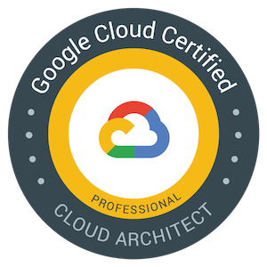

Professional Cloud Architect Certification – Google Cloud Platform - Community – Medium

# Professional Cloud Architect Certification

[Mete Atamel](https://medium.com/@meteatamel)
Mar 4·6 min read

TL;DR: I recently went through the preparation and exam of Google Cloud’s [Professional Cloud Architect Certification](https://cloud.google.com/certification/cloud-architect). It was great learning experience and I highly recommend it. You can [register here](https://webassessor.com/wa.do?page=publicHome&branding=GOOGLECLOUD) to get certified yourself!

### Why?

As you might know, I’m a Googler and a Developer Advocate for Google Cloud. Why do I want to be certified by Google Cloud when I already work at Google and know a great deal about Google Cloud? I had 2 main motivations:

1. 1 "."I wanted to go through the process as everyone else would and see how it is. I always receive questions from developers about certifications at conferences & meetups and it’s hard to answer them in detail unless you go through the process yourself.

2. 2 "."I wanted to see if there’s something we can improve about the process and provide my feedback to our certification team.

3. 3 "."Fill any gaps and refresh my existing knowledge of Google Cloud.

I also learned that Cloud Professional Certification recently ranked #1 in [15 Top-Paying IT Certifications for 2019](https://www.globalknowledge.com/us-en/resources/resource-library/articles/top-paying-certifications/). Good to know!

### Find the learning resources

Professional Cloud Engineer Certification page has a [details page](https://cloud.google.com/certification/cloud-architect). In this page, there’s a *Path to Success* section that lists exam guide, training courses on Coursera and Instructor-led and practice challenges with Qwiklabs. It’s great that all the resources are listed in this single page in a clear format.

I decided to go with online courses for more flexibility. Coursera has a [Specialization on Architecting with Google Cloud Platform](https://www.coursera.org/specializations/gcp-architecture). It has 6 courses. My plan was to finish these 6 courses first and then go through exam guides before registering for the exam.

Later, I realized that there’s an additional course specifically on the exam itself. I went through that as well. In total, I completed 7 courses over roughly 7 weeks to prepare for the exam.

### Going through courses on Coursera

I usually get bored of online tutorial videos because they’re either too long or too hands-off to keep me focused. Going through the courses on Coursera was quite fun. Videos were the right length and had enough level of detail. They were not only informative but they also contained hands-on exercises with [Qwiklabs](http://www.qwiklabs.com/). That made videos more relevant and courses more engaging for me.

I wasn’t expecting to learn much new information due to my current role at Google but I was pleasantly surprised how informative some videos were for me, especially the ones in networking and general architecture.

Hands-on exercises with Qwiklabs were great too. The only slight glitch was that Coursera sometimes had difficulty in registering that I finished the lab. As a result, I had to do some labs twice and that was somewhat annoying. Also, having to re-login with new credentials for every lab gets a little tedious but not a big issue.

Let me go through courses briefly, so you can get an idea on what to expect.

#### Course 1: Google Cloud Platform Fundamentals: Core Infrastructure

*Start date: 2019–01–13, End date: 2019–01–20*

This was the first course I went through. It was a good introduction to Google Cloud, explaining all the different services and options. I liked the videos overall. They weren’t too long or short. I also liked the fact that they had quizzes and Qwiklabs hands-on exercises.

#### Course 2: Essential Cloud Infrastructure: Foundation

*Start date: 2019–01–20, End date: 2019–01–26*

This course was much shorter than Course1. I found some of the content in **Module 1 **redundant because they were already covered in Course1 but good to have some repetition, I suppose.

Some of **Module 2** (VPCs and subnetworks) is already been covered in Course 1, however, later parts of the module had good info that I didn’t know about.

#### Course 3: Essential Cloud Infrastructure: Core Services

*Start date: 2019–01–27, End date: 2019–02–02*

**Module 1 **of this course was all about IAM. This was already covered in Course 1 but it was more detailed, so I learned quite a bit. The lab exercise was very nice as well. It was long enough to help me understand IAM but not too long to make me bored.

**Module 2** was all about storage. It started with Cloud Storage. It was a review of Course 1 with additional information and exercises.

**Module 3** was about billing and **Module 4 **was about Stackdriver. Not most exciting topics for me but useful nevertheless.

#### Course 4: Elastic Cloud Infrastructure: Scaling and Automation

*Start date: 2019–02–04, End date: 2019–02–09*

This was probably my favorite course because it contained a lot of networking topics that I didn’t know in detail.

**Module 1 **started with VPNs and **Module 2 **was about HTTPs load balancing. Videos were very nice and diagrams explaining how it works was very useful. I also liked their best practices section. This whole section was very useful and probably the best part of the course for me.

The next three modules were mostly review of what was already covered in Course 1. **Module 3 **about autoscaling, **Module 4 **about infrastructure automation with Cloud API and **Module 5** about Deployment Manager.

The last module, **Module 6, **is about Managed Services such as Dataflow, Dataproc and BigQuery at a high level.

#### Course 4: Elastic Cloud Infrastructure: Containers and Services

*Start date: 2019–02–10, End date: 2019–02–10*

This course got into more application development side of things. **Module 1** was about Cloud Pub/Sub, Cloud Endpoints and Cloud Functions. **Module 2** was about App Engine Standard and Flex. They were both good overviews but there was no hands-on lab.

**Module 3** was about Kubernetes Engine and Container Registry. It was a good module with a hands-on lab.

#### Course 6: Reliable Cloud Infrastructure: Design and Process

*Start date: 2019–02–14, End date: 2019–02–17*

This course was the only course in the series that is about software architecture rather than specific Google Cloud products. I liked the first part of the course but later when it started talking about data layer, it got repetitive because I already heard about Cloud Storage, BigQuery, etc. many times before in the previous courses.

#### Course 7: Preparing for the Google Cloud Professional Cloud Architect Exam

Start date: 2019–02–23, End date: 2019–02–24

This course wasn’t part of the specialization but more about the logistics of the exam and going through the case studies one by one to figure out solutions. I liked it quite a lot. Lots of useful information that you wouldn’t normally get from documentation. It turned out to be much more relevant for the exam than I thought (more on this in the next section).

Towards the later part of the course, it turned into more of a lecture than case studies. At this point, it got a little repetitive for me because it started talking about Kubernetes Engine, App Engine etc. or things like BigQuery, Dataflow. All of these were covered in other courses.

### Taking the exam

I took the exam on 2019–02–28. The exam consists of 50 multiple choice questions and you have 2 hours to answer them. I thought I’d be done in 1 hour but to my surprise, it took me 1 hour 45 minutes to finish the exam and it was harder than I expected.

There were questions from the case studies. I spent quite a bit of time reading the case studies. In hindsight, I should have read the case studies more carefully while studying for Course 7. In general, I should have spent more time on Course 7, it seemed the most relevant course for the exam.

I finished the initial pass of the questions in about 1 hour and I marked about 20 questions as unsure. I did a full second pass in 35 minutes and I still had about 10 questions as unsure. I finally spent 10 more minutes to review the unsure questions one last time and I submitted. I got a provisional result that I passed.

On the exam itself, I think it’s a moderately difficult exam. There were about 5 or 6 questions that were quite easy. The rest, you either had to read the case study well or know the material inside out. I realized that I didn’t remember some of the networking stuff (Direct Peering, CloudVPN etc.) and also some BigQuery details like federated vs. partitioned tables. As a result, I wasn’t sure of the answers.

I found some questions quite tricky. For example, I felt that there was a question where normal or preemptible VMs would be OK in the solution, but I had to choose one. Not sure in the end what I missed.

### Conclusion

Overall, I’m very happy I went through the process of getting certified. It was definitely more challenging than I thought it would be. It’s a time commitment with all the courses and the actual exam itself. However, you end up learning a lot, even if you already know a lot about Google Cloud.

I noted some of the improvements we can make in courses and certification exam and I will follow up with our certifications team to make sure the experience gets even better going forward.