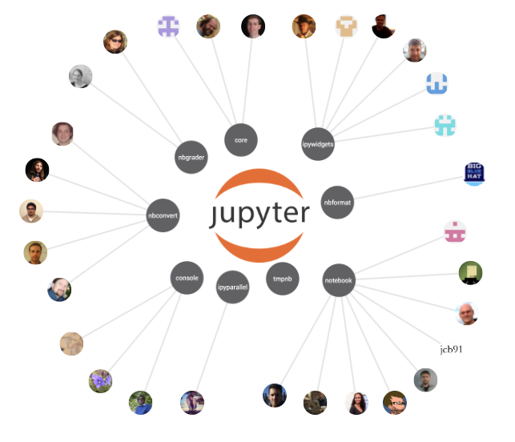
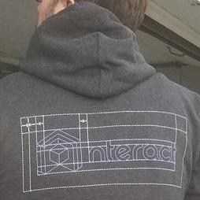
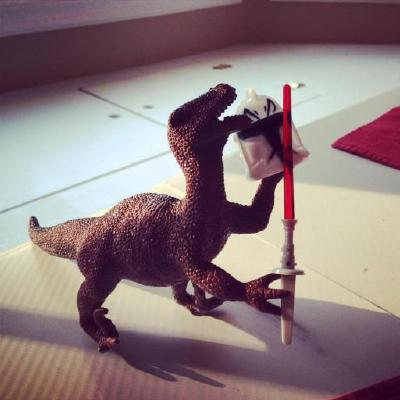

Project Jupyter

## About Project Jupyter

Project Jupyter is an open source project was born out of the [IPython Project](https://ipython.org/) in 2014 as it evolved to support interactive data science and scientific computing across all programming languages. Jupyter will always be 100% open source software, free for all to use and released under the liberal terms of the [modified BSD license](https://opensource.org/licenses/BSD-3-Clause)

   

### Community

Our vibrant community empowers us to create an amazing platform. Dynamic developers, cutting edge scientists as well as everyday users work together to further Jupyter's best-in-class tools. Here is a dynamic visualization of our most recent contributors:

 jupyterlabafshinblink1073vidartfian-r-rosejupyterhubminrkwillingcparenteyuvipandanotebookrgbkrkgnestortakluyverjim22kCarreaurmorsheajupyter_consoleadamchainzmariusvniekerkfperezevhubtmlwilywampajupyter_corealexandrulsrstevensonscolby33douarddaipywidgetsSylvainCorlayjasongroutipyparallelbasnijholtlesteveBaxterEavesyuvallangernbconvertmichaelpacernbformatcaptainsafiamarbremobletmpnbnvenayakmabauyacchin1205smashwilsonnbgraderjhamrickqtconsoleccordoba12wmvanvliettmr232lejenome

 

   

### Steering Council

Our team is primarily led by 15 steering committee members who ultimately make the final decisions.

 
Damian Avila

Continuum Analytics
[*@damianavila*](https://github.com/damianavila) on GitHub

 
Matthias Bussonnier

UC Berkeley
[*@carreau*](https://github.com/carreau) on GitHub

 
Sylvain Corlay

QuantStack
[*@sylvaincorlay*](https://github.com/sylvaincorlay) on GitHub

 
Jonathan Frederic

Cal Poly, San Luis Obispo
[*@jdfreder*](https://github.com/jdfreder) on GitHub

 
Brian Granger

Cal Poly, San Luis Obispo
[*@ellisonbg*](https://github.com/ellisonbg) on GitHub

 
Jason Grout

Bloomberg
[*@jasongrout*](https://github.com/jasongrout) on GitHub

 
Jessica Hamrick

UC Berkeley
[*@jhamrick*](https://github.com/jhamrick) on GitHub

 
Paul Ivanov

Bloomberg
[*@ivanov*](https://github.com/ivanov) on GitHub

 
Thomas Kluyver

University of Southampton
[*@takluyver*](https://github.com/takluyver) on GitHub

 
Kyle Kelley

Netflix
[*@rgbkrk*](https://github.com/rgbkrk) on GitHub

 
Peter Parente

MaxPoint
[*@parente*](https://github.com/parente) on GitHub

 
Fernando Perez

UC Berkeley
[*@fperez*](https://github.com/fperez) on GitHub

 
Min Ragan-Kelley

Simula Research Lab
[*@minrk*](https://github.com/minrk) on GitHub

 
Steven Silvester

Continuum Analytics
[*@blink1073*](https://github.com/blink1073) on GitHub

 
Carol Willing

Cal Poly
[*@willingc*](https://github.com/willingc) on GitHub

   

### Sponsors

Project Jupyter receives direct funding from the following sources:

 

 

 

 

 

 

 

 

   

### Institutional Partners

Institutional Partners are companies and universities that support the project by employing Steering Council members. Current Institutional Partners include:

 

 

 

 

 

 

   

### Governance

Robust, community driven development with institutional backing.

#### NumFocus

#### Copyright/License

#### Decisions

#### Steering Council

Project Jupyter is part of the non-profit NumFOCUS Foundation, which provides fiscal sponsorship, governance and a legal umbrella for the project.