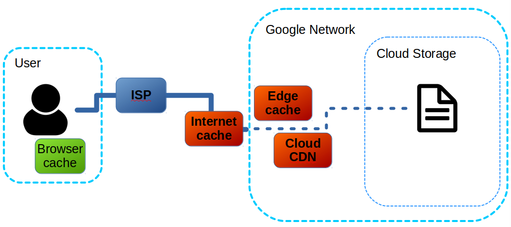

Public cache : don’t panic – Val Deleplace – Medium

# Public cache : don’t panic

In [this previous post](https://medium.com/@val_deleplace/gcs-my-static-page-online-in-1-single-command-cfb2381fd527), you learned the fast way to host some HTML page online on Google Cloud Storage (GCS).

You then want to modify your files locally, upload again, refresh the browser tab… only to discover that your changes are not online!

Not really worried yet, you attempt a deep refresh, and clear your cache, and clear your cookies just in case… only to notice the page is still not refreshed, over and over.

This is normal : the default cache setting for public files hosted on GCS is **1 hour of public cache**.

A public cache policy has many nice properties to optimize the page delivery speed :

- •It allows the resource to be stored in the user’s browser cache ;
- •It allows the resource to be stored in a server cache ;
- •It allows the resource to be stored in any intermediate “internet cache” ;
- •It allows the resource to be served by a machine closer to the user, like a CDN would do.

It has a somewhat unexpected property : **you** (the webmaster) **cannot clear the internet caches**. You just have to wait for the stale cached data to expire.

Intermediate caches (red) cannot be flushed

Between your update and the cache expiration, you cannot predict which version of a file will be served to a given visitor, and you shouldn’t rely on it.

You may be tempted to always set an explicit much shorter cache lifetime, or no cache at all, to make easier incremental development and achieve more flexible, atomic updates. I would not recommend this, as it would hurt performance.

Instead consider the following approach :

- •Set a short public cache (5mn) for HTML files only
- •Set a long term public cache (1 year) for all static resources: images, js, css, etc.
- •Make sure the static resources are **immutable**. If you need to update them, you must change their URL (and modify the html code accordingly).

With this technique, you achieve consistency in all cases, and atomic update propagation in 5 minutes.

My favorite way to deal with immutability is by “revving folder name” : if I update my static site on Nov 14th 2017, then I just put all my static immutable resources in a folder named “resources_2017–11–14”. Any previous browser cache and internet cache entries are now ignored, simply because they’re not referenced anymore.

An alternative finer-grained method (used by the Webpack bundler) consists in inserting the hash of each resource in its filename. When a resource is modified, then its hash changes, thus its URL is not the same anymore.

Here are the commands to specify the public cache durations:

**> gsutil setmeta -h “Cache-Control: public, max-age=300” gs://my-quick-page/*.html

> gsutil setmeta -h “Cache-Control: public, max-age=31536000” gs://my-quick-page/resources*/****

One must be careful though when setting a 1-year public cache : make sure to apply it only to immutable resources, because the public cache is irreversible until expiration of its full duration!