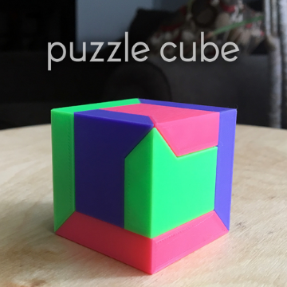

Puzzle Cube (easy print no support) by WildRoseBuilds

Puzzle Cube (easy print no support) by WildRoseBuilds

https://www.thingiverse.com/thing:2975065

https://www.youtube.com/watch?v=F_T_tMMpWjQ This puzzle was heavily inspired by a gif of pacificpuzzleworks slideways puzzle cube. He has since made a thingiverse account and shared his files here: https://www.thingiverse.com/thing:3073646 3 identicle parts that slide together in a satisfying way to create a cube. Once assembled it needs to be held and moved in a specific direction to seperate. clearance between the parts is around .3mm allowing for smooth movement without binding. Since these parts have