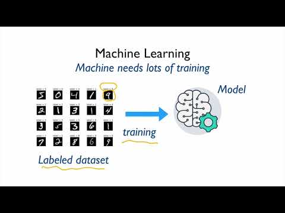

PyTorch Lecture 01: Overview - YouTube

PyTorch Lecture 01: Overview

https://www.youtube.com/watch?v=SKq-pmkekTk&list=PLlMkM4tgfjnJ3I-dbhO9JTw7gNty6o_2m&index=1

[Sung Kim](https://www.youtube.com/channel/UCML9R2ol-l0Ab9OXoNnr7Lw)
7,499 views views
Published on Oct 22, 2017

|     |
| --- |
| [(L)](https://www.youtube.com/watch?v=SKq-pmkekTk&list=PLlMkM4tgfjnJ3I-dbhO9JTw7gNty6o_2m&index=1) |

Description

PyTorch Zero To All Lecture by Sung Kim hunkim+ml@gmail.com at HKUST

Code: [https://github.com/hunkim/PyTorchZero...](https://www.youtube.com/redirect?q=https%3A%2F%2Fgithub.com%2Fhunkim%2FPyTorchZeroToAll&v=SKq-pmkekTk&event=video_description&redir_token=ykiWR8F-UDmZNgXrHLMxD58X1il8MTUxNTM1MzI4MkAxNTE1MjY2ODgy) Slides: [http://bit.ly/PyTorchZeroAll](https://www.youtube.com/redirect?q=http%3A%2F%2Fbit.ly%2FPyTorchZeroAll&v=SKq-pmkekTk&event=video_description&redir_token=ykiWR8F-UDmZNgXrHLMxD58X1il8MTUxNTM1MzI4MkAxNTE1MjY2ODgy)