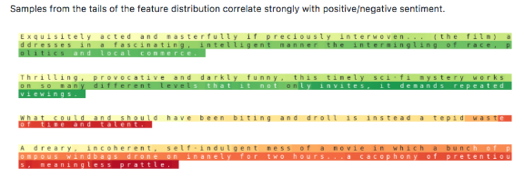
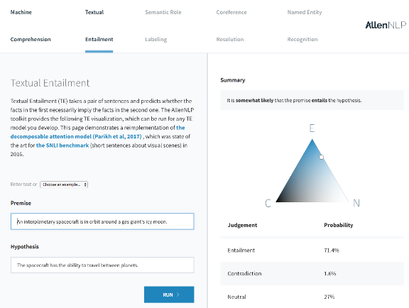
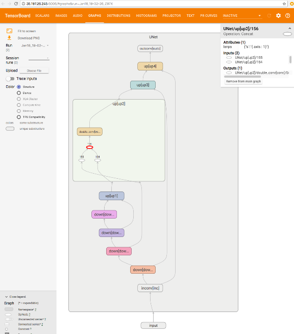
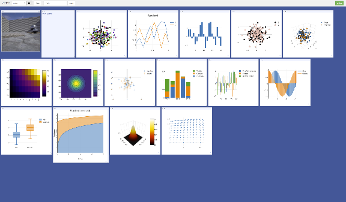
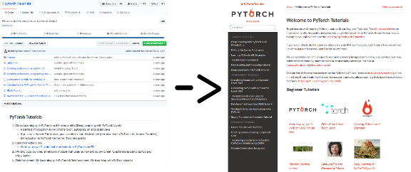

PyTorch, a year in....

# Community

We’ve been blessed with a strong organic community of researchers and engineers who fell in love with PyTorch. The core team has engineers and researchers from multiple countries, companies and universities, and we couldn’t have made PyTorch what it is without each contribution.

## Research papers, packages and Github

Within days of release, users from the community started to implement their favorite research papers in PyTorch and release the code on Github. Open-source code is a primary and essential tool for researchers today.

Folks came together to create [torchtext](https://github.com/pytorch/text), [torchvision](https://github.com/pytorch/vision) and [torchaudio](https://github.com/pytorch/audio) packages to help facilitate and democratize research in different domains.

The first community package based on PyTorch came from Brandon Amos, [titled Block](https://twitter.com/brandondamos/status/828652480573607937), and helped with easier manipulation of block matrices. The Locus Lab at **CMU** subsequently went on to [publish PyTorch packages](https://github.com/locuslab) and implementations for most of their research. The first research paper code came from Sergey Zagoruyko titled [Paying more attention to attention](https://twitter.com/PyTorch/status/822561885744726016).

Jun-Yan Zhu, Taesung Park, Phillip Isola, Alyosha Efros and team from **U.C.Berkeley** released the hugely popular [Cycle-GAN and pix2pix](https://github.com/junyanz/pytorch-CycleGAN-and-pix2pix) which does image to image transforms.

The researchers at **HarvardNLP** and **Systran** started developing and improving [OpenNMT in PyTorch](https://github.com/OpenNMT/OpenNMT-py), seeded by initial reimplementation of the [Lua]Torch code from Adam Lerer at Facebook.

The MagicPony team at **Twitter** contributed implementations of their [Super-resolution work early on into PyTorch’s examples](https://twitter.com/Rob_Bishop/status/821793080877588480).

**Salesforce Research** released several packages, including their highlight release of [PyTorch-QRNN](https://twitter.com/Smerity/status/917472260851560448), a type of RNN that is 2x to 17x faster than standard LSTMs optimized by CuDNN. James Bradbury and team form one of the most active and engaging forces in the PyTorch community.

> We're releasing > [> @PyTorch](https://twitter.com/PyTorch?ref_src=twsrc%5Etfw)> -QRNN, 2-17x faster than NVIDIA's cuDNN LSTM.

> Speed thanks to 50 lines of CUDA via CuPy.> [https://t.co/KaWhN4yDZd>   > [> pic.twitter.com/yoLYj3pMI0](https://t.co/yoLYj3pMI0)

> — Smerity (@Smerity) > [> October 9, 2017](https://twitter.com/Smerity/status/917472260851560448?ref_src=twsrc%5Etfw)

Researchers from **Uber**, **Northeastern** and **Stanford** came together to form an active probabilistic programming community around their packages [Pyro](http://pyro.ai/) and [ProbTorch](https://github.com/probtorch/probtorch). They are actively developing the torch.distributions core package. This community is so active and fast-moving, we had our first pytorch-probabilistic-programming meetup at NIPS 2017 with Fritz Obermeyer, Noah Goodman, Jan-Willem van de Meent, Brooks Paige, Dustin Tran and 22 additional attendees discussing how to make the world bayesian.

**NVIDIA** Researchers released three high-quality repositories that implemented [pix2pix-HD](https://github.com/NVIDIA/pix2pixHD), [Sentiment Neuron](https://github.com/NVIDIA/sentiment-discovery) and [FlowNet2](https://github.com/NVIDIA/flownet2-pytorch) papers. Their analysis of scalability of different [Data Parallel models in PyTorch](https://github.com/NVIDIA/sentiment-discovery/blob/master/analysis/scale.md) was helpful to the community.

The Allen Institute for AI released [AllenNLP](http://allennlp.org/) which includes several state-of-the-art models in NLP — reference implementations and easy to use [web demos](http://demo.allennlp.org/machine-comprehension) for standard NLP tasks.

We also had our first Kaggle winning team grt123 in July. They won the DataScience Bowl 2017 on Lung Cancer detection and [subsequently released their PyTorch implementations](https://twitter.com/PyTorch/status/881573658166267904).

On the visualization front, Tzu-Wei Huang implemented a [TensorBoard-PyTorch plugin](https://github.com/lanpa/tensorboard-pytorch) and Facebook AI Research released PyTorch compatibility for their [visdom](https://github.com/facebookresearch/visdom) visualization package.

Lastly, **Facebook AI Research** released several projects such as [ParlAI, fairseq-py, VoiceLoop and FaderNetworks](https://github.com/facebookresearch/) that implemented cutting-edge models and interfaced datasets in multiple domains.

There are countless good projects that we haven’t highlighted for the lack of space, you can find a curated list [here](https://github.com/soumith?tab=stars).

We would also like to give a huge shout-out to folks who actively help others out on the Forums, especially [ptrblck](https://discuss.pytorch.org/u/ptrblck/summary), [jpeg729](https://discuss.pytorch.org/u/jpeg729/summary), [QuantScientist](https://discuss.pytorch.org/u/quantscientist/summary), [albanD](https://discuss.pytorch.org/u/alband/summary), [Thomas Viehmann](https://discuss.pytorch.org/u/tom/summary) and [chenyuntc](https://discuss.pytorch.org/u/chenyuntc/summary). You are providing an invaluable service, thank you so much!

## Metrics

In terms of sheer numbers,

- 87,769 lines of Python code on github that [import torch](https://github.com/search?l=Python&q=import+torch&type=Code)

- [3,983 repositories on Github that mention PyTorch in their name or description](https://github.com/search?q=pytorch&type=Repositories)

- More than half a million downloads of PyTorch binaries. 651,916 to be precise.

- **5,400 users** wrote **21,500 posts** discussing 5,200 topics on our forums discuss.pytorch.org (http://discuss.pytorch.org/)

- 131 mentions of PyTorch on Reddit’s /r/machinelearning since the day of release. In the same period, TensorFlow was mentioned 255 times.

### Research Metrics

PyTorch is a research-focused framework. So one of the metrics of interest is to see the usage of PyTorch in machine learning research papers.

- In the recent ICLR2018 conference submissions, PyTorch was mentioned in **87 papers**, compared to TensorFlow at 228 papers, Keras at 42 papers, Theano and Matlab at 32 papers.

- [Monthly arxiv.org mentions for frameworks](https://twitter.com/fchollet/status/951828914103402497) had PyTorch at 72 mentions, with TensorFlow at 273 mentions, Keras at 100 mentions, Caffe at 94 mentions and Theano at 53 mentions.

## Courses, Tutorials and Books

When we released PyTorch, we had good API documentation, but our tutorials were limited to a few ipython notebooks — helpful, but not good enough.

[Sasank Chilamkurthy](https://github.com/chsasank) took it upon himself to revamp the tutorials into the [beautiful website](http://pytorch.org/tutorials/) that it is today.

[Sean Robertson](https://github.com/spro/practical-pytorch) and [Justin Johnson](https://github.com/jcjohnson/pytorch-examples) wrote great new tutorials — in NLP, and to learn by example. [Yunjey Choi](https://github.com/yunjey/pytorch-tutorial) wrote a beautiful tutorial where most models were implemented in 30 lines or less. Each new tutorial helped users find their way faster, with different approaches to learning.

[Goku Mohandas and Delip Rao](https://twitter.com/PyTorch/status/888500355943641088) switched the code content of their book-in-progress to use PyTorch.

We’ve seen quite a few university machine learning courses being taught with PyTorch as the primary tool, such as Harvard’s [CS287](https://harvard-ml-courses.github.io/cs287-web/). Taking it one step further and democratizing learning, we had three online courses pop up that teach using PyTorch.

- **Fast.ai’s** “Deep Learning for Coders” is a popular online course. In September, Jeremy and Rachel [announced that the next fast.ai courses will be nearly entirely based on PyTorch](http://www.fast.ai/2017/09/08/introducing-pytorch-for-fastai/).

- Ritchie Ng, a researcher with ties to NUS Singapore and Tsinghua released [a Udemy course](https://www.udemy.com/practical-deep-learning-with-pytorch/) titled Practical Deep Learning with PyTorch.

- Sung Kim from HKUST released an [online course on Youtube](https://www.youtube.com/playlist?list=PLlMkM4tgfjnJ3I-dbhO9JTw7gNty6o_2m) that was aimed towards a general audience, titled: “PyTorch Zero to All”.

# Engineering

Over the last year we implemented multiple features, improved performance across the board and fixed lots of bugs. A full list of the work we’ve done is found in our [release notes](https://github.com/pytorch/pytorch/releases). Here are highlights from our work over the last year:

## Higher-order gradients

With the release of several papers that implement penalties of gradients and with ongoing research in 2nd order gradient methods, this was an essential and sought-after feature. In August, we implemented a generalized interface that can take n-th order derivatives and increased the coverage of functions that support higher-order gradients over time, such that at the moment of writing almost all ops support this.

## Distributed PyTorch

In August, we released a small distributed package that followed the highly popular MPI-collective approach. The package has multiple backends such as TCP, MPI, Gloo and NCCL2 to support various types of CPU/GPU collective operations and use-cases, and integrates distributed technologies such as Infiniband and RoCE. Distributed is hard, and we had bugs in the initial iteration. Over subsequent releases, we made the package more stable and improved performance.

## Closer to NumPy

One of the biggest demands from users were NumPy features that they were familiar with. Features such as Broadcasting and Advanced Indexing are convenient and save users a lot of verbosity. We implemented these features and started to align our API to be closer to NumPy. Over time, we expect to get closer and closer to NumPy’s API where appropriate.

## Sparse Tensors

In March, we released a small package supporting sparse Tensors and in May we released CUDA support for the sparse package. The package is small and limited in functionality, and is used for implementing Sparse Embeddings and commonly used sparse paradigms in deep learning. This package is still small in scope and there’s demand to expand it — if you are interested in working on expanding the sparse package, reach out to us on our [Discussion Boards](https://discuss.pytorch.org/)

## Performance

Performance is always an ongoing battle, especially for PyTorch which is a dynamic framework that wants to maximize flexibility. Over the last year, we’ve improved performance across board, from our core Tensor library to the neural network operators, writing faster micro-optimized across board.

- We’ve added specialized AVX and AVX2 intrinsics for Tensor operations

- Wrote faster GPU kernels for frequent workloads like concatenation and Softmax (among many other things)

- Rewrote the code for several neural network operators (too many to list), but notably nn.Embedding and group convolutions.

**Reducing framework overhead by 10x across board**

Since PyTorch is a dynamic graph framework, we create a new graph on the fly at every iteration of a training loop. Hence, the framework overhead has to be low, or the workload has to be large enough that the framework overhead is hidden. In August, the authors of DyNet (Graham Neubig and team) showcased that it’s much faster than PyTorch on small NLP models. This was an interesting challenge, we didn’t realize that models of those sizes were being trained. In a multi-month (and ongoing) effort, we embarked upon a significant rewrite of PyTorch internals that reduced the framework overhead from more than 10 microseconds per operator execution to as little as 1 microsecond.

**ATen**

As we embarked upon a redesign of the PyTorch internals, we built the [ATen C++11](https://github.com/pytorch/pytorch/tree/master/aten) library that now powers all of the PyTorch backend. ATen has an API that mirrors PyTorch’s Python API, which makes it a convenient C++ library for Tensor computation. ATen can be built and used independently of PyTorch.

## Exporting models to production — ONNX Support and the JIT compiler

One of the common requests we’ve received was to export PyTorch models to another framework. Users engaged in a rapid research cycle in PyTorch and when they were done, they wanted to ship it to larger projects with C++ only requirements.

With this in mind, we built a tracer for PyTorch — which can export PyTorch models into an intermediate representation. The subsequent trace can be either used to run the current PyTorch model more efficiently (by running optimization passes on it), or be converted to the [ONNX](http://onnx.ai/) format to be shipped to other frameworks such as Caffe2, MXNet, TensorFlow and others or directly to the hardware accelerated libraries like CoreML or TensorRT. Over the next year, you will hear more about the JIT compiler for performance improvements.

# Users being funny :)

Our users express their support in funny ways, made us laugh, thanks for this :)

> I've been using PyTorch a few months now and I've never felt better. I have more energy. My skin is clearer. My eye sight has improved.

> — Andrej Karpathy (@karpathy) > [> May 26, 2017](https://twitter.com/karpathy/status/868178954032513024?ref_src=twsrc%5Etfw)

> Talk to your doctor to find out if PyTorch is right for you.

> — Sean Robertson (@sprobertson) > [> May 26, 2017](https://twitter.com/sprobertson/status/868180795000750080?ref_src=twsrc%5Etfw)

> PyTorch gave me so much life that my skin got cleared, my grades are up, my bills are paid and my crops are watered.

> — Adam Will ð️‍ð (@adam_will_do_it) > [> May 26, 2017](https://twitter.com/adam_will_do_it/status/868179679483764736?ref_src=twsrc%5Etfw)

> So have I! But my hair is also shiner and I've lost weight. > [> @PyTorch](https://twitter.com/PyTorch?ref_src=twsrc%5Etfw)>  for the win. > [https://t.co/qgU4oIOB4K

> — Mariya (@thinkmariya) > [> May 26, 2017](https://twitter.com/thinkmariya/status/868181991212044288?ref_src=twsrc%5Etfw)