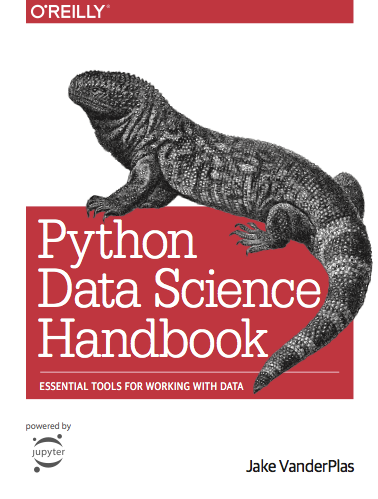

Python Data Science Handbook | Python Data Science Handbook

# Python Data Science Handbook

*Jake VanderPlas*

This website contains the full text of the [Python Data Science Handbook](http://shop.oreilly.com/product/0636920034919.do) by Jake VanderPlas; the content is available [on GitHub](https://github.com/jakevdp/PythonDataScienceHandbook) in the form of Jupyter notebooks.

The text is released under the [CC-BY-NC-ND license](https://creativecommons.org/licenses/by-nc-nd/3.0/us/legalcode), and code is released under the [MIT license](https://opensource.org/licenses/MIT).

If you find this content useful, please consider supporting the work by [buying the book](http://shop.oreilly.com/product/0636920034919.do)!

## # Table of Contents[¶](https://jakevdp.github.io/PythonDataScienceHandbook/#Table-of-Contents)

### ## [Preface](https://jakevdp.github.io/PythonDataScienceHandbook/00.00-preface.html)[¶](https://jakevdp.github.io/PythonDataScienceHandbook/#Preface)

### ## [1. IPython: Beyond Normal Python](https://jakevdp.github.io/PythonDataScienceHandbook/01.00-ipython-beyond-normal-python.html)[¶](https://jakevdp.github.io/PythonDataScienceHandbook/#1.-IPython:-Beyond-Normal-Python)

- [Help and Documentation in IPython](https://jakevdp.github.io/PythonDataScienceHandbook/01.01-help-and-documentation.html)
- [Keyboard Shortcuts in the IPython Shell](https://jakevdp.github.io/PythonDataScienceHandbook/01.02-shell-keyboard-shortcuts.html)
- [IPython Magic Commands](https://jakevdp.github.io/PythonDataScienceHandbook/01.03-magic-commands.html)
- [Input and Output History](https://jakevdp.github.io/PythonDataScienceHandbook/01.04-input-output-history.html)
- [IPython and Shell Commands](https://jakevdp.github.io/PythonDataScienceHandbook/01.05-ipython-and-shell-commands.html)
- [Errors and Debugging](https://jakevdp.github.io/PythonDataScienceHandbook/01.06-errors-and-debugging.html)
- [Profiling and Timing Code](https://jakevdp.github.io/PythonDataScienceHandbook/01.07-timing-and-profiling.html)
- [More IPython Resources](https://jakevdp.github.io/PythonDataScienceHandbook/01.08-more-ipython-resources.html)

### ## [2. Introduction to NumPy](https://jakevdp.github.io/PythonDataScienceHandbook/02.00-introduction-to-numpy.html)[¶](https://jakevdp.github.io/PythonDataScienceHandbook/#2.-Introduction-to-NumPy)

- [Understanding Data Types in Python](https://jakevdp.github.io/PythonDataScienceHandbook/02.01-understanding-data-types.html)
- [The Basics of NumPy Arrays](https://jakevdp.github.io/PythonDataScienceHandbook/02.02-the-basics-of-numpy-arrays.html)
- [Computation on NumPy Arrays: Universal Functions](https://jakevdp.github.io/PythonDataScienceHandbook/02.03-computation-on-arrays-ufuncs.html)
- [Aggregations: Min, Max, and Everything In Between](https://jakevdp.github.io/PythonDataScienceHandbook/02.04-computation-on-arrays-aggregates.html)
- [Computation on Arrays: Broadcasting](https://jakevdp.github.io/PythonDataScienceHandbook/02.05-computation-on-arrays-broadcasting.html)
- [Comparisons, Masks, and Boolean Logic](https://jakevdp.github.io/PythonDataScienceHandbook/02.06-boolean-arrays-and-masks.html)
- [Fancy Indexing](https://jakevdp.github.io/PythonDataScienceHandbook/02.07-fancy-indexing.html)
- [Sorting Arrays](https://jakevdp.github.io/PythonDataScienceHandbook/02.08-sorting.html)
- [Structured Data: NumPy's Structured Arrays](https://jakevdp.github.io/PythonDataScienceHandbook/02.09-structured-data-numpy.html)

### ## [3. Data Manipulation with Pandas](https://jakevdp.github.io/PythonDataScienceHandbook/03.00-introduction-to-pandas.html)[¶](https://jakevdp.github.io/PythonDataScienceHandbook/#3.-Data-Manipulation-with-Pandas)

- [Introducing Pandas Objects](https://jakevdp.github.io/PythonDataScienceHandbook/03.01-introducing-pandas-objects.html)
- [Data Indexing and Selection](https://jakevdp.github.io/PythonDataScienceHandbook/03.02-data-indexing-and-selection.html)
- [Operating on Data in Pandas](https://jakevdp.github.io/PythonDataScienceHandbook/03.03-operations-in-pandas.html)
- [Handling Missing Data](https://jakevdp.github.io/PythonDataScienceHandbook/03.04-missing-values.html)
- [Hierarchical Indexing](https://jakevdp.github.io/PythonDataScienceHandbook/03.05-hierarchical-indexing.html)
- [Combining Datasets: Concat and Append](https://jakevdp.github.io/PythonDataScienceHandbook/03.06-concat-and-append.html)
- [Combining Datasets: Merge and Join](https://jakevdp.github.io/PythonDataScienceHandbook/03.07-merge-and-join.html)
- [Aggregation and Grouping](https://jakevdp.github.io/PythonDataScienceHandbook/03.08-aggregation-and-grouping.html)
- [Pivot Tables](https://jakevdp.github.io/PythonDataScienceHandbook/03.09-pivot-tables.html)
- [Vectorized String Operations](https://jakevdp.github.io/PythonDataScienceHandbook/03.10-working-with-strings.html)
- [Working with Time Series](https://jakevdp.github.io/PythonDataScienceHandbook/03.11-working-with-time-series.html)
- [High-Performance Pandas: eval() and query()](https://jakevdp.github.io/PythonDataScienceHandbook/03.12-performance-eval-and-query.html)
- [Further Resources](https://jakevdp.github.io/PythonDataScienceHandbook/03.13-further-resources.html)

### ## [4. Visualization with Matplotlib](https://jakevdp.github.io/PythonDataScienceHandbook/04.00-introduction-to-matplotlib.html)[¶](https://jakevdp.github.io/PythonDataScienceHandbook/#4.-Visualization-with-Matplotlib)

- [Simple Line Plots](https://jakevdp.github.io/PythonDataScienceHandbook/04.01-simple-line-plots.html)
- [Simple Scatter Plots](https://jakevdp.github.io/PythonDataScienceHandbook/04.02-simple-scatter-plots.html)
- [Visualizing Errors](https://jakevdp.github.io/PythonDataScienceHandbook/04.03-errorbars.html)
- [Density and Contour Plots](https://jakevdp.github.io/PythonDataScienceHandbook/04.04-density-and-contour-plots.html)
- [Histograms, Binnings, and Density](https://jakevdp.github.io/PythonDataScienceHandbook/04.05-histograms-and-binnings.html)
- [Customizing Plot Legends](https://jakevdp.github.io/PythonDataScienceHandbook/04.06-customizing-legends.html)
- [Customizing Colorbars](https://jakevdp.github.io/PythonDataScienceHandbook/04.07-customizing-colorbars.html)
- [Multiple Subplots](https://jakevdp.github.io/PythonDataScienceHandbook/04.08-multiple-subplots.html)
- [Text and Annotation](https://jakevdp.github.io/PythonDataScienceHandbook/04.09-text-and-annotation.html)
- [Customizing Ticks](https://jakevdp.github.io/PythonDataScienceHandbook/04.10-customizing-ticks.html)
- [Customizing Matplotlib: Configurations and Stylesheets](https://jakevdp.github.io/PythonDataScienceHandbook/04.11-settings-and-stylesheets.html)
- [Three-Dimensional Plotting in Matplotlib](https://jakevdp.github.io/PythonDataScienceHandbook/04.12-three-dimensional-plotting.html)
- [Geographic Data with Basemap](https://jakevdp.github.io/PythonDataScienceHandbook/04.13-geographic-data-with-basemap.html)
- [Visualization with Seaborn](https://jakevdp.github.io/PythonDataScienceHandbook/04.14-visualization-with-seaborn.html)
- [Further Resources](https://jakevdp.github.io/PythonDataScienceHandbook/04.15-further-resources.html)

### ## [5. Machine Learning](https://jakevdp.github.io/PythonDataScienceHandbook/05.00-machine-learning.html)[¶](https://jakevdp.github.io/PythonDataScienceHandbook/#5.-Machine-Learning)

- [What Is Machine Learning?](https://jakevdp.github.io/PythonDataScienceHandbook/05.01-what-is-machine-learning.html)
- [Introducing Scikit-Learn](https://jakevdp.github.io/PythonDataScienceHandbook/05.02-introducing-scikit-learn.html)
- [Hyperparameters and Model Validation](https://jakevdp.github.io/PythonDataScienceHandbook/05.03-hyperparameters-and-model-validation.html)
- [Feature Engineering](https://jakevdp.github.io/PythonDataScienceHandbook/05.04-feature-engineering.html)
- [In Depth: Naive Bayes Classification](https://jakevdp.github.io/PythonDataScienceHandbook/05.05-naive-bayes.html)
- [In Depth: Linear Regression](https://jakevdp.github.io/PythonDataScienceHandbook/05.06-linear-regression.html)
- [In-Depth: Support Vector Machines](https://jakevdp.github.io/PythonDataScienceHandbook/05.07-support-vector-machines.html)
- [In-Depth: Decision Trees and Random Forests](https://jakevdp.github.io/PythonDataScienceHandbook/05.08-random-forests.html)
- [In Depth: Principal Component Analysis](https://jakevdp.github.io/PythonDataScienceHandbook/05.09-principal-component-analysis.html)
- [In-Depth: Manifold Learning](https://jakevdp.github.io/PythonDataScienceHandbook/05.10-manifold-learning.html)
- [In Depth: k-Means Clustering](https://jakevdp.github.io/PythonDataScienceHandbook/05.11-k-means.html)
- [In Depth: Gaussian Mixture Models](https://jakevdp.github.io/PythonDataScienceHandbook/05.12-gaussian-mixtures.html)
- [In-Depth: Kernel Density Estimation](https://jakevdp.github.io/PythonDataScienceHandbook/05.13-kernel-density-estimation.html)
- [Application: A Face Detection Pipeline](https://jakevdp.github.io/PythonDataScienceHandbook/05.14-image-features.html)
- [Further Machine Learning Resources](https://jakevdp.github.io/PythonDataScienceHandbook/05.15-learning-more.html)

### ## [Appendix: Figure Code](https://jakevdp.github.io/PythonDataScienceHandbook/06.00-figure-code.html)[¶](https://jakevdp.github.io/PythonDataScienceHandbook/#Appendix:-Figure-Code)