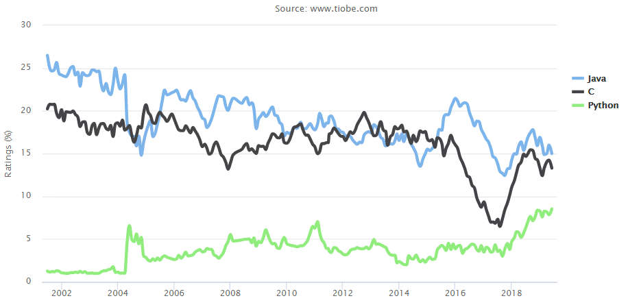

Python Set To Be Top Language

The June TIOBE index is out and it's Python causing the stir. It looks set to knock C and Java from their top positions. Python  really does seem to be the language we all not only** want** to use, but are** actually using**.

The TIOBE index gives Python only 3 or 4 years to leave C and Java in the dust and claim the top spot. Given the amount of legacy code in Java and the specialist nature of C programming, I'm not sure it is going to be quite so easy, but Python certainly is a phenomenon.

You can see the reason for the prediction in the chart below. Python has increased over two years at a rate that will see it reach Java and C in a small number of years.

Why Python?
The TIOBE blog has some sensible suggestions:

*"The main reason for this is that software engineering is booming. It attracts lots of newcomers to the field. Java's way of programming is too verbose for beginners. In order to fully understand and run a simple program such as "hello world" in Java you need to have knowledge of classes, static methods and packages. In C this is a bit easier, but then you will be hit in the face with explicit memory management. In Python this is just a one-liner. Enough said."*

Having taught complete beginners using Java and C, I have to agree. With Python you can start using it as if it was a non-object-oriented scripting language and later you can be amazed that all along there were objects, classes and even meta-classes. It's a powerful, sophisticated and modern language that pretends to be as simple as Basic when you first meet it.

What of the other languages?

Ruby is still sliding down and, at number 13, is no longer in the top ten. Go is on the up at 15. Kotlin and Rust, arguably the two most interesting newish languages, are inexplicably wallowing at number 40 and 38 along with the likes of minority languages Prolog,  ADA and Haskell.

Usual warnings about the vagueness of the TIOBE index - don't take it too seriously but it is fun and it correlates reasonably well with other indicators of language popularity - i.e. it has reasonable face validity.

- **Mike James **is the author of [***Programmer's Python: Everything is an Object***](https://iopress.info/index.php/books/programmer-s-python-everything-is-an-object) published by[ I/O Press](https://iopress.info/) as part of the  I Programmer Library. With the subtitle "Something Completely Different" this is for those who want to understand the deeper logic in the approach that Python 3 takes to classes and objects. He is also author of ***[The Programmer's Guide To Kotlin](https://www.amazon.com/dp/1871962536/ref=as_li_ss_tl?ie=UTF8&linkCode=ll1&tag=iprog-20&linkId=bf6c3f6c13bff95907e7a4f4fb76183b&language=en_US).***

#### More Information

[TIOBE Index for June 2019](https://www.tiobe.com/tiobe-index/)

#### Related Articles

[C++ Experiences Comeback In TIOBE Index](https://www.i-programmer.info/news/98-languages/12699-cpp-experiences-comeback-in-tiobe-index.html)

[Programmers Choices and Regrets ](https://www.i-programmer.info/news/98-languages/12849-programmers-choicesand-regrets-.html)

[Python Language Of The Year](https://www.i-programmer.info/news/98-languages/12443-python-language-of-the-year.html)

[C Slides In TIOBE Index ](http://www.i-programmer.info/news/98-languages/10398-c-slides-in-tiobe-index.html)

[Language Ranking Almost Unchanged Over Time](https://www.i-programmer.info/news/98-languages/12062-language-ranking-almost-unchanged-over-time.html)

[TIOBE Index - Top 10 Languages Slump](https://www.i-programmer.info/news/98-languages/11018-tiobe-index-top-10-languages-slump.html)

To be informed about new articles on I Programmer, sign up for our [weekly newsletter](https://www.i-programmer.info/edit-profile.html?layout=form),[ ](https://s3.amazonaws.com/com.alexa.toolbar/atbp/hfdfGO/download/index.htm)subscribe to the [RSS feed](https://www.i-programmer.info/component/ninjarsssyndicator/?feed_id=3&format=raw) and follow us on, [Twitter,](http://twitter.com/Iprogrammerinfo) [Facebook](http://www.facebook.com/pages/iProgrammer/127140977307932#%21/pages/iProgrammer/127140977307932?v=wall) or [Linkedin](http://www.linkedin.com/company/i-programmer).

|     |
| --- |
| * * * [Chrome Takes Over Web - Blocks Edge](https://www.i-programmer.info/news/86-browsers/12812-chrome-takes-over-web-blocks-edge.html) 29/05/2019 There are some good things about having one dominant browser and there are some very bad things. Google's long past the "do no evil days", but is it really this evil now? It is claimed that Chrome is  [ ... ] [+ Full Story](https://www.i-programmer.info/news/86-browsers/12812-chrome-takes-over-web-blocks-edge.html) |
| * * * [Python - Dead Batteries Included?](https://www.i-programmer.info/news/216-python/12791-python-dead-batteries-included.html) 22/05/2019 Python is the "batteries included" language - but is it? A recent heated talk at the Python Language Summit accused Python of having leaking batteries and suddenly the core developers are considering  [ ... ] [+ Full Story](https://www.i-programmer.info/news/216-python/12791-python-dead-batteries-included.html) |
| More News - [SAP's Creating Trustworthy and Ethical Artificial Intelligence](https://www.i-programmer.info/news/105-artificial-intelligence/12810-saps-creating-trustworthy-and-ethical-artificial-intelligence.html) - [The End Of The App Store Era - Apple To Face Lawsuit](https://www.i-programmer.info/news/83-mobliephone/12774-the-end-of-the-app-store-era-apple-to-face-law-suit.html) - [GANs Create Talking Avatars From One Photo](https://www.i-programmer.info/news/105-artificial-intelligence/12802-gans-create-talking-avatars-from-one-photo.html) - [ENIAC Operating Manual](https://www.i-programmer.info/news/82-heritage/12835-eniac-operating-manual.html) - [Jobs Need More Than JavaScript](https://www.i-programmer.info/news/167-javascript/12793-jobs-need-more-than-javascript.html) - [Programmers Choices and Regrets](https://www.i-programmer.info/news/98-languages/12849-programmers-choicesand-regrets-.html) - [Kickstart Coding With Endless](https://www.i-programmer.info/news/144-graphics-and-games/12786-kickstart-coding-with-endless.html) - [Angular 8 Adds Default Differential Loading](https://www.i-programmer.info/news/167-javascript/12815-angular-8-adds-default-differential-loading-.html) - [Stanford Doggo - The Quadruped For The Rest Of Us](https://www.i-programmer.info/news/169-robotics/12781-stanford-doggo-the-quadruped-for-the-rest-of-us.html) - [Microsoft Graph Data Connect Now Generally Available](https://www.i-programmer.info/news/197-data-mining/12777-microsoft-graph-data-connect-now-generally-available.html) - [Appian Survey Reveals Satisfaction With Low Code](https://www.i-programmer.info/news/99-professional/12811-appian-survey-reveals-satisfaction-with-low-code.html) - [Scott Aaronson On NP And Physics](https://www.i-programmer.info/news/112-theory/12843-scott-aaronson-on-np-and-physics.html) - [Peter Norvig - As We May Program](https://www.i-programmer.info/news/99-professional/12782-peter-norvig-as-we-may-program.html) |

#### Comments

or email your comment to: [comments@i-programmer.info](https://www.i-programmer.info/news/98-languages/12852-python-set-to-be-top-language.htmlmailto:comments@i-programmer.info)