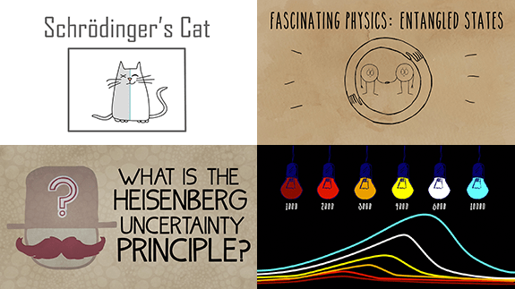
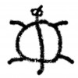

Quantum mechanics 101: Demystifying tough physics in 4 easy lessons

## [Quantum mechanics 101: Demystifying tough physics in 4 easy lessons](http://blog.ed.ted.com/2014/12/07/quantum-mechanics-101-demystifying-tough-physics-in-4-easy-lessons/)

By Emilie Soffe on December 7, 2014 in [TED-Ed Lessons](http://blog.ed.ted.com/category/lessons/)

Ready to level up your working knowledge of quantum mechanics? Check out these four TED-Ed Lessons written by Chad Orzel, Associate Professor in the Department of Physics and Astronomy at Union College and author of *How to Teach Quantum Physics to Your Dog.*

1. [Particles and waves: The central mystery of quantum mechanics](http://ed.ted.com/lessons/particles-and-waves-the-central-mystery-of-quantum-mechanics-chad-orzel)

One of the most amazing facts in physics is that everything in the universe, from light to electrons to atoms, behaves like both a particle and a wave at the same time. But how did physicists arrive at this mind-boggling conclusion? In this lesson, Orzel recounts the string of scientists who built on each other’s discoveries to arrive at this ‘central mystery’ of quantum mechanics.

[Particles and waves: The central mystery of quantum mechanics - Chad Orzel](https://www.youtube.com/watch?v=Hk3fgjHNQ2Q)

2. [Schrödinger’s cat: A thought experiment in quantum mechanics](http://ed.ted.com/lessons/schrodinger-s-cat-a-thought-experiment-in-quantum-mechanics-chad-orzel)

Austrian physicist Erwin Schrödinger, one of the founders of quantum mechanics, posed this famous question: If you put a cat in a sealed box with a device that has a 50% chance of killing the cat in the next hour, what will be the state of the cat when that time is up? Orzel investigates this thought experiment.

[Schrödinger's cat: A thought experiment in quantum mechanics - Chad Orzel](https://www.youtube.com/watch?v=UjaAxUO6-Uw)

3. [Einstein’s brilliant mistake: Entangled states](http://ed.ted.com/lessons/einstein-s-brilliant-mistake-entangled-states-chad-orzel)

When you think about Einstein and physics, E=mc^2 is probably the first thing that comes to mind. But one of his greatest contributions to the field actually came in the form of an odd philosophical footnote in a 1935 paper he co-wrote — which ended up being wrong. Here, Orzel details Einstein’s “EPR” paper and its insights on the strange phenomena of entangled states.

[Einstein's brilliant mistake: Entangled states - Chad Orzel](https://www.youtube.com/watch?v=DbbWx2COU0E)

4. [What is the Heisenberg Uncertainty Principle?](http://ed.ted.com/lessons/what-is-the-heisenberg-uncertainty-principle-chad-orzel)

The Heisenberg Uncertainty Principle states that you can never simultaneously know the exact position and the exact speed of an object. Why not? Because everything in the universe behaves like both a particle and a wave at the same time. In his final lesson, Orzel navigates this complex concept of quantum physics.

[What is the Heisenberg Uncertainty Principle? - Chad Orzel](https://www.youtube.com/watch?v=TQKELOE9eY4)

### Share this:

- [Facebook](http://blog.ed.ted.com/2014/12/07/quantum-mechanics-101-demystifying-tough-physics-in-4-easy-lessons/?share=facebook&nb=1)
- [Twitter](http://blog.ed.ted.com/2014/12/07/quantum-mechanics-101-demystifying-tough-physics-in-4-easy-lessons/?share=twitter&nb=1)
- [Email](http://blog.ed.ted.com/2014/12/07/quantum-mechanics-101-demystifying-tough-physics-in-4-easy-lessons/?share=email&nb=1)

-

## Related Articles

 [            ####    Should every kid learn to love computer science?](http://blog.ed.ted.com/2017/02/09/should-every-kid-learn-to-love-computer-science/)  [            ####    The neuroscience of Pokemon Go](http://blog.ed.ted.com/2016/08/01/the-neuroscience-of-pokemon-go/)

### 30 Comments

1. [Roisin Colgan](http://facebook/)

[December 10, 2014 at 8:23 am](http://blog.ed.ted.com/2014/12/07/quantum-mechanics-101-demystifying-tough-physics-in-4-easy-lessons/#comment-574958)·

more physics please. I love physics,in fact I would love a physics talk every day.

IS THIS POSSIBLE ..?

    - Jeff

[December 12, 2014 at 12:49 am](http://blog.ed.ted.com/2014/12/07/quantum-mechanics-101-demystifying-tough-physics-in-4-easy-lessons/#comment-579859)·

Yeah, I think it’s called school.

        - Oliver

[December 19, 2014 at 10:24 am](http://blog.ed.ted.com/2014/12/07/quantum-mechanics-101-demystifying-tough-physics-in-4-easy-lessons/#comment-603042)·

Bwaaaaahaahahaha

            - ZephyrWolf

[July 27, 2015 at 11:03 am](http://blog.ed.ted.com/2014/12/07/quantum-mechanics-101-demystifying-tough-physics-in-4-easy-lessons/#comment-862021)·

Not quite, although Physics i a subject, most cases involve slow repetitive learning, while TED talks provide a quick insight into a new unexplored area for the person watching. So school becomes extraordinarily repetitive, especially since most work is done by building upon already know principles, and in most cases, simply combining them, no new work. In other words… I am sick of how boring and repetitive my school curriculum is, however that does help when studying, so what can you do.

2. Job

[December 10, 2014 at 5:33 pm](http://blog.ed.ted.com/2014/12/07/quantum-mechanics-101-demystifying-tough-physics-in-4-easy-lessons/#comment-575899)·

Excellent : Theoretical aspects explained so well indeed demystifying!

3. Marianella

[December 11, 2014 at 12:15 am](http://blog.ed.ted.com/2014/12/07/quantum-mechanics-101-demystifying-tough-physics-in-4-easy-lessons/#comment-576813)·

Thank you! I look forward to sharing with my children.

4. Timothy

[December 11, 2014 at 3:08 am](http://blog.ed.ted.com/2014/12/07/quantum-mechanics-101-demystifying-tough-physics-in-4-easy-lessons/#comment-577204)·

This is a great little collection nicely put together. Thank you. I’m sure my students will enjoy it.

5. sanjay

[December 11, 2014 at 5:32 am](http://blog.ed.ted.com/2014/12/07/quantum-mechanics-101-demystifying-tough-physics-in-4-easy-lessons/#comment-577479)·

Thank you, post more . Love them

6. mahesh

[December 11, 2014 at 5:34 am](http://blog.ed.ted.com/2014/12/07/quantum-mechanics-101-demystifying-tough-physics-in-4-easy-lessons/#comment-577484)·

Really helping…in all d
Quantum confusion…

7. Brandon

[December 11, 2014 at 12:16 pm](http://blog.ed.ted.com/2014/12/07/quantum-mechanics-101-demystifying-tough-physics-in-4-easy-lessons/#comment-578171)·

Thank you!

8. joseph deluca

[December 11, 2014 at 4:19 pm](http://blog.ed.ted.com/2014/12/07/quantum-mechanics-101-demystifying-tough-physics-in-4-easy-lessons/#comment-578677)·

Sharing this with my intervention group of 4th & 5th graders…can’t wait to see what happens!

9. Daniel Rohner

[December 11, 2014 at 7:06 pm](http://blog.ed.ted.com/2014/12/07/quantum-mechanics-101-demystifying-tough-physics-in-4-easy-lessons/#comment-579080)·

The 11 dimensions of our existence are divided between space, time and size. 6 spacial, 4 size, and 1 time. I call the size dimensions Big, Small, More, and less. When the more small become one large the magic can happen.

10. Manoj Powar

[December 11, 2014 at 7:20 pm](http://blog.ed.ted.com/2014/12/07/quantum-mechanics-101-demystifying-tough-physics-in-4-easy-lessons/#comment-579107)·

http://blog.ed.ted.com/2014/12/07/quantum-mechanics-101-demystifying-tough-physics-in-4-easy-lessons/

IT IS NOT A QUESTION OF MAKING A MISTAKE IT IS A QUESTION OF REALIZING THAT ONE MISTAKE IS LIKE AN EQUATION TO BE SOLVED IT IS A LIFE WHERE YOU FIND REACHING TILL THE TIME YOU HAVE SOLVED ALL THE X’s AND Y’s till the time you reach your Zee        have FUN MANOJ POWAR POWER.

LIVE LIFE TILL YOU REACH ZEE I.E. THE END

When life leaves between quantum physics and string theory you realize a section of relativity which is unsaid and that is a a very personal very deep and doable thought and relation with people whom you have a deep relationship with . Which i hope GOOGLE founders (Larry Page and Sergey Bin) Mark Zuckerberg WITH WHATSAPP and Tom Cook of Apple (With a closed system) not to forget the ALIBABAS AND THE BAIDUS do they and using all there there systems and tools of Business Intelligence and Analysis realize that what THEY ARE doing is being a New age guru I hope it leads to world connectivity and as we use to say in our generation in India where the realization came very early through I believe our spiriritulltaulity in beleiveing and respectinfg elders.

I DO NOT SAY THE WHAT WE CAN DO BUT I DO SAY WHAT WE SHOULD NOT DO THAT COULD BE UNDERSTOOD ABOVE .

You the youth are the harbingers of the real truth i.e. connectivity.

11. jesi

[December 11, 2014 at 10:07 pm](http://blog.ed.ted.com/2014/12/07/quantum-mechanics-101-demystifying-tough-physics-in-4-easy-lessons/#comment-579498)·

and the conclusion is: humanity knows nothing about what’s going on here.

    - Heidi

[December 12, 2014 at 5:13 pm](http://blog.ed.ted.com/2014/12/07/quantum-mechanics-101-demystifying-tough-physics-in-4-easy-lessons/#comment-581956)·

Right. But now we know that there is something to know. You know? So, actually, we know something.

12. Mathias

[December 12, 2014 at 12:45 am](http://blog.ed.ted.com/2014/12/07/quantum-mechanics-101-demystifying-tough-physics-in-4-easy-lessons/#comment-579848)·

With my dangerous half-knowledge I conclude that the solution to the “spooky action at a distance” („spukhafte* Fernwirkung“) in the entanglement video is that the two particles are really not separate at a higher spatial dimension, only appear so in our limited perception of three (spatial) dimension plus time. Once they have been together they will always be, everything is connected (as everything was together at the Big Bang). Christmas is typically a time where Westerners are more aware than usual that we are really all connected and our thoughts change the world through influencing quantum states. (See Gregg Braden’s “Divine Matrix” talk in Milan available at http://youtu.be/MRedvbARVhM – I don’t agree scientifically with everything he says, but scientists miss a trick by only nit-picking these popular pseudo-scientific spirits without realising that they are on to something with the practical points they’re making.)

* Pricelessly, at 2:44, the „spukhafte“ is written wrongly as „spuckhafte“. Spucken means to spit, so this would translate as “action at a distance like spitting”. „Spuckhaft“ could also mean jail for spitting but that goes too far.)

13. [Richard Brennan](http://facebook/)

[December 12, 2014 at 2:48 am](http://blog.ed.ted.com/2014/12/07/quantum-mechanics-101-demystifying-tough-physics-in-4-easy-lessons/#comment-580117)·

Is it possible a new Newton comes along and creates a new puzzle.

14. William Hunter

[December 12, 2014 at 2:38 pm](http://blog.ed.ted.com/2014/12/07/quantum-mechanics-101-demystifying-tough-physics-in-4-easy-lessons/#comment-581597)·

The word of God says that Jesus Christ is the one that keeps all these particles together…..in other words he abides in every nook and crany right down to an atomic level and the only place he does not abide in is in your heart…do you know why….because its by invite alone and thats the place he wants to abide in more than anywhere…… invite him into your heart today as he loves you more than you could ever imagine….

.

    - Cecily

[June 4, 2015 at 3:23 am](http://blog.ed.ted.com/2014/12/07/quantum-mechanics-101-demystifying-tough-physics-in-4-easy-lessons/#comment-826452)·

Yes, He is the master of our hearts only in our giving them. Thank-you, I do.

15. Agata

[December 12, 2014 at 7:49 pm](http://blog.ed.ted.com/2014/12/07/quantum-mechanics-101-demystifying-tough-physics-in-4-easy-lessons/#comment-582342)·

Does professor Chad Orzel have polish roots? Because “orzeł” in polish is “eagle” and I couldn’t find any information about professor’s descent.

16. [Adrian](http://www.podcastpedia.org/)

[December 13, 2014 at 1:18 pm](http://blog.ed.ted.com/2014/12/07/quantum-mechanics-101-demystifying-tough-physics-in-4-easy-lessons/#comment-584677)·

It’s called “spukhafte Fernwirkung” NOT “spukhafte Ferwirklung”- please correct in 3rd video. Othewise awesome work.

Thanks,
Adrian

17. Joshua Conci

[December 15, 2014 at 3:06 pm](http://blog.ed.ted.com/2014/12/07/quantum-mechanics-101-demystifying-tough-physics-in-4-easy-lessons/#comment-591123)·

Re: Entangles States

The two paired particles could be functioning similar to two ends of a “tube” or “Cylinder” spinning on its axis. They have reverse rotations when both are looked at simultaneously. As in one end is spinning clockwise while the other is spinning counter-clockwise. All spinning objects are like this, I mentioned a tube though because the “ends” indicate separate locations. It just seems as though what they are measuring is essentially two opposite ends of a single “thing”. These opposing ends states are entangles just as the ends of a tube are entangles…except for in this case the “tube” or “cylinder” is invisible or escaping measurement. I have a diagram to explain this but can’t post it.

18. [Sean](http://www.youtube.com/watch?v=KKAwpEetJ-Q&list=PL3zkZRUI2IyBFAowlUivFbeBh-Mq7HdoQ)

[December 15, 2014 at 8:54 pm](http://blog.ed.ted.com/2014/12/07/quantum-mechanics-101-demystifying-tough-physics-in-4-easy-lessons/#comment-591897)·

An apple has an inside and an outside, …..correct ? After all, how could it not have both an inside and an outside !

The universe also has an inside and an outside. After all, how could it not have both an inside and an outside !

However, in the world of physics, there is no attention being paid at all concerning the outside, nor do they even ponder the idea of there possibly being an outside. Thus the outside is totally rejected by today’s physicists.

An inside is different than an outside, thus the laws of physics on the outside of the universe are different than the laws of physics on the inside. An event can be governed from either of these two sides.

Whenever an event is governed from the outside, while being observed by today’s physicists on the inside, thanks to their ongoing total ignorance of the outside and the laws of physics on the outside, they see nothing but an event that has no fully explicable cause. They place such an event under the title “The Mysteriousness of Quantum Mechanics”.

Today’s physicists subconsciously have decided to leave the “outside” to those imaginative religious folk. In turn, the mysteries go on and on via today’s physicists demanding the acceptance of pure mysteriousness rather than finding the true cause or foundation. Thus there is an ongoing mere “acceptance” of Particle/Wave Duality, Action at a Distance, Entangled Pairs, Collapse of the Quantum Wave, Delayed Quantum Choice, Quantum Erasure, etc., yet there is absolutely no interest in the full explanation of each such bizarre phenomena.

However, if you include the laws of physics on the outside, all of these mysteries disappear in an instant. But, unfortunately, concerning this complete inside/outside understanding, today’s physicists currently have no interest at all in such completeness. Thus any presentation given of the outside laws of physics, is a useless presentation. It is ignored by the physics community in a nanosecond.

    - Georgie

[March 14, 2015 at 11:11 pm](http://blog.ed.ted.com/2014/12/07/quantum-mechanics-101-demystifying-tough-physics-in-4-easy-lessons/#comment-751286)·

https://www.youtube.com/watch?v=kYAdwS5MFjQ
Not true …

19. K K CHOPRA

[December 16, 2014 at 1:02 pm](http://blog.ed.ted.com/2014/12/07/quantum-mechanics-101-demystifying-tough-physics-in-4-easy-lessons/#comment-593866)·

I found these lessons very interesting and fascinating. Some very mysterious concepts are explained in an easy to understand way. I hope the students of Physics will have their curiosity aroused to get interested in quantum physics.

20. Stickler

[June 4, 2015 at 9:22 am](http://blog.ed.ted.com/2014/12/07/quantum-mechanics-101-demystifying-tough-physics-in-4-easy-lessons/#comment-826603)·

Just to prevent the further spread of an incorrect version of Einstein’s original “spooky action at a distance” comment, this was actually “**Spukhafte Fernwirkung**“.

21. Sifat

[August 23, 2015 at 5:26 pm](http://blog.ed.ted.com/2014/12/07/quantum-mechanics-101-demystifying-tough-physics-in-4-easy-lessons/#comment-867964)·

I will be really happy if my college starts to show TED-Ed videos in classes.

22. [Physics Tutors](https://www.studentlance.com/subjects/physics-homework-help/)

[March 15, 2016 at 6:18 am](http://blog.ed.ted.com/2014/12/07/quantum-mechanics-101-demystifying-tough-physics-in-4-easy-lessons/#comment-902569)·

Students always misunderstood tough physics topics in the absence of proper guidance. You have truly demystify the physics concepts in these lessons very well. Thanks and keep up the good work!!

23. Errol Hussey

[September 22, 2016 at 9:08 pm](http://blog.ed.ted.com/2014/12/07/quantum-mechanics-101-demystifying-tough-physics-in-4-easy-lessons/#comment-916287)·

I think it is okay that Einstien made a mistake… he is human after all.

24. Ahmed Ibrahim

[October 6, 2016 at 11:03 pm](http://blog.ed.ted.com/2014/12/07/quantum-mechanics-101-demystifying-tough-physics-in-4-easy-lessons/#comment-917448)·

Keep going, the most remarkable page I have ever seen. Good job