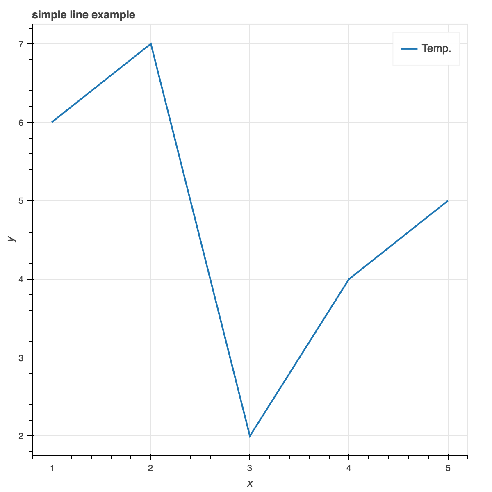
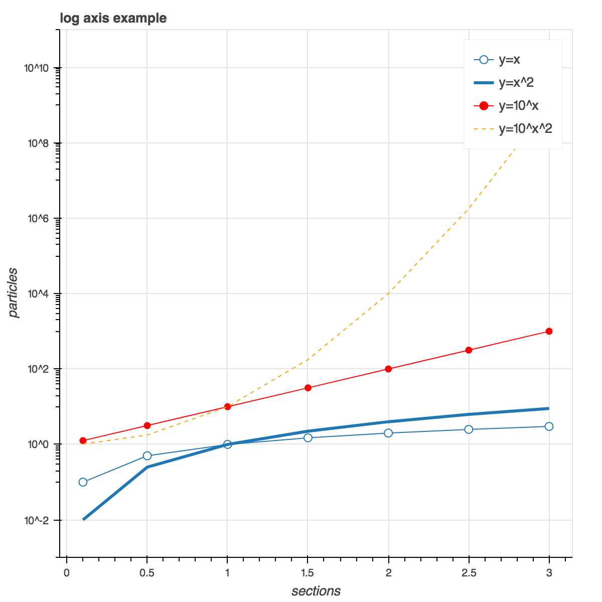
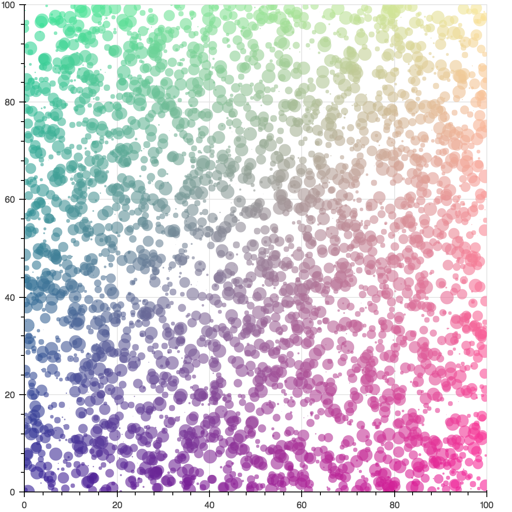
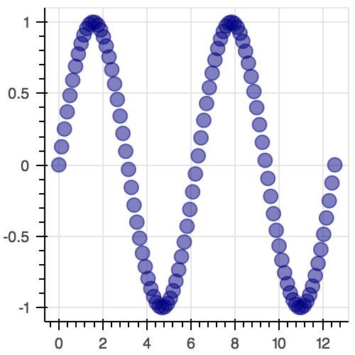
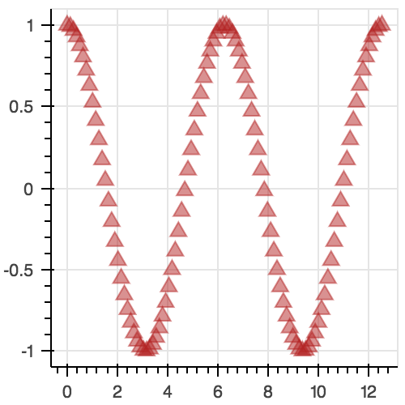
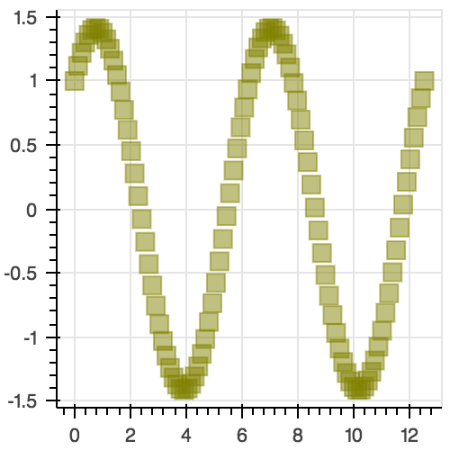
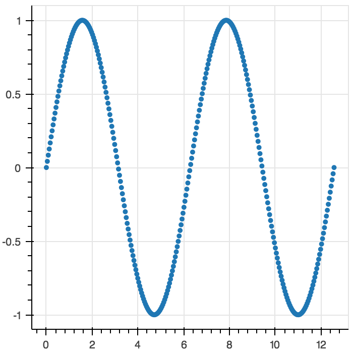
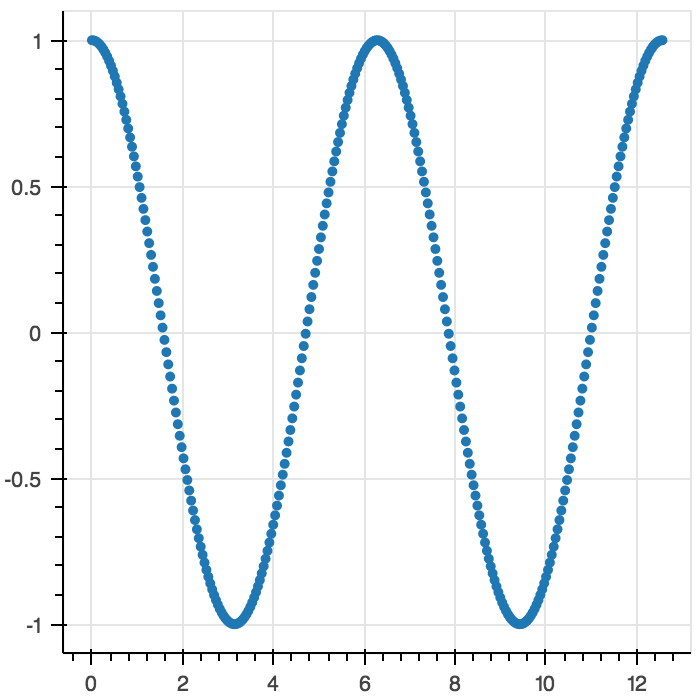
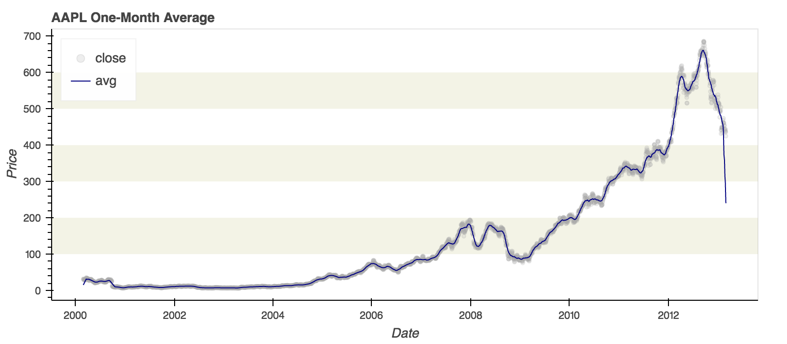

Quickstart — Bokeh 0.12.10 documentation

# Quickstart[¶](https://bokeh.pydata.org/en/latest/docs/user_guide/quickstart.html#quickstart)

## Introduction[¶](https://bokeh.pydata.org/en/latest/docs/user_guide/quickstart.html#introduction)

Bokeh is a Python interactive visualization library that targets modern web browsers for presentation. Bokeh provides elegant, concise construction of novel graphics with high-performance interactivity over very large or streaming datasets in a quick and easy way.

To offer both simplicity and the powerful and flexible features needed for advanced customizations, Bokeh exposes two interface levels to users:

- a *low-level*  [bokeh.models](https://bokeh.pydata.org/en/latest/docs/reference/models.html#bokeh-models) interface that provides the most flexibility to application developers.
- an *higher-level*  [bokeh.plotting](https://bokeh.pydata.org/en/latest/docs/reference/plotting.html#bokeh-plotting) interface centered around composing visual glyphs.

This Quickstart focuses on the [bokeh.plotting](https://bokeh.pydata.org/en/latest/docs/reference/plotting.html#bokeh-plotting) interface.

## Quick Installation[¶](https://bokeh.pydata.org/en/latest/docs/user_guide/quickstart.html#quick-installation)

There are multiple ways to install Bokeh, and we recommend the easiest one, which is to use the [Anaconda Python distribution](http://anaconda.com/anaconda) and enter this command at a Bash or Windows command prompt:

conda install bokeh

This installs all the dependencies that Bokeh needs. Anaconda minimizes installation effort on all platforms and configurations, including Windows, and also installs the examples into the `examples/` subdirectory of your Anaconda or Miniconda installation directory.

If you are confident that you have installed all needed dependencies, such as NumPy, you may instead use `pip` at the command line:

pip install bokeh
Note

The `pip` method does not install the examples. Clone the Git repository and look in the `examples/` directory of the checkout to see examples.

## Getting Started[¶](https://bokeh.pydata.org/en/latest/docs/user_guide/quickstart.html#getting-started)

Bokeh is a large library that exposes many capabilities, so this section is only a quick tour of some common Bokeh use cases and workflows. For more detailed information please consult the full [User Guide](https://bokeh.pydata.org/en/latest/docs/user_guide.html#userguide).

Let’s begin with some examples.

Plotting data in basic Python lists as a line plot including zoom, pan, save, and other tools is simple and straightforward:

from  bokeh.plotting  import  figure,  output_file,  show*# prepare some data*x  =  [1,  2,  3,  4,  5]y  =  [6,  7,  2,  4,  5]*# output to static HTML file*output_file("lines.html")*# create a new plot with a title and axis labels*p  =  figure(title="simple line example",  x_axis_label='x',  y_axis_label='y')*# add a line renderer with legend and line thickness*p.line(x,  y,  legend="Temp.",  line_width=2)*# show the results*show(p)

[(L)](https://bokeh.pydata.org/)

When you execute this script, you will see that a new output file`"lines.html"` is created, and that a browser automatically opens a new tab to display it. (For presentation purposes we have included the plot output directly inline in this document.)

The basic steps to creating plots with the [bokeh.plotting](https://bokeh.pydata.org/en/latest/docs/reference/plotting.html#bokeh-plotting) interface are:

1. Prepare some data (in this case plain python lists).

2. Tell Bokeh where to generate output (in this case using [`output_file()`](https://bokeh.pydata.org/en/latest/docs/reference/io.html#bokeh.io.output_file), with the filename `"lines.html"`).

3. Call `figure()` to create a plot with some overall options like title, tools and axes labels.

4. Add renderers (in this case, `Figure.line`) for our data, with visual customizations like colors, legends and widths to the plot.

5. Ask Bokeh to [`show()`](https://bokeh.pydata.org/en/latest/docs/reference/io.html#bokeh.io.show) or [`save()`](https://bokeh.pydata.org/en/latest/docs/reference/io.html#bokeh.io.save) the results.

Steps three and four can be repeated to create more than one plot, as shown in some of the examples below.

The [bokeh.plotting](https://bokeh.pydata.org/en/latest/docs/reference/plotting.html#bokeh-plotting) interface is also quite handy if we need to customize the output a bit more by adding more data series, glyphs, logarithmic axis, and so on. It’s also possible to easily combine multiple glyphs together on one plot as shown below:

from  bokeh.plotting  import  figure,  output_file,  show*# prepare some data*x  =  [0.1,  0.5,  1.0,  1.5,  2.0,  2.5,  3.0]y0  =  [i**2  for  i  in  x]y1  =  [10**i  for  i  in  x]y2  =  [10**(i**2)  for  i  in  x]*# output to static HTML file*output_file("log_lines.html")*# create a new plot*p  =  figure(  tools="pan,box_zoom,reset,save",  y_axis_type="log",  y_range=[0.001,  10**11],  title="log axis example",  x_axis_label='sections',  y_axis_label='particles')*# add some renderers*p.line(x,  x,  legend="y=x")p.circle(x,  x,  legend="y=x",  fill_color="white",  size=8)p.line(x,  y0,  legend="y=x^2",  line_width=3)p.line(x,  y1,  legend="y=10^x",  line_color="red")p.circle(x,  y1,  legend="y=10^x",  fill_color="red",  line_color="red",  size=6)p.line(x,  y2,  legend="y=10^x^2",  line_color="orange",  line_dash="4 4")*# show the results*show(p)

[(L)](https://bokeh.pydata.org/)

## Jupyter Notebooks[¶](https://bokeh.pydata.org/en/latest/docs/user_guide/quickstart.html#jupyter-notebooks)

At this point we should mention Jupyter (formerly IPython) notebooks.

Jupyter notebooks are a fantastic tool for exploratory data analysis, widely used across the “PyData” community. Bokeh integrates seamlessly with Jupyter notebooks. To view the above examples in a notebook, you would only change [`output_file()`](https://bokeh.pydata.org/en/latest/docs/reference/io.html#bokeh.io.output_file) to a call to [`output_notebook()`](https://bokeh.pydata.org/en/latest/docs/reference/io.html#bokeh.io.output_notebook) instead.

Many static examples may be viewed directly online at the[Bokeh NBViewer Gallery](http://nbviewer.ipython.org/github/bokeh/bokeh-notebooks/blob/master/index.ipynb).

The [Bokeh GitHub repository](https://github.com/bokeh/bokeh) also has a number of example notebooks in the`examples/howto` directory. After cloning the repository, navigate there and run:

ipython notebook

You can open and interact with any of the notebooks listed in the index page that automatically opens up. In particular, you might check out these examples, which show how Bokeh can be used together with Jupyter interactive widgets:

[examples/howto/notebook_comms/Jupyter Interactors.ipynb](https://github.com/bokeh/bokeh/tree/0.12.10/examples/howto/notebook_comms/Jupyter%20Interactors.ipynb)

[examples/howto/notebook_comms/Numba Image Example.ipynb](https://github.com/bokeh/bokeh/tree/0.12.10/examples/howto/notebook_comms/Numba%20Image%20Example.ipynb)

## Zeppelin Notebooks[¶](https://bokeh.pydata.org/en/latest/docs/user_guide/quickstart.html#zeppelin-notebooks)

At this point we should mention [Apache Zeppelin](http://zeppelin.apache.org/) notebooks.

[Apache Zeppelin](http://zeppelin.apache.org/) is a web-based notebook that enables interactive data analytics. You can make beautiful data-driven, interactive and collaborative documents with SQL, Scala and more. It is widely used across the Spark community. Bokeh integrates seamlessly with Zeppelin notebooks. To view the above examples in a notebook, you would only need change [`output_file()`](https://bokeh.pydata.org/en/latest/docs/reference/io.html#bokeh.io.output_file) to [`output_notebook()`](https://bokeh.pydata.org/en/latest/docs/reference/io.html#bokeh.io.output_notebook) (notebook_type=’zeppelin’) instead.

The usage of bokeh in Zeppelin notebook is no difference from Jupyter except you need to specify notebook_type as zeppelin.

## Other Languages[¶](https://bokeh.pydata.org/en/latest/docs/user_guide/quickstart.html#other-languages)

Bokeh’s architecture makes it easy to create bindings for Bokeh in other languages, and in fact several already exist. We are obviously big Python fans, but having many language options is a compelling feature. Here are some of the other ways to use Bokeh:

- [Bokeh for R](http://hafen.github.io/rbokeh/)
- [Bokeh for Scala](https://github.com/bokeh/bokeh-scala)
- [Bokeh for Julia](https://github.com/bokeh/Bokeh.jl)

## Sample Data[¶](https://bokeh.pydata.org/en/latest/docs/user_guide/quickstart.html#sample-data)

Some of the examples included in the Bokeh source make use of sample data files that are distributed separately. To download this data, execute the following commands at a Bash or Windows command prompt:

bokeh sampledata

## Concepts[¶](https://bokeh.pydata.org/en/latest/docs/user_guide/quickstart.html#concepts)

Let’s consider the plots above, and use them to help define some core concepts.

### Plot[¶](https://bokeh.pydata.org/en/latest/docs/user_guide/quickstart.html#plot)

Plots are a central concept in Bokeh. They are containers that hold all the various objects (renderers, guides, data, and tools) that comprise the final visualization that is presented to users. The [bokeh.plotting](https://bokeh.pydata.org/en/latest/docs/reference/plotting.html#bokeh-plotting) interface provides a `Figure` class to help with assembling all the necessary objects, and a convenience function `figure()` for creating `Figure` objects.

### Glyphs[¶](https://bokeh.pydata.org/en/latest/docs/user_guide/quickstart.html#glyphs)

Glyphs are the basic visual marks that Bokeh can display. At the lowest level, there are **glyph objects**, such as [`Line`](https://bokeh.pydata.org/en/latest/docs/reference/models/glyphs/line.html#bokeh.models.glyphs.Line). If you are using the low-level[bokeh.models](https://bokeh.pydata.org/en/latest/docs/reference/models.html#bokeh-models) interface, it is your responsibility to create and coordinate all the various Bokeh objects, including glyph objects and their data sources. To make life easier, the [bokeh.plotting](https://bokeh.pydata.org/en/latest/docs/reference/plotting.html#bokeh-plotting) interface exposes higher level**glyph methods** such as the `Figure.line` method used in the first example. The second example also adds in calls to `Figure.circle` to display circle and line glyphs together on the same plot. Besides lines and circles, Bokeh makes many additional [glyphs](https://bokeh.pydata.org/en/latest/docs/reference/models/glyphs.html#bokeh-models-glyphs) and [markers](https://bokeh.pydata.org/en/latest/docs/reference/models/markers.html#bokeh-models-markers) available.

The visual appearance of a glyph is tied directly to the data values that are associated with the glyph’s various attributes. In the example above we see that positional attributes like x and y can be set to vectors of data. But glyphs also have some combination of [Line Properties](https://bokeh.pydata.org/en/latest/docs/user_guide/styling.html#userguide-styling-line-properties), [Fill Properties](https://bokeh.pydata.org/en/latest/docs/user_guide/styling.html#userguide-styling-fill-properties), and[Text Properties](https://bokeh.pydata.org/en/latest/docs/user_guide/styling.html#userguide-styling-text-properties) to control their appearance. All of these attributes can be set with “vectorized” values as well. We will show examples of this below.

### Guides and Annotations[¶](https://bokeh.pydata.org/en/latest/docs/user_guide/quickstart.html#guides-and-annotations)

Bokeh plots can also have other visual components that aid presentation or help the user make comparisons. These fall into two categories. **Guides**are visual aids that help users judge distances, angles, etc. These include grid lines or bands, axes (such as linear, log, or datetime) that may have ticks and tick labels as well. **Annotations** are visual aids that label or name parts of the plot. These include titles, legends, etc.

### Ranges[¶](https://bokeh.pydata.org/en/latest/docs/user_guide/quickstart.html#ranges)

Ranges describe the data-space bounds of a plot. By default, plots generated with the [bokeh.plotting](https://bokeh.pydata.org/en/latest/docs/reference/plotting.html#bokeh-plotting) interface come configured with[`DataRange1d`](https://bokeh.pydata.org/en/latest/docs/reference/models/ranges.html#bokeh.models.ranges.DataRange1d) objects that try to automatically set the plot bounds to encompass all the available data. But it is possible to supply explicit[`Range1d`](https://bokeh.pydata.org/en/latest/docs/reference/models/ranges.html#bokeh.models.ranges.Range1d) objects for fixed bounds. As a convenience these can also typically be spelled as 2-tuples or lists:

p  =  figure(x_range=[0,10],  y_range=(10,  20))

### Resources[¶](https://bokeh.pydata.org/en/latest/docs/user_guide/quickstart.html#resources)

To generate plots, the client library BokehJS JavaScript and CSS code must be loaded into the browser. By default, the [`output_file()`](https://bokeh.pydata.org/en/latest/docs/reference/io.html#bokeh.io.output_file) function will load BokehJS from [http://cdn.pydata.org](http://cdn.pydata.org/) . However, you can also configure Bokeh to generate static HTML files with BokehJS resources embedded directly inside, by passing the argument `mode="inline"` to the [`output_file()`](https://bokeh.pydata.org/en/latest/docs/reference/io.html#bokeh.io.output_file) function.

## More examples[¶](https://bokeh.pydata.org/en/latest/docs/user_guide/quickstart.html#more-examples)

Here are a few more examples to demonstrate other common tasks and use-cases with the [bokeh.plotting](https://bokeh.pydata.org/en/latest/docs/reference/plotting.html#bokeh-plotting) interface.

### Vectorized colors and sizes[¶](https://bokeh.pydata.org/en/latest/docs/user_guide/quickstart.html#vectorized-colors-and-sizes)

This example shows how it is possible to provide sequences of data values for glyph attributes like `fill_color` and `radius`. Other things to look out for in this example:

- supplying an explicit list of tool names to `figure()`
- fetching BokehJS resources from CDN using the `mode` argument
- setting the `x_range` and `y_range` explicitly
- turning a line *off* (by setting its value to `None`)
- using NumPy arrays for supplying data

import  numpy  as  npfrom  bokeh.plotting  import  figure,  output_file,  show*# prepare some data*N  =  4000x  =  np.random.random(size=N)  *  100y  =  np.random.random(size=N)  *  100radii  =  np.random.random(size=N)  *  1.5colors  =  [  "#%02x%02x%02x"  %  (int(r),  int(g),  150)  for  r,  g  in  zip(50+2*x,  30+2*y)]*# output to static HTML file (with CDN resources)*output_file("color_scatter.html",  title="color_scatter.py example",  mode="cdn")TOOLS="crosshair,pan,wheel_zoom,box_zoom,reset,box_select,lasso_select"*# create a new plot with the tools above, and explicit ranges*p  =  figure(tools=TOOLS,  x_range=(0,100),  y_range=(0,100))*# add a circle renderer with vectorized colors and sizes*p.circle(x,y,  radius=radii,  fill_color=colors,  fill_alpha=0.6,  line_color=None)*# show the results*show(p)

[(L)](https://bokeh.pydata.org/)

### Linked panning and brushing[¶](https://bokeh.pydata.org/en/latest/docs/user_guide/quickstart.html#linked-panning-and-brushing)

Linking together various aspects of different plots can be a useful technique for data visualization. In Bokeh, such linkages are typically accomplished by*sharing* some plot component between plots. Below is an example that demonstrates **linked panning** (where changing the range of one plot causes others to update) by sharing range objects between the plots. Some other things to look out for in this example:

- calling `figure()` multiple times to create multiple plots
- using [`gridplot()`](https://bokeh.pydata.org/en/latest/docs/reference/layouts.html#bokeh.layouts.gridplot) to arrange several plots in an array
- showing new glyphs using new glyph methods `Figure.triangle` and`Figure.square`
- hiding the toolbar by setting `toolbar_location` to `None`
- setting convenience arguments `color` (sets both `line_color` and`fill_color`) and `alpha` (sets both `line_alpha` and`fill_alpha`)

import  numpy  as  npfrom  bokeh.layouts  import  gridplotfrom  bokeh.plotting  import  figure,  output_file,  show*# prepare some data*N  =  100x  =  np.linspace(0,  4*np.pi,  N)y0  =  np.sin(x)y1  =  np.cos(x)y2  =  np.sin(x)  +  np.cos(x)*# output to static HTML file*output_file("linked_panning.html")*# create a new plot*s1  =  figure(width=250,  plot_height=250,  title=None)s1.circle(x,  y0,  size=10,  color="navy",  alpha=0.5)*# NEW: create a new plot and share both ranges*s2  =  figure(width=250,  height=250,  x_range=s1.x_range,  y_range=s1.y_range,  title=None)s2.triangle(x,  y1,  size=10,  color="firebrick",  alpha=0.5)*# NEW: create a new plot and share only one range*s3  =  figure(width=250,  height=250,  x_range=s1.x_range,  title=None)s3.square(x,  y2,  size=10,  color="olive",  alpha=0.5)*# NEW: put the subplots in a gridplot*p  =  gridplot([[s1,  s2,  s3]],  toolbar_location=None)*# show the results*show(p)

Although the toolbar is hidden, the pan tool is still present and active. Click and drag the above plots to pan them, and see how their ranges are linked together.

Another linkage that is often useful is **linked brushing** (where a selection on one plot causes a selection to update on other plots). Below is an example that demonstrates linked brushing by sharing a [`ColumnDataSource`](https://bokeh.pydata.org/en/latest/docs/reference/models/sources.html#bokeh.models.sources.ColumnDataSource) between two plots:

import  numpy  as  npfrom  bokeh.plotting  import  *from  bokeh.models  import  ColumnDataSource*# prepare some date*N  =  300x  =  np.linspace(0,  4*np.pi,  N)y0  =  np.sin(x)y1  =  np.cos(x)*# output to static HTML file*output_file("linked_brushing.html")*# NEW: create a column data source for the plots to share*source  =  ColumnDataSource(data=dict(x=x,  y0=y0,  y1=y1))TOOLS  =  "pan,wheel_zoom,box_zoom,reset,save,box_select,lasso_select"*# create a new plot and add a renderer*left  =  figure(tools=TOOLS,  width=350,  height=350,  title=None)left.circle('x',  'y0',  source=source)*# create another new plot and add a renderer*right  =  figure(tools=TOOLS,  width=350,  height=350,  title=None)right.circle('x',  'y1',  source=source)*# put the subplots in a gridplot*p  =  gridplot([[left,  right]])*# show the results*show(p)

[(L)](https://bokeh.pydata.org/)

Choose the box or lasso select tool, and click and drag to make a selection on one plot, which will update the selection on the other plot.

### Datetime axes[¶](https://bokeh.pydata.org/en/latest/docs/user_guide/quickstart.html#datetime-axes)

Dealing with date and time series is another common task. Bokeh has a sophisticated [`DatetimeAxis`](https://bokeh.pydata.org/en/latest/docs/reference/models/axes.html#bokeh.models.axes.DatetimeAxis) that can change the displayed ticks based on the current scale of the plot. There are some inputs for which Bokeh will automatically default to [`DatetimeAxis`](https://bokeh.pydata.org/en/latest/docs/reference/models/axes.html#bokeh.models.axes.DatetimeAxis), but you can always explicitly ask for one by passing the value `"datetime"` to the`x_axis_type` or `y_axis_type` parameters to `figure()`. A few things of interest to look out for in this example:

- setting the `width` and `height` arguments to `figure()`
- customizing plots and other objects by assigning values to their attributes
- accessing guides and annotations with convenience `Figure` attributes:`legend`, `grid`, `xgrid`, `ygrid`, `axis`, `xaxis`, `yaxis`

import  numpy  as  npfrom  bokeh.plotting  import  figure,  output_file,  showfrom  bokeh.sampledata.stocks  import  AAPL*# prepare some data*aapl  =  np.array(AAPL['adj_close'])aapl_dates  =  np.array(AAPL['date'],  dtype=np.datetime64)window_size  =  30window  =  np.ones(window_size)/float(window_size)aapl_avg  =  np.convolve(aapl,  window,  'same')*# output to static HTML file*output_file("stocks.html",  title="stocks.py example")*# create a new plot with a a datetime axis type*p  =  figure(width=800,  height=350,  x_axis_type="datetime")*# add renderers*p.circle(aapl_dates,  aapl,  size=4,  color='darkgrey',  alpha=0.2,  legend='close')p.line(aapl_dates,  aapl_avg,  color='navy',  legend='avg')*# NEW: customize by setting attributes*p.title.text  =  "AAPL One-Month Average"p.legend.location  =  "top_left"p.grid.grid_line_alpha=0p.xaxis.axis_label  =  'Date'p.yaxis.axis_label  =  'Price'p.ygrid.band_fill_color="olive"p.ygrid.band_fill_alpha  =  0.1*# show the results*show(p)

[(L)](https://bokeh.pydata.org/)

## Bokeh Plot Server[¶](https://bokeh.pydata.org/en/latest/docs/user_guide/quickstart.html#bokeh-plot-server)

Bokeh also comes with an optional server component, the Bokeh Server. It possible to create many interesting and interactive visualizations without using the Bokeh server, as we have seen above. However, the Bokeh server affords many novel and powerful capabilities, including:

- UI widgets and plot selections driving computations and plot updates.
- Intelligent server-side downsampling of large datasets.
- Streaming data automatically updating plots.
- Sophisticated glyph re-writing and transformations for “Big Data”.
- Plot and dashboard publishing for wider audiences.

Details of Bokeh server usage require more space than a Quickstart allows, but you can see (and interact with) a simple Bokeh server app below:

title
offset:
0

amplitude:
1

phase:
0

frequency:
1

[(L)](https://bokeh.pydata.org/)

More examples of hosted Bokeh applications can be found in the[Server App Examples](https://bokeh.pydata.org/en/latest/docs/gallery.html#gallery-server-examples) section of the [Gallery](https://bokeh.pydata.org/en/latest/docs/gallery.html#gallery). For information about how to use the server and write Bokeh server plots and apps, consult the [Running a Bokeh Server](https://bokeh.pydata.org/en/latest/docs/user_guide/server.html#userguide-server) section of the[User Guide](https://bokeh.pydata.org/en/latest/docs/user_guide.html#userguide).

## What’s next?[¶](https://bokeh.pydata.org/en/latest/docs/user_guide/quickstart.html#what-s-next)

This Quickstart barely scratches the surface of Bokeh capability.

For more information about the different plotting APIs Bokeh offers, using the Bokeh server, and how to embed Bokeh plots in your own apps and documents, check out the [User Guide](https://bokeh.pydata.org/en/latest/docs/user_guide.html#userguide). For detailed information about all modules, classes, models, and objects, consult the [Reference Guide](https://bokeh.pydata.org/en/latest/docs/reference.html#refguide). If you are interested in learning how to build and develop Bokeh, or for information about how to create a new language binding, see the[Developer Guide](https://bokeh.pydata.org/en/latest/docs/dev_guide.html#devguide).

To see ready-made examples of how you might use Bokeh with your own data, check out the [Gallery](https://bokeh.pydata.org/en/latest/docs/gallery.html#gallery). To see detailed examples and walkthroughs as well as find exercises for learning Bokeh by doing, work through the[Tutorials](https://bokeh.pydata.org/en/latest/docs/user_guide/tutorials.html#userguide-tutorials).

For questions and technical assistance, come join the [Bokeh mailing list](https://groups.google.com/a/anaconda.com/forum/#!forum/bokeh).

Visit the [Bokeh GitHub repository](https://github.com/bokeh/bokeh) and try the examples.

Be sure to follow us on Twitter [@bokehplots](http://twitter.com/BokehPlots), as well as on[Vine](https://vine.co/bokehplots), and [Youtube](https://www.youtube.com/channel/UCK0rSk29mmg4UT4bIOvPYhw)!