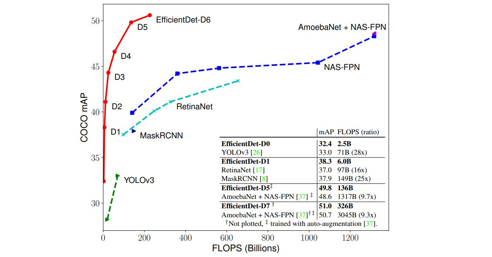

Quoc Le on Twitter: "EfficientDet: a new family of efficient object detectors. It is based on EfficientNet, and many times more efficient than state of art models. Link: https://t.co/9pnZECs6In Code: coming soon… https://t.co/RgwslgqHBA"

 [    **Quoc Le**‏ @**quocleix**](https://twitter.com/quocleix)

EfficientDet: a new family of efficient object detectors. It is based on EfficientNet, and many times more efficient than state of art models.

Link: [https://arxiv.org/abs/1911.09070 ](https://t.co/9pnZECs6In)Code: coming soon

 

   5:07 PM - 21 Nov 2019

- [**227** Retweets]()

- [**811** Likes]()

-                 

   [Mingxing Tan](https://twitter.com/tanmingxing) and [Ruoming Pang](https://twitter.com/ruomingpang)

     9 replies          227 retweets          811 likes