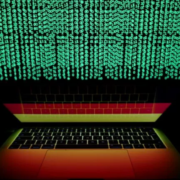

R and Python are joining forces, in the most ambitious crossover event of the year—for programmers – Quartz

R and Python are joining forces, in the most ambitious crossover event of the year—for programmers – Quartz

https://qz.com/1270139/r-and-python-are-joining-forces-in-the-most-ambitious-crossover-event-of-the-year-for-programmers/amp/

URSA LABS R and Python are joining forces, in the most ambitious crossover event of the year—for programmers By Dan Kopf May 06, 2018 Codifying a solution. Hadley Wickham is the most important developer for the programming language R . Wes McKinney is among the most important developers for programming language Python . The two languages, which are free to use, are often seen as competitors in the world of data science. Wickham and McKinney don’t think the rivalry is necessary. In fact, they think that by working together, they can make each other’s languages more useful for their