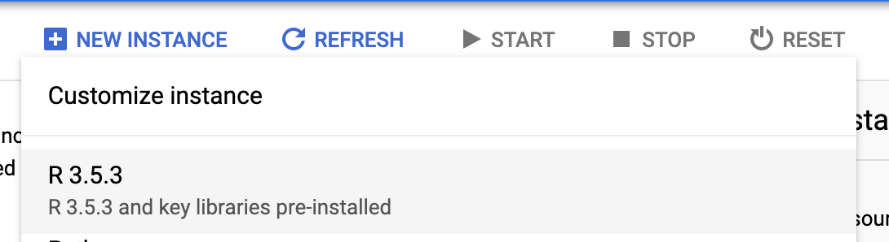

R lang + GCP = 💖 – Deep Learning as I See It

# R lang + GCP =

[Viacheslav Kovalevskyi](https://blog.kovalevskyi.com/@b0noi)
Jun 5·2 min read

Recently we have released a new revision of AI Platform Notebooks and Deep Learning VMs, M26. Many changes are part of the release, however the main one is [R](https://blog.kovalevskyi.com/r-lang-gcp-5f1b76e5c6afabout:invalid#zSoyz)! Yes, we do have the support of R language now, as a first-class citizen on the [Google Cloud AI Platform Notebooks](https://cloud.google.com/ai-platform-notebooks/) as well as it is now a flavor of Deep Learning VMs.

> BTW if you do not know what is Deep Learning VM, read > [> this](https://blog.kovalevskyi.com/deep-learning-images-for-google-cloud-engine-the-definitive-guide-bc74f5fb02bc)>  first

### What Is Under The Hood

New flavor effectively is the same familiar interface of the [Jupyter Lab](https://jupyterlab.readthedocs.io/en/stable/) with pre-configure [R-lang kernel](https://irkernel.github.io/) and tons of other additional things. Among extra things:

- •r-essentials
- •rpy2 (that allows you to use both Python and R in the same notebook!!!)
- •h2o
- •xgboost
- •Google Cloud clients, such as: cloudml; bigrquery; googleCloudStorageR; googleComputeEngineR; googleAuthR; googleAnalyticsR

BTW if you prefer more to pay tons of money for almost the same thing, you can look on the R-studio offering on the [Cloud Marketplace](https://console.cloud.google.com/marketplace/details/rstudio-launcher-public/rstudio-server-pro-for-gcp) (~2k$ per month!).

### How To Use It

#### Via AI Platform Notebooks

Using R with Notebook is a straightforward process, R is now an officially supported “flavor”, so just:

- •go to the console: https://console.cloud.google.com/mlengine/notebooks/instances
- •press “create instance” and
- •pick R:)

As you probably have spotted already, there is no GPU support for R just yet. One can attach GPU to it later on, but currently, such configuration is not supported just yet.

#### Via DLVMs

If you want to use R with DLVMs, it is straightforward you need to execute one command:

|     |     |
| --- | --- |
| 1   | export IMAGE_FAMILY="r-latest-cpu-experimental" |
| 2   | export ZONE="us-west1-b" |
| 3   | export INSTANCE_NAME="my-r-instance" |
| 4   | export INSTANCE_TYPE="n1-standard-8" |
| 5   | gcloud compute instances create "${INSTANCE_NAME}" \ |
| 6   | --zone="${ZONE}" \ |
| 7   | --image-family="${IMAGE_FAMILY}" \ |
| 8   | --image-project=deeplearning-platform-release \ |
| 9   | --machine-type="${INSTANCE_TYPE}" \ |
| 10  | --boot-disk-size=100GB |

 [view raw](https://gist.github.com/b0noI/1018282bbd0a48580c0f77ba2052a7af/raw/300a4bf3afa8568f917ccd8b9b8444b2cee5e5d7/create_r_dlvm.sh)  [create_r_dlvm.sh](https://gist.github.com/b0noI/1018282bbd0a48580c0f77ba2052a7af#file-create_r_dlvm-sh) hosted with ❤ by [GitHub](https://github.com/)

For the detail instructions on how to use DLVM after the creation please see [main article](https://blog.kovalevskyi.com/deep-learning-images-for-google-cloud-engine-the-definitive-guide-bc74f5fb02bc) about DLVMs.