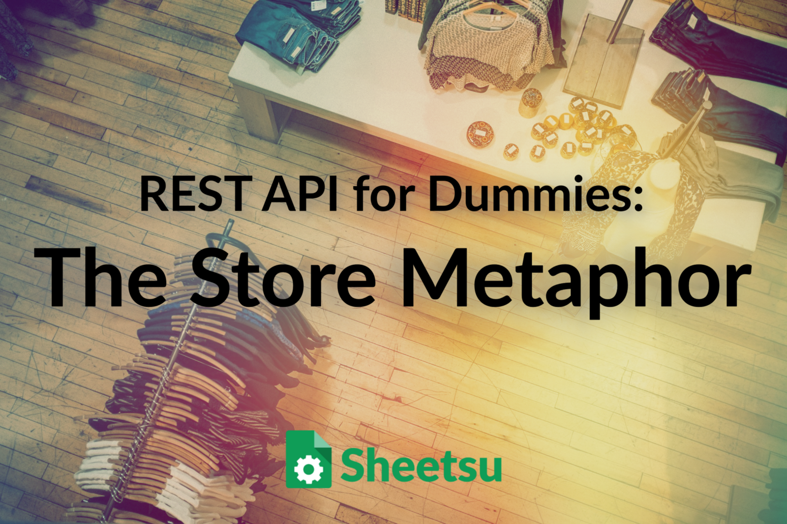
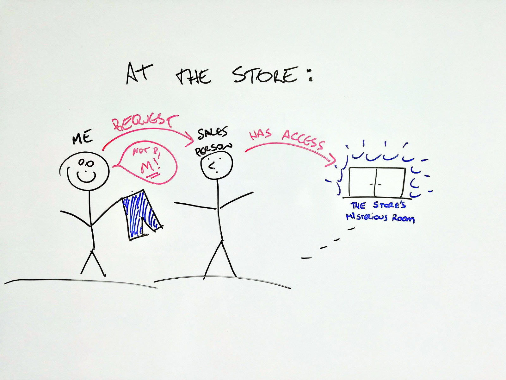
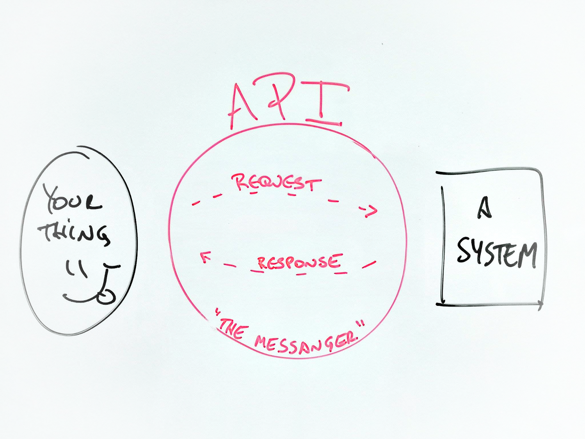
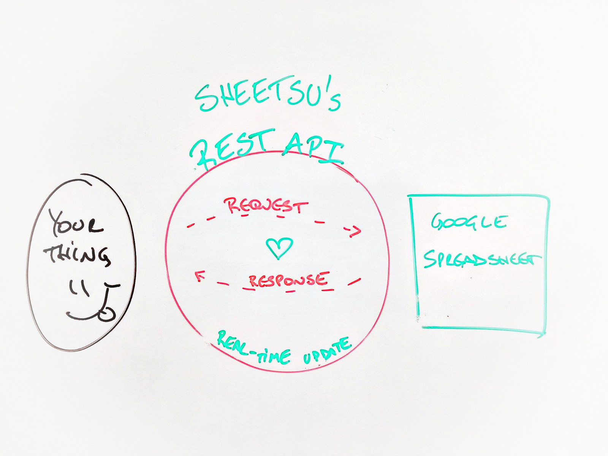

REST API for Dummies: The Store Metaphor – Sheetsu.com – Medium

# REST API for Dummies: The Store Metaphor

This is the ultimate REST API for Dummies. In order to be able to give you a REST API definition, let’s go shopping. I will use what I call **“The Store Metaphor”**. This way you will also be able to understand what the hell is [**Sheetsu**](http://sheetsu.com/) as well and how it can help developers out there to keep the quality in their beautiful code while coding less. This is not a REST API tutorial but **a simple explanation for people like me who is not a developer but for some crazy reason feels entitled to understanding this mystery**. If you code for a living and have always wanted to **share your passion with your mom/dad or your girlfriend/boyfriend** but was never able to explain it to her, to find the words and the examples they could relate to, this post may be the link. ;)

* * *

*...*
This post will cover:

- •**What is REST API?**
- •**REST API: The Store Metaphor**
- •**REST API & Google Spreadsheet**
- •**REST API & API: The Difference**

* * *

*...*

### What is REST API?

What the hell is a **REST API** or **Restful API**? If you are like me, you are thinking the same thing:

- •**I am not an albino living in a cave **(so, not a developer)
- •**I have no intention in start developing or coding**
- •**All I see below in this image are the cute colors **(green matches red, who knew?):

Cute colors some people call code and make money out of it

To sum up, **I don’t have time to get into details to create a solution, I just want a solution that is ready for me** **— that’s it!**

* * *

*...*

But I still consider myself pretty smart and I want to understand at least the basics, right? So first, I go ask the **developers** I work with @ **Sheetsu** about the meaning of a **REST API**:

> “ *> C’mon Nani, it’s so obvious. It’s a programming architectural implementation intended to increase the efficiency of communication in computing systems by making that data available on-demand by sharing references instead of the complete copy of the data itself.*>  ”

Was that even English?

* * *

*...*

So then I tried to get more info with specific communities, like the awesome guys at [**Hacker News**](https://news.ycombinator.com/) and [**Quora**](https://www.quora.com/) but I still was not getting it. So I try to shake it off and go to **uncle Google**, looking for an answer a normal human being can understand. Google tells me:

**> “REST**>  stands for **> RE**> presentational**>  S**> tate**>  T**> ransfer”

**> “API**>  means **> A**> pplication **> P**> rogramming**>  I**> nterface”

That moment you have no idea what is happening to your life

Well, I did learn something from it all… that maybe I am not as smart as I thought.

But I will not give up!! **Steve Jobs fought cancer for years, my poor mother survived 80’s fashion and Britney Spears still has a career after a shaved head**, so anything is possible in this world, right?

* * *

*...*

Let’s say you go to your favorite store to **buy a new pair of jeans**.

You look around and find **exactly what you were looking for! But in the wrong size**: It’s small while you need medium. But, unless you are a shop lifter, **you do not have access to that mysterious room in the back of the store** that holds all items they sell, at all sizes and colors.

To get access to this wonderland, you need to **make a request** to the **sales person** so you **receive back** exactly what you need: those pair of jeans you loved, but the right size for you.

You need to **make a request** to the **sales person** that has access to that **mysterious room in the back of the store**

Since the** sales person has this special access**, he goes inside, gets exactly what you need, **comes back and delivers what you requested**.

Yes! It’s done!

* * *

*...*

### So let’s Review

In this metaphor, **the sales person is the messenger,** right? It took a request you made, used the access he had in order to give you what you wanted or at least worked to give you the answer to your question.

**> Now get ready for this: the sales person is the API!!**
Whaaat? Yes!

**An API is the messenger that takes a request, tells a system what you want to do and then returns the response back to you!**

It looks something like this:

An API is the **messenger** that takes a **request**, tells a **system** what you want to do and then **returns the response back**

… Did I just blow your mind? Let’s get a big deeper than…

* * *

*...*

### REST API & Google Spreadsheet

This is simply [**the best real-time update**](http://sheetsu.com/) you can imagine! **Let me explain by going back to the metaphor**: let’s say I gained a few pounds.

**I tried the pants, size medium, but they didn’t fit**. This is our worst nightmare, right? Not only I will have to stop eating chocolate for a while but worst: I will have to find the sales person again!

* * *

*...*

You guys know what I am talking about. Every single time you look for that freakin’ sales person, they are nowhere to be found! **It’s like they disappeared into a dark whole!** Then, we always have to stop pause our plans to start a saga to find someone that can help.

* * *

*...*

**At this stage you just want to get the right pants size, pay and leave the store to move on with your life and not waste any more time!**

Oh… it would be amazing if we could just** type what we needed and the pants you were holding in your hands would magically become your size!**

> Now let me blow your mind again: **> THAT IS WHAT SHEETSU DOES!!**

mind = blown

### [Sheetsu](http://sheetsu.com/): How does it work?

[**Sheetsu**](http://sheetsu.com/)** allows you to create a REST API from a Google Spreadsheet. **Let’s say it in a different way:**  **Sheetsu turns your Google Spreadsheet into a REST API. Ok, let’s try one more time: **Sheetsu connects whatever data you need to a simple Google Spreadsheet** in a few steps:

1 . Open a Google Spreadsheet and copy the link
2 . Paste it into [**Sheetsu**](http://sheetsu.com/)
3 . Get your REST API link!

#### Let me give you an example:

If you use this [**Sheetsu**](http://sheetsu.com/) REST API link to build a website, every time you **change something in your spreadsheet, it will automatically change the content on your website too, in real-time**! We have “caching” which is a fancy way of saying we will make sure it will all happen fast ;)

It looks a bit like this:

[**Sheetsu**](http://sheetsu.com/) turns your **Google Spreadsheet** into a **REST API**

* * *

*...*

### REST API & API: The Difference

Well, to be fair to you, I explained what is an **API.** So if you ever asks a developer to show you an API or a REST API, that’s all you will see: **links**. **REST** is the way you organize these links.

* * *

*...*

In case you want to find out more about it, I will write a post so you can understand how developers process the same information I gave you on this post. But be careful not to send too many requests because **once you get into a black whole**… You know what they say…

**You may finally find that freaking sales person you were looking for**.

When the **sales guy** shows up last minute for the commission

Well, I hope I was able to truly help you! In case you want to [**try Sheetsu now, it’s FREE**](http://sheetsu.com/) and you can signup using your Google account. If you still have questions, please send me an e-mail to [nani@sheetsu.com](https://medium.com/@sheetsu.com/rest-api-for-dummies-the-store-metaphor-c9e531bcd425mailto:nani@sheetsu.com) and I will do an awesome research and write about it ;)

* * *

*...*
For this and more, follow the Sheetsu team!

- •[Twitter](http://twitter.com/sheetsuhq)
- •[Facebook](https://www.facebook.com/sheetsuhq/)
- •[YouTube](https://www.youtube.com/channel/UCqOyvAZkiE91ACLxRp2FxsA)
- •[Official Website](https://www.sheetsu.com/)

* * *

*...*
See you next time!

