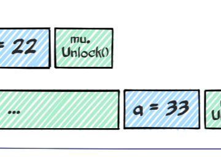

Race-free doesn’t mean deterministic – Val Deleplace – Medium

Race-free doesn’t mean deterministic – Val Deleplace – Medium

https://medium.com/@val_deleplace/race-free-doesnt-mean-deterministic-d27d051f68f

In this article about the Go race detector, I emphasize that violating the Memory model with unprotected concurrent accesses is a serious…