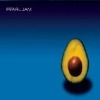

Radio Paradise - eclectic commercial free Internet radio

[Listener Supported](https://www.radioparadise.com/rp2s-content.php?name=Support)

[(L)](http://www.radioparadise.com/#)

  [(L)](http://www.radioparadise.com/rp2-content.php?name=Members&file=register_psd)

|     |     |     |
| --- | --- | --- |
|     | [Travis — Eyes Wide Open](http://www.radioparadise.com/rp2-content.php?name=Music&file=songinfo&song_id=40196) [Led Zeppelin — Nobody's Fault But Mine](http://www.radioparadise.com/rp2-content.php?name=Music&file=songinfo&song_id=20534) [Snow Patrol — Run](http://www.radioparadise.com/rp2-content.php?name=Music&file=songinfo&song_id=36041) [**Pearl Jam — Inside Job**](http://www.radioparadise.com/rp2-content.php?name=Music&file=songinfo&song_id=38737) |  |

|     |
| --- |
| [ [Beta Website/Player](https://beta.radioparadise.com/) ]   [ [Slideshow Player](#) ]   [ [Audio Player](#) ] [ [Log In](http://www.radioparadise.com/rp2-content.php?name=Members&file=login&query_n=HomeZZfile=index) ]      [ [Register](http://www.radioparadise.com/rp2-content.php?name=Members&file=register) ]   [ [refresh this window](#) ] |

|     |
| --- |
| - [Home](http://www.radioparadise.com/rp2-content.php) - [Listen/Apps](http://www.radioparadise.com/rp2-content.php?name=Listen) - [Playlist](http://www.radioparadise.com/rp2-content.php?name=Playlist) - [Music & Artists](http://www.radioparadise.com/rp2-content.php?name=Music) - [Community](http://www.radioparadise.com/rp2-content.php?name=Forum) - [Support RP](https://www.radioparadise.com/rp2s-content.php?name=Support&file=support) - [Help & Info](http://www.radioparadise.com/rp2-content.php?name=Help) - [Shirts & Stuff](http://www.cafepress.com/radioparadise) |

|     |     |
| --- | --- |
| Welcome! If you're new to Radio Paradise, welcome! We're very glad you found us. RP is a blend of many styles and genres of music, carefully selected and mixed by two real human beings. You'll hear modern and classic rock, world music, electronica, even a bit of classical and jazz. What you won't hear are random computer-generated playlists or mind-numbing commercials. Our specialty is taking a diverse assortment of songs and making them flow together in a way that makes sense harmonically, rhythmically, and lyrically — an art that, to us, is the very essence of radio. We hope that you'll enjoy RP so much that you'll want to [**become a supporter**](https://www.radioparadise.com/rp2s-content.php?name=Support) and to share us with your friends, your family, your co-workers, your neighbors... you get the idea. ;~) Your grateful hosts, [**Bill & Rebecca Goldsmith**](http://www.radioparadise.com/?name=About) RP Shirts & Stuff  Our online emporium features many styles of shirts, hoodies, cups, hats, buttons, stickers and all sorts of other goodies — all carefully branded to help you show of your excellent taste in radio stations. Each purchase also sends a little trickle of money our way. [Clicky clicky right here to check it all out](https://www.cafepress.com/radioparadise) Amazon links RP is not endorsed in any way by amazon.com, but we do earn a small commission through their affiliate program on sales made through our links to various worldwide Amazon locations. These links appear on all [song info pages](http://www.radioparadise.com/?name=Music&file=songinfo&song_id=now). Anything you buy during a shopping session that starts with one of our links gets credited to our account, including products that you find via a search on Amazon. Friends & Family: - [NutritionFacts.org](http://nutritionfacts.org/) — No-nonsense [nutrition research](http://nutritionfacts.org/) from Dr. Michael Greger - [Straight Up Food](http://www.straightupfood.com/blog) — Fabulous [vegan recipes](http://www.straightupfood.com/blog) from Kathy Fisher - Interested in healthy eating? [Watch Forks Over Knives](http://www.forksoverknives.com/) (now would be good) - [Eat Unprocessed](http://www.eatunprocessed.com/) with Chef AJ - More great [plant-based recipes](http://www.healthygirlskitchen.com/) from [Healthy Girl's Kitchen](http://www.healthygirlskitchen.com/) - [Happy Cow](http://www.happycow.net/) - our favorite [vegan restaurant guide](http://www.happycow.net/) - Food for the spirit: [Adyashanti](http://www.adyashanti.org/) - Cafe Coda — [restaurant in Chico, CA](https://www.facebook.com/cafecoda) - [Creative writing - Grass Valley](http://www.maximakahn.com/) from Maxima Kahn - [The Lakeside Resort](http://www.lakeside.bc.ca/) - in BC's sunny [Okanagan Valley](http://www.lakeside.bc.ca/) - [Barrel Oak Winery](http://www.barreloak.com/) - hand-crafted in Virginia | Important note for iPhone users After updating to iOS 11, you may have received an error message when trying to access the RP app on your iPhone. That means that you're using an old verion of our app that is no longer supported. Just go to the App Store and [download our current app](https://itunes.apple.com/us/app/radio-paradise-2.0/id517818306?mt=8&uo=4) (still free). That should solve the problem — and give you access to several nifty new features: the ability to skip songs, several PSD (Play Something Different) options, and the ability to cache blocks of RP programming on your phone for offline playback. We're very sorry for any confusion. Thanks for your Support! If you're already a regular RP supporter, thank you very much. A special thanks to those of you who've become first-time supporters in response to our recent support requests. If not, this would be a [great time to start](https://www.radioparadise.com/support). A 2016 royalty board ruling increased the fees that we pay for the use of music by over 300%. This has been quite a challenge for us. We're happy to provide RP free of charge to everyone, including those of you who aren't able to send support. However, if you can afford to [become a supporter](https://www.radioparadise.com/support) — either on a one-time or an ongoing basis — we would appreciate it now more than ever. The artists we play will benefit from your support as well, as at least 50% of the royalties we pay go directly to them rather than to their record labels. You can [read more about the royalty issue here](https://www.radioparadise.com/rp2s-content.php?name=Support&file=crb). We've also been investing in some very interesting upgrades to the RP listening experience. Some of those are available now, and more are on their way soon. See below for more about that. "Alexa, play Radio Paradise" If you have an Amazon Echo or other Alexa-enabled device, just say "Alexa, enable Radio Paradise" to start using our Alexa skill. Once it's enabled, tell her "Alexa, play Radio Paradise" to start listening, then "Alexa, skip" if you don't care for what's playing — or "Alexa, ask Radio Paradise what's playing". When you enable the skill, check the Alexa app to link your RP account & see a list of all of the available commands. New improved web player & site design on the way We've been hard at work on a web player that allows you to skip songs — like you can with our apps — rather than use the current "PSD" (Play Something Different) function. If all goes well, that will be available sometime later this month — along with some very nice enhancements and updates to our website design. Some of the new features are available on our [beta website](https://beta.radioparadise.com/), along with some more information about the coming changes. Check it out! RP Slideshow Player, Apps, etc. [Click here](#) to enjoy this beautiful visual accompaniment to RP's music, or — if you're a photographer — [click here to submit your photos](http://www.radioparadise.com/image_upload.php) to Mike, our photo editor. You can also enjoy the slideshow in our [iPhone/iPad](http://www.radioparadise.com/?name=Listen&file=ios) and [Android](http://www.radioparadise.com/?name=Listen&file=android) apps (just rotate your screen to the horizontal position), via our free Roku channel, and our new AppleTV app. If you need more info on our apps or on how to listen to RP via Sonos systems, WiFi radios, iTunes, or anything else, just click the [Listen/Apps](http://www.radioparadise.com/?name=Listen&file=index) tab above. You'll also find a complete list of [stream URLs](http://www.radioparadise.com/?name=Listen&file=links) at bitrates from 32k to 320k, in a variety of stream formats — including audiophile-class high-fidelity streams. [Who's Listening Where?](#) |

|     |     |
| --- | --- |
|  | ©1999-2017 Radio Paradise Inc.   —  Photo of Bill & Rebecca ©2008 [Brad Trent](http://www.bradtrent.com/) |

Problems? Questions?

Hopefully we have solutions and answers — and we'll always be happy to answer any additional questions via email.

[< 1 min to Spreed]()