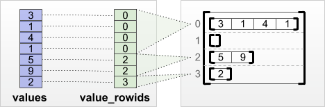
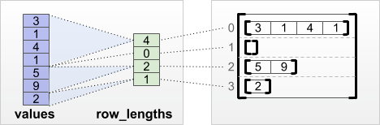
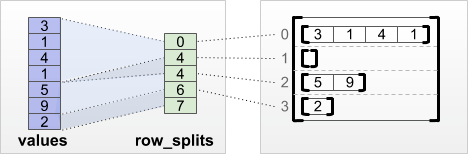
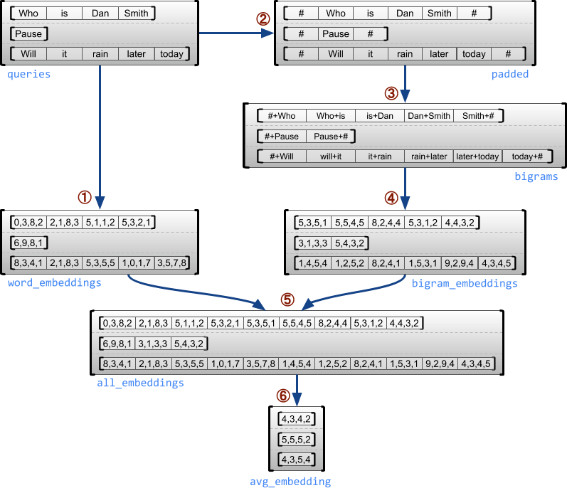
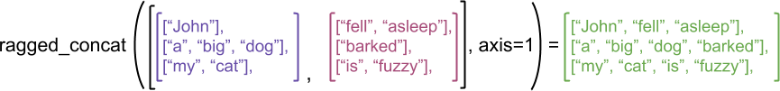
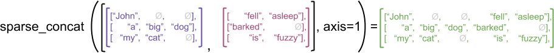
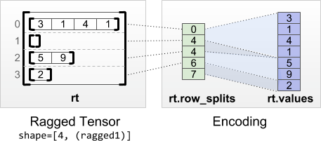
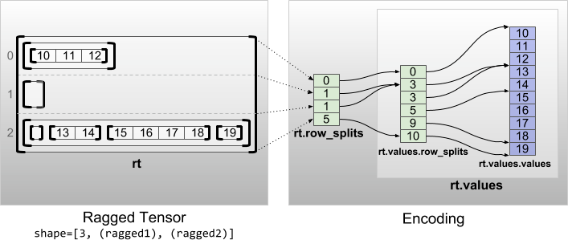
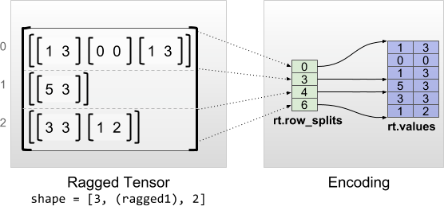

Ragged Tensors  |  TensorFlow Core  |  TensorFlow

- [TensorFlow](https://www.tensorflow.org/)

- chevron_right

 [Learn](https://www.tensorflow.org/learn)

- chevron_right

 [TensorFlow Core](https://www.tensorflow.org/overview)

- chevron_right

 [Guide](https://www.tensorflow.org/guide)

star_border
star_border
star_border
star_border
star_border

# Ragged Tensors

- [Contents](https://www.tensorflow.org/guide/ragged_tensors#top_of_page)
- [Setup](https://www.tensorflow.org/guide/ragged_tensors#setup)
- [Overview](https://www.tensorflow.org/guide/ragged_tensors#overview)
    - [What you can do with a ragged tensor](https://www.tensorflow.org/guide/ragged_tensors#what_you_can_do_with_a_ragged_tensor)
    - [Constructing a ragged tensor](https://www.tensorflow.org/guide/ragged_tensors#constructing_a_ragged_tensor)

-

|     |     |
| --- | --- |
|  [Run in Google Colab](https://colab.research.google.com/github/tensorflow/docs/blob/master/site/en/guide/ragged_tensors.ipynb) |  [View source on GitHub](https://github.com/tensorflow/docs/blob/master/site/en/guide/ragged_tensors.ipynb) |

## Setup[arrow_upward](https://www.tensorflow.org/guide/ragged_tensors#top_of_page)

`from __future__ import absolute_import, division, print_function, unicode_literals[[NEWLINE]][[NEWLINE]]import math[[NEWLINE]]import tensorflow as tf[[NEWLINE]]tf.enable_eager_execution()[[NEWLINE]]`

## Overview[arrow_upward](https://www.tensorflow.org/guide/ragged_tensors#top_of_page)

Your data comes in many shapes; your tensors should too.*Ragged tensors* are the TensorFlow equivalent of nested variable-length lists. They make it easy to store and process data with non-uniform shapes, including:

- Variable-length features, such as the set of actors in a movie.
- Batches of variable-length sequential inputs, such as sentences or video clips.
- Hierarchical inputs, such as text documents that are subdivided into sections, paragraphs, sentences, and words.
- Individual fields in structured inputs, such as protocol buffers.

### What you can do with a ragged tensor

Ragged tensors are supported by more than a hundred TensorFlow operations, including math operations (such as [`tf.add`](https://www.tensorflow.org/api_docs/python/tf/math/add) and [`tf.reduce_mean`](https://www.tensorflow.org/api_docs/python/tf/math/reduce_mean)), array operations (such as [`tf.concat`](https://www.tensorflow.org/api_docs/python/tf/concat) and [`tf.tile`](https://www.tensorflow.org/api_docs/python/tf/tile)), string manipulation ops (such as[`tf.substr`](https://www.tensorflow.org/api_docs/python/tf/substr)), and many others:

`digits = tf.ragged.constant([[3, 1, 4, 1], [], [5, 9, 2], [6], []])[[NEWLINE]]words = tf.ragged.constant([["So", "long"], ["thanks", "for", "all", "the", "fish"]])[[NEWLINE]]print(tf.add(digits, 3))[[NEWLINE]]print(tf.reduce_mean(digits, axis=1))[[NEWLINE]]print(tf.concat([digits, [[5, 3]]], axis=0))[[NEWLINE]]print(tf.tile(digits, [1, 2]))[[NEWLINE]]print(tf.strings.substr(words, 0, 2))[[NEWLINE]]`

WARNING: Logging before flag parsing goes to stderr.

W0603 18:08:54.291949 140335682398016 deprecation.py:323] From /usr/local/lib/python3.6/dist-packages/tensorflow/python/ops/array_ops.py:1340: add_dispatch_support.<locals>.wrapper (from tensorflow.python.ops.array_ops) is deprecated and will be removed in a future version.

Instructions for updating:
Use tf.where in 2.0, which has the same broadcast rule as np.where
<tf.RaggedTensor [[6, 4, 7, 4], [], [8, 12, 5], [9], []]>
tf.Tensor([2.25 nan 5.33333333 6. nan], shape=(5,), dtype=float64)
<tf.RaggedTensor [[3, 1, 4, 1], [], [5, 9, 2], [6], [], [5, 3]]>

<tf.RaggedTensor [[3, 1, 4, 1, 3, 1, 4, 1], [], [5, 9, 2, 5, 9, 2], [6, 6], []]>

<tf.RaggedTensor [[b'So', b'lo'], [b'th', b'fo', b'al', b'th', b'fi']]>

There are also a number of methods and operations that are specific to ragged tensors, including factory methods, conversion methods, and value-mapping operations. For a list of supported ops, see the [`tf.ragged`](https://www.tensorflow.org/api_docs/python/tf/ragged) package documentation.

As with normal tensors, you can use Python-style indexing to access specific slices of a ragged tensor. For more information, see the section on**Indexing** below.

`print(digits[0])       # First row[[NEWLINE]]`

tf.Tensor([3 1 4 1], shape=(4,), dtype=int32)

`print(digits[:, :2])   # First two values in each row.[[NEWLINE]]`

<tf.RaggedTensor [[3, 1], [], [5, 9], [6], []]>

`print(digits[:, -2:])  # Last two values in each row.[[NEWLINE]]`

<tf.RaggedTensor [[4, 1], [], [9, 2], [6], []]>

And just like normal tensors, you can use Python arithmetic and comparison operators to perform elementwise operations. For more information, see the section on**Overloaded Operators** below.

`print(digits + 3)[[NEWLINE]]`

<tf.RaggedTensor [[6, 4, 7, 4], [], [8, 12, 5], [9], []]>

`print(digits + tf.ragged.constant([[1, 2, 3, 4], [], [5, 6, 7], [8], []]))[[NEWLINE]]`

<tf.RaggedTensor [[4, 3, 7, 5], [], [10, 15, 9], [14], []]>

If you need to perform an elementwise transformation to the values of a `RaggedTensor`, you can use [`tf.ragged.map_flat_values`](https://www.tensorflow.org/api_docs/python/tf/ragged/map_flat_values), which takes a function plus one or more arguments, and applies the function to transform the `RaggedTensor`'s values.

`times_two_plus_one = lambda x: x * 2 + 1[[NEWLINE]]print(tf.ragged.map_flat_values(times_two_plus_one, digits))[[NEWLINE]]`

<tf.RaggedTensor [[7, 3, 9, 3], [], [11, 19, 5], [13], []]>

### Constructing a ragged tensor

The simplest way to construct a ragged tensor is using[`tf.ragged.constant`](https://www.tensorflow.org/api_docs/python/tf/ragged/constant), which builds the`RaggedTensor` corresponding to a given nested Python `list`:

`sentences = tf.ragged.constant([[[NEWLINE]]    ["Let's", "build", "some", "ragged", "tensors", "!"],[[NEWLINE]]    ["We", "can", "use", "tf.ragged.constant", "."]])[[NEWLINE]]print(sentences)[[NEWLINE]]`

<tf.RaggedTensor [[b"Let's", b'build', b'some', b'ragged', b'tensors', b'!'], [b'We', b'can', b'use', b'tf.ragged.constant', b'.']]>

`paragraphs = tf.ragged.constant([[[NEWLINE]]    [['I', 'have', 'a', 'cat'], ['His', 'name', 'is', 'Mat']],[[NEWLINE]]    [['Do', 'you', 'want', 'to', 'come', 'visit'], ["I'm", 'free', 'tomorrow']],[[NEWLINE]]])[[NEWLINE]]print(paragraphs)[[NEWLINE]]`

<tf.RaggedTensor [[[b'I', b'have', b'a', b'cat'], [b'His', b'name', b'is', b'Mat']], [[b'Do', b'you', b'want', b'to', b'come', b'visit'], [b"I'm", b'free', b'tomorrow']]]>

Ragged tensors can also be constructed by pairing flat *values* tensors with*row-partitioning* tensors indicating how those values should be divided into rows, using factory classmethods such as [`tf.RaggedTensor.from_value_rowids`](https://www.tensorflow.org/api_docs/python/tf/RaggedTensor#from_value_rowids),[`tf.RaggedTensor.from_row_lengths`](https://www.tensorflow.org/api_docs/python/tf/RaggedTensor#from_row_lengths), and[`tf.RaggedTensor.from_row_splits`](https://www.tensorflow.org/api_docs/python/tf/RaggedTensor#from_row_splits).

#### [`tf.RaggedTensor.from_value_rowids`](https://www.tensorflow.org/api_docs/python/tf/RaggedTensor#from_value_rowids)

If you know which row each value belongs in, then you can build a `RaggedTensor` using a `value_rowids` row-partitioning tensor:

`print(tf.RaggedTensor.from_value_rowids([[NEWLINE]]    values=[3, 1, 4, 1, 5, 9, 2, 6],[[NEWLINE]]    value_rowids=[0, 0, 0, 0, 2, 2, 2, 3]))[[NEWLINE]]`

<tf.RaggedTensor [[3, 1, 4, 1], [], [5, 9, 2], [6]]>

#### [`tf.RaggedTensor.from_row_lengths`](https://www.tensorflow.org/api_docs/python/tf/RaggedTensor#from_row_lengths)

If you know how long each row is, then you can use a `row_lengths` row-partitioning tensor:

`print(tf.RaggedTensor.from_row_lengths([[NEWLINE]]    values=[3, 1, 4, 1, 5, 9, 2, 6],[[NEWLINE]]    row_lengths=[4, 0, 3, 1]))[[NEWLINE]]`

<tf.RaggedTensor [[3, 1, 4, 1], [], [5, 9, 2], [6]]>

#### [`tf.RaggedTensor.from_row_splits`](https://www.tensorflow.org/api_docs/python/tf/RaggedTensor#from_row_splits)

If you know the index where each row starts and ends, then you can use a `row_splits` row-partitioning tensor:

`print(tf.RaggedTensor.from_row_splits([[NEWLINE]]    values=[3, 1, 4, 1, 5, 9, 2, 6],[[NEWLINE]]    row_splits=[0, 4, 4, 7, 8]))[[NEWLINE]]`

<tf.RaggedTensor [[3, 1, 4, 1], [], [5, 9, 2], [6]]>

See the [`tf.RaggedTensor`](https://www.tensorflow.org/api_docs/python/tf/RaggedTensor) class documentation for a full list of factory methods.

### What you can store in a ragged tensor

As with normal `Tensor`s, the values in a `RaggedTensor` must all have the same type; and the values must all be at the same nesting depth (the *rank* of the tensor):

`print(tf.ragged.constant([["Hi"], ["How", "are", "you"]]))  # ok: type=string, rank=2[[NEWLINE]]`

<tf.RaggedTensor [[b'Hi'], [b'How', b'are', b'you']]>

`print(tf.ragged.constant([[[1, 2], [3]], [[4, 5]]]))        # ok: type=int32, rank=3[[NEWLINE]]`

<tf.RaggedTensor [[[1, 2], [3]], [[4, 5]]]>

`try:[[NEWLINE]]  tf.ragged.constant([["one", "two"], [3, 4]])              # bad: multiple types[[NEWLINE]]except ValueError as exception:[[NEWLINE]]  print(exception)[[NEWLINE]]`

Can't convert Python sequence with mixed types to Tensor.

`try:[[NEWLINE]]  tf.ragged.constant(["A", ["B", "C"]])                     # bad: multiple nesting depths[[NEWLINE]]except ValueError as exception:[[NEWLINE]]  print(exception)[[NEWLINE]]`

all scalar values must have the same nesting depth

### Example use case

The following example demonstrates how `RaggedTensor`s can be used to construct and combine unigram and bigram embeddings for a batch of variable-length queries, using special markers for the beginning and end of each sentence. For more details on the ops used in this example, see the [`tf.ragged`](https://www.tensorflow.org/api_docs/python/tf/ragged) package documentation.

`queries = tf.ragged.constant([['Who', 'is', 'Dan', 'Smith'],[[NEWLINE]]                              ['Pause'],[[NEWLINE]]                              ['Will', 'it', 'rain', 'later', 'today']])[[NEWLINE]][[NEWLINE]]# Create an embedding table.[[NEWLINE]]num_buckets = 1024[[NEWLINE]]embedding_size = 4[[NEWLINE]]embedding_table = tf.Variable([[NEWLINE]]    tf.truncated_normal([num_buckets, embedding_size],[[NEWLINE]]                       stddev=1.0 / math.sqrt(embedding_size)))[[NEWLINE]][[NEWLINE]]# Look up the embedding for each word.[[NEWLINE]]word_buckets = tf.strings.to_hash_bucket_fast(queries, num_buckets)[[NEWLINE]]word_embeddings = tf.ragged.map_flat_values([[NEWLINE]]    tf.nn.embedding_lookup, embedding_table, word_buckets)                  # ①[[NEWLINE]][[NEWLINE]]# Add markers to the beginning and end of each sentence.[[NEWLINE]]marker = tf.fill([queries.nrows(), 1], '#')[[NEWLINE]]padded = tf.concat([marker, queries, marker], axis=1)                       # ②[[NEWLINE]][[NEWLINE]]# Build word bigrams & look up embeddings.[[NEWLINE]]bigrams = tf.string_join([padded[:, :-1], padded[:, 1:]], separator='+')    # ③[[NEWLINE]][[NEWLINE]]bigram_buckets = tf.strings.to_hash_bucket_fast(bigrams, num_buckets)[[NEWLINE]]bigram_embeddings = tf.ragged.map_flat_values([[NEWLINE]]    tf.nn.embedding_lookup, embedding_table, bigram_buckets)                # ④[[NEWLINE]][[NEWLINE]]# Find the average embedding for each sentence[[NEWLINE]]all_embeddings = tf.concat([word_embeddings, bigram_embeddings], axis=1)    # ⑤[[NEWLINE]]avg_embedding = tf.reduce_mean(all_embeddings, axis=1)                      # ⑥[[NEWLINE]]print(avg_embedding)[[NEWLINE]]`

tf.Tensor(
[[ 0.20697758 -0.07755419 0.24734344 0.25163525]
[ 0.01676146 0.42883357 -0.21086366 -0.12161228]
[ 0.20740245 -0.16167732 0.06997513 0.09948716]], shape=(3, 4), dtype=float32)

## Ragged tensors: definitions[arrow_upward](https://www.tensorflow.org/guide/ragged_tensors#top_of_page)

### Ragged and uniform dimensions

A *ragged tensor* is a tensor with one or more *ragged dimensions*, which are dimensions whose slices may have different lengths. For example, the inner (column) dimension of `rt=[[3, 1, 4, 1], [], [5, 9, 2], [6], []]` is ragged, since the column slices (`rt[0, :]`, ..., `rt[4, :]`) have different lengths. Dimensions whose slices all have the same length are called *uniform dimensions*.

The outermost dimension of a ragged tensor is always uniform, since it consists of a single slice (and so there is no possibility for differing slice lengths). In addition to the uniform outermost dimension, ragged tensors may also have uniform inner dimensions. For example, we might store the word embeddings for each word in a batch of sentences using a ragged tensor with shape`[num_sentences, (num_words), embedding_size]`, where the parentheses around`(num_words)` indicate that the dimension is ragged.

Ragged tensors may have multiple ragged dimensions. For example, we could store a batch of structured text documents using a tensor with shape `[num_documents, (num_paragraphs), (num_sentences), (num_words)]` (where again parentheses are used to indicate ragged dimensions).

#### Ragged tensor shape restrictions

The shape of a ragged tensor is currently restricted to have the following form:

- A single uniform dimension
- Followed by one or more ragged dimensions
- Followed by zero or more uniform dimensions.

star**Note:** These restrictions are a consequence of the current implementation, and we may relax them in the future.

### Rank and ragged rank

The total number of dimensions in a ragged tensor is called its ***rank***, and the number of ragged dimensions in a ragged tensor is called its ***ragged rank***. In graph execution mode (i.e., non-eager mode), a tensor's ragged rank is fixed at creation time: it can't depend on runtime values, and can't vary dynamically for different session runs. A ***potentially ragged tensor*** is a value that might be either a [`tf.Tensor`](https://www.tensorflow.org/api_docs/python/tf/Tensor) or a [`tf.RaggedTensor`](https://www.tensorflow.org/api_docs/python/tf/RaggedTensor). The ragged rank of a [`tf.Tensor`](https://www.tensorflow.org/api_docs/python/tf/Tensor) is defined to be zero.

### RaggedTensor shapes

When describing the shape of a RaggedTensor, ragged dimensions are indicated by enclosing them in parentheses. For example, as we saw above, the shape of a 3-D RaggedTensor that stores word embeddings for each word in a batch of sentences can be written as `[num_sentences, (num_words), embedding_size]`. The `RaggedTensor.shape` attribute returns a [`tf.TensorShape`](https://www.tensorflow.org/api_docs/python/tf/TensorShape) for a ragged tensor, where ragged dimensions have size `None`:

`tf.ragged.constant([["Hi"], ["How", "are", "you"]]).shape[[NEWLINE]]`

TensorShape([Dimension(2), Dimension(None)])

The method [`tf.RaggedTensor.bounding_shape`](https://www.tensorflow.org/api_docs/python/tf/RaggedTensor#bounding_shape) can be used to find a tight bounding shape for a given `RaggedTensor`:

`print(tf.ragged.constant([["Hi"], ["How", "are", "you"]]).bounding_shape())[[NEWLINE]]`

tf.Tensor([2 3], shape=(2,), dtype=int64)

## Ragged vs sparse tensors[arrow_upward](https://www.tensorflow.org/guide/ragged_tensors#top_of_page)

A ragged tensor should *not* be thought of as a type of sparse tensor, but rather as a dense tensor with an irregular shape.

As an illustrative example, consider how array operations such as `concat`,`stack`, and `tile` are defined for ragged vs. sparse tensors. Concatenating ragged tensors joins each row to form a single row with the combined length:

`ragged_x = tf.ragged.constant([["John"], ["a", "big", "dog"], ["my", "cat"]])[[NEWLINE]]ragged_y = tf.ragged.constant([["fell", "asleep"], ["barked"], ["is", "fuzzy"]])[[NEWLINE]]print(tf.concat([ragged_x, ragged_y], axis=1))[[NEWLINE]]`

<tf.RaggedTensor [[b'John', b'fell', b'asleep'], [b'a', b'big', b'dog', b'barked'], [b'my', b'cat', b'is', b'fuzzy']]>

But concatenating sparse tensors is equivalent to concatenating the corresponding dense tensors, as illustrated by the following example (where Ø indicates missing values):

`sparse_x = ragged_x.to_sparse()[[NEWLINE]]sparse_y = ragged_y.to_sparse()[[NEWLINE]]sparse_result = tf.sparse.concat(sp_inputs=[sparse_x, sparse_y], axis=1)[[NEWLINE]]print(tf.sparse.to_dense(sparse_result, ''))[[NEWLINE]]`

tf.Tensor(
[[b'John' b'' b'' b'fell' b'asleep']
[b'a' b'big' b'dog' b'barked' b'']
[b'my' b'cat' b'' b'is' b'fuzzy']], shape=(3, 5), dtype=string)

For another example of why this distinction is important, consider the definition of “the mean value of each row” for an op such as [`tf.reduce_mean`](https://www.tensorflow.org/api_docs/python/tf/math/reduce_mean). For a ragged tensor, the mean value for a row is the sum of the row’s values divided by the row’s width. But for a sparse tensor, the mean value for a row is the sum of the row’s values divided by the sparse tensor’s overall width (which is greater than or equal to the width of the longest row).

## Overloaded operators[arrow_upward](https://www.tensorflow.org/guide/ragged_tensors#top_of_page)

The `RaggedTensor` class overloads the standard Python arithmetic and comparison operators, making it easy to perform basic elementwise math:

`x = tf.ragged.constant([[1, 2], [3], [4, 5, 6]])[[NEWLINE]]y = tf.ragged.constant([[1, 1], [2], [3, 3, 3]])[[NEWLINE]]print(x + y)[[NEWLINE]]`

<tf.RaggedTensor [[2, 3], [5], [7, 8, 9]]>

Since the overloaded operators perform elementwise computations, the inputs to all binary operations must have the same shape, or be broadcastable to the same shape. In the simplest broadcasting case, a single scalar is combined elementwise with each value in a ragged tensor:

`x = tf.ragged.constant([[1, 2], [3], [4, 5, 6]])[[NEWLINE]]print(x + 3)[[NEWLINE]]`

<tf.RaggedTensor [[4, 5], [6], [7, 8, 9]]>

For a discussion of more advanced cases, see the section on**Broadcasting**.

Ragged tensors overload the same set of operators as normal `Tensor`s: the unary operators `-`, `~`, and `abs()`; and the binary operators `+`, `-`, `*`, `/`,`//`, `%`, `**`, `&`, `|`, `^`, `<`, `<=`, `>`, and `>=`. Note that, as with standard `Tensor`s, binary `==` is not overloaded; you can use`tf.equal()` to check elementwise equality.

## Indexing[arrow_upward](https://www.tensorflow.org/guide/ragged_tensors#top_of_page)

Ragged tensors support Python-style indexing, including multidimensional indexing and slicing. The following examples demonstrate ragged tensor indexing with a 2-D and a 3-D ragged tensor.

### Indexing a 2-D ragged tensor with 1 ragged dimension

`queries = tf.ragged.constant([[NEWLINE]]    [['Who', 'is', 'George', 'Washington'],[[NEWLINE]]     ['What', 'is', 'the', 'weather', 'tomorrow'],[[NEWLINE]]     ['Goodnight']])[[NEWLINE]]print(queries[1])[[NEWLINE]]`

tf.Tensor([b'What' b'is' b'the' b'weather' b'tomorrow'], shape=(5,), dtype=string)

`print(queries[1, 2])                # A single word[[NEWLINE]]`

tf.Tensor(b'the', shape=(), dtype=string)

`print(queries[1:])                  # Everything but the first row[[NEWLINE]]`

<tf.RaggedTensor [[b'What', b'is', b'the', b'weather', b'tomorrow'], [b'Goodnight']]>

`print(queries[:, :3])               # The first 3 words of each query[[NEWLINE]]`

<tf.RaggedTensor [[b'Who', b'is', b'George'], [b'What', b'is', b'the'], [b'Goodnight']]>

`print(queries[:, -2:])              # The last 2 words of each query[[NEWLINE]]`

<tf.RaggedTensor [[b'George', b'Washington'], [b'weather', b'tomorrow'], [b'Goodnight']]>

### Indexing a 3-D ragged tensor with 2 ragged dimensions

`rt = tf.ragged.constant([[[1, 2, 3], [4]],[[NEWLINE]]                         [[5], [], [6]],[[NEWLINE]]                         [[7]],[[NEWLINE]]                         [[8, 9], [10]]])[[NEWLINE]]`

`print(rt[1])                        # Second row (2-D RaggedTensor)[[NEWLINE]]`

<tf.RaggedTensor [[5], [], [6]]>

`print(rt[3, 0])                     # First element of fourth row (1-D Tensor)[[NEWLINE]]`

tf.Tensor([8 9], shape=(2,), dtype=int32)

`print(rt[:, 1:3])                   # Items 1-3 of each row (3-D RaggedTensor)[[NEWLINE]]`

<tf.RaggedTensor [[[4]], [[], [6]], [], [[10]]]>

`print(rt[:, -1:])                   # Last item of each row (3-D RaggedTensor)[[NEWLINE]]`

<tf.RaggedTensor [[[4]], [[6]], [[7]], [[10]]]>

`RaggedTensor`s supports multidimensional indexing and slicing, with one restriction: indexing into a ragged dimension is not allowed. This case is problematic because the indicated value may exist in some rows but not others. In such cases, it's not obvious whether we should (1) raise an `IndexError`; (2) use a default value; or (3) skip that value and return a tensor with fewer rows than we started with. Following the[guiding principles of Python](https://www.python.org/dev/peps/pep-0020/)("In the face of ambiguity, refuse the temptation to guess" ), we currently disallow this operation.

## Tensor Type Conversion[arrow_upward](https://www.tensorflow.org/guide/ragged_tensors#top_of_page)

The `RaggedTensor` class defines methods that can be used to convert between `RaggedTensor`s and [`tf.Tensor`](https://www.tensorflow.org/api_docs/python/tf/Tensor)s or `tf.SparseTensors`:

`ragged_sentences = tf.ragged.constant([[[NEWLINE]]    ['Hi'], ['Welcome', 'to', 'the', 'fair'], ['Have', 'fun']])[[NEWLINE]]print(ragged_sentences.to_tensor(default_value=''))[[NEWLINE]]`

tf.Tensor(
[[b'Hi' b'' b'' b'']
[b'Welcome' b'to' b'the' b'fair']
[b'Have' b'fun' b'' b'']], shape=(3, 4), dtype=string)

`print(ragged_sentences.to_sparse())[[NEWLINE]]`

SparseTensor(indices=tf.Tensor(
[[0 0]
[1 0]
[1 1]
[1 2]
[1 3]
[2 0]

[2 1]], shape=(7, 2), dtype=int64), values=tf.Tensor([b'Hi' b'Welcome' b'to' b'the' b'fair' b'Have' b'fun'], shape=(7,), dtype=string), dense_shape=tf.Tensor([3 4], shape=(2,), dtype=int64))

`x = [[1, 3, -1, -1], [2, -1, -1, -1], [4, 5, 8, 9]][[NEWLINE]]print(tf.RaggedTensor.from_tensor(x, padding=-1))[[NEWLINE]]`

<tf.RaggedTensor [[1, 3], [2], [4, 5, 8, 9]]>

`st = tf.SparseTensor(indices=[[0, 0], [2, 0], [2, 1]],[[NEWLINE]]                     values=['a', 'b', 'c'],[[NEWLINE]]                     dense_shape=[3, 3])[[NEWLINE]]print(tf.RaggedTensor.from_sparse(st))[[NEWLINE]]`

<tf.RaggedTensor [[b'a'], [], [b'b', b'c']]>

## Evaluating ragged tensors[arrow_upward](https://www.tensorflow.org/guide/ragged_tensors#top_of_page)

### Eager execution

In eager execution mode, ragged tensors are evaluated immediately. To access the values they contain, you can:

- Use the`tf.RaggedTensor.to_list()`method, which converts the ragged tensor to a Python `list`.

`rt = tf.ragged.constant([[1, 2], [3, 4, 5], [6], [], [7]])[[NEWLINE]]print(rt.to_list())[[NEWLINE]]`

[[1, 2], [3, 4, 5], [6], [], [7]]

- Use Python indexing. If the tensor piece you select contains no ragged dimensions, then it will be returned as an `EagerTensor`. You can then use the `numpy()` method to access the value directly.

`print(rt[1].numpy())[[NEWLINE]]`

[3 4 5]

- Decompose the ragged tensor into its components, using the[`tf.RaggedTensor.values`](https://www.tensorflow.org/api_docs/python/tf/RaggedTensor#values)and[`tf.RaggedTensor.row_splits`](https://www.tensorflow.org/api_docs/python/tf/RaggedTensor#row_splits)properties, or row-paritioning methods such as `tf.RaggedTensor.row_lengths()`and `tf.RaggedTensor.value_rowids()`.

`print(rt.values)[[NEWLINE]]`

tf.Tensor([1 2 3 4 5 6 7], shape=(7,), dtype=int32)

`print(rt.row_splits)[[NEWLINE]]`

tf.Tensor([0 2 5 6 6 7], shape=(6,), dtype=int64)

### Graph execution

In graph execution mode, ragged tensors can be evaluated using `session.run()`, just like standard tensors.

`with tf.Session() as session:[[NEWLINE]]  rt = tf.ragged.constant([[1, 2], [3, 4, 5], [6], [], [7]])[[NEWLINE]]  rt_value = session.run(rt)[[NEWLINE]]`

The resulting value will be a[`tf.ragged.RaggedTensorValue`](https://www.tensorflow.org/api_docs/python/tf/ragged/RaggedTensorValue)instance. To access the values contained in a `RaggedTensorValue`, you can:

- Use the`tf.ragged.RaggedTensorValue.to_list()`method, which converts the `RaggedTensorValue` to a Python `list`.

`print(rt_value.to_list())[[NEWLINE]]`

[[1, 2], [3, 4, 5], [6], [], [7]]

- Decompose the ragged tensor into its components, using the[`tf.ragged.RaggedTensorValue.values`](https://www.tensorflow.org/api_docs/python/tf/ragged/RaggedTensorValue#values)and[`tf.ragged.RaggedTensorValue.row_splits`](https://www.tensorflow.org/api_docs/python/tf/ragged/RaggedTensorValue#row_splits)properties.

`print(rt_value.values)[[NEWLINE]]`

[1 2 3 4 5 6 7]

`print(rt_value.row_splits)[[NEWLINE]]`

[0 2 5 6 6 7]

`tf.enable_eager_execution()  # Resume eager execution mode.[[NEWLINE]]`

### Broadcasting

Broadcasting is the process of making tensors with different shapes have compatible shapes for elementwise operations. For more background on broadcasting, see:

- [Numpy: Broadcasting](https://docs.scipy.org/doc/numpy/user/basics.broadcasting.html)
- [`tf.broadcast_dynamic_shape`](https://www.tensorflow.org/api_docs/python/tf/broadcast_dynamic_shape)
- [`tf.broadcast_to`](https://www.tensorflow.org/api_docs/python/tf/broadcast_to)

The basic steps for broadcasting two inputs `x` and `y` to have compatible shapes are:

1. If `x` and `y` do not have the same number of dimensions, then add outer dimensions (with size 1) until they do.

2. For each dimension where `x` and `y` have different sizes:

    - If `x` or `y` have size `1` in dimension `d`, then repeat its values across dimension `d` to match the other input's size.
    - Otherwise, raise an exception (`x` and `y` are not broadcast compatible).

Where the size of a tensor in a uniform dimension is a single number (the size of slices across that dimension); and the size of a tensor in a ragged dimension is a list of slice lengths (for all slices across that dimension).

#### Broadcasting examples

`# x       (2D ragged):  2 x (num_rows)[[NEWLINE]]# y       (scalar)[[NEWLINE]]# result  (2D ragged):  2 x (num_rows)[[NEWLINE]]x = tf.ragged.constant([[1, 2], [3]])[[NEWLINE]]y = 3[[NEWLINE]]print(x + y)[[NEWLINE]]`

<tf.RaggedTensor [[4, 5], [6]]>

`# x         (2d ragged):  3 x (num_rows)[[NEWLINE]]# y         (2d tensor):  3 x          1[[NEWLINE]]# Result    (2d ragged):  3 x (num_rows)[[NEWLINE]]x = tf.ragged.constant([[NEWLINE]]   [[10, 87, 12],[[NEWLINE]]    [19, 53],[[NEWLINE]]    [12, 32]])[[NEWLINE]]y = [[1000], [2000], [3000]][[NEWLINE]]print(x + y)[[NEWLINE]]`

<tf.RaggedTensor [[1010, 1087, 1012], [2019, 2053], [3012, 3032]]>

`# x      (3d ragged):  2 x (r1) x 2[[NEWLINE]]# y      (2d ragged):         1 x 1[[NEWLINE]]# Result (3d ragged):  2 x (r1) x 2[[NEWLINE]]x = tf.ragged.constant([[NEWLINE]]    [[[1, 2], [3, 4], [5, 6]],[[NEWLINE]]     [[7, 8]]],[[NEWLINE]]    ragged_rank=1)[[NEWLINE]]y = tf.constant([[10]])[[NEWLINE]]print(x + y)[[NEWLINE]]`

<tf.RaggedTensor [[[11, 12], [13, 14], [15, 16]], [[17, 18]]]>

`# x      (3d ragged):  2 x (r1) x (r2) x 1[[NEWLINE]]# y      (1d tensor):                    3[[NEWLINE]]# Result (3d ragged):  2 x (r1) x (r2) x 3[[NEWLINE]]x = tf.ragged.constant([[NEWLINE]]    [[[NEWLINE]]        [[[NEWLINE]]            [[1], [2]],[[NEWLINE]]            [],[[NEWLINE]]            [[3]],[[NEWLINE]]            [[4]],[[NEWLINE]]        ],[[NEWLINE]]        [[[NEWLINE]]            [[5], [6]],[[NEWLINE]]            [[7]][[NEWLINE]]        ][[NEWLINE]]    ],[[NEWLINE]]    ragged_rank=2)[[NEWLINE]]y = tf.constant([10, 20, 30])[[NEWLINE]]print(x + y)[[NEWLINE]]`

<tf.RaggedTensor [[[[11, 21, 31], [12, 22, 32]], [], [[13, 23, 33]], [[14, 24, 34]]], [[[15, 25, 35], [16, 26, 36]], [[17, 27, 37]]]]>

Here are some examples of shapes that do not broadcast:

`# x      (2d ragged): 3 x (r1)[[NEWLINE]]# y      (2d tensor): 3 x    4  # trailing dimensions do not match[[NEWLINE]]x = tf.ragged.constant([[1, 2], [3, 4, 5, 6], [7]])[[NEWLINE]]y = tf.constant([[1, 2, 3, 4], [5, 6, 7, 8], [9, 10, 11, 12]])[[NEWLINE]]try:[[NEWLINE]]  x + y[[NEWLINE]]except tf.errors.InvalidArgumentError as exception:[[NEWLINE]]  print(exception)[[NEWLINE]]`

Expected 'tf.Tensor(False, shape=(), dtype=bool)' to be true. Summarized data: b'Unable to broadcast: dimension size mismatch in dimension'

1
b'lengths='
4
b'dim_size='
2, 4, 1

`# x      (2d ragged): 3 x (r1)[[NEWLINE]]# y      (2d ragged): 3 x (r2)  # ragged dimensions do not match.[[NEWLINE]]x = tf.ragged.constant([[1, 2, 3], [4], [5, 6]])[[NEWLINE]]y = tf.ragged.constant([[10, 20], [30, 40], [50]])[[NEWLINE]]try:[[NEWLINE]]  x + y[[NEWLINE]]except tf.errors.InvalidArgumentError as exception:[[NEWLINE]]  print(exception)[[NEWLINE]]`

Expected 'tf.Tensor(False, shape=(), dtype=bool)' to be true. Summarized data: b'Unable to broadcast: dimension size mismatch in dimension'

1
b'lengths='
2, 2, 1
b'dim_size='
3, 1, 2

`# x      (3d ragged): 3 x (r1) x 2[[NEWLINE]]# y      (3d ragged): 3 x (r1) x 3  # trailing dimensions do not match[[NEWLINE]]x = tf.ragged.constant([[[1, 2], [3, 4], [5, 6]],[[NEWLINE]]                        [[7, 8], [9, 10]]])[[NEWLINE]]y = tf.ragged.constant([[[1, 2, 0], [3, 4, 0], [5, 6, 0]],[[NEWLINE]]                        [[7, 8, 0], [9, 10, 0]]])[[NEWLINE]]try:[[NEWLINE]]  x + y[[NEWLINE]]except tf.errors.InvalidArgumentError as exception:[[NEWLINE]]  print(exception)[[NEWLINE]]`

Expected 'tf.Tensor(False, shape=(), dtype=bool)' to be true. Summarized data: b'Unable to broadcast: dimension size mismatch in dimension'

2
b'lengths='
3, 3, 3, 3, 3
b'dim_size='
2, 2, 2, 2, 2

## RaggedTensor encoding[arrow_upward](https://www.tensorflow.org/guide/ragged_tensors#top_of_page)

Ragged tensors are encoded using the `RaggedTensor` class. Internally, each`RaggedTensor` consists of:

- A `values` tensor, which concatenates the variable-length rows into a flattened list.
- A `row_splits` vector, which indicates how those flattened values are divided into rows. In particular, the values for row `rt[i]` are stored in the slice `rt.values[rt.row_splits[i]:rt.row_splits[i+1]]`.

`rt = tf.RaggedTensor.from_row_splits([[NEWLINE]]    values=[3, 1, 4, 1, 5, 9, 2],[[NEWLINE]]    row_splits=[0, 4, 4, 6, 7])[[NEWLINE]]print(rt)[[NEWLINE]]`

<tf.RaggedTensor [[3, 1, 4, 1], [], [5, 9], [2]]>

### Multiple ragged dimensions

A ragged tensor with multiple ragged dimensions is encoded by using a nested`RaggedTensor` for the `values` tensor. Each nested `RaggedTensor` adds a single ragged dimension.

`rt = tf.RaggedTensor.from_row_splits([[NEWLINE]]    values=tf.RaggedTensor.from_row_splits([[NEWLINE]]        values=[10, 11, 12, 13, 14, 15, 16, 17, 18, 19],[[NEWLINE]]        row_splits=[0, 3, 3, 5, 9, 10]),[[NEWLINE]]    row_splits=[0, 1, 1, 5])[[NEWLINE]]print(rt)[[NEWLINE]]print("Shape: {}".format(rt.shape))[[NEWLINE]]print("Number of ragged dimensions: {}".format(rt.ragged_rank))[[NEWLINE]]`

<tf.RaggedTensor [[[10, 11, 12]], [], [[], [13, 14], [15, 16, 17, 18], [19]]]>
Shape: (3, ?, ?)
Number of ragged dimensions: 2

The factory function [`tf.RaggedTensor.from_nested_row_splits`](https://www.tensorflow.org/api_docs/python/tf/RaggedTensor#from_nested_row_splits) may be used to construct a RaggedTensor with multiple ragged dimensions directly, by providing a list of`row_splits` tensors:

`rt = tf.RaggedTensor.from_nested_row_splits([[NEWLINE]]    flat_values=[10, 11, 12, 13, 14, 15, 16, 17, 18, 19],[[NEWLINE]]    nested_row_splits=([0, 1, 1, 5], [0, 3, 3, 5, 9, 10]))[[NEWLINE]]print(rt)[[NEWLINE]]`

<tf.RaggedTensor [[[10, 11, 12]], [], [[], [13, 14], [15, 16, 17, 18], [19]]]>

### Uniform Inner Dimensions

Ragged tensors with uniform inner dimensions are encoded by using a multidimensional [`tf.Tensor`](https://www.tensorflow.org/api_docs/python/tf/Tensor) for `values`.

`rt = tf.RaggedTensor.from_row_splits([[NEWLINE]]    values=[[1, 3], [0, 0], [1, 3], [5, 3], [3, 3], [1, 2]],[[NEWLINE]]    row_splits=[0, 3, 4, 6])[[NEWLINE]]print(rt)[[NEWLINE]]print("Shape: {}".format(rt.shape))[[NEWLINE]]print("Number of ragged dimensions: {}".format(rt.ragged_rank))[[NEWLINE]]`

<tf.RaggedTensor [[[1, 3], [0, 0], [1, 3]], [[5, 3]], [[3, 3], [1, 2]]]>
Shape: (3, ?, 2)
Number of ragged dimensions: 1

### Alternative row-partitioning schemes

The `RaggedTensor` class uses `row_splits` as the primary mechanism to store information about how the values are partitioned into rows. However,`RaggedTensor` also provides support for four alternative row-partitioning schemes, which can be more convenient to use depending on how your data is formatted. Internally, `RaggedTensor` uses these additional schemes to improve efficiency in some contexts.

Row lengths

`row_lengths` is a vector with shape `[nrows]`, which specifies the length of each row.

Row starts

`row_starts` is a vector with shape `[nrows]`, which specifies the start offset of each row. Equivalent to `row_splits[:-1]`.

Row limits

`row_limits` is a vector with shape `[nrows]`, which specifies the stop offset of each row. Equivalent to `row_splits[1:]`.

Row indices and number of rows

`value_rowids` is a vector with shape `[nvals]`, corresponding one-to-one with values, which specifies each value's row index. In particular, the row `rt[row]` consists of the values `rt.values[j]` where `value_rowids[j]==row`. \ `nrows` is an integer that specifies the number of rows in the `RaggedTensor`. In particular, `nrows` is used to indicate trailing empty rows.

For example, the following ragged tensors are equivalent:

`values = [3, 1, 4, 1, 5, 9, 2, 6][[NEWLINE]]print(tf.RaggedTensor.from_row_splits(values, row_splits=[0, 4, 4, 7, 8, 8]))[[NEWLINE]]print(tf.RaggedTensor.from_row_lengths(values, row_lengths=[4, 0, 3, 1, 0]))[[NEWLINE]]print(tf.RaggedTensor.from_row_starts(values, row_starts=[0, 4, 4, 7, 8]))[[NEWLINE]]print(tf.RaggedTensor.from_row_limits(values, row_limits=[4, 4, 7, 8, 8]))[[NEWLINE]]print(tf.RaggedTensor.from_value_rowids([[NEWLINE]]    values, value_rowids=[0, 0, 0, 0, 2, 2, 2, 3], nrows=5))[[NEWLINE]]`

<tf.RaggedTensor [[3, 1, 4, 1], [], [5, 9, 2], [6], []]>
<tf.RaggedTensor [[3, 1, 4, 1], [], [5, 9, 2], [6], []]>
<tf.RaggedTensor [[3, 1, 4, 1], [], [5, 9, 2], [6], []]>
<tf.RaggedTensor [[3, 1, 4, 1], [], [5, 9, 2], [6], []]>
<tf.RaggedTensor [[3, 1, 4, 1], [], [5, 9, 2], [6], []]>

The RaggedTensor class defines methods which can be used to construct each of these row-partitioning tensors.

`rt = tf.ragged.constant([[3, 1, 4, 1], [], [5, 9, 2], [6], []])[[NEWLINE]]print("      values: {}".format(rt.values))[[NEWLINE]]print("  row_splits: {}".format(rt.row_splits))[[NEWLINE]]print(" row_lengths: {}".format(rt.row_lengths()))[[NEWLINE]]print("  row_starts: {}".format(rt.row_starts()))[[NEWLINE]]print("  row_limits: {}".format(rt.row_limits()))[[NEWLINE]]print("value_rowids: {}".format(rt.value_rowids()))[[NEWLINE]]`

values: [3 1 4 1 5 9 2 6]
row_splits: [0 4 4 7 8 8]
row_lengths: [4 0 3 1 0]
row_starts: [0 4 4 7 8]
row_limits: [4 4 7 8 8]
value_rowids: [0 0 0 0 2 2 2 3]

(Note that [`tf.RaggedTensor.values`](https://www.tensorflow.org/api_docs/python/tf/RaggedTensor#values) and `tf.RaggedTensors.row_splits` are properties, while the remaining row-partitioning accessors are all methods. This reflects the fact that the `row_splits` are the primary underlying representation, and the other row-partitioning tensors must be computed.)

Some of the advantages and disadvantages of the different row-partitioning schemes are:

- **Efficient indexing**: The `row_splits`, `row_starts`, and `row_limits` schemes all enable constant-time indexing into ragged tensors. The `value_rowids` and `row_lengths` schemes do not.
- **Small encoding size**: The `value_rowids` scheme is more efficient when storing ragged tensors that have a large number of empty rows, since the size of the tensor depends only on the total number of values. On the other hand, the other four encodings are more efficient when storing ragged tensors with longer rows, since they require only one scalar value for each row.
- **Efficient concatenation**: The `row_lengths` scheme is more efficient when concatenating ragged tensors, since row lengths do not change when two tensors are concatenated together (but row splits and row indices do).
- **Compatibility**: The `value_rowids` scheme matches the[segmentation](https://www.tensorflow.org/api_guides/python/math_ops#Segmentation)format used by operations such as [`tf.segment_sum`](https://www.tensorflow.org/api_docs/python/tf/math/segment_sum). The `row_limits` scheme matches the format used by ops such as [`tf.sequence_mask`](https://www.tensorflow.org/api_docs/python/tf/sequence_mask).

Was this page helpful?
star_border
star_border
star_border
star_border
star_border