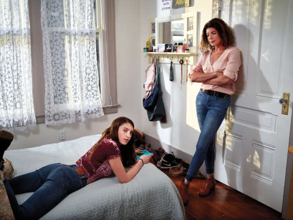

Raising a Teenage Daughter*

 11.30.2017

The Teens Issue

# Raising a Teenage Daughter*

##

 By Elizabeth Weil *with comments and corrections by Hannah W Duane

Photograph by Tabitha Soren

Assisted by Dixie Lewis, 15

Six months ago, my 15-year-old daughter, Hannah, sent me a video. In it, she’s hanging upside down by her feet from a head-high granite boulder, inching along from one end to the other. It’s everything that you’d ever want in your child — to be like a baby bat. Strong, capable, poised, in control. Of course, that video captures one minute at the end of a soul-destroying day during which her father, Dan, took her rock climbing in Yosemite Valley even though he didn’t want to climb. But he did anyway because he was worried about disappointing her, worried about losing her, worried about making enough money to send her to college, and worried about [feeling alienated](https://story.californiasunday.com/raising-a-teenage-daughter#block-1811893) as the only man in a house with not just one but two suddenly woman-sized girls. Naturally, on the climb that he didn’t want to do, he threw out his back and writhed in pain on a ledge before (inevitably) disappointing and [pissing off](https://story.californiasunday.com/raising-a-teenage-daughter#block-1811795) Hannah with the news that they needed to descend. So then there they were, in a boulder patch on the valley floor: Dan lay flat-out under a tree, a disaster. Nearby, Hannah — who at home often looks muddled and vague, in her overalls and Doc Martens, sitting next to her copy of George Orwell’s essays and the scruffy stuffed dog she’s slept with since age 2 — dangled by her toes, [masterful](https://story.californiasunday.com/raising-a-teenage-daughter#block-1811792).

When you have a 2- or 3-year-old child, there’s always someone with older kids who tells you that having a toddler is just like having a teen. You don’t believe them, which is adaptive, because it’s really not OK, when you have a toddler, to think that it doesn’t get easier. But it’s true. The first time around, your kid screams and cries and tries to run into traffic; [you catch her](https://story.californiasunday.com/raising-a-teenage-daughter#block-1811802). Your kid pokes body parts into every available crevice and does her best to electrocute herself; you prevent her. Hannah, as a toddler, was capable of getting hurt just sitting on a kitchen stool. She’d lose focus for a second and WHACK! She’d hit the floor, forehead first. It’s upsetting. The job as a parent of a young kid is risk management. It’s exhausting but not complicated. You don’t even need to know much about your child in particular except that he or she is a human baby in a human-baby body, and all the rules and indemnities apply.

## Sponsored

 [Guided by the Pack: Walking with Wolves in Northern Washington  Presented by Airbnbmag](http://guidedby.us/)

But then your kid starts doing it again, a dozen years later, making forays into independence, pursuing near-death experiences, [throwing tantrums at horrible times](https://story.californiasunday.com/raising-a-teenage-daughter#block-1811804). Only now you’re out of the realm of Newtonian physics — toddler runs, you accelerate and catch — and into the disorienting arena of quantum mechanics, in which everything is incredibly small or incredibly large, and nothing is stable, logical, or obvious. The goal, now, is not just to keep your child alive (though there is that, too) but to steer your child through the hormonal hell-waters of adolescence onto the firm shores of adulthood where, with luck, your child won’t be an idiot or an ass.

It’s a tough task. How well do you know your child? How well do you know the situations [your child is getting into](https://story.californiasunday.com/raising-a-teenage-daughter#block-1811807)? What makes it all seem so impossible is that you need to allow your child to get hurt because if you don’t, your child won’t be resilient and will definitely be an ass. But we’re not talking about losing at Candy Land. We’re talking about … it’s hard to say out loud.

I offered Hannah what I had. Here’s how to [make a bridge while shuffling cards](https://story.californiasunday.com/raising-a-teenage-daughter#block-1811811). Here’s why you show up to things that you think you don’t want to do: Showing up is [the secret to life](https://story.californiasunday.com/raising-a-teenage-daughter#block-1811812). She rejected most of the books I loved (even *[Siddhartha](https://story.californiasunday.com/raising-a-teenage-daughter#block-1811813)*). But she did connect with Rebecca Solnit’s *Men Explain Things to Me*, so I took her to hear Solnit speak. Solnit, God bless her, is a resplendent adult who told the whole audience that she was a solitary semimiserable kid. This was right after the 2016 election. During the Q&A, a young woman asked what I’m sure she thought was a decent question: What should you do to contribute to the political discourse if you’re not comfortable protesting?

Solnit eviscerated her. Who cares about your comfort? — that was her basic answer. Being an adult means doing important things that are uncomfortable. [Hannah loved this](https://story.californiasunday.com/raising-a-teenage-daughter#block-1811815).

Not all our outings went that well. I took Hannah to a matinee of a documentary friends made called *Audrie & Daisy*. It’s a terrifying film about sexual assault in high school. When Hannah was young, [she said *why *at least a thousand times a day](https://story.californiasunday.com/raising-a-teenage-daughter#block-1811901), and Dan and I developed a theory: She needed to know the truth; the truth would soothe her. Then on Christmas morning, when Hannah was 5, decked out in her new fairy dress, she asked where babies came from, and Dan told her. [She didn’t speak for a week](https://story.californiasunday.com/raising-a-teenage-daughter#block-1811824).

I want to say: I’ll give you all I’ve got, but I wasn’t that great at being a teenager, and I’m a pretty flawed adult, too.

The film was basically like that. Audrie, age 15, is raped at a party; Daisy, age 14, is raped at her brother’s “friend’s” house and then dumped, half-naked, to freeze on her front lawn. Watching these stories unfold beside my daughter was excruciating. [I doubted myself the whole time](https://story.californiasunday.com/raising-a-teenage-daughter#block-1811830). I wanted Hannah to be aware, even scared, of the dangers in the world, but I did not want her to be traumatized. I felt I’d set her teetering on that line. Midway through the film, I reached across the armrest and grabbed Hannah’s hand, but I wasn’t sure what I was trying to communicate. *I’m sorry I brought you here? I’m sorry the world is so awful? I’m sorry we’ve reached the point in life where I have to tell you the ghastly things that happen to girls?*

I should just come out and say it:  When we talk about parenting teenage girls and risk, we’re talking, to no small degree, about sex. I worry about Hannah getting hit by a bus. I worry about Hannah feeling alone. But when I consider what truly worries me, I worry about her getting hurt through sex. Bad sex she doesn’t want. Sex with people who trample her heart. What I’ve got to offer as a parent on this front is pathetically scattered. [Own your body but don’t flaunt it](https://story.californiasunday.com/raising-a-teenage-daughter#block-1811833). Be brave but don’t be reckless. Love fiercely but keep boundaries. You’re wearing that crop top? You’re wearing that crop top. OK, you look cute.

## Story Advertisement

 [Dropbox Stories: Collaboration  Presented by Dropbox](http://storyads.californiasunday.com/dropboxcollaboration)

When I was a teenager, I basically [had no idea who I was](https://story.californiasunday.com/raising-a-teenage-daughter#block-1811905). I followed the rules. I didn’t experience a lot of pain, but I didn’t experience a lot of growth, either, and my life was generally pretty lame. Not until my early 20s, when I took risks, quit jobs, crashed cars, and had thrilling, irresponsible, doomed relationships, did I scratch my way, sloppily, to [the adult life I want](https://story.californiasunday.com/raising-a-teenage-daughter#block-1811835).

Sometimes, now, when I see Hannah in her room, I see that she is everything. She’s lanky, elegant, and muscled, and she’s inconsistent, volatile, not sorted out. It’s all right there: the framed picture on her desk of herself, age 4, in a tutu; the [faded RESIST poster](https://story.californiasunday.com/raising-a-teenage-daughter#block-1811837) in her window; the shelf beneath her mirror lined with [the makeup she so dearly wanted in middle school](https://story.californiasunday.com/raising-a-teenage-daughter#block-1811839) and that now sits untouched.

Hannah is the most competent person in our house, and [she’s a puddle](https://story.californiasunday.com/raising-a-teenage-daughter#block-1811841). She wants to know the correct answer, what other people would like her to say, but she’s furious if she thinks the right answer is untrue.

I want to say: I’ll give you all I’ve got, but I wasn’t that great at being a teenager, and I’m a pretty flawed adult, too.

[Nobody contests this last point](https://story.californiasunday.com/raising-a-teenage-daughter#block-1811845). Last summer, thinking I should stay close to Hannah (and also, if I’m honest, maybe feeling threatened and competitive and not wanting to let her get too far ahead of me), I decided to learn to climb. I’d done my pushups. I loved the mountains. Hannah encouraged me to do a route called Tenaya Peak in Tuolumne Meadows, 1,500 feet of granite but not that steep for a rock climb. Hannah had done the climb with Dan the summer before. Dan, playing [risk manager](https://story.californiasunday.com/raising-a-teenage-daughter#block-1811846), made her get up at [4 a.m.](https://story.californiasunday.com/raising-a-teenage-daughter#block-1811849) so they’d have 15 hours of daylight to top out. They finished in [three hours](https://story.californiasunday.com/raising-a-teenage-daughter#block-1811852).

[“It’s so easy!” Hannah told me](https://story.californiasunday.com/raising-a-teenage-daughter#block-1812033).

Off I went.

I felt great and cocky at the beginning. What’s the big deal? Then, a quarter of the way up, I started to panic, and by halfway I was unhinged, weeping, unable to look down, incapable of moving my feet, no relationship at all to controlling fear — just a babbling, paralyzed, narcissistic 47-year-old toddler.

“It’s OK. It’s a lot of exposure. We probably should have started with something smaller,” Dan said, trying to comfort me in the car on the way home. “You’ve got to realize: Hannah’s way tougher mentally than I ever was or than I am now.”

Hannah took my backpack when we walked into our house, and then she hugged me sweetly, gently, with just a hint of pity, the kind of hug I imagine I might give her if she [fails her first driver’s test](https://story.californiasunday.com/raising-a-teenage-daughter#block-1812035). I told her that I was amazed by her and proud, and she nodded beneficently and returned to her room.