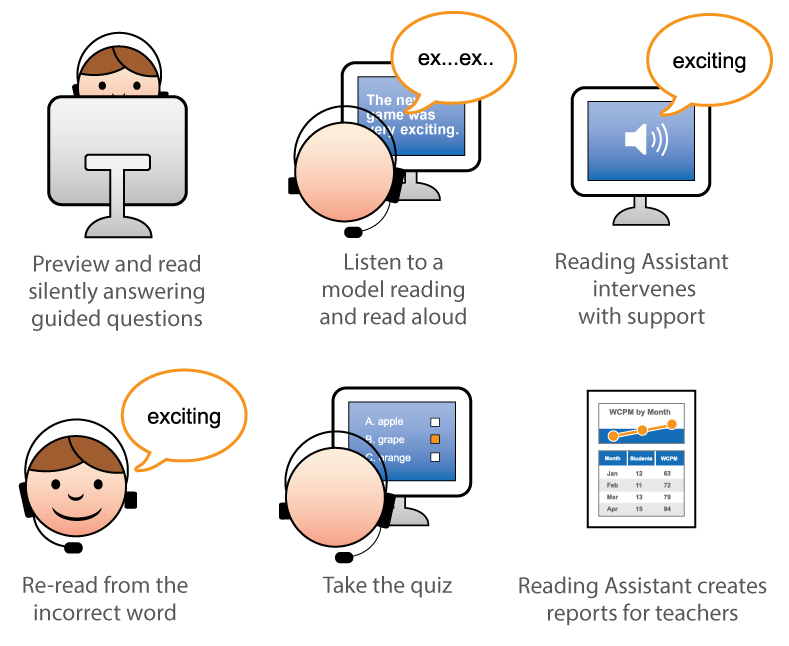
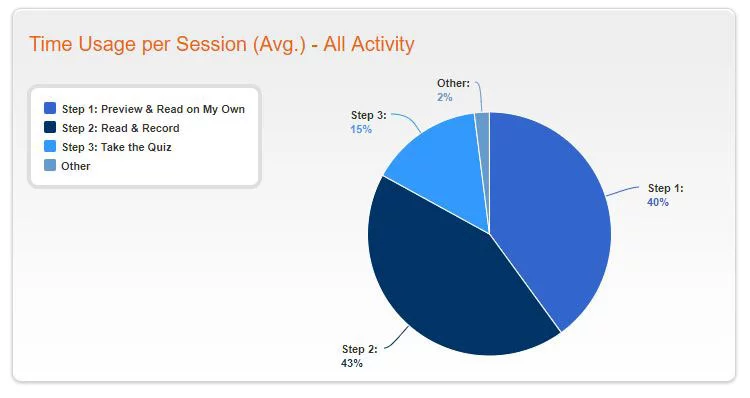

Reading Assistant Plus - Scientific Learning

##### Reading Assistant Plus

# Our Online Guided Reading Tool for Improving Vocabulary, Fluency, Comprehension, and Prosody

Oral reading is critical in improving reading fluency, comprehension, and prosody. Reading Assistant Plus is an innovative online guided reading tool that provides intensive reading practice. Learners use the tool to read developmentally appropriate texts both silently and aloud. What makes Reading Assistant Plus such an innovative reading practice tool is its use of patented technology that listens as each word is read aloud and delivers immediate support whenever a learner struggles with or mispronounces a word — reinforcing newly learned reading skills, vocabulary, and fluency.

# What Reading Assistant Plus Does

**Provides Guided Reading Support to More Students**

- Reading Assistant Plus uses patented speech recognition technology to deliver real-time corrective guided reading feedback, enabling learners to self-correct as they are reading aloud.

**Improves Both Silent Reading and Oral Reading Skills**

- Unlike other digital reading practice resources that only allow learners to record themselves reading aloud, Reading Assistant Plus actually listens and helps learners whenever they struggle or mispronounce a word — it's like having a personal guided reading tutor available 24/7!

**Saves Teachers Time**

- Automatic calculation of words correct per minute (WCPM), and actionable comprehension and vocabulary reports make it easy for teachers to track learners’ reading levels, and specific areas of strength and weakness.

**Pre-teaches Academic Vocabulary**

- Built-in Word Wall activities pre-teach academic vocabulary, activate prior knowledge, and provide pronunciations for new words before learners begin each e-book passage.

**Reaches the Reluctant Reader**

- Reading Assistant Plus provides reading selections for a variety of interests and reading levels, plus frequent comprehension checks, to keep learners motivated and focused on reading for meaning.

# How Reading Assistant Plus Works

# Easy-to-Use Reports and Indicators

Reading Assistant Plus provides implementation and performance reporting at the district, group, and student level to support and improve data-driven decision making. Graphical depictions show usage, performance, reading level trends, and student proficiency levels.

# How do I Purchase the Reading Assistant Plus Tool?

Reading Assistant Plus is included in all K-12 subscriptions of Fast ForWord reading intervention at no additional cost. The software is available to purchase separately from the Fast ForWord intervention program for schools, private providers, and international distributors. [Contact us](https://www.scilearn.com/contact-us/)for more information about purchasing options.

# Want to Learn More About Reading Assistant Plus?

If you’re interested in learning more about our Reading Assistant Plus online guided reading tool and how it works as part of our Fast ForWord language and reading intervention program, let us know! We’re happy to send you more information or schedule a personal demonstration.

[Download Info Pack](http://https//pages.scilearn.com/info-pack-new-2019.html)[Request Demo](http://https//pages.scilearn.com/Website-demo-req-2019LP.html)