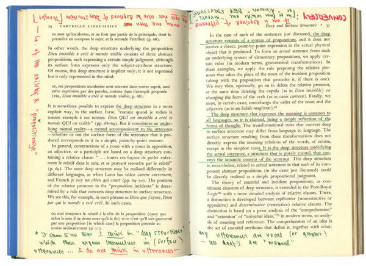
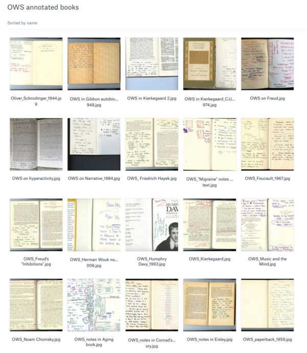
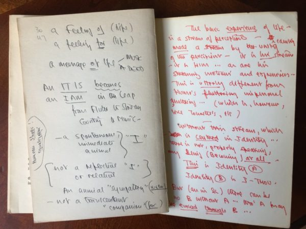
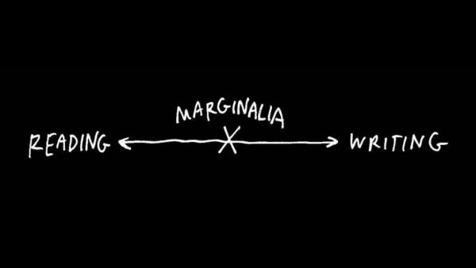
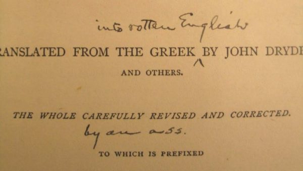
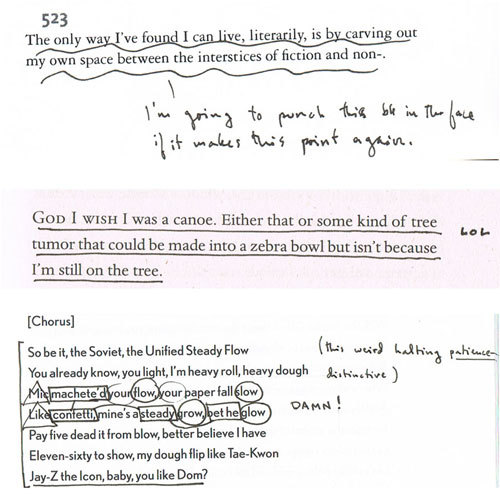
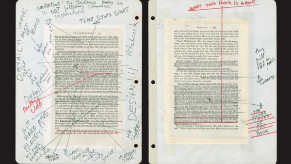
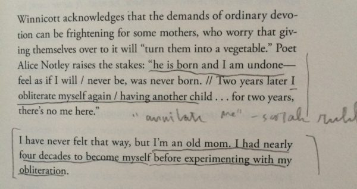
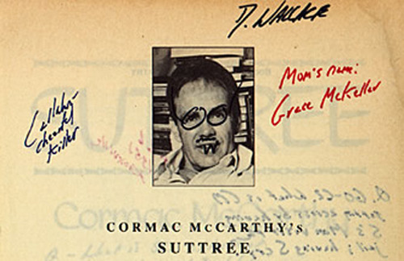

Reading with a pencil - Austin Kleon

# Reading with a pencil

Thursday, August 30, 2018

[Oliver Sacks’ writing in a Noam Chomsky book](https://www.nytimes.com/2018/08/29/opinion/oliver-sacks-the-man-who-loved-words.html)

> “

> The intellectual is, quite simply, a human being who has a pencil in his or her hand when reading a book.

> —George Steiner

Photographer [Bill Hayes](https://www.billhayes.com/) wrote a nice essay about [Oliver Sacks’ love of words](https://www.nytimes.com/2018/08/29/opinion/oliver-sacks-the-man-who-loved-words.html), and he’s been posting images of Sacks’ hand-annotated books [on Twitter](https://twitter.com/billhayesnyc):

Sacks “[loved](https://twitter.com/BillHayesNYC/status/1032729651112763393) to write notes on the pages of books he was reading — thoughts, ideas, arguments with the author, diagrams.” What a delight it must be to go through such a library (of 500+ books) and see Sacks’ [raw thoughts in margins and endpapers](https://twitter.com/BillHayesNYC/status/1033713514354028545):

This is, of course, an ancient practice called [*marginalia.*](https://en.wikipedia.org/wiki/Marginalia) (A nice, short read on the subject is Mark O’Connell’s piece, “[The Marginal Obsession With Marginalia](https://www.newyorker.com/books/page-turner/the-marginal-obsession-with-marginalia).”)

I believe that **the first step towards becoming a writer is becoming a reader, but the next step is becoming a reader***** with a pencil**. *When you underline and circle and jot down your questions and argue in the margins, you’re existing in this interesting middle ground between reader and writer:

Patricia Lockwood [put it this way](https://longform.org/posts/longform-podcast-250-patricia-lockwood):

> “

>  There’s a way of reading that is like writing. You feel in collaboration… You have a pen in your hand, you’re going along in a way that’s, like, half creating it as you go. And you’re also strip-mining it for anything you can use… you’re sifting for what could be gold.

Panning for gold, or “shopping for images,” as Allen Ginsberg puts it in “[A Supermarket in California](https://www.poetryfoundation.org/poems/47660/a-supermarket-in-california).”

Mark Twain’s copy of Plutarch’s *Lives*

Sometimes marginalia is the next best thing to [punching an author in the face](https://www.nybooks.com/daily/2015/02/19/marginalia-insults-epiphanies/). I’m a huge fan of Sam Anderson’s “[A Year in Marginalia](https://themillions.com/2010/12/a-year-in-marginalia-sam-anderson.html)” in which he posts [snapshots of his marginal comments](http://archive.nytimes.com/www.nytimes.com/interactive/2012/01/01/magazine/sam-anderson-marginalia.html):

Sam Anderson [marginalia](https://themillions.com/2010/12/a-year-in-marginalia-sam-anderson.html)

> “

> The writing I enjoy doing most, every year, is marginalia: spontaneous bursts of pure, private response to whatever book happens to be in front of me. It’s the most intimate, complete, and honest form of criticism possible — not the big wide-angle aerial shot you get from an official review essay, but a moment-by-moment record of what a book actually *> feels*>  like to the actively reading brain.

Whether you’re panning for gold or slinging shit at a dead man, marginalia turns reading into writing. (See [Billy Collins’ poem](https://www.poetryfoundation.org/poetrymagazine/browse?contentId=39493).) My friend [John T. Unger](http://johntunger.com/) once said to me, “Every piece of art I’ve ever made was because I saw bad and could do better, or saw great and needed to catch up.”

Francis Ford Coppola’s [notes on Puzo’s *The Godfather*](http://tumblr.austinkleon.com/post/144910238886)

In Sam Anderson’s “[What I Really Want Is Someone Rolling Around in the Text](https://www.nytimes.com/2011/03/06/magazine/06Riff-t.html),” he points out that marginalia used to be more of a social practice:

> “

> [P]eople would mark up books for one another as gifts, or give pointedly annotated novels to potential lovers…. Samuel Taylor Coleridge, the undisputed all-time champion of marginalia, flourished at the tail end of this period, and his friends were always begging him to mark up their books. He eventually published some of his own marginalia, and in the process even popularized the word “marginalia” — a self-consciously pompous Latinism intended to mock the triviality of the form.

I own books that were marked up by my father-in-law *and *my wife when they were in high school. Reading through them is like a kind of time travel — get to visit with them in the past. Sometimes I imagine my kids reading one of my books and coming across a note from me…

[My notes in Maggie Nelson’s *The Argonauts*](http://tumblr.austinkleon.com/post/119129599506)

I love this idea of marginalia as a way to turn a book into a medium for conversation — a kind of literary note-passing. G.K. Chesterton’s once went through a friend’s newly-published book of aphorisms and [answered each one with his pencil](http://tumblr.austinkleon.com/post/1462724912). (It was later published as [*Platitudes Undone*](https://www.amazon.com/exec/obidos/ASIN/0898706289/wwwaustinkleo-20/ref=nosim/).) Sam Anderson and David Rees [wrote notes to each other in a copy of Dan Brown’s *Inferno*](https://themillions.com/2014/01/dumbest-thing-ever-scribbling-in-the-margins-of-dan-browns-inferno.html). J.J. Abrams and Doug Dorst actually used handwritten marginalia as a device in their novel, [*Ship of Theseus*](https://www.amazon.com/exec/obidos/ASIN/0316201642/wwwaustinkleo-20/ref=nosim/). (I was delighted to see readers [swapping their marginalia](https://seanziebarth.com/2014/04/06/reading-braddo-reading-austinkleon-1/) for my book, *[Show Your Work!](https://austinkleon.com/show-your-work/)*)

[David Foster Wallace’s copy of Suttree](http://www.hrc.utexas.edu/press/releases/2010/dfw/books/)

Finally, marginalia is a way of really owning your books and your reading experience. Here’s Mortimer J. Adler and Charles Van Doren in their classic, [*How To Read A Book*](https://www.amazon.com/exec/obidos/ASIN/0671212095/wwwaustinkleo-20/ref=nosim/):

> “

> Full ownership of a book only comes when you have made > it a part of yourself, and the best way to make yourself a part of it — which comes to the same thing — is by writing in it. Why is marking a book indispensable to reading it? First, it keeps you awake — not merely conscious, but wide awake. Second, reading, if it is active, is thinking, and thinking tends to express itself in words, spoken or written. The person who says he knows what he thinks but cannot express it usually does not know what he thinks. Third, writing your reactions down helps you to remember the thoughts of the author. Reading a book should be a conversation between you and the author….Marking a book is literally an expression of your differences or your agreements…It is the highest respect you can pay him.

Read with a pencil! (I recommend [Blackwing Palaminos](https://www.amazon.com/exec/obidos/ASIN/B006CQWILK/wwwaustinkleo-20/ref=nosim/).)

Filed Under: [Reading](https://austinkleon.com/category/reading/)  Tagged: [allen ginsberg](https://austinkleon.com/tag/allen-ginsberg/), [bill hayes](https://austinkleon.com/tag/bill-hayes/), [Books](https://austinkleon.com/tag/books/), [charles van doren](https://austinkleon.com/tag/charles-van-doren/), [david foster wallace](https://austinkleon.com/tag/david-foster-wallace/), [maggie nelson](https://austinkleon.com/tag/maggie-nelson/), [marginalia](https://austinkleon.com/tag/marginalia/), [mark twain](https://austinkleon.com/tag/mark-twain/), [mortimer adler](https://austinkleon.com/tag/mortimer-adler/), [oliver sacks](https://austinkleon.com/tag/oliver-sacks/), [patricia lockwood](https://austinkleon.com/tag/patricia-lockwood/), [reading](https://austinkleon.com/tag/reading/), [sam anderson](https://austinkleon.com/tag/sam-anderson/)