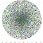

Realtime tSNE Visualizations with TensorFlow.js

Realtime tSNE Visualizations with TensorFlow.js

https://ai.googleblog.com/2018/06/realtime-tsne-visualizations-with.html

Posted by Nicola Pezzotti, Software Engineering Intern, Google Zürich In recent years, the t-distributed Stochastic Neighbor Embedding (...