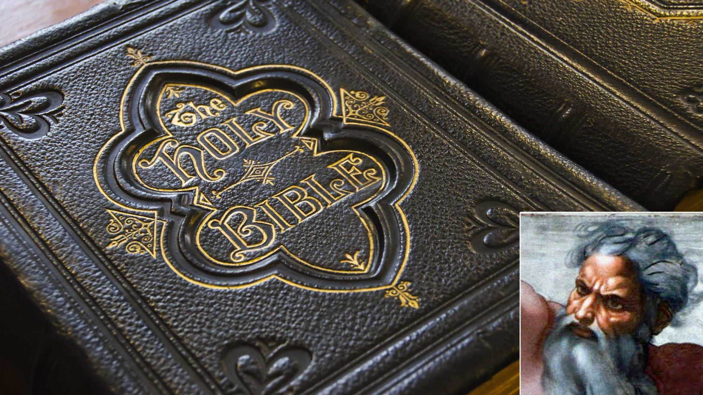

Reclusive Deity Hasn’t Written A New Book In 2,000 Years

 [NEWS](http://www.theonion.com/features/news)  •   9.16.14

# Reclusive Deity Hasn’t Written A New Book In 2,000 Years

The popular book’s author hasn’t been seen in public in ages.
 

   [**SHARE](http://www.theonion.com/article/reclusive-deity-hasnt-written-a-new-book-in-2000-y-36936?utm_content=Main&utm_campaign=SF&utm_source=Twitter&utm_medium=SocialMarketing#)  [**TWEET](http://www.theonion.com/article/reclusive-deity-hasnt-written-a-new-book-in-2000-y-36936?utm_content=Main&utm_campaign=SF&utm_source=Twitter&utm_medium=SocialMarketing#)  [**EMAIL](http://www.theonion.com/article/reclusive-deity-hasnt-written-a-new-book-in-2000-y-36936?utm_content=Main&utm_campaign=SF&utm_source=Twitter&utm_medium=SocialMarketingmailto:?subject=Reclusive%20Deity%20Hasn%E2%80%99t%20Written%20A%20New%20Book%20In%202%2C000%20Years&body=http://www.theonion.com/article/reclusive-deity-hasnt-written-a-new-book-in-2000-y-36936%20%0D%0A%0D%0AReclusive%20Deity%20Hasn%E2%80%99t%20Written%20A%20New%20Book%20In%202,000%20Years)

NEW YORK—Leading writers, scholars, and publishers gathered this week at Fordham University for a literary conference and panel discussion on God, the widely praised but reclusive deity who has not published a book since His landmark debut 2,000 years ago.

Hailed by critics as one of the most important authors in recent millennia, the eccentric divinity is said to have long ago retreated from the public eye, eschewing a life of celebrity for one of solitude and quiet. To this day, experts confirmed, His artistic reputation rests exclusively upon His bestselling and highly acclaimed first work, the Bible.

“God has granted no interviews, made no public appearances, and kept entirely to Himself for what seems like ages, and yet it’s fair to say that no other author has been quite so influential,” said noted critic and conference attendee James Wood, observing that while the fiercely private immortal being has only one book to His credit, He remains among the world’s most respected and quoted writers. “For many readers, God’s writing had a transformative impact on their lives, and countless people list His book among their favorite titles. But for reasons that we can only speculate about, God has chosen to stay out of the limelight and let His words speak for themselves. Perhaps it is God’s retreat into His own world that allowed Him to render His vision so vividly on the page.”

“It’s also possible that, with the first book, He simply said everything He had to say,” Wood continued. “Though one would think a writer of such impressive knowledge and power would never lack for inspiration.”

Many within the literary community suggested that God might well have become a victim of His own success, arguing that the enormous pressure to write a book as well-loved as the Bible—to which any new work of His would inevitably be compared—had simply proved too daunting. Regardless of His reasons, experts agreed that the Supreme Being’s public absence had only added to His mystique.

According to publishers, who predict that the Bible will remain in print for many years to come, the popularity of the famously secretive deity remains so high that just about anything new He released would be an instant commercial success.

“Certainly in the book business we’ve been wondering for a very long time what He’s been up to, whether or not He’s still writing,” said publishing executive Sandra Eakins, who brushed aside concerns that a lackluster follow-up to the Bible might damage God’s reputation. “Maybe He writes for His own pleasure and has no desire to publish anything new. I can respect that, but at the same time, it’s a tragedy for His readers.”

“We’d absolutely love to see more stories, psalms, epistles—anything He has,” Eakins continued. “In His first book, He created this dense, sprawling, multifaceted universe, and there are readers out there clamoring to know what’s happened to all those characters since the Bible ended.”

Eakins said the Lord Almighty retains an incredibly loyal international readership and, to this day, His writing continues to attract legions of devotees. Since the time of the Bible’s first publication, when God was heralded by critics as a promising new talent, successive generations of booklovers have reportedly found themselves returning again and again to what they regard as a timeless and enduring classic.

Many of God’s most ardent fans still make regular attempts to contact Him, sources said, despite the fact that the reclusive being is infamous for never responding.

“It’s understandably very difficult for people to accept that a deity could create an epic as complex, beautiful, strange, and enduring as the Bible, and then just stop writing altogether—cutting off all ties and making Himself completely inaccessible,” said Professor Charles Boutwell, a panelist at the conference and a self-proclaimed admirer of the God of Heaven and Earth. “However, the qualities that make God so mysterious to us are the very same qualities that make Him such a unique voice.”

“It’s natural to want more,” Boutwell added. “But in the end, maybe God only had the one Bible in him.”