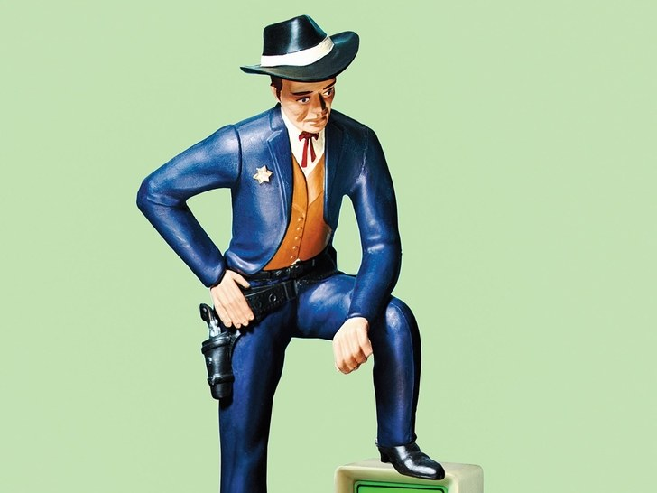
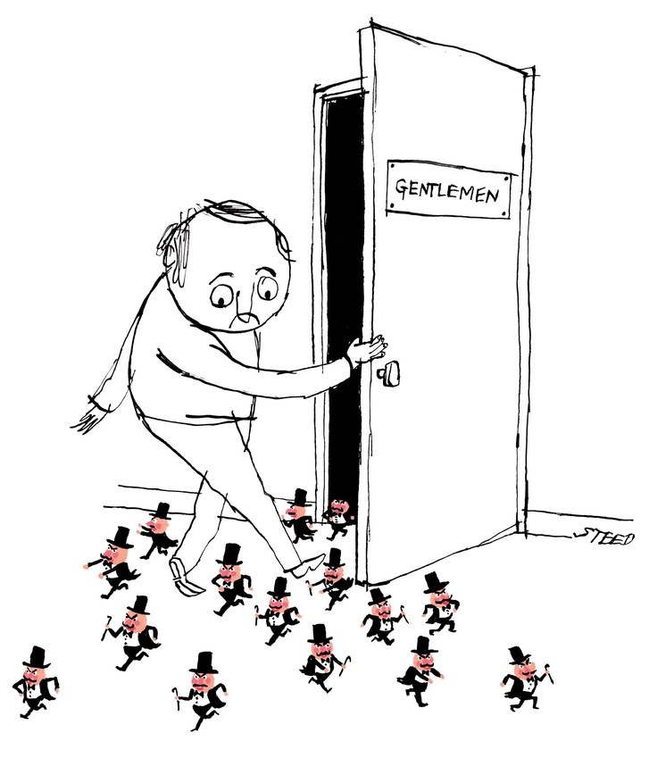

Reddit and the Struggle to Detoxify the Internet

# Reddit and the Struggle to Detoxify the Internet

## How do we fix life online without limiting free speech?

By [Andrew Marantz](https://www.newyorker.com/contributors/andrew-marantz)

Illustration by Javier Jaén

**Audio:** Listen to this story. To hear more feature stories, [download the Audm app for your iPhone.](https://goo.gl/tgysHu)

Which Web sites get the most traffic? According to the ranking service Alexa, the top three sites in the United States, as of this writing, are Google, YouTube, and Facebook. (Porn, somewhat hearteningly, doesn’t crack the top ten.) The rankings don’t reflect everything—the dark Web, the nouveau-riche recluses harvesting bitcoin—but, for the most part, people online go where you’d expect them to go. The only truly surprising entry, in fourth place, is Reddit, whose astronomical popularity seems at odds with the fact that many Americans have only vaguely heard of the site and have no real understanding of what it is. A link aggregator? A microblogging platform? A social network?

To its devotees, Reddit feels proudly untamed, one of the last Internet giants to resist homogeneity. Most Reddit pages have a throwback aesthetic, with a few crudely designed graphics and a tangle of text: an original post, comments on the post, responses to the comments, responses to the responses. That’s pretty much it. Reddit is made up of more than a million individual communities, or subreddits, some of which have three subscribers, some twenty million. Every subreddit is devoted to a specific kind of content, ranging from vital to trivial: r/News, r/Politics, r/Trees (for marijuana enthusiasts), r/MarijuanaEnthusiasts (for tree enthusiasts), r/MildlyInteresting (“for photos that are, you know, mildly interesting”). Some people end up on Reddit by accident, find it baffling, and never visit again. But people who do use it—redditors, as they’re called—often use it all day long, to the near-exclusion of anything else. “For a while, we called ourselves the front page of the Internet,” Steve Huffman, Reddit’s C.E.O., said recently. “These days, I tend to say that we’re a place for open and honest conversations—‘open and honest’ meaning authentic, meaning messy, meaning the best and worst and realest and weirdest parts of humanity.”

On November 23, 2016, shortly after President Trump’s election, Huffman was at his desk, in San Francisco, perusing the site. It was the day before Thanksgiving. Reddit’s administrators had just deleted a subreddit called r/Pizzagate, a forum for people who believed that high-ranking staffers of Hillary Clinton’s Presidential campaign, and possibly Clinton herself, were trafficking child sex slaves. The evidence, as extensive as it was unpersuasive, included satanic rituals, a map printed on a handkerchief, and an elaborate code involving the words “cheese” and “pizza.” In only fifteen days of existence, the Pizzagate subreddit had attracted twenty thousand subscribers. Now, in its place, was a scrubbed white page with the message “This community has been banned.”

The reason for the ban, according to Reddit’s administrators, was not the beliefs of people on the subreddit, but the way they’d behaved—specifically, their insistence on publishing their enemies’ private phone numbers and addresses, a clear violation of Reddit’s rules. The conspiracy theorists, in turn, claimed that they’d been banned because Reddit administrators were part of the conspiracy. (Less than two weeks after Pizzagate was banned, a man fired a semiautomatic rifle inside a D.C. pizzeria called Comet Ping Pong, in an attempt to “self-investigate” claims that the restaurant’s basement was a dungeon full of kidnapped children. Comet Ping Pong does not have a basement.)

Some of the conspiracy theorists left Reddit and reunited on Voat, a site made by and for the users that Reddit sloughs off. (Many social networks have such Bizarro networks, which brand themselves as strongholds of free speech and in practice are often used for hate speech. People banned from Twitter end up on Gab; people banned from Patreon end up on Hatreon.) Other Pizzagaters stayed and regrouped on r/The_Donald, a popular pro-Trump subreddit. Throughout the Presidential campaign, The_Donald was a hive of Trump boosterism. By this time, it had become a hermetic subculture, full of inside jokes and ugly rhetoric. The community’s most frequent commenters, like the man they’d helped propel to the Presidency, were experts at testing boundaries. Within minutes, they started to express their outrage that Pizzagate had been deleted.

Redditors are pseudonymous, and their pseudonyms are sometimes prefaced by “u,” for “username.” Huffman’s is Spez. As he scanned The_Donald, he noticed that hundreds of the most popular comments were about him:

“fuck u/spez”
“u/spez is complicit in the coverup”
“u/spez supports *child rape*”

One commenter simply wrote “u/*SPEZ IS A CUCK*,” in bold type, a hundred and ten times in a row.

Huffman, alone at his computer, wondered whether to respond. “I consider myself a troll at heart,” he said later. “Making people bristle, being a little outrageous in order to add some spice to life—I get that. I’ve done that.” Privately, Huffman imagined The_Donald as a misguided teen-ager who wouldn’t stop misbehaving. “If your little brother flicks your ear, maybe you ignore it,” he said. “If he flicks your ear a hundred times, or punches you, then maybe you give him a little smack to show you’re paying attention.”

Although redditors didn’t yet know it, Huffman could edit any part of the site. He wrote a script that would automatically replace his username with those of The_Donald’s most prominent members, directing the insults back at the insulters in real time: in one comment, “Fuck u/Spez” became “Fuck u/Trumpshaker”; in another, “Fuck u/Spez” became “Fuck u/MAGAdocious.”

The_Donald’s users saw what was happening, and they reacted by spinning a conspiracy theory that, in this case, turned out to be true.

“Manipulating the words of your users is fucked,” a commenter wrote.
“Even Facebook and Twitter haven’t stooped this low.”
“Trust nothing.”

The incident became known as Spezgiving, and it’s still invoked, internally and externally, as a paradigmatic example of tech-executive overreach. Social-media platforms must do something to rein in their users, the consensus goes, but not *that*.

Huffman can no longer edit the site indiscriminately, but his actions laid bare a fact that most social-media companies go to great lengths to conceal—that, no matter how neutral a platform may seem, there’s always a person behind the curtain. “I fucked up,” Huffman wrote in an apology the following week. “More than anything, I want Reddit to heal, and I want our country to heal.” Implicit in his apology was a set of questions, perhaps the central questions facing anyone who worries about the current state of civic discourse. Is it possible to facilitate a space for open dialogue without also facilitating hoaxes, harassment, and threats of violence? Where is the line between authenticity and toxicity? What if, after technology allows us to reveal our inner voices, what we learn is that many of us are authentically toxic?

The only way to understand the Internet, at least at first, was by metaphor. “Web” and “page” and “superhighway” are metaphors. So are “link,” “viral,” “post,” and “stream.” Last year, the Supreme Court heard a case about whether it was constitutional to bar registered sex offenders from using social media. In order to answer that question, the Justices had to ask another question: What is social media? In sixty minutes of oral argument, Facebook was compared to a park, a playground, an airport terminal, a polling place, and a town square.

It might be most helpful to compare a social network to a party. The party starts out small, with the hosts and a few of their friends. Then word gets out and strangers show up. People take cues from the environment. Mimosas in a sun-dappled atrium suggest one kind of mood; grain alcohol in a moldy basement suggests another. Sometimes, a pattern emerges on its own. Pinterest, a simple photo-sharing site founded by three men, happened to catch on among women aspiring to an urbane life style, and today the front page is often a collage of merino scarves and expensive glassware. In other cases, the gatekeeping seems more premeditated. If you’re fourteen, Snapchat’s user interface is intuitive; if you’re twenty-two, it’s intriguing; if you’re over thirty-five, it’s impenetrable. This encourages old people to self-deport.

Huffman and his college roommate, Alexis Ohanian, founded Reddit a few weeks after graduating from the University of Virginia, in 2005. The first people to show up were, like the co-founders, the kind of strong-headed young men who got excited about computer programming, video games, and edgy, self-referential humor. Reddit’s system was purely democratic, which is to say anarchic. Anyone could post any link, and the ones that got the most “upvotes” would rise to the top of a page. At the time, Facebook was available only to college students, and before joining it you had to provide your real name, your birthday, and a valid school e-mail address—the equivalent of being carded at the door. To join Reddit, all you needed was a username that hadn’t been claimed yet. You could start as many anonymous accounts as you wanted, which gave rise to creativity, and also to mischief.

Back then, Ohanian was ungainly and clean-shaven, and he was often photographed in a hoodie and with a goofy smile. At his wedding, last year, wearing a beard and an Armani tuxedo, he was nearly unrecognizable. (The paparazzi weren’t too interested in him, though, given that his bride was Serena Williams.) Huffman, on the other hand, has always looked more or less the same: bright-blue eyes, chipmunk teeth, and a thatch of blond hair.

A few months after Reddit launched, Huffman created the first constraints. People were posting links to vulgar and violent content—which was fine, except that Huffman wanted users to have some idea of what they were about to click on, so that they could avoid, say, inadvertently opening porn in front of their bosses. Huffman labelled some content N.S.F.W.—not safe for work—and separated it from everything else. That was the end of pure democracy.

In 2006, Ohanian and Huffman sold Reddit to Condé Nast, a media conglomerate that owns more than twenty magazines, including this one. (Reddit now operates independently.) The sale made them twenty-two-year-old millionaires, but they didn’t fit in at a large corporation, and three years later they left. In their absence, the party got bigger and weirder, and ominous cliques started to gather in the corners. One popular subreddit, r/Jailbait, was devoted to sexually suggestive photos of young-looking women. This was profoundly creepy, but probably not illegal—the subreddit’s users swore that all the women in the photos were eighteen or older—and Reddit allowed the community to grow. In September of 2011, Anderson Cooper discussed the subreddit on CNN. “It’s pretty amazing that a big corporation would have something like this, which reflects badly on it,” he said. Traffic to Jailbait quadrupled overnight. Twelve days later, after someone in the group apparently shared a nude photo of a fourteen-year-old girl, the community was banned. And yet the founder of Jailbait, an infamous troll who went by u/Violentacrez, was allowed to stay on Reddit, as were some four hundred other communities he’d created—r/Jewmerica, r/ChokeABitch, and worse. (Yes, it gets worse.)

Yishan Wong, an engineer who had worked at Facebook, was then Reddit’s C.E.O. He implied that he’d banned Jailbait only because the subreddit had violated U.S. law. “We stand for free speech,” he wrote in an internal post, in 2012. Reddit’s goal, he continued, was to “become a universal platform for human discourse.” Therefore, “it would not do if, in our youth, we decided to censor things simply because they were distasteful.”

At the time, Wong’s free-speech absolutism was ubiquitous in Silicon Valley. Twitter’s executives referred to their company as “the free-speech wing of the free-speech party.” Facebook’s original self-description, “an online directory that connects people through social networks at colleges,” had evolved into a grandiose mission statement: “Facebook gives people the power to share and make the world more open and connected.” With the Arab Spring fresh in everyone’s mind, few questioned the assumption that “giving people the power” would inevitably lead to social progress. Barack Obama, who had been carried into office by a social-media groundswell, often expressed a similar optimism about the salubrious effects of the Internet. “In the twenty-first century, information is power,” Obama said in a 2011 speech on Middle East policy. “The truth cannot be hidden. . . . Such open discourse is important even if what is said does not square with our worldview.”

Wong left the company in 2014, after two and a half years. His successor was Ellen Pao, a former venture capitalist. She lasted eight months. Early in her tenure, Reddit announced a crackdown on involuntary pornography. If you found a compromising photo of yourself circulating on Reddit without your consent, you could report it and the company would remove it. In retrospect, this seems like a straightforward business decision, but some redditors treated it as the first in an inevitable parade of horrors. “This rule is stupid and suppresses our rights,” u/penisfuckermcgee commented.

A few months later, Reddit banned five of its most egregious communities, including r/FatPeopleHate and r/ShitNiggersSay. Again redditors were apoplectic (“We may as well take a one way ticket to North Korea”). Almost every day, strident misogynists called Pao a tyrant, an “Asian slut,” or worse. (Yes, it gets worse.) She resigned in July, 2015. “The Internet started as a bastion for free expression,” she wrote in the Washington *Post*. “But that balancing act is getting harder. The trolls are winning.”

Over time, social networks have turned into institutions. More than two billion people now use Facebook. In other words, the company has achieved its mission of making the world more connected. In 2016, that meant, among other things, making the American electorate more connected to white supremacists, armed militias, Macedonian fake-news merchants, and micro-targeted campaign ads purchased in rubles. “I continue to believe Mr. Trump will not be President,” Obama said that year, despite the mounting aggression in some online forums. “And the reason is because I have a lot of faith in the American people.” (In response to Obama’s remarks, a commenter on The_Donald wrote, “*FUCK THAT LOW ENERGY CUCK*!”)

Shortly after the election, Brad Parscale, the Trump campaign’s top digital strategist, [told *Wired*](https://www.wired.com/2016/11/facebook-won-trump-election-not-just-fake-news/), “Facebook and Twitter were the reason we won this thing.” Reddit was also an important part of Trump’s strategy. Parscale wrote—on Reddit, naturally—that “members here provided considerable growth and reach to our campaign.” The_Donald, in particular, proved a fecund host cell for viral memes. On July 2, 2016, Trump tweeted a photo collage of Hillary Clinton, piles of cash, and the phrase “Most Corrupt Candidate Ever!” written inside a six-pointed star. When Trump’s critics called attention to the image’s anti-Semitic implications, The_Donald’s users rushed to Trump’s defense, posting photos of other six-pointed stars in innocuous contexts. “Where is the outrage from the liberal left on this one?” a user wrote, beneath a photo of a “Frozen”-themed sticker book with a star on its cover. A few hours later, Trump tweeted the same photo, with a version of the same question, followed by “Dishonest media! #Frozen.”

During the campaign, Trump, or someone typing on his behalf, participated in Reddit’s signature interview format—an A.M.A., for “ask me anything.” In response to a question about the “protected class of media elites,” Trump wrote, “I have been very concerned about media bias and the total dishonesty of the press. I think new media is a great way to get out the truth.” This drew hundreds of jubilant comments (u/*RAINBOW*_*DILDO*: “daddy *YES*”; u/CantContheDon: “*WE’RE THE MEDIA NOW*”).

The_Donald, with more than half a million subscribers, is by far the biggest pro-Trump subreddit, but it ranks just below No. 150 on the list of all subreddits; it’s roughly the same size as r/CryptoCurrency and r/ComicBooks. “Some people on The_Donald are expressing their genuine political beliefs, and obviously that’s something we want to encourage,” Huffman said. “Others are maybe not expressing sincere beliefs, but are treating it more like a game—If I post this ridiculous or offensive thing, can I get people to upvote it? And then some people, to quote ‘The Dark Knight,’ just want to watch the world burn.” On some smaller far-right subreddits, the discourse is more unhinged. One, created in July of 2016, was called r/Physical_Removal. According to its “About Us” section, it was a subreddit for people who believe that liberals “qualify to get a helicopter ride.” “Helicopter ride,” an allusion to Augusto Pinochet’s reputed habit of throwing Communists out of helicopters, is alt-right slang for murder.

The_Donald accounts for less than one per cent of Reddit’s traffic, but it occupies far more than one per cent of the Reddit-wide conversation. Trolls set a cunning trap. By ignoring their provocations, you risk seeming complicit. By responding, you amplify their message. Trump, perhaps the world’s most skilled troll, can get attention whenever he wants, simply by being outrageous. Traditional journalists and editors can decide to resist the bait, and sometimes they do, but that option isn’t available on user-generated platforms. Social-media executives claim to transcend subjectivity, and they have designed their platforms to be feedback machines, giving us not what we claim to want, nor what might be good for us, but what we actually pay attention to.

There are no good solutions to this problem, and so tech executives tend to discuss it as seldom as possible, and only in the airiest of platitudes. Twitter has rebuffed repeated calls to ban President Trump’s account, despite his many apparent violations of company policy. (If tweeting that North Korea “won’t be around much longer” doesn’t break Twitter’s rule against “specific threats of violence,” it’s not clear what would.) Last fall, on his Facebook page, Mark Zuckerberg addressed—sort of, obliquely—the widespread critique that his company was exacerbating political polarization. “We’ll keep working to ensure the integrity of free and fair elections around the world, and to ensure our community is a platform for all ideas and force for good in democracy,” he wrote, then stepped away as a global howl of frustration grew in the comments.

I asked a few social-media executives to talk to me about all this. I didn’t expect definitive answers, I told them; I just wanted to hear them think through the questions. Unsurprisingly, no one jumped at the chance. Twitter mostly ignored my e-mails. Snapchat’s P.R. representatives had breakfast with me once, then ignored my e-mails. Facebook’s representatives talked to me for weeks, asking precise, intelligent questions, before they started to ignore my e-mails.

Reddit has more reason to be transparent. It’s big, but doesn’t feel indispensable to most Internet users or, for that matter, to most advertisers. Moreover, Anderson Cooper’s CNN segment was hardly the only bit of vividly terrible press that Reddit has received over the years. All social networks contain vitriol and bigotry, but not all social networks are equally associated with these things in the public imagination. Recently, I typed “Reddit is” into Google. Three of the top suggested auto-completions were “toxic,” “cancer,” and “hot garbage.”

Huffman, after leaving Condé Nast, spent a few months backpacking in Costa Rica, then founded a travel company called Hipmunk. In July, 2015, he returned to Reddit as C.E.O. In a post about his “top priority” in the job, he wrote, “The overwhelming majority of content on reddit comes from wonderful, creative, funny, smart, and silly communities. There is also a dark side, communities whose purpose is reprehensible, and we don’t have any obligation to support them. . . . Neither Alexis nor I created reddit to be a bastion of free speech.” This was shocking, and about half true. When free-speech absolutism was in vogue, Reddit’s co-founders were as susceptible to its appeal as anyone. In 2012, a *Forbes* reporter asked Ohanian how the Founding Fathers might have reacted to Reddit. “A bastion of free speech on the World Wide Web? I bet they would like it,” Ohanian [responded](https://www.forbes.com/sites/kashmirhill/2012/02/02/reddit-co-founder-alexis-ohanians-rosy-outlook-on-the-future-of-politics/3/#6a0fdcf86c46). “I would love to imagine that ‘Common Sense’ would have been a self-post on Reddit, by Thomas Paine, or actually a redditor named T_Paine.”

Still, Ohanian and Huffman never took their own rhetoric too literally. The site’s rules were brief and vague, and their unwritten policy was even simpler. “We always banned people,” Huffman told me. “We just didn’t talk about it very much.” Because Reddit was so small, and misbehavior relatively rare, Huffman could do most of the banning himself, on an ad-hoc basis. “It wasn’t well thought out or even articulated, really. It was ‘That guy has the N-word in his username? Fuck that.’ Delete account.”

As C.E.O., Huffman continued the trend Pao had started, banning a few viciously racist subreddits such as r/Coontown. “There was pushback,” Huffman told me. “But I had the moral authority, as the founder, to take it in stride.” If Pao was like a forbearing parent, then Huffman’s style was closer to “I brought you into this world, and I can take you out of it.” “Yes, I know that it’s really hard to define hate speech, and I know that any way we define it has the potential to set a dangerous precedent,” he told me. “I also know that a community called Coontown is not good for Reddit.” In most cases, Reddit didn’t suspend individual users’ accounts, Huffman said: “We just took away the spaces where they liked to hang out, and went, ‘Let’s see if this helps.’ ”

Reddit’s headquarters, in a former radio tower in downtown San Francisco, look like a stereotypical startup office: high concrete ceilings, a large common area with beer and kombucha on tap. Each desk is decorated aggressively with personal flair—a “Make Reddit Great Again” hat, a glossy print magazine called *Meme Insider*. Working at Reddit requires paying close anthropological attention to the motley tastes of redditors, and it’s not uncommon to see groups of fit, well-dressed employees cheerfully discussing the most recent post on r/CatDimension or r/PeopleFuckingDying.

The first morning I visited the office, I ran into Huffman, who was wearing jeans, a T-shirt, and Adidas indoor-soccer shoes, as he tried to persuade an employee to buy a ticket to Burning Man. Huffman is far more unfiltered than other social-media executives, and every time he and I talked in the presence of Reddit’s head of P.R., he said at least one thing that made her wince. “There’s only one Steve,” Ohanian told me. “No matter when you catch him, for better or worse, that’s the Steve you’re gonna get.” I had a list of delicate topics that I planned to ask Huffman about eventually, including allegations of vote manipulation on Reddit’s front page and his personal feelings about Trump. Huffman raised all of them himself on the first day. “My political views might not be exactly what you’d predict,” he said. “I’m a gun owner, for example. And I don’t care all that much about politics, compared to other things.” He speaks in quick bursts, with an alpha-nerd combination of introversion and confidence. His opinion about Trump is that he is incompetent and that his Presidency has mostly been a failure. But, he told me, “I’m open to counterarguments.”

That afternoon, I watched Huffman make a sales pitch to a group of executives from a New York advertising agency. Like many platforms, Reddit has struggled to convert its huge audience into a stable revenue stream, and its representatives spend a lot of time trying to convince potential advertisers that Reddit is not hot garbage. Huffman sat at the head of a long table, facing a dozen men and women in suits. The “snarky, libertarian” ethos of early Reddit, he said, “mostly came from me as a twenty-one-year-old. I’ve since grown out of that, to the relief of everyone.” The executives nodded and chuckled. “We had a lot of baggage,” he continued. “We let the story get away from us. And now we’re trying to get our shit together.”

Later, Huffman told me that getting Reddit’s shit together would require continual intervention. “I don’t think I’m going to leave the office one Friday and go, ‘Mission accomplished—we fixed the Internet,’ ” he said. “Every day, you keep visiting different parts of the site, opening this random door or that random door—‘What’s it like in here? Does this feel like a shitty place to be? No, people are generally having a good time, nobody’s hatching any evil plots, nobody’s crying. O.K., great.’ And you move on to the next room.”

In January, Facebook announced that it would make news less visible in its users’ feeds. “Facebook was originally designed to connect friends and family—and it has excelled at that,” a product manager named Samidh Chakrabarti wrote on a company blog. “But as unprecedented numbers of people channel their political energy through this medium, it’s being used in unforeseen ways with societal repercussions that were never anticipated.” It wasn’t the most effusive mea culpa in history, but by Facebook’s standards it amounted to wailing and gnashing of teeth. “We want to make sure that our products are not just fun, but are good for people,” Mark Zuckerberg [told the *Times*](https://www.nytimes.com/2018/01/11/technology/facebook-news-feed.html). Direct pronouncements from him are so rare that even this pabulum was treated as push-alert-worthy news.

In retrospect, although Facebook denies this, it seems clear that the company was preparing for a blow that was about to land. On February 16th, the special counsel Robert Mueller filed an indictment against several Russian individuals and businesses, including the Internet Research Agency, a company aligned with the Kremlin. The indictment mentioned Facebook thirty-five times, and not in ways that made the platform seem like a “force for good in democracy.” According to recent reporting by the Daily Beast, the Internet Research Agency also seeded Reddit with disinformation during the 2016 election. (A group of impostors even tried to set up an A.M.A.) Last Monday, the Washington *Post*  [reported](https://www.washingtonpost.com/news/the-switch/wp/2018/03/05/senate-investigators-want-answers-from-reddit-and-tumblr-on-russia-meddling/?utm_term=.16f984d510f2) that the Senate Intelligence Committee will question Reddit executives about this; the same day, Huffman admitted that the company had “found and removed a few hundred accounts” associated with Russian propaganda. (A Reddit representative told me that the company has been coöperating with congressional investigators “for months,” although they haven’t spoken about it publicly.) As in all such disinformation campaigns, the Russians did not act alone: their messages were upvoted and repeated by thousands of unsuspecting Americans. “I believe the biggest risk we face as Americans is our own ability to discern reality from nonsense,” Huffman wrote. “I wish there was a solution as simple as banning all propaganda, but it’s not that easy.”

Zuckerberg recently set a “personal challenge” for himself: “enforcing our policies and preventing misuse of our tools.” This seems to be a reversal for Zuckerberg, who was once a fake-news truther. Two days after the 2016 election, he said, “The idea that fake news on Facebook, of which it’s a very small amount of the content, influenced the election in any way, I think, is a pretty crazy idea. Voters make decisions based on their lived experience.” This was a pretty crazy idea, and Zuckerberg has been walking it back ever since. It’s obvious that what we see online affects how we think and feel. We know this in part because Facebook has done research on it. In 2012, without notice or permission, Facebook tweaked the feeds of nearly seven hundred thousand of its users, showing one group more posts containing “positive emotional content” and the other more “negative emotional content.” Two years later, Facebook declassified the experiment and published the results. Users were livid, and, after that, Facebook either stopped conducting secret experiments or stopped admitting to them. But the results of the experiment were clear: the people with happier feeds acted happier, and vice versa. The study’s authors called it “massive-scale emotional contagion.” Since then, social media has only grown in size and influence, and the persuasive tools available to advertisers, spies, politicians, and propagandists have only become sharper. During the 2016 election, a few Russian impostors affected many Americans’ beliefs and, presumably, votes. With another election coming up, most of the loopholes that the Russians exploited have not been closed, and the main loophole—the open, connected, massively contagious world of social media—might not be closable.

When I raised this issue with Huffman over dinner last summer, he said, “I go back and forth on whether Reddit is the tail or the dog. I think it’s a bit of both.” First, he laid out the tail hypothesis: “Reddit is a reflection of reality. People are enthusiastic about Bernie or Trump in real life, so they go on Reddit and talk about how much they like Bernie or Trump. So far, so good.” Then he laid out the dog hypothesis, which his fellow social-media executives almost never acknowledge—that reality is also a reflection of social media. “All sorts of weird things can happen online,” he said. “Imagine I post a joke where the point is to be offensive—like, to imply, ‘This is something that a racist person would say’—but you misread the context and think, ‘Yeah, that racist guy has a good point.’ That kind of dynamic, I think, explains a lot of what happened on The_Donald, at least in the early days—someone keeps pushing a joke or a meme to see how far they can take it, and the answer turns out to be Pretty fucking far.”

Leftist communities on Reddit often implore the company to ban The_Donald. So far, Huffman has demurred. “There are arguments on both sides,” he said, “but, ultimately, my view is that their anger comes from feeling like they don’t have a voice, so it won’t solve anything if I take away their voice.” He thought of something else to say, but decided against it. Then he took a swig of beer and said it anyway. “I’m confident that Reddit could sway elections,” he told me. “We wouldn’t do it, of course. And I don’t know how many times we could get away with it. But, if we really wanted to, I’m sure Reddit could have swayed at least this election, this once.” That’s a terrifying thought. It’s also almost certainly true.

On August 11th, Huffman’s alma mater, the University of Virginia, was overrun by white nationalists carrying torches. “I was on a plane when I saw the news, and I got really emotional,” Huffman said. He told his employees, “If any of these people are on Reddit, I want them gone. Nuke ’em.” This felt cathartic, but personal catharsis is an awful way to make policy. “Luckily, my team knew me well enough to go, ‘Steve, you’re pissed off right now. Let’s talk about it more rationally on Monday.’ ”

Early the next week, Reddit banned Physical_Removal. In Charlottesville, James Alex Fields, one of the white nationalists, had driven a car into a crowd of counterprotesters, injuring nineteen and killing a woman named Heather Heyer. “This is a good thing,” the top post on Physical_Removal read. “They are mockeries of life and need to fucking go.” Reddit had a rule prohibiting content that “encourages or incites violence,” and this was a violation of that rule. Huffman said, “We’d had our eye on that community for a while, and it felt good to get rid of them, I have to say. But it still didn’t feel like enough.”

“Encouraging or inciting violence” was a narrow standard, and Huffman and his team agreed to expand it. Four words became thirty-six: “Do not post content that encourages, glorifies, incites, or calls for violence or physical harm against an individual or a group of people; likewise, do not post content that glorifies or encourages the abuse of animals.” This, too, required interpretation, and forced the company to create a non-exhaustive list of exceptions (“educational, newsworthy, artistic, satire, documentary”). Still, it made the team’s intentions clearer. Jessica Ashooh, Reddit’s head of policy, spent four years as a policy consultant in Abu Dhabi. “I know what it’s like to live under censorship,” she said. “My internal check, when I’m arguing for a restrictive policy on the site, is Do I sound like an Arab government? If so, maybe I should scale it back.” On the other hand, she said, “people hide behind the notion that there’s a bright line between ideology and action, but some ideologies are inherently more violent than others.”

In October, on the morning the new policy was rolled out, Ashooh sat at a long conference table with a dozen other employees. Before each of them was a laptop, a mug of coffee, and a few hours’ worth of snacks. “Welcome to the Policy Update War Room,” she said. “And, yes, I’m aware of the irony of calling it a war room when the point is to make Reddit less violent, but it’s too late to change the name.” The job of policing Reddit’s most pernicious content falls primarily to three groups of employees—the community team, the trust-and-safety team, and the anti-evil team—which are sometimes described, respectively, as good cop, bad cop, and RoboCop. Community stays in touch with a cross-section of redditors, asking them for feedback and encouraging them to be on their best behavior. When this fails and redditors break the rules, trust and safety punishes them. Anti-evil, a team of back-end engineers, makes software that flags dodgy-looking content and sends that content to humans, who decide what to do about it.

Ashooh went over the plan for the day. All at once, they would replace the old policy with the new policy, post an announcement explaining the new policy, warn a batch of subreddits that they were probably in violation of the new policy, and ban another batch of subreddits that were flagrantly, irredeemably in violation. I glanced at a spreadsheet with a list of the hundred and nine subreddits that were about to be banned (r/KKK, r/KillAllJews, r/KilltheJews, r/KilltheJoos), followed by the name of the employee who would carry out each deletion, and, if applicable, the reason for the ban (“mostly just swastikas?”). “Today we’re focussing on a lot of Nazi stuff and bestiality stuff,” Ashooh said. “Context matters, of course, and you shouldn’t get in trouble for posting a swastika if it’s a historical photo from the 1936 Olympics, or if you’re using it as a Hindu symbol. But, even so, there’s a lot that’s clear-cut.” I asked whether the same logic—that the Nazi flag was an inherently violent symbol—would apply to the Confederate flag, or the Soviet flag, or the flag under which King Richard fought the Crusades. “We can have those conversations in the future,” Ashooh said. “But we have to start somewhere.”

At 10 *a*.*m*., the trust-and-safety team posted the announcement and began the purge. “Thank you for letting me do DylannRoofInnocent,” one employee said. “That was one of the ones I really wanted.”

“What is ReallyWackyTicTacs?” another employee asked, looking down the list.

“Trust me, you don’t want to know,” Ashooh said. “That was the most unpleasant shit I’ve ever seen, and I’ve spent a lot of time looking into Syrian war crimes.”

Some of the comments on the announcement were cynical. “They don’t actually want to change anything,” one redditor wrote, arguing that the bans were meant to appease advertisers. “It was, in fact, never about free speech, it was about money.” One trust-and-safety manager, a young woman wearing a leather jacket and a ship captain’s cap, was in charge of monitoring the comments and responding to the most relevant ones. “Everyone seems to be taking it pretty well so far,” she said. “There’s one guy, freespeechwarrior, who seems very pissed, but I guess that makes sense, given his username.”

“People are making lists of all the Nazi subs getting banned, but nobody has noticed that we’re banning bestiality ones at the same time,” Ashooh said.

“No one wants to admit it,” an employee said. “ ‘Guys, I was just browsing r/HorseCock and I couldn’t help but notice . . .’ ”

The woman in the captain’s cap said, “O.K., someone just asked, ‘How will the exact phrase “kill yourself” be handled?’ ”

“It all depends on context,” Ashooh said. “They’re going to get tired of hearing that, but it’s true.”

“Uh-oh, looks like we missed a bestiality sub,” the woman in the captain’s cap said. “Apparently, SexWithDogs was on our list, but DogSex was not.”

“Did you go to DogSex?” Ashooh said.
“Yep.”
“And what’s on it?”
“I mean . . .”
“Are there people having sex with dogs?”
“Oh, yes, very much.”
“Yeah, ban it.”

“I’m going to get more cheese sticks,” the woman in the captain’s cap said, standing up. “How many cheese sticks is too many in one day? At what point am I encouraging or glorifying violence against my own body?”

“It all depends on context,” Ashooh said.

I understood why other companies had been reluctant to let me see something like this. Never again would I be able to read a lofty phrase about a social-media company’s shift in policy—“open and connected,” or “encouraging meaningful interactions”—without imagining a group of people sitting around a conference room, eating free snacks and making fallible decisions. Social networks, no matter how big they get or how familiar they seem, are not ineluctable forces but experimental technologies built by human beings. We can tell ourselves that these human beings aren’t gatekeepers, or that they have cleansed themselves of all bias and emotion, but this would have no relation to reality. “I have biases, like everyone else,” Huffman told me once. “I just work really hard to make sure that they don’t prevent me from doing what’s right.”

In a perfect world, a thirty-four-year-old in soccer shoes wouldn’t have such fearsome power. In the world we live in, the least social-media executives can do is acknowledge that power. Last November, a group of computer scientists at three universities published a study called “You Can’t Stay Here: The Efficacy of Reddit’s 2015 Ban Examined Through Hate Speech.” They parsed a data set of a hundred million Reddit posts. Did the ban “diminish hateful behavior” over all, or did it merely “relocate such behavior to different parts of the site”? They concluded that the ban had worked: “Users participating in the banned subreddits either left the site or (for those who remained) dramatically reduced their hate speech usage.”

Melissa Tidwell, Reddit’s general counsel, told me, “I am so tired of people who repeat the mantra ‘Free speech!’ but then have nothing else to say. Look, free speech is obviously a great ideal to strive toward. Who doesn’t love freedom? Who doesn’t love speech? But then, in practice, every day, gray areas come up.” Earlier that day, I’d watched Tidwell and a colleague spend several minutes debating whether a soft-core porn subreddit, r/GentlemenBoners, should be included in standard search results.

“Does free speech mean literally anyone can say anything at any time?” Tidwell continued. “Or is it actually more conducive to the free exchange of ideas if we create a platform where women and people of color can say what they want without thousands of people screaming, ‘Fuck you, light yourself on fire, I know where you live’? If your entire answer to that very difficult question is ‘Free speech,’ then, I’m sorry, that tells me that you’re not really paying attention.”

It has become a tradition for tech companies to release elaborate, self-referential jokes every April Fools’ Day. The point is to generate some free publicity that will make the company seem quirky and relatable, but it can also have the opposite effect, especially when the premise of the joke is Silicon Valley’s unprecedented power. A few years ago, Twitter announced that it would start charging for vowels. Last year, Google shared a mockup of its new data center on Mars, and Amazon revealed voice-recognition software that would take commands from pets. The companies hadn’t actually initiated any of these projects, but they probably could, one day, if they wanted to. Get it?

Last April Fools’, instead of a parody announcement, Reddit unveiled a genuine social experiment. It was called r/Place, and it was a blank square, a thousand pixels by a thousand pixels. In the beginning, all million pixels were white. Once the experiment started, anyone could change a single pixel, anywhere on the grid, to one of sixteen colors. The only restriction was speed: the algorithm allowed each redditor to alter just one pixel every five minutes. “That way, no one person can take over—it’s too slow,” Josh Wardle, the Reddit product manager in charge of Place, explained. “In order to do anything at scale, they’re gonna have to coöperate.”

Place had been active for about twenty minutes when I stopped by, and Wardle was huddled over his laptop, frantically refreshing dozens of tabs. So far, the square was mostly blank, with a few stray dots blinking in and out of existence. But redditors were making plans in the comments and, in true Reddit fashion, clinging to those plans with cultish intensity. The Blue Empire was conspiring to turn the whole square blue; the Red Empire vowed to make it red; already, they were on a war footing. Other groups planned elaborate messages, fractal patterns, and references to various memes. A multi-partisan group—leftists, Trump supporters, patriotic libertarians, and pre-political teen-agers—decided to draw an American flag in the center of the square. They congregated at r/AmericanFlagInPlace, where they hashed out the exact dimensions, the shapes of the stars and stripes, and strategies for repelling invaders. Meanwhile, a group of nihilists at r/BlackVoid prepared to blot out whatever the other groups created.

Wardle went to great lengths to show me that Place was a pure democracy—the algorithm was designed so that, once it went live, all he could do was watch, along with everyone else. Now that he was watching, he seemed deeply nervous. “The idea was ‘Let’s put up a very simple microcosm of the Internet and just see what happens,’ ” he said. “Reddit itself is not the most complex idea. It’s sort of a blank canvas. The community takes that and does all sorts of creative things with it.”

“And some terrible things,” I said.

The idea behind r/Place was to put up a very simple microcosm of the Internet and see what happens.

He paused. “I’m pretty confident,” he said. “I’d be lying if I said I was a hundred per cent confident.” Already, one of the top comments on Place read, “I give this an hour until swastikas.” Later, one of Wardle’s colleagues told me, “That was what kept Josh up at night. Before this went live, he was literally calculating, ‘O.K., it takes a minimum of seventeen pixels to make a swastika—what if we open this up to the world, and the headline the next day is “*Reddit: A Place to Draw Swastikas on the Internet*”?’ ”

The upper-left corner was a choppy, flickering purple, as the Blue Empire and the Red Empire battled for dominance. A graffiti artist, or artists, wrote, “9/11 was an inside job”; a few minutes later, the “was” turned into “wasn’t,” and the “an” became “anime.” Elsewhere, “Dick butt” became “Dick butter,” then “Dick buffet.” And then the swastikas appeared—just a few of them, but enough to make Wardle raise the hood of his sweatshirt, retreat into an empty conference room, and shut the door, looking pallid.

In his office, Huffman met with Chris Slowe, Reddit’s first employee, who is now the chief technical officer.

“How is Place going?” Huffman asked.

“Pretty much as expected,” Slowe said. “A lot of memes, some Pokémon, and a barrage of dicks.”

“If there’s ever a Reddit musical, that wouldn’t be a bad title,” Huffman said. “Maybe I should write a memoir called ‘A Barrage of Dicks.’ ”

“I have faith in our people,” Slowe said.

Lunch was served: a shrimp-and-lentil salad and a vegan bean fricassee. People stood in the common area, holding paper plates, watching a live feed of Place on a wall-mounted TV.

One employee, reading the comments, said, “A bunch of people are finding swastikas and then telling everyone else where they are, so that people can go get rid of them.”

“I just saw it!” another said. He pointed to a section of the screen. As we watched, one swastika was erased and another was modified to become a Windows 95 logo. Eventually, the swastika-makers got bored and moved on.

At one point, the American flag caught on fire; the fire was stamped out, and the Reddit employees cheered.

“Feels like watching a football game in extreme slow motion,” one said.
“Or like watching the election results.”
“Oh, God, don’t say that.”

Toward the end, the square was a dense, colorful tapestry, chaotic and strangely captivating. It was a collage of hundreds of incongruous images: logos of colleges, sports teams, bands, and video-game companies; a transcribed monologue from “Star Wars”; likenesses of He-Man, David Bowie, the “Mona Lisa,” and a former Prime Minister of Finland. In the final hours, shortly before the experiment ended and the image was frozen for posterity, BlackVoid launched a surprise attack on the American flag. A dark fissure tore at the bottom of the flag, then overtook the whole thing. For a few minutes, the center was engulfed in darkness. Then a broad coalition rallied to beat back the Void; the stars and stripes regained their form, and, in the end, the flag was still there.

The final image contained no visible hate symbols, no violent threats, not even much nudity. Late in the day, Wardle emerged from hiding, poured himself a drink, and pushed back his hood. “It’s possible that I will be able to sleep tonight,” he said. ♦