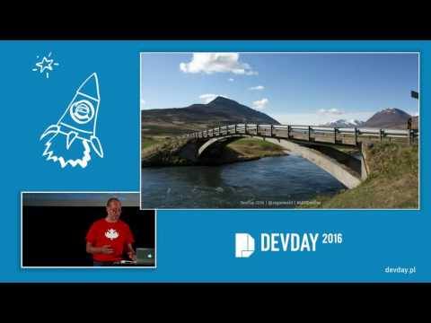

Reginald Braithwaite - Optimism - YouTube

Reginald Braithwaite - Optimism
https://www.youtube.com/watch?v=wYPp4nG7qw4
[Dev Day](https://www.youtube.com/channel/UCSy0eOtiWe6TOQS8y6PpgaQ)
956 views views
Published on Oct 3, 2016

|     |
| --- |
| [(L)](https://www.youtube.com/watch?v=wYPp4nG7qw4) |

Description

"Optimism"

Reginald lives with depression. In this talk he will share Dr. Martin Seligman’s three techniques for reprogramming our brains to think optimistically, and explain how they have helped him feel better, accomplish more, and be a better member of the Ruby community. Whether you have ever struggled with your mood or not, they just might help you change your life.