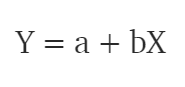
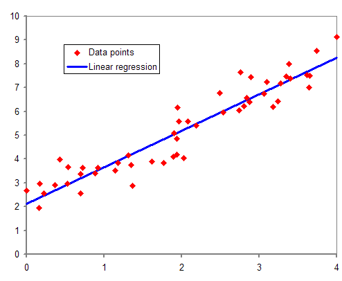
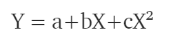
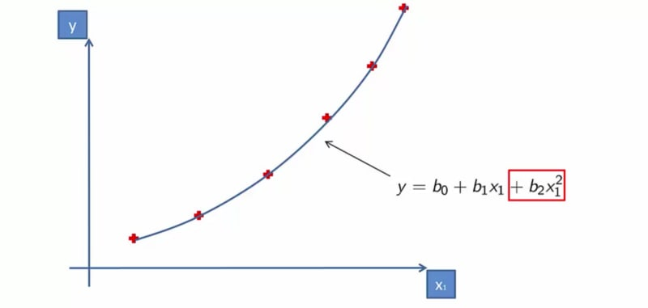
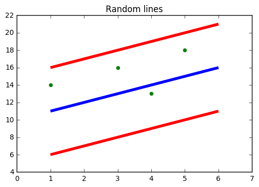
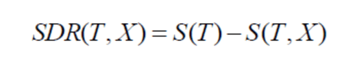

Regression in Machine Learning - Part 2

#  Regression in Machine Learning - Part 2

###     [  Apoorva Dave](https://dev.to/apoorvadave)      [![](data:image/svg+xml,%3csvg xmlns='http://www.w3.org/2000/svg' width='438.549' height='438.549' viewBox='0 0 438.549 438.549' class='icon-img js-evernote-checked' data-evernote-id='161'%3e%3cpath d='M409.132 114.573c-19.608-33.596-46.205-60.194-79.798-79.8C295.736 15.166 259.057 5.365 219.27 5.365c-39.78 0-76.47 9.804-110.062 29.408-33.596 19.605-60.192 46.204-79.8 79.8C9.803 148.168 0 184.853 0 224.63c0 47.78 13.94 90.745 41.827 128.906 27.884 38.164 63.906 64.572 108.063 79.227 5.14.954 8.945.283 11.42-1.996 2.474-2.282 3.71-5.14 3.71-8.562 0-.57-.05-5.708-.144-15.417-.098-9.71-.144-18.18-.144-25.406l-6.567 1.136c-4.187.767-9.47 1.092-15.846 1-6.375-.09-12.992-.757-19.843-2-6.854-1.23-13.23-4.085-19.13-8.558-5.898-4.473-10.085-10.328-12.56-17.556l-2.855-6.57c-1.903-4.374-4.9-9.233-8.992-14.56-4.093-5.33-8.232-8.944-12.42-10.847l-1.998-1.43c-1.332-.952-2.568-2.1-3.71-3.43-1.143-1.33-1.998-2.663-2.57-3.997-.57-1.335-.097-2.43 1.428-3.29 1.525-.858 4.28-1.275 8.28-1.275l5.708.853c3.807.763 8.516 3.042 14.133 6.85 5.615 3.807 10.23 8.755 13.847 14.843 4.38 7.807 9.657 13.755 15.846 17.848 6.184 4.093 12.42 6.136 18.7 6.136 6.28 0 11.703-.476 16.273-1.423 4.565-.95 8.848-2.382 12.847-4.284 1.713-12.758 6.377-22.56 13.988-29.41-10.847-1.14-20.6-2.857-29.263-5.14-8.658-2.286-17.605-5.996-26.835-11.14-9.235-5.137-16.896-11.516-22.985-19.126-6.09-7.614-11.088-17.61-14.987-29.98-3.9-12.373-5.852-26.647-5.852-42.825 0-23.035 7.52-42.637 22.557-58.817-7.044-17.318-6.38-36.732 1.997-58.24 5.52-1.715 13.706-.428 24.554 3.853 10.85 4.284 18.794 7.953 23.84 10.995 5.046 3.04 9.09 5.618 12.135 7.708 17.706-4.947 35.977-7.42 54.82-7.42s37.116 2.473 54.822 7.42l10.85-6.85c7.418-4.57 16.18-8.757 26.26-12.564 10.09-3.806 17.803-4.854 23.135-3.14 8.562 21.51 9.325 40.923 2.28 58.24 15.035 16.18 22.558 35.788 22.558 58.818 0 16.178-1.958 30.497-5.853 42.966-3.9 12.47-8.94 22.457-15.125 29.98-6.19 7.52-13.9 13.85-23.13 18.985-9.233 5.14-18.183 8.85-26.84 11.135-8.663 2.286-18.416 4.004-29.264 5.146 9.894 8.563 14.842 22.078 14.842 40.54v60.237c0 3.422 1.19 6.28 3.572 8.562 2.38 2.278 6.136 2.95 11.276 1.994 44.163-14.653 80.185-41.062 108.068-79.226 27.88-38.16 41.826-81.126 41.826-128.906-.01-39.77-9.818-76.454-29.414-110.05z'%3e%3c/path%3e%3c/svg%3e)](http://github.com/apoorva-dave)  Feb 17  ・4 min read

 [#machinelearning](https://dev.to/t/machinelearning)  [#regression](https://dev.to/t/regression)  [#python](https://dev.to/t/python)  [#beginners](https://dev.to/t/beginners)

Part of "Beginning with Machine Learning" series

 [(L)](https://dev.to/apoorvadave/beginning-with-machine-learning---part-1-pbl)  [(L)](https://dev.to/apoorvadave/regression-in-machine-learning---part-2-30bb)

In our earlier post, we discussed about Machine learning, its types and a few important terminologies. Here we are going to talk about Regression. Regression models are used to predict a continuous value. Predicting prices of a house given the features of house like size, price etc is one of the common examples of Regression. It is a supervised technique (where we have labelled training data).

##   [(L)](https://dev.to/apoorvadave/regression-in-machine-learning---part-2-30bb#types-of-regression) Types of Regression

1. Simple Linear Regression
2. Polynomial Regression
3. Support Vector Regression
4. Decision Tree Regression
5. Random Forest Regression

##   [(L)](https://dev.to/apoorvadave/regression-in-machine-learning---part-2-30bb#simple-linear-regression) Simple Linear Regression

This is one of the most common and interesting types of Regression technique. Here we predict a target variable Y based on the input variable X. A linear relationship exists between the target variable and predictor and so comes the name Linear Regression.

Consider predicting the salary of an employee based on his/her age. We can easily identify, there seems to be a correlation between employee’s age and salary (more the age, more is the salary). The hypothesis of linear regression is

Y represents salary, X is employee’s age and a and b are the coefficients of the equation. So in order to predict Y (salary) given X (age), we need to know the values of a and b (the model’s coefficients).

Linear Regression

*While training and building a regression model, it is these coefficients which are learned and fitted to training data. The aim of training is to find the best fit line such that cost function is minimized. The cost function helps in measuring the error. During the training process, we try to minimize the error between actual and predicted values and thus minimizing the cost function.*

In the figure, the red points are the actual data points and the blue line is the predicted line for this training data. To get the predicted value, these data points are projected on to the line.

**To summarize, our aim is to find such values of coefficients which will minimize the cost function.** The most common cost function is **Mean Squared Error (MSE)** which is equal to the average squared difference between an observation’s actual and predicted values. The coefficient values can be calculated using a Gradient Descent approach which will be discussed in detail in later articles. To give a brief understanding, in Gradient descent we start with some random values of coefficients, compute the gradient of cost function on these values, update the coefficients and calculate the cost function again. This process is repeated until we find a minimum value of cost function.

##   [(L)](https://dev.to/apoorvadave/regression-in-machine-learning---part-2-30bb#polynomial-regression) Polynomial Regression

In polynomial regression, we transform the original features into polynomial features of a given degree and then apply Linear Regression on it. The above linear model Y = a+bX is transformed into something like

It is still a linear model but the curve is now quadratic rather than a line. Scikit-Learn provides PolynomialFeatures class to transform the features.

Polynomial Regression

If we increase the degree to a very high value, the curve becomes overfitted as it learns the noise in the data as well.

##   [(L)](https://dev.to/apoorvadave/regression-in-machine-learning---part-2-30bb#support-vector-regression) Support Vector Regression

In SVR, we identify a hyperplane with maximum margin such that maximum number of data points are within that margin. SVRs are almost similar to the SVM classification algorithm. We will discuss the SVM algorithm in detail in my next article.

Instead of minimizing the error rate as in simple linear regression, we try to fit the error within a certain threshold. Our objective in SVR is to basically consider the points that are within the margin. **Our best fit line is the hyperplane that has the maximum number of points.**

Data points within the boundary line

##   [(L)](https://dev.to/apoorvadave/regression-in-machine-learning---part-2-30bb#decision-tree-regression) Decision Tree Regression

Decision trees can be used for classification as well as regression. In decision trees, at each level we need to identify the splitting attribute. In case of regression, the ID3 algorithm can be used to identify the splitting node by reducing standard deviation (in classification information gain is used).

A decision tree is built by partitioning the data into subsets containing instances with similar values (homogenous). Standard deviation is used to calculate the homogeneity of a numerical sample. If the numerical sample is completely homogeneous, its standard deviation is zero.

The steps for finding splitting node is briefly described as below:
Calculate standard deviation of target variable using below formula.

Standard Deviation

Split the dataset on different attributes and calculate standard deviation for each branch (standard deviation for target and predictor). This value is subtracted from the standard deviation before the split. The result is the standard deviation reduction.

The attribute with the largest standard deviation reduction is chosen as the splitting node.

The dataset is divided based on the values of the selected attribute. This process is run recursively on the non-leaf branches, until all data is processed.

To avoid overfitting, Coefficient of Deviation (CV) is used which decides when to stop branching. Finally the average of each branch is assigned to the related leaf node (in regression mean is taken where as in classification mode of leaf nodes is taken).

##   [(L)](https://dev.to/apoorvadave/regression-in-machine-learning---part-2-30bb#random-forest-regression) Random Forest Regression

Random forest is an ensemble approach where we take into account the predictions of several decision regression trees.

1. Select K random points
2. Identify n where n is the number of decision tree regressors to be created.
3. Repeat step 1 and 2 to create several regression trees.
4. The average of each branch is assigned to leaf node in each decision tree.

5. To predict output for a variable, the average of all the predictions of all decision trees are taken into consideration.

Random Forest prevents overfitting (which is common in decision trees) by creating random subsets of the features and building smaller trees using these subsets.

The above explanation is a brief overview of each regression type. You might have to dig into it to get a clear understanding :) Do feel free to give inputs in the comments. This will help me to learn as well . Thank you for reading my post and if you like it stay tuned for more. Happy Learning

Part of "Beginning with Machine Learning" series

 [(L)](https://dev.to/apoorvadave/beginning-with-machine-learning---part-1-pbl)  [(L)](https://dev.to/apoorvadave/regression-in-machine-learning---part-2-30bb)

Are you new to [dev.to](https://dev.to/)? [Making the most of dev.to](https://dev.to/acoh3n/how-to-make-the-most-out-of-devto-ag0)

 Thanks for stopping by ❤️