Reinforcement learning for complex goals, using TensorFlow

 [AI](https://www.oreilly.com/topics/ai)
                 Follow this topic

# Reinforcement learning for complex goals, using TensorFlow

How to build a class of RL agents using a TensorFlow notebook.

By [Arthur Juliani](https://www.oreilly.com/people/65714-arthur-juliani).
 August 2, 2017

 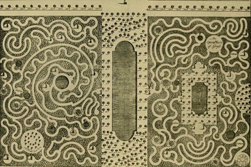

Image from page 206 of "Mazes and labyrinths; a general account of their history and developments" (1922).  (source: [Internet Archive on Flickr](https://www.flickr.com/photos/126377022@N07/14781509471))

Attention readers: We invite you to [access the corresponding Python code and iPython notebooks for this article on GitHub](https://github.com/awjuliani/dfp).

Reinforcement learning (RL) is about training agents to complete tasks. We typically think of this as being able to accomplish some goal. Take, for example, a robot we might want to train to open a door. Reinforcement learning can be used as a framework for teaching the robot to open the door by allowing it to learn from trial and error. But what if we are interested in having our agent solve not just one goal, but a set that might vary over time?

In this article, and the accompanying notebook available on [GitHub](https://github.com/awjuliani/dfp), I am going to introduce and walk through both the traditional reinforcement learning paradigm in machine learning as well as a new and emerging paradigm for extending reinforcement learning to allow for complex goals that vary over time.

I will start by demonstrating how to build a simple [Q-learning](https://en.wikipedia.org/wiki/Q-learning) agent that is guided by a single reward signal to navigate an environment and make deliveries. I will then demonstrate how this simple formulation becomes problematic for more complex behavior we might envision. To allow for greater flexibility, I will then describe how to build a class of reinforcement learning agents, which can optimize for various goals called “direct feature prediction” (DFP). All the code is available in [TensorFlow](https://www.tensorflow.org/) in this [accompanying iPython Jupyter Notebook](https://github.com/awjuliani/dfp).

Get O'Reilly's AI newsletter

 [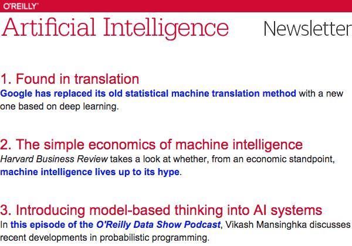](https://www.oreilly.com/ideas/reinforcement-learning-for-complex-goals-using-tensorflow)

[**Tweet](https://twitter.com/intent/tweet?original_referer=https%3A%2F%2Fwww.oreilly.com%2Fideas%2Freinforcement-learning-for-complex-goals-using-tensorflow&ref_src=twsrc%5Etfw&text=Reinforcement%20learning%20for%20complex%20goals%2C%20using%20TensorFlow%20-%20O%27Reilly%20Media&tw_p=tweetbutton&url=https%3A%2F%2Fwww.oreilly.com%2Fideas%2Freinforcement-learning-for-complex-goals-using-tensorflow&via=oreillymedia)

## Q-learning—for the greatest cumulative reward

[Reinforcement learning](https://www.oreilly.com/ideas/reinforcement-learning-explained) involves agents interacting in some environment to maximize obtained rewards over time. This is typically formalized in the following way: an agent receives a state (s)(s) from the environment, and produces an action (a)(a). Given this state and action pair, the environment then provides the agent a new state (s′)(s′) and a reward (r)(r). The reinforcement learning problem is then to discover a mapping from states to actions, which produce the greatest amount of cumulative reward.

One approach to this is called Q-learning, in which we learn a direct mapping between state and action pairs (s,a)(s,a) and value estimations (v)(v). This value estimation should correspond to the discounted expected reward over time from taking action (a)(a) while in state (s)(s). Using the [Bellman equation](https://en.wikipedia.org/wiki/Bellman_equation), we can iteratively update our estimations of Q(s,a)Q(s,a) for all possible state action pairs. This capacity to iteratively update the Q-value comes from the following property of an optimal Q-function:

Q∗(s,a)=r+γmaxa′Q(s′,a′)Q∗(s,a)=r+γmaxa′Q(s′,a′)

The above means that the current Q-value for a given state and action can be decomposed into the current reward plus the discounted expected future reward in the next state. By collecting experiences, we can train a neural network to predict more accurate Q-values over time, and by taking actions that optimize the expected value, we can then, ideally, obtain the greatest cumulative reward possible from the environment. Using a universal function approximator such as a neural network, we can generalize our Q-estimation to unseen states, allowing us to learn Q-functions for arbitrarily large state spaces.

## Delivery drone scenario for goal-based RL

Q-learning and other traditionally formulated reinforcement learning algorithms learn a single reward signal, and as such, can only pursue a single “goal” at a time. Take, for example, a situation in which we would like a drone to learn to deliver packages to various locations around a city. This “delivery drone” scenario will be our guiding paradigm in the discussion of goal-based RL going forward.

In this environment, the agent occupies a position in a 5x5 grid, and the delivery destination occupies another position. The agent can move in any of four directions (up, down, left, right). If we want our drone to learn to deliver packages, we simply provide a positive reward of +1 for successfully flying to a marked location and making a delivery.

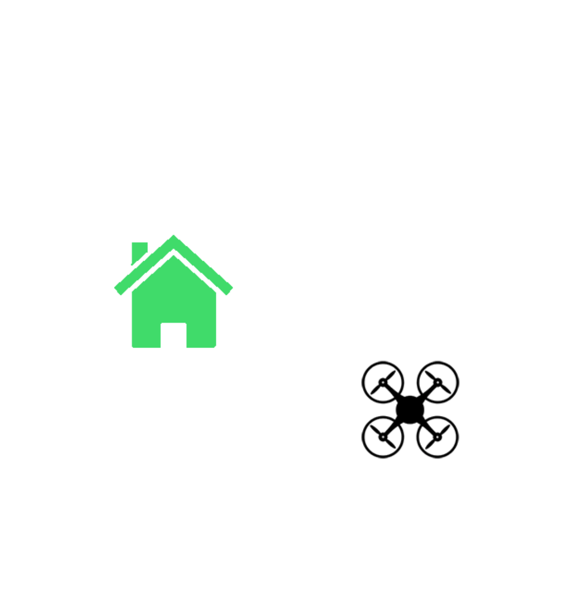

Figure 1. Rendering of simple drone delivery environment. Credit: Arthur Juliani.

While the rendering in Figure 1 will be used to give an intuition of what our agent is learning, we will use an even simpler state representation, a 5x5 grid, of RGB pixels (75 values in total) to represent the environment. This will speed up the learning process from hours to minutes on a modern desktop computer. Each episode will last 100 steps, and the agent and delivery locations will be randomized at the beginning of each episode.

#### Safari

 [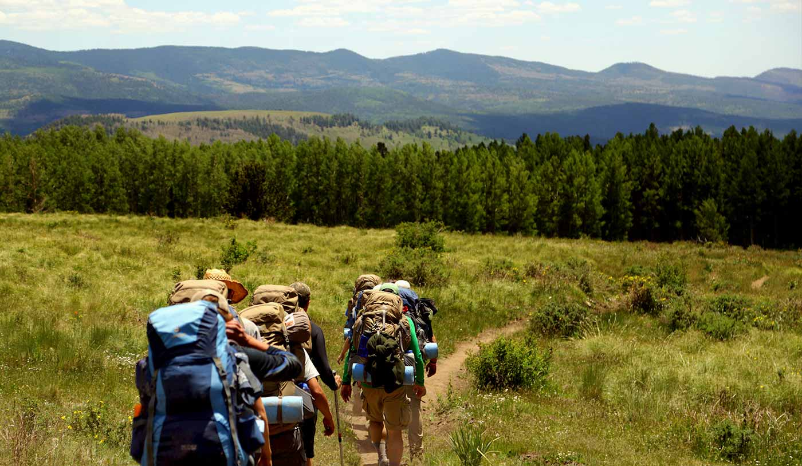](https://www.safaribooksonline.com/home/?utm_source=newsite&utm_medium=content&utm_campaign=lgen&utm_content=ai-post-safari-right-rail-cta)

## [Learn faster. Dig deeper. See farther.](https://www.safaribooksonline.com/home/?utm_source=newsite&utm_medium=content&utm_campaign=lgen&utm_content=ai-post-safari-right-rail-cta)

Join Safari. Get a free trial today and find answers on the fly, or master something new and useful.

 [Learn more](https://www.safaribooksonline.com/home/?utm_source=newsite&utm_medium=content&utm_campaign=lgen&utm_content=ai-post-safari-right-rail-cta)

## Q-learning with TensorFlow

The TensorFlow implementation of Q-learning shown below is an asynchronous version of the algorithm, which allows for multiple agents to work in parallel to learn a policy. This both speeds up and increases the robustness of the training process. This implementation is in the Jupyter Notebook [here](https://github.com/awjuliani/dfp/blob/master/Async-Q.ipynb).

Training on a machine with four workers, after 6,000 training episodes per worker, we end up with a performance curve that should look something like the graph in Figure 2. Our agent can consistently deliver about 20 packages per episode. This can be considered something close to the optimal number of deliveries possible within 100 steps, given the size of the environment. For an animated version, [look here](http://awjuliani.github.io/q.gif).

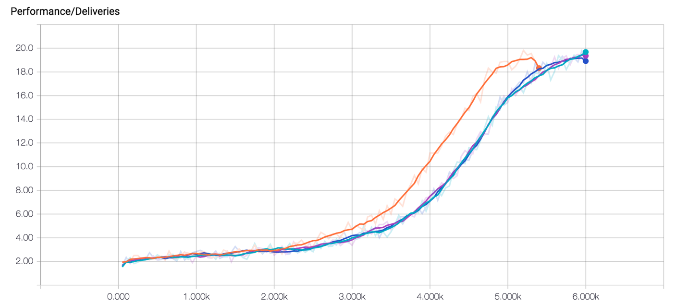

Figure 2. Performance curve, after training on machine with four workers and 6,000 training episodes per worker. Credit: Arthur Juliani.

## Direct feature prediction

A real-world drone wouldn’t be able to endlessly deliver packages. It would likely have a limited battery capacity and would need to be occasionally re-charged. With every movement, the agent’s battery charge will decrease slightly. With this finite battery capacity, running out of a charge means falling out of the sky and no longer being able to deliver packages—and no more packages means no more reward.

We can augment the environment with a location our agent can fly toward to recharge its battery. Now all the agent needs to do is to learn to fly to the recharge station when the battery is low and otherwise deliver packages as normal.

## Creating an optimal reward function

Given enough time, and the correct hyperparameter tuning, the Q-learning algorithm could eventually discover that recharging the battery is beneficial to delivering more packages in the long-term. This involves learning to take a complex series of actions for no immediate reward, in the understanding that a greater reward will come later. In this case, it is a tempting option to augment the reward signal to encourage battery-rewarding behavior. A naïve approach might be to provide a reward (say +0.5) for flying to the specified location to recharge the battery. What our agent will learn in this situation, however, is to simply always fly to the recharge station, since there is a guaranteed reward every time it charges itself. What we run into now is the problem of coming up with a reward function that describes the kind of behavior we believe to be optimal. While this is simple for some problems, there are often unintended consequences of posing the reward function incorrectly. For some examples, see this recent OpenAI article, “[Faulty Reward Functions](https://openai.com/blog/faulty-reward-functions/).”

## Changing the goal

If we want to avoid the pitfalls of bad reward engineering, we need a more intuitive way to convey the structure of the task to our agent. It turns out that by providing our agent with an explicit goal that can vary based on both the episode and specific moment, we are better able to get the kinds of dynamic behaviors we want. In the case of the battery, we can simply change the goal from “deliver packages” to “recharge battery” once the battery is below a certain capacity. In this way, we don’t have to worry about reward formulation, and the neural network can just focus on learning the environment dynamics themselves.

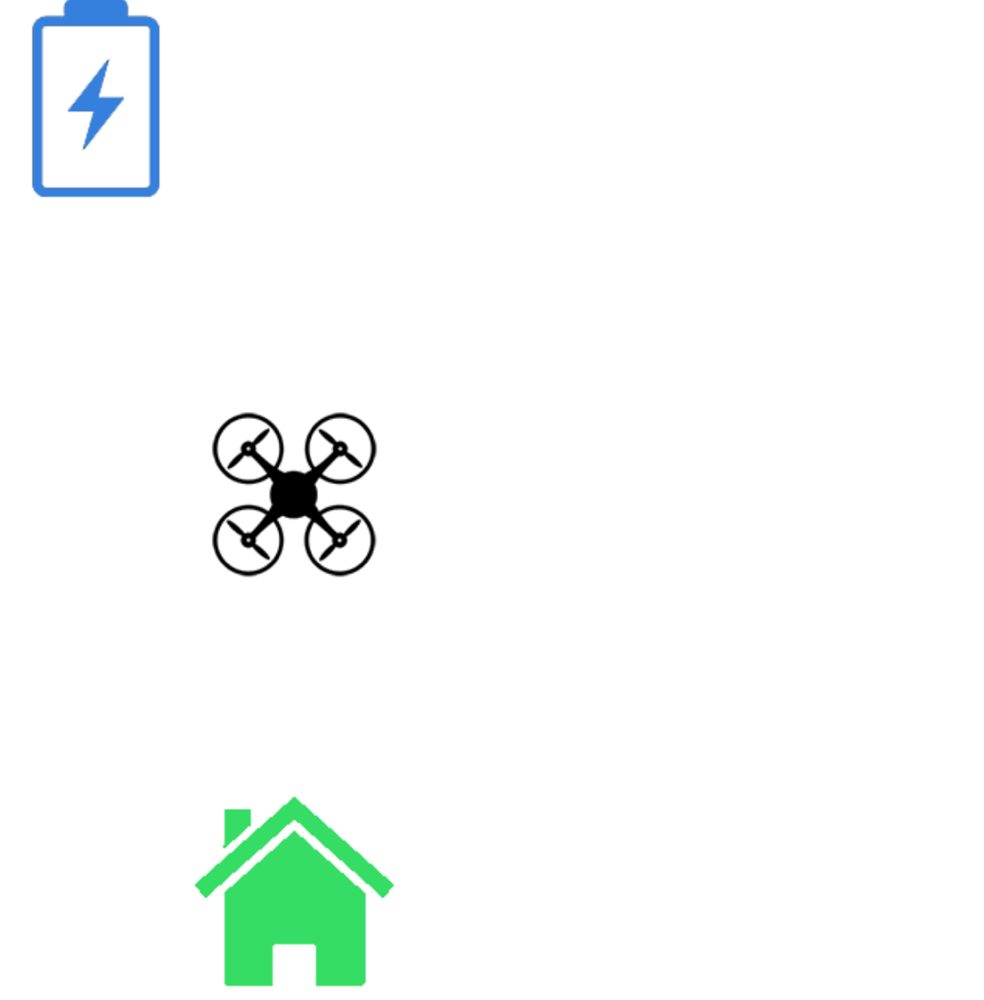
Figure 3. Drone delivery environment with battery. Credit: Arthur Juliani.

## Formalizing goal-seeking

To make this concept usable, we need to make the description above a little more formal. There are multiple ways to formalize goal-seeking in RL; the one I will be following is from a recently introduced paper that was presented at this year’s [International Conference on Learning Representations](http://www.iclr.cc/doku.php?id=ICLR2017:main&redirect=1). The paper is called “[*Learning to Act by Predicting the Future*](https://arxiv.org/pdf/1611.01779.pdf),” and that is just what we will be training our agent to do!

First, a slight disclaimer that the model presented here won’t be a direct implementation of what the authors, Alexey Dosovitskiy and Vladlen Koltun, describe in their paper. In the paper, they refer to their network as “direct feature prediction” (DFP). We will be making something more akin to a DFP-lite. I have adjusted a few elements to make them more intuitive for the simple example discussed in this article.

In the original paper, the authors train their agent to play the first-person shooter game “Doom” competitively, something very impressive but more complex than the scope of this introduction.

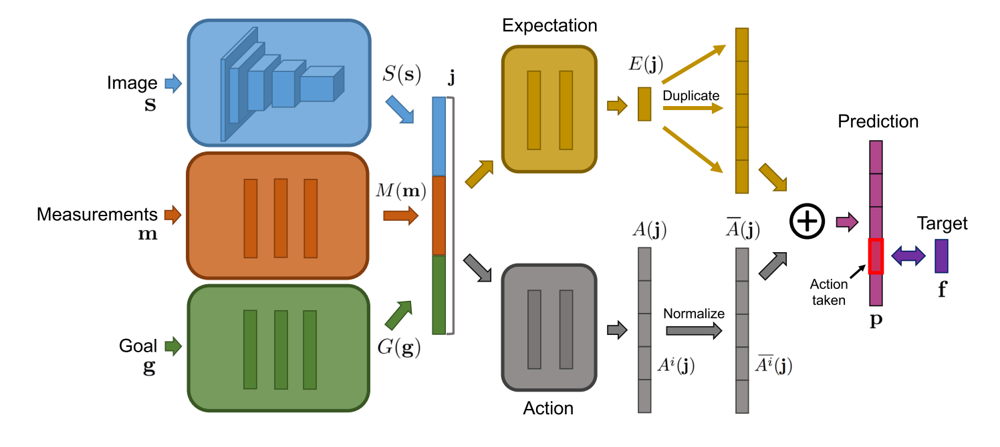

Figure 4. Diagram of a “direct feature prediction” network from [Dosovitskiy and Koltun (2016)](https://arxiv.org/pdf/1611.01779.pdf), used with permission.

Instead of training our agent to map a state (s)(s) to a Q-value estimate Q(s,a)Q(s,a) and then receive a reward (r)(r) from the environment, we maintain a set of measurements (m)(m) and goals (g)(g) in addition to our state (s)(s), and train the network to predict the future changes in measurements (f)(f) for each action (a)(a).

## Training our network to predict the expected future

In our delivery-drone scenario, the two measurements we will maintain are battery charge and number of packages delivered. Instead of predicting a value function like in Q-learning, we train our network to predict the expected future changes in battery and deliveries at 1, 2, 4, 8, 16, and 32 steps into the future. Formally this can be written as:

f=<mT1–m0,mT2–m0…mTn–m0>f=<mT1–m0,mT2–m0…mTn–m0>
Where T is our list of temporal offsets, [1, 2, 4, ...etc.].

In this paradigm, there are no longer explicit rewards; instead, success is measured by how well the goals and measurements align. In the case of the delivery drone, this would mean maximizing deliveries and ensuring the battery is charged when low.

If our agent were perfect at predicting the future measurements for each of these actions, we would simply need to take the action that optimized the measurements we were interested in. Our goals allow us to specify which measurements we care about at any given time.

## Formulating more complex goals

Since we aren’t simply predicting a single scalar value estimate like in Q-learning, we can formulate more complex goals. Imagine that we have a measurement vector [battery, deliveries]. If we want to maximize battery charge but ignore deliveries, then our goal would be [1 , 0], which would correspond to desiring a positive battery measurement in the future and indifference to the number of deliveries.

If we wanted to maximize deliveries, our goal would be [0, 1]. Since we (rather than the environment or the network itself) formulate the goal, we are free to change it at every time-step as we see fit. In this way, we can explicitly change the goal from optimizing deliveries to optimizing the battery, whenever the battery measurement drops below a certain threshold (in our case, 30% charge). By combining goals and measurement in this way, we now can flexibly adjust our agent’s behavior on the fly, depending on the desire of the human operator. This is in contrast to Q-learning, where the Q-values would remain fixed after training, and only a single behavior pattern would be possible.

This new formulation changes our neural network in several ways. Instead of just a state, we will also provide as input to the network the current measurements and goal. Instead of Q-values, our network will now output a prediction tensor of the form [Measurements X Actions X Offsets]. Taking the product of the summed predicted future changes and our goals, we can pick actions that best satisfy our goals over time:

a=gT∗∑p(s,m,g)a=gT∗∑p(s,m,g)

Where ∑p(s,m,g)∑p(s,m,g) is the output of the network summed over future timesteps, and is the transpose of the goal vector.

We can train this new kind of agent using a simple regression loss to predict the true measurement changes into the future:

Loss=∑[P(s,m,g,a)−f(m)]2Loss=∑[P(s,m,g,a)−f(m)]2

Where P(s,m,g,a)P(s,m,g,a) refers to the output of the network for the chosen action .

When we put all this together, we have an agent that can skillfully navigate our package delivery scenario, all the while maintaining a charged battery. We will again be using an asynchronous implementation in TensorFlow and the notebook with the model that is available [here](https://github.com/awjuliani/dfp/blob/master/DFP.ipynb).

## Asynchronous implementation in TensorFlow

After 10,000 episodes of training per worker (with four workers), we end up with training curves like those in Figure 5. The agent has learned to keep its battery charged (as indicated by average episode length approaching 100 steps) as well as to deliver the near-optimal number of packages within a single episode. [Click here for an animated version](http://awjuliani.github.io/dfp.gif).

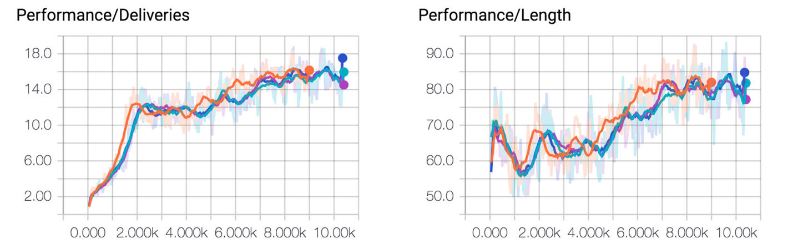

Figure 5. Number of deliveries (left) and steps in each episode (right) over time, as measured in episodes. Credit: Arthur Juliani.

It is best to keep in mind that the environment provided here is a greatly simplified version of what might exist in a real-world scenario. A grid-world was used to allow the network to train in a reasonable time to demonstrate goal learning. A real-world drone would likely utilize smooth, continuous control in what is obviously a more visually complex world.

## Advancing this technique

If you have access to more powerful computing resources, I encourage you to try the technique with more complex environments, such as those provided by the [OpenAI universe](https://universe.openai.com/). A simple change that could be made is to provide a better encoder for the visual stream by using convolutional layers instead of the fully connected ones used here. The basic architecture, however, should be extensible.

I hope this tutorial has provided an insight into the kinds of problems that reinforcement learning can solve and the benefits that can come from reformulating tasks in new contexts. The multi-goal approach described here may not be the best for all situations, but it provides another possible avenue for designing agents to solve complex tasks in the world.

*This post is a collaboration between O'Reilly and *[*TensorFlow*](https://www.tensorflow.org/)*. *[*See our statement of editorial independence*](http://www.oreilly.com/about/editorial_independence.html)*.*

Article image: Image from page 206 of "Mazes and labyrinths; a general account of their history and developments" (1922).  (source: [Internet Archive on Flickr](https://www.flickr.com/photos/126377022@N07/14781509471)).

Tags: [All About TensorFlow.](https://www.oreilly.com/tags/all-about-tensorflow)

Share

1.   [**Tweet](https://twitter.com/intent/tweet?original_referer=https%3A%2F%2Fwww.oreilly.com%2Fideas%2Freinforcement-learning-for-complex-goals-using-tensorflow&ref_src=twsrc%5Etfw&text=Reinforcement%20learning%20for%20complex%20goals%2C%20using%20TensorFlow%20-%20O%27Reilly%20Media&tw_p=tweetbutton&url=https%3A%2F%2Fwww.oreilly.com%2Fideas%2Freinforcement-learning-for-complex-goals-using-tensorflow&via=oreillymedia)

2.

[(L)](https://www.facebook.com/sharer/sharer.php?kid_directed_site=0&sdk=joey&u=https%3A%2F%2Fwww.oreilly.com%2Fideas%2Freinforcement-learning-for-complex-goals-using-tensorflow&display=popup&ref=plugin&src=share_button)

3. [inShare.](#)185

* * *

##   [Arthur Juliani](https://www.oreilly.com/people/65714-arthur-juliani)

Arthur Juliani is a researcher working at the intersection of Cognitive Neuroscience and Deep Learning. He is currently obtaining his Phd from the University of Oregon.

 [more](https://www.oreilly.com/people/65714-arthur-juliani)

* * *

 [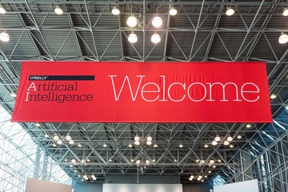](https://www.oreilly.com/ideas/keynotes-from-ai-new-york-2016)

 [AI](https://www.oreilly.com/topics/ai)

##   [Highlights from the O'Reilly AI Conference in New York 2016](https://www.oreilly.com/ideas/keynotes-from-ai-new-york-2016)

By [Mac Slocum](https://www.oreilly.com/people/0d2c1-mac-slocum).

Watch highlights covering artificial intelligence, machine learning, intelligence engineering, and more. From the O'Reilly AI Conference in New York 2016.

 Video

 [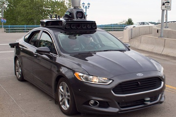](https://www.oreilly.com/ideas/how-ai-is-propelling-driverless-cars-the-future-of-surface-transport)

 [AI](https://www.oreilly.com/topics/ai)

##   [How AI is propelling driverless cars, the future of surface transport](https://www.oreilly.com/ideas/how-ai-is-propelling-driverless-cars-the-future-of-surface-transport)

By [Shahin Farshchi](https://www.oreilly.com/people/c7521-shahin-farshchi).

Shahin Farshchi examines role artificial intelligence will play in driverless cars.

 

 [AI](https://www.oreilly.com/topics/ai)

##   [Untapped opportunities in AI](https://www.oreilly.com/ideas/untapped-opportunities-in-ai)

By [Beau Cronin](https://www.oreilly.com/people/89289-beau-cronin).

Some of AI's viable approaches lie outside the organizational boundaries of Google and other large Internet companies.

 [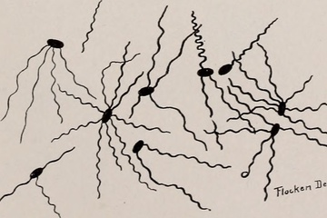](https://www.oreilly.com/ideas/small-brains-big-data)

 [AI](https://www.oreilly.com/topics/ai)

##   [Small brains, big data](https://www.oreilly.com/ideas/small-brains-big-data)

By [Jeremy Freeman](https://www.oreilly.com/people/476ef-jeremey-freeman).

How neuroscience is benefiting from distributed computing, and how computing might learn from neuroscience.