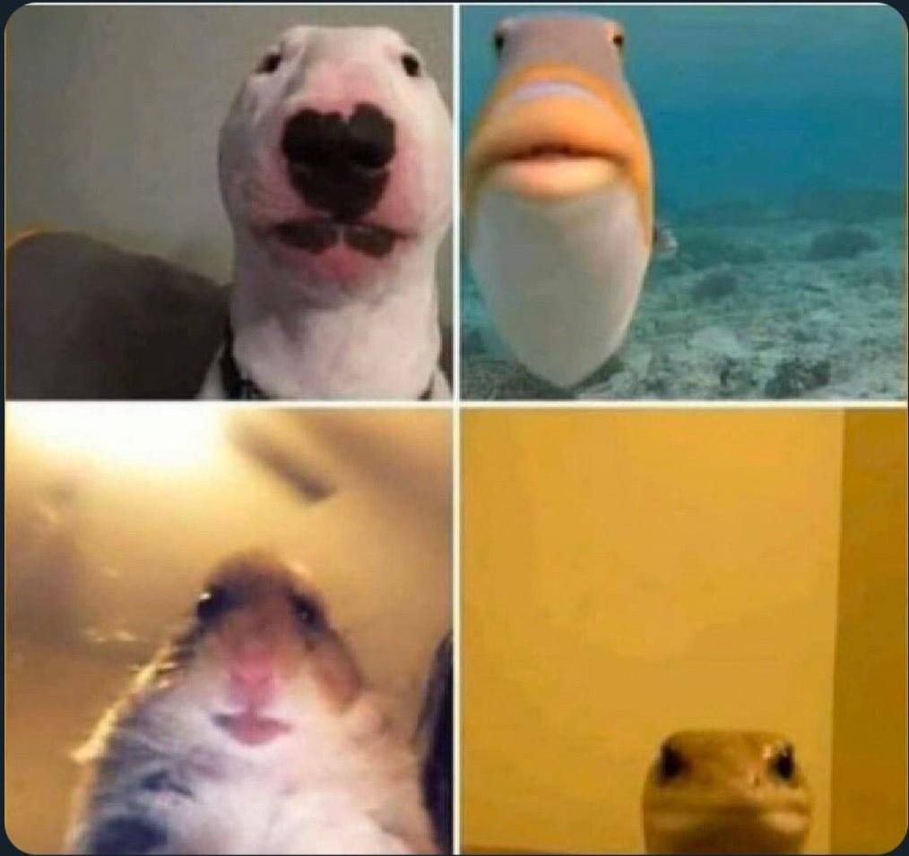
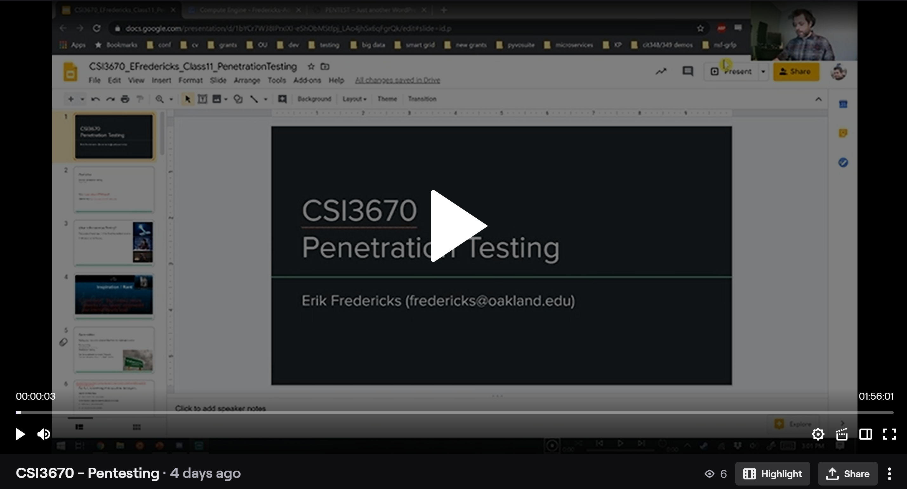
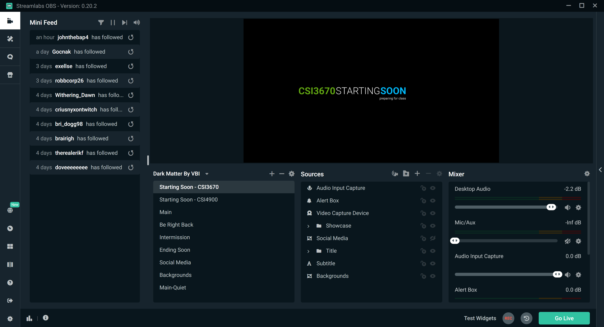
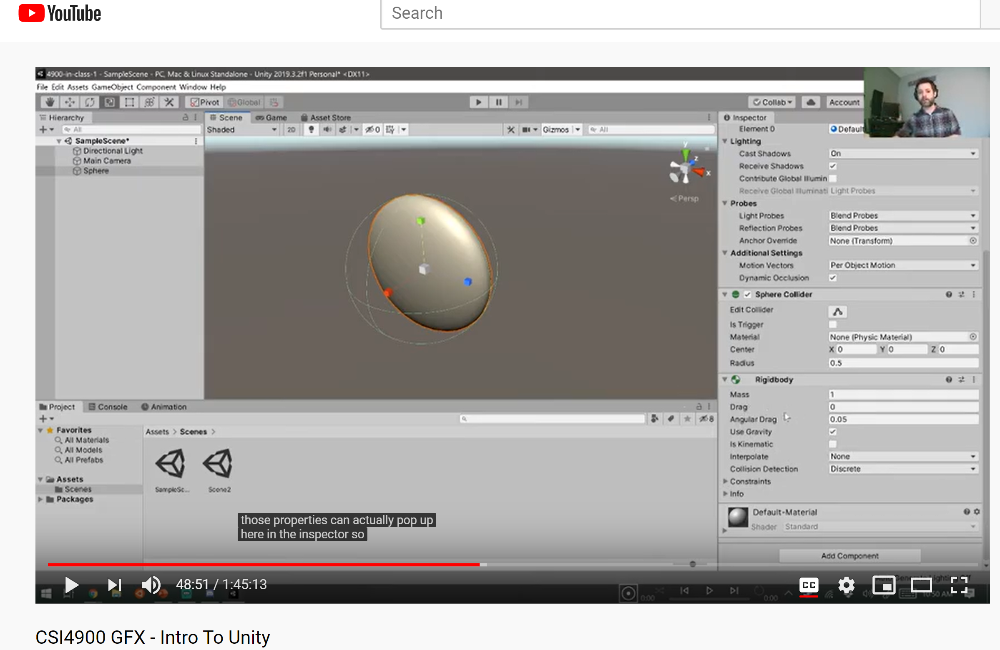
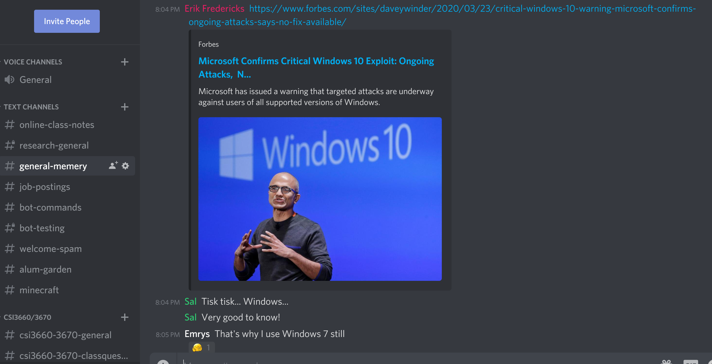

Remote teaching with Twitch, Discord, and YouTube – erik fredericks

# Remote teaching with Twitch, Discord, and YouTube

Posted on [March 24](http://efredericks.net/2020/03/24/remote-teaching-with-twitch-discord-and-youtube/) by [Erik Fredericks](http://efredericks.net/author/erik/)

*Editor’s (me) note: I am not sponsored or getting paid by any of the services mentioned here.*

I find it interesting that my first blog post to this website is a “guide” of sorts of my workflow for teaching in the time of a global emergency, but here we are.  Really, this is intended for two purposes:

1. To provide an overview of *one* way of handling online teaching that is somewhat different than the standard WebEx/Zoom/Meet class.

2. To provide me a reminder of how I did this in the future when I’ve completely forgotten how it all works.

When the COVID-19 pandemic started making its way around the globe, I’m sure we (as teachers) all realized that we would need to provide remote learning.  Many of us (myself included) *had never run an online course before*, much less presented ourselves in video format.  That’s somewhat of a scary concept if you’re not prepared.

I sure wasn’t.  But, I’ve participated in enough WebEx meetings in my former engineering life to realize that it wasn’t going to work for me.  *Keep in mind, this is what works for me*.  Every class is going to be different.  Every class has its own requirements, its own needs, really its own life.  They each need to be treated differently and presented differently.

All of us on Zoom

For reference, the majority of my classes are designed with an aim for a reasonable split between theoretical and practical efforts.  There is a decent amount of dry lecturing with enough cynicism and dry humor to make it all worthwhile, coupled with hands-on work to hopefully make the concepts stick.  Some students love it, some hate it.  Such is life.

Regardless, for me, moving to online hasn’t been all that bad.  It serves my classes well.  Note however that I teach Computer Science / Information Technology concepts, so real-world hardware is not a major concern for me.  At least, not this semester.  If this had struck in the Fall, I’d be trying to teach students about how to work with Raspberry Pis, so that may have changed things.  ([Rob Parke at USC](https://sites.usc.edu/parke/) runs an excellent website detailing his teaching strategies, and I’m looking forward to his inevitable post about remotely teaching with microcomputers and wiring up really neat projects).

*Point of note: I’m not going to be debugging everybody’s setup in the comments.  If you have issues with a particular technology, please study the plethora of documentation available on the net.*

Enough blathering, here is my workflow:
**Class:**
1. Livestream my lecture via Twitch.tv
2. Interact with students via:

    1. *Twitch chat*: a live feed of student comments pops up on my second monitor (in the streaming software)

    2. *Discord voice*: students that would prefer to use their voice can talk to me directly via my Discord server that has been setup for students in my classes

3. Upload recorded stream to YouTube
4. Publish link to YouTube video to my course webpage (we use Moodle)
**Lab:**

1. Livestream (via Twitch) me working through the lab manual, fielding questions as I go

2. Remain in my Discord voice channel to continue supporting students as they work through the lab

    1. At this point, I will generally end the Twitch stream, as an hour and a half of dead air is (to me) not all that interesting

**Office Hours:**

1. Join my Discord voice channel and generally be available online for my students

Clearly, this workflow revolves around the use of several technologies, all of which are **free** to use (at least, as of now).   Let’s break them down:

**Livestreaming class – [Twitch.tv](https://twitch.tv/)**

This is a streaming platform predominantly used by gamers to enable anybody to stream from home.  Like any platform, there are massive success stories and failures.  It was actually suggested to me by one of my students, and I thought.  And thought.  And thought.  And it is a perfect platform for teaching online.

Paused video of pentesting lecture

The video above is what students see.  They see me running through my slides, a little video of me in the corner expounding and flapping my arms around, and most importantly, class continues on much as it had before.  This is what I see though:

Streamlabs OBS – Pre-stream

The image above is prior to clicking “Go Live.”  What I do see though after going live is a view of what is being broadcast to the world, plus a window that students will send messages to me in.  Effectively, it becomes a way for me to get videos out on the web during class time, and a chat client for them to ask me questions.

I’ve also added (with the help of some more Twitch-savvy students) a special command that will pop up an animation and play a sound to really catch my attention, if I’m lecturing.  The student would just write that command in chat, and I would get my attention ripped away from the slide so that I can field whatever question there is.  *Keep in mind that you should always repeat the question, as Twitch messages aren’t logged by default to the video stream (it’s possible to setup, but I haven’t as of yet).*  For the deeper technical side, it is: `redeem raisehand`, which is set in such a way that students can use it for free (other steams can use the `redeem` command as a way of rewarding members, or having them pay for the use of the command — this is an educational stream and therefore I don’t allow any donations/bits/etc. to be used).

One other thing is that middle-bottom window.  The one with `Starting Soon - CSI3670` and the like.  Whichever option is selected is what is presented to your stream.  So I have a ‘Starting Soon’ stream for each class, a “live” feed (`Main`) that broadcasts my main display, and several other options to choose from.  Once you click ‘Go Live’ (and `REC` to make sure your stream is saved locally!), your stream will start.

Getting lost?  I am, while writing this up.  It is quite simple, at least on Windows.  I don’t have a Mac or Linux box handy at the moment, but my understanding is you can use OBS and hook that up to Twitch.  Streamlabs makes it exceedingly simple however.

1. Get a Twitch.tv account and have your students sign up for Twitch accounts if they want to chat with you on there (they don’t need one to view the stream)

2. Get streaming software that can broadcast to Twitch, setup your streaming page to your liking, and manage everything on your end

3. Make sure that students have other means of interacting with you while streaming.  I use Discord for all my classroom chats (others use Slack in a similar fashion), and will listen into a `Voice` channel for students to ask questions while I’m streaming

4. Publish the stream to a location that will retain your video that can be shared with the class, for instance if students want to rewatch it, or if they missed the class.  Note that Twitch will retain the stream for a maximum of **two weeks** (if you are unaffiliated, which I am — meaning I don’t get paid by Twitch for this).

I’m probably missing a multitude of features and things I do to get a stream up.  But, at minimum, it is a very simple and easy process.  I personally tried out Panopto, WebEx, Meets, and Zoom, and none of them have been to my liking.  Again, if they work for you that is wonderful, keep using them!  The goal here is to have a successful class session, not to be pedantic about what software to use.

**Videos on Demand (VOD) – YouTube**

YouTube is the current juggernaut of internet videos.  Other than using it to show off all the amazing videos out there that can support my classes, I use it as a repository for students after the streams are done.  I’ll take the video from Streamlabs (providing I remembered to hit `REC`, if not I’ll need to download it from Twitch), upload it to my class playlist, and then simply paste the link into my Moodle page.

There’s also this lovely little `CC` option on all videos.  YouTube will try to automatically transcribe my words, and it does a decent job!

YouTube VOD with Closed Captioning

Easy peasy.  I don’t worry about this one too much personally, as I just want to make sure the video will be there in case if a student had real-life things to deal with and couldn’t make class.

**Class Interaction – [Discord](https://discord.app/)**

Spoiler warning.  I love Discord.  I use it for both personal and professional things.  I interact with members of various communities, open-source movements, and yes, even students, in various Discord servers.  I’ve even written bots for it to either interact with Reddit, post homework assignments, and the like.  Very neat platform!

Anyway, I setup a Discord server for class a few years back as a result of being very frustrated with Moodle’s methods for class interaction.

Class Discord

This is a snapshot of my server with some of the various channels I’ve created.  ***If you’re reading this Dr. Terwilliger — this is a direct result of you setting up twigforums* back in the 2000’s**.  There are channels for students to post random memes, job postings that might interest others in my classes, and so on.  More importantly, there are class-specific channels (`CSI3660/3670` for instance at the bottom) and the `General` voice channel at the top.  I don’t ever kick out former students either, and sometimes they’ll come back and chat with my current students.  I also have observed students helping each other out in the channels, and honestly, that is very wonderful to see as faculty.

To the point of streaming/office hours, I will join the Voice channel.  Any other student can join this channel and talk directly to me, as though we were on a voice conference.  On this particular channel I’ve enforced push-to-talk, so students must press a combination of keys to trigger their mic (no live mics enforced is a lovely thing when streaming audio).

—

Now, there are a plethora of teachers out there who have already taught fully-online classes, and I’m sure that many of you will grimace reading through this.  I’m always happy to keep learning, and if there is something that can be improved, please let me know!  I’m sure online classes are still in my future once we get through this current state of affairs, so any good constructive criticism is welcome.

Thanks, and good luck to all!

    Posted in [teaching](http://efredericks.net/category/teaching/)     |   [4 Comments](http://efredericks.net/2020/03/24/remote-teaching-with-twitch-discord-and-youtube/#comments)