Reviewing Python Visualization Packages – Towards Data Science

# Reviewing Python Visualization Packages

## Which solutions are good in which situations?

[Aaron Frederick](https://towardsdatascience.com/@frederickaarond)

Apr 11·7 min read

There are so many ways to create a graph using Python, but which way is *best*? When we make visualizations, it is important to ask some questions as to the figure’s objective: Are you trying to get an initial feel for how your data looks? Maybe you are trying to impress someone at a presentation? Perhaps you want to show someone a figure internally and want a middle-of-the-road figure? In this post, I will be walking through a number of popular Python visualization packages, their pros and cons, and situations where they can each shine. I will scope this review to 2D plots, leaving room for 3D figures and dashboards for another time, though many of these packages support both quite well.

* * *

*...*

### Matplotlib, Seaborn, and Pandas:

I’m going to group these together for a few reasons, first of which being that Seaborn and Pandas plotting were built on top of Matplotlib — when you use Seaborn or df.plot() in Pandas, you are actually utilizing code that people have written using Matplotlib. The resulting aesthetic from each of these is therefore similar and the ways of customizing your plots will use eerily similar syntax.

When I think of these visualization tools, I think of 3 words: Exploratory Data Analysis. These packages are fantastic for getting a first look at your data but lack when it comes to presentation. Matplotlib is a low-level library that allows for incredible levels of customization (so don’t simply rule it out for presentation!), but there are many other tools that make great presentation-worthy graphics much easier. Matplotlib also has a set of [style selections](https://matplotlib.org/users/style_sheets.html) which emulate other popular aesthetics like ggplot2 and xkcd. Below are some examples of graphs made using Matplotlib and its cousins:

When working with basketball salary data, I wanted to find the teams that had the highest median salary data. In order to show that, I color-coded a bar graph with each team’s salary below to show which teams players should appeal to in order to be on a team that pays well.

|     |     |
| --- | --- |
| 1   | import seaborn as sns |
| 2   | import matplotlib.pyplot as plt |
| 3   |     |
| 4   | color_order = ['xkcd:cerulean', 'xkcd:ocean', |
| 5   |  'xkcd:black','xkcd:royal purple', |
| 6   |  'xkcd:royal purple', 'xkcd:navy blue', |
| 7   |  'xkcd:powder blue', 'xkcd:light maroon', |
| 8   |  'xkcd:lightish blue','xkcd:navy'] |
| 9   |     |
| 10  | sns.barplot(x=top10.Team, |
| 11  |  y=top10.Salary, |
| 12  |  palette=color_order).set_title('Teams with Highest Median Salary') |
| 13  |     |
| 14  | plt.ticklabel_format(style='sci', axis='y', scilimits=(0,0)) |

 [view raw](https://gist.github.com/aaronfrederick/b8e8ac75bfa6be068a4a4d59b429186a/raw/a9e582637484eaf7311b29357c0e8a766c48baeb/plt1.py)  [plt1.py](https://gist.github.com/aaronfrederick/b8e8ac75bfa6be068a4a4d59b429186a#file-plt1-py) hosted with ❤ by [GitHub](https://github.com/)

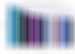

This second plot is a Q-Q plot of the residuals of a regression experiment. The main purpose of this visualization is to show how few lines are necessary to make a useful visualization, even if the aesthetics are not eye-popping.

|     |     |
| --- | --- |
| 1   | import matplotlib.pyplot as plt |
| 2   | import scipy.stats as stats |
| 3   |     |
| 4   | #model2 is a regression model |
| 5   | log_resid = model2.predict(X_test)-y_test |
| 6   | stats.probplot(log_resid, dist="norm", plot=plt) |
| 7   | plt.title("Normal Q-Q plot") |
| 8   | plt.show() |

 [view raw](https://gist.github.com/aaronfrederick/7ecbfd7ecc7e4285a621a0736aadd074/raw/d0b538c5507f06ef5635607d355aeba50d0b166c/plt2.py)  [plt2.py](https://gist.github.com/aaronfrederick/7ecbfd7ecc7e4285a621a0736aadd074#file-plt2-py) hosted with ❤ by [GitHub](https://github.com/)

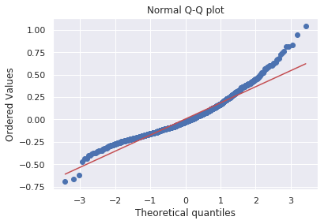

Ultimately, Matplotlib and its relatives are very efficient, but typically not the final product as far as a presentation goes.

### ggplot(2):

I groaned as I wrote that. “Aaron, why are you talking about ggplot, the most popular R visualization package? Isn’t this a Python package review?” you may ask. Developers implemented ggplot2 in Python, replicating everything from the aesthetics to syntax. From all of the material I have seen, it looks and feels like ggplot2, but with the added bonus of having dependencies on the Pandas Python package, which recently deprecated some methods resulting in the irrelevance of the Python version of ggplot. If you want to use the REAL ggplot in R(which has all of the same looks, feels, and syntax without the dependencies), [I talk through some of its perks here](https://towardsdatascience.com/how-to-transfer-sql-knowledge-to-r-e9ec951f33dc)! That said, if you truly must use ggplot in Python, you must install Pandas version 0.19.2, but I would caution against downgrading your Pandas so that you can use an inferior plotting package.

What makes ggplot2 (and ggplot for Python, I guess) game-changing is that they use the “Grammar of Graphics” to construct a figure. The basic premise is that you can instantiate your plot and then add different features to it separately, i.e. the title, axes, data points, and trendline are all added separately with their own aesthetic properties. A simple example of some ggplot code follows is below. First we instantiate our figure with ggplot, set our aesthetics and data, then add points, a theme, and axis/title labels.

|     |     |
| --- | --- |
| 1   | #All Salaries |
| 2   | ggplot(data=df, aes(x=season_start, y=salary, colour=team)) + |
| 3   | geom_point() + |
| 4   | theme(legend.position="none") + |
| 5   | labs(title  =  'Salary Over Time', x='Year', y='Salary ($)') |

 [view raw](https://gist.github.com/aaronfrederick/1bbf0b37d7f22368a0e43c77cd4fe80f/raw/089901eec59456a4c1866ec6c3ae6334745b5534/all_salaries.R)  [all_salaries.R](https://gist.github.com/aaronfrederick/1bbf0b37d7f22368a0e43c77cd4fe80f#file-all_salaries-r) hosted with ❤ by [GitHub](https://github.com/)

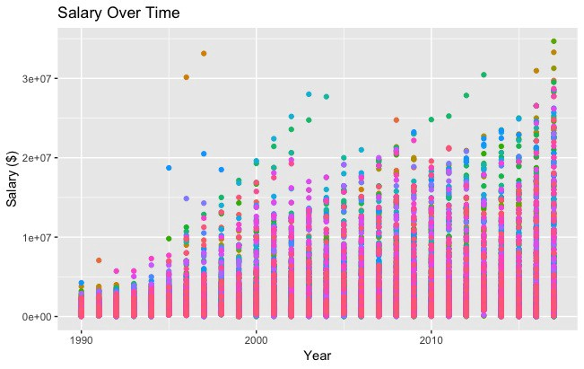

### Bokeh:

Bokeh is beautiful. Conceptually similar to ggplot in how it uses the grammar of graphics to structure its figures, Bokeh has an easy-to-use interface that makes very professional graphs and dashboards. To *illustrate* my point (sorry!), below is a sample of code to make a histogram from the 538 Masculinity Survey dataset.

|     |     |
| --- | --- |
| 1   | import pandas as pd |
| 2   | from bokeh.plotting import figure |
| 3   | from bokeh.io import show |
| 4   |     |
| 5   | # is_masc is a one-hot encoded dataframe of responses to the question: |
| 6   | # "Do you identify as masculine?" |
| 7   |     |
| 8   | #Dataframe Prep |
| 9   | counts = is_masc.sum() |
| 10  | resps = is_masc.columns |
| 11  |     |
| 12  | #Bokeh |
| 13  | p2 = figure(title='Do You View Yourself As Masculine?', |
| 14  |  x_axis_label='Response', |
| 15  |  y_axis_label='Count', |
| 16  |  x_range=list(resps)) |
| 17  | p2.vbar(x=resps, top=counts, width=0.6, fill_color='red', line_color='black') |
| 18  | show(p2) |
| 19  |     |
| 20  | #Pandas |
| 21  | counts.plot(kind='bar') |

 [view raw](https://gist.github.com/aaronfrederick/284e74f30294d06fe0f8e91ab31b78e2/raw/970e1f915664b5f2785981929889b6090808cb6e/bokeh_vs_plt.py)  [bokeh_vs_plt.py](https://gist.github.com/aaronfrederick/284e74f30294d06fe0f8e91ab31b78e2#file-bokeh_vs_plt-py) hosted with ❤ by [GitHub](https://github.com/)

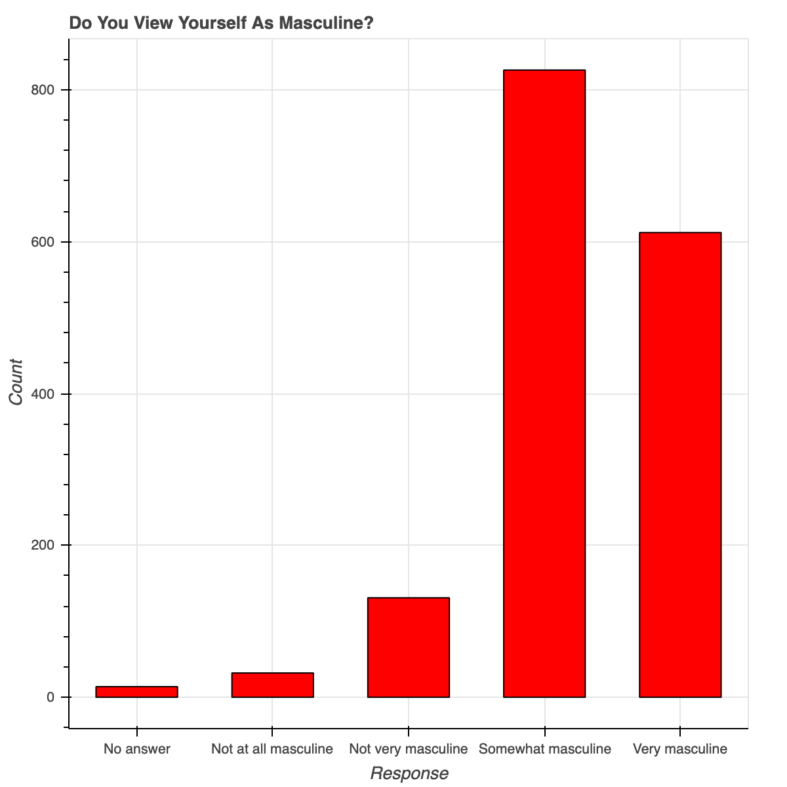

Using Bokeh to represent survey responses

The bar graph to the left shows responses to the question “Do you identify as masculine” as asked by 538 in a recent survey. The Bokeh code in lines 9–14 create an elegant and professional histogram of response counts, with sensible font sizing, y-ticks, and formatting. The majority of the code I wrote went to labeling the axes and title, along with giving the bars a color and border. When making nice, presentable figures, I lean very heavily towards Bokeh — a lot of the aesthetic work has already been done for us!

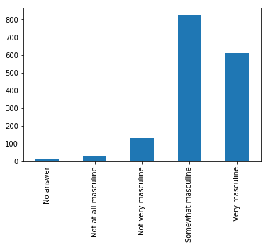

Using Pandas to represent the same data

The blue plot to the left is what comes from the single line of code on line 17 of the gist above. Both histograms have the same values, but serve different purposes. In an exploratory setting, it is much more convenient to write one line with pandas to see the data, but the aesthetics of Bokeh are pretty clearly superior. Every convenience that Bokeh provides takes customization in Matplotlib, be it angle of x-axis labels, background lines, y-tick spread, font sizing/italicizing/bolding, etc. The graph below shows a few random trends using a few more customizations with legends and different line types and colors:

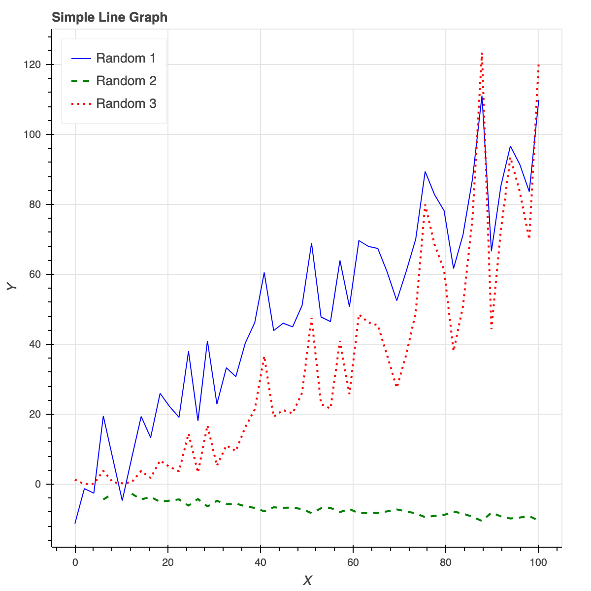

Bokeh is also a great tool for making interactive dashboards. I don’t want to get into dashboarding in this post, but there are great posts ([**like this one**](https://towardsdatascience.com/data-visualization-with-bokeh-in-python-part-iii-a-complete-dashboard-dc6a86aa6e23)) that get more into the application and implementation of Bokeh dashboards.

### Plotly:

Plotly is extremely powerful, but both setup and creating figures take a lot of time and neither are intuitive. After spending the better part of a morning working through Plotly, I went to lunch with almost nothing to show for it. I had created a bar graph without axis labels and a ‘scatterplot’ that had lines that I couldn’t remove. Some notable cons when getting started with Plotly:

- •It requires an API key and registration rather than just a pip install
- •It plots data/layout objects that are unique to Plotly and aren’t intuitive
- •The plot layout hasn’t worked for me (40 lines of code for literal nothing!)

For all of its setup cons, however, there are pros and workarounds:

- •You can edit plots on the Plotly website as well as in a Python environment
- •There is a lot of support for interactive graphs/dashboards
- •Plotly is partnered with Mapbox, allowing for customized maps
- •There is amazing overall potential for great graphics

It wouldn’t be fair for me to just air my gripes with Plotly without showing some code and what I was able to accomplish versus what people more capable with this package have made.

|     |     |
| --- | --- |
| 1   | #plot 1 - barplot |
| 2   | # **note** - the layout lines do nothing and trip no errors |
| 3   | data = [go.Bar(x=team_ave_df.team, |
| 4   |  y=team_ave_df.turnovers_per_mp)] |
| 5   |     |
| 6   | layout = go.Layout( |
| 7   |     |
| 8   |  title=go.layout.Title( |
| 9   |  text='Turnovers per Minute by Team', |
| 10  |  xref='paper', |
| 11  |  x=0 |
| 12  | ),  |
| 13  |     |
| 14  |  xaxis=go.layout.XAxis( |
| 15  |  title  = go.layout.xaxis.Title( |
| 16  |  text='Team', |
| 17  |  font=dict( |
| 18  |  family='Courier New, monospace', |
| 19  |  size=18, |
| 20  |  color='#7f7f7f' |
| 21  | )   |
| 22  | )   |
| 23  | ),  |
| 24  |     |
| 25  |  yaxis=go.layout.YAxis( |
| 26  |  title  = go.layout.yaxis.Title( |
| 27  |  text='Average Turnovers/Minute', |
| 28  |  font=dict( |
| 29  |  family='Courier New, monospace', |
| 30  |  size=18, |
| 31  |  color='#7f7f7f' |
| 32  | )   |
| 33  | )   |
| 34  | ),  |
| 35  |     |
| 36  |  autosize=True, |
| 37  |  hovermode='closest') |
| 38  |     |
| 39  | py.iplot(figure_or_data=data, layout=layout, filename='jupyter-plot', sharing='public', fileopt='overwrite') |
| 40  |     |
| 41  |     |
| 42  |     |
| 43  | #plot 2 - attempt at a scatterplot |
| 44  | data = [go.Scatter(x=player_year.minutes_played, |
| 45  |  y=player_year.salary, |
| 46  |  marker=go.scatter.Marker(color='red', |
| 47  |  size=3))] |
| 48  |     |
| 49  | layout = go.Layout(title="test", |
| 50  |  xaxis=dict(title='why'), |
| 51  |  yaxis=dict(title='plotly')) |
| 52  |     |
| 53  | py.iplot(figure_or_data=data, layout=layout, filename='jupyter-plot2', sharing='public') |

 [view raw](https://gist.github.com/aaronfrederick/138427cb6dea4c66650192efb5772708/raw/c4137612af8f834c75254ee6826d7f0b3e923094/plotly.py)  [plotly.py](https://gist.github.com/aaronfrederick/138427cb6dea4c66650192efb5772708#file-plotly-py) hosted with ❤ by [GitHub](https://github.com/)

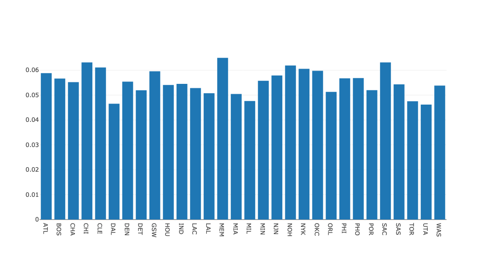

A bar graph representing average turnovers per minute by different NBA teams

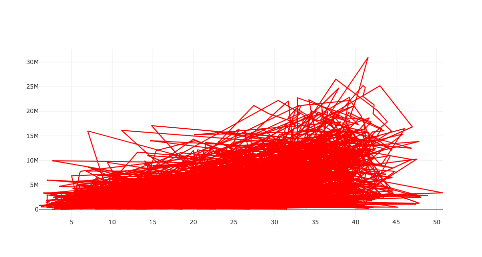

An attempt at a scatterplot representing salary as a function of playing time in the NBA

Overall, the aesthetics out of the box look good but multiple attempts at fixing the axis labels copying the documentation verbatim yielded no change. As I promised before, however, here are some plots that show the potential of Plotly and why spending more than a few hours might be worth it:

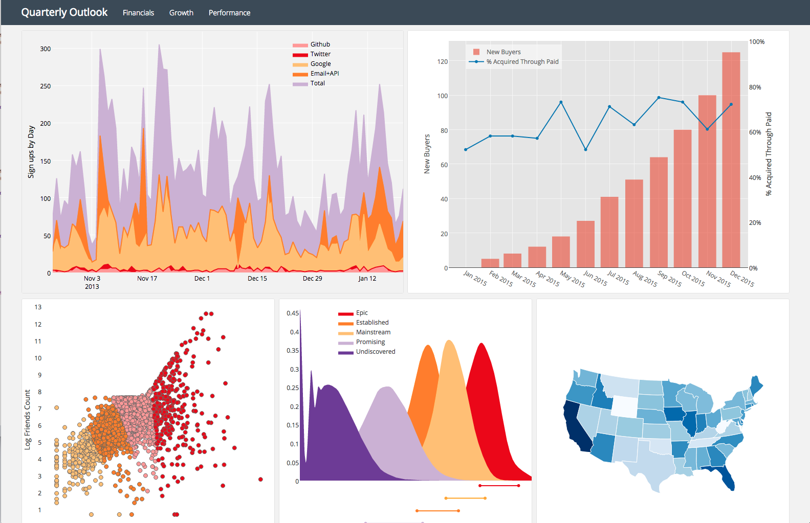

Some sample plots from [the Plotly page](https://plot.ly/products/on-premise/)

### Pygal:

Pygal is a slightly lesser-known plotting package that, like other popular packages, uses the grammar of graphics framework to construct its images. It is a relatively straight-forward package due to how simple the plot objects are. Using Pygal is about as simple as:

1. 1.Instantiate your figure
2. 2.Format using the figure objects’ attributes
3. 3.Add data to your figure using figure.add() notation

The main issues I had with Pygal were in actually rendering the figures. I had to use their render_to_file option then open that file in a web browser to see what I had built. It was ultimately worth it, as the figures are interactive and have a pleasant and easily customizable aesthetic. Overall, the package seems good but has some file creation/rendering quirks that limit its appeal.

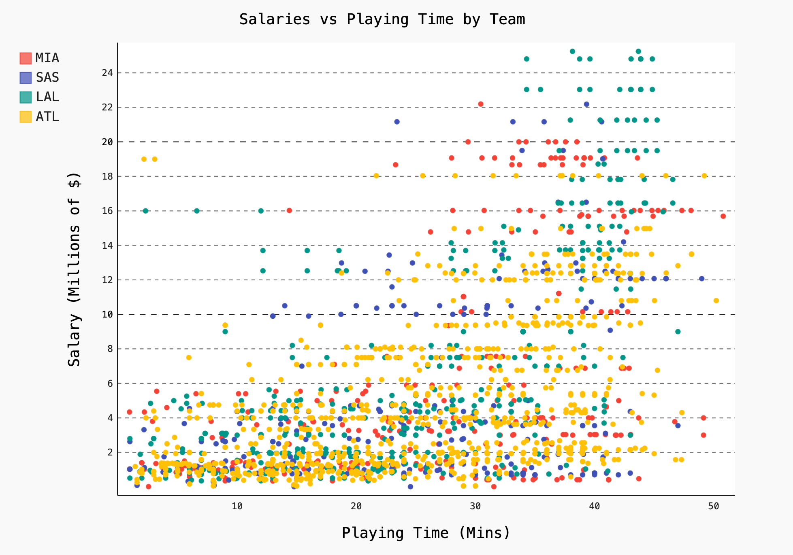

### Networkx:

Networkx is a great solution for analyzing and visualizing graphs, though it is based visually on matplotlib. Graphs and networks are not my area of expertise, but Networkx allows for quick and easy graphical representations of connected networks. Below are a few different representations of a simple graph I constructed, and some code getting started plotting a small Facebook network downloaded from [SNAP at Stanford](https://snap.stanford.edu/data/ego-Facebook.html).

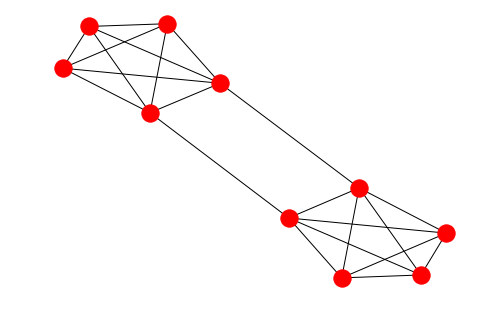

The code I used to color-code each node by its number (1–10) is below:

|     |     |
| --- | --- |
| 1   | options = { |
| 2   |  'node_color' : range(len(G)), |
| 3   |  'node_size' : 300, |
| 4   |  'width' : 1, |
| 5   |  'with_labels' : False, |
| 6   |  'cmap' : plt.cm.coolwarm |
| 7   | }   |
| 8   | nx.draw(G, **options) |

 [view raw](https://gist.github.com/aaronfrederick/26ee89c5c982e7bdabd364db5c2abb9c/raw/a44c9d6aa460bf0f283a5d428415a680e42d81d8/graph_simple_network.py)  [graph_simple_network.py](https://gist.github.com/aaronfrederick/26ee89c5c982e7bdabd364db5c2abb9c#file-graph_simple_network-py) hosted with ❤ by [GitHub](https://github.com/)

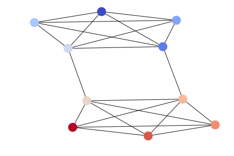

Below is code I wrote to visualize the sparse Facebook graph mentioned above:

|     |     |
| --- | --- |
| 1   | import itertools |
| 2   | import networkx as nx |
| 3   | import matplotlib.pyplot as plt |
| 4   |     |
| 5   | f =  open('data/facebook/1684.circles', 'r') |
| 6   | circles = [line.split() for line in f] |
| 7   | f.close() |
| 8   |     |
| 9   | network = [] |
| 10  | for circ in circles: |
| 11  | cleaned = [int(val) for val in circ[1:]] |
| 12  | network.append(cleaned) |
| 13  |     |
| 14  | G = nx.Graph() |
| 15  | for v in network: |
| 16  | G.add_nodes_from(v) |
| 17  |     |
| 18  | edges = [itertools.combinations(net,2) for net in network] |
| 19  |     |
| 20  | for edge_group in edges: |
| 21  | G.add_edges_from(edge_group) |
| 22  |     |
| 23  | options = { |
| 24  |  'node_color' : 'lime', |
| 25  |  'node_size' : 3, |
| 26  |  'width' : 1, |
| 27  |  'with_labels' : False, |
| 28  | }   |
| 29  | nx.draw(G, **options) |

 [view raw](https://gist.github.com/aaronfrederick/950a8185915019d69b4b2ec72da04289/raw/6b7a7c6372572001b3fc922ef7e24a0e61e9b126/fb_graph.py)  [fb_graph.py](https://gist.github.com/aaronfrederick/950a8185915019d69b4b2ec72da04289#file-fb_graph-py) hosted with ❤ by [GitHub](https://github.com/)

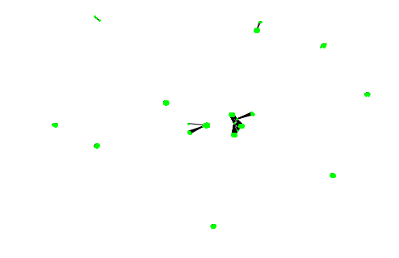

This graph is quite sparse, Networkx shows it by giving each cluster maximum separation

There are so many packages out there to visualize data and no clear best package. Hopefully after reading through this review, you can see how some of the various aesthetics and code lend themselves to different situations, from EDA to presentation.