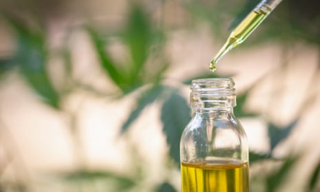

Risks of cannabis use for mental health treatment outweigh benefits

[Cannabis](https://www.theguardian.com/society/cannabis)

# Risks of cannabis use for mental health treatment outweigh benefits

New study shows evidence of positive outcomes is scarce while symptoms can be exacerbated

[Sarah Boseley](https://www.theguardian.com/profile/sarahboseley) Health editor
Mon 28 Oct 2019 19.30 EDTLast modified on Mon 28 Oct 2019 23.44 EDT

- 
- 
- [](https://www.theguardian.com/society/2019/oct/28/risks-of-cannabis-use-for-mental-health-treatment-outweigh-benefits?utm_term=RWRpdG9yaWFsX01vcm5pbmdCcmllZmluZ1VLLTE5MTAyOQ%3D%3D&utm_source=esp&utm_medium=Email&utm_campaign=MorningBriefingUK&CMP=morningbriefinguk_emailmailto:?subject=Risks%20of%20cannabis%20use%20for%20mental%20health%20treatment%20outweigh%20benefits&body=https%3A%2F%2Fwww.theguardian.com%2Fsociety%2F2019%2Foct%2F28%2Frisks-of-cannabis-use-for-mental-health-treatment-outweigh-benefits%3FCMP%3Dshare_btn_link)

Shares

656

The use of hemp oil or other cannabis medicines to treat depression, anxiety or psychosis, is not fully justified according to a new study. Photograph: Tinnakorn Jorruang/Getty/iStockphoto

The use of cannabis medicines to treat people with depression, anxiety, psychosis or other mental health issues cannot be justified because there is little evidence that they work or are safe, according to a major new study.

A review of evidence from trials conducted over nearly 40 years, [published in the journal Lancet Psychiatry](http://www.thelancet.com/journals/lanpsy/article/PIIS2215-0366(19)30401-8/fulltext), concludes that the risks outweigh the benefits. And yet, say the authors, they are being given to people with mental health problems in Australia, the US and Canada, and demand is likely to grow.

Prof Louisa Degenhardt of the National Drug and Alcohol Research Centre at UNSW Sydney, Australia, lead author of the study, said the findings had important implications in countries where medical use was allowed.

“There is a notable absence of high-quality evidence to properly assess the effectiveness and safety of medicinal cannabinoids compared with placebo, and until evidence from randomised controlled trials is available, clinical guidelines cannot be drawn up around their use in mental health disorders,” she said.

##   [Cannabis: Miracle Medicine or Dangerous Drug? review – weeding out the truth]()

 4 out of 5 stars.

                           

   

Read more

 [(L)](https://www.theguardian.com/tv-and-radio/2019/aug/28/cannabis-miracle-medicine-or-dangerous-drug-review)

“In countries where medicinal cannabinoids are already legal, doctors and patients must be aware of the limitations of existing evidence and the risks of cannabinoids. These must be weighed when considering use to treat symptoms of common mental health disorders. Those who decide to proceed should be carefully monitored for positive and negative mental health effects of using medicinal cannabinoids.”

 Profile

#### Cannabis: a history

    Show

**Cannabis: a history**

The earliest written reference to cannabis comes from China in the third millennium BC, but archaeological evidence suggests that hemp, probably for use in fabrics, was cultivated as early as 8,000BC. Native to Central Asia and India, the plant – known as ganja in Sanskrit – appears to have been recognised for its psychoactive properties among several pre-Christian cultures, some of which used it in rituals.

It was banned in parts of the Islamic world in the 14th century, not to mention in some British colonies, but was not widely proscribed across the world until the US took against it. A series of regulations in the US culminated in the Marihuana Tax Act of 1937 that banned possession or transfer of the drug, except for medicinal use. But it was not outlawed for all types of use until 1970, as the establishment reacted to hippie culture – a crackdown that continued with President Nixon’s so-called “war on drugs”, which saw the US place pressure on international governments to follow suit.

While countries such as the Netherlands have long defied such pressure, tolerating both medicinal and recreational use, international momentum towards legalisation has only begun to pick up in recent years with relaxation of the law in North America.

California kicked off the legalisation of medicinal cannabis in 1996, several states had legalised recreational use by 2012 and a majority of states had legalised medicinal cannabis by 2016. It remains illegal under US federal law. Canada lifted a ban on recreational use in 2018, while the UK legalised medicinal marijuana in the same year, albeit subject to tight restrictions.

According to the World [Health](https://www.theguardian.com/society/health) Organization, there are about 147 million cannabis users worldwide, some 2.5% of the global population. While the US market is exploding thanks to liberalisation of laws at state level, Europe is predicted to be the world’s biggest and most lucrative market for medicinal cannabis.

 Photograph: PR

Was this helpful?
Advertisement

The authors looked for evidence of an effect of medicinal cannabinoids in trials conducted in depression, anxiety, attention-deficit hyperactivity disorder (ADHD), Tourette syndrome, post-traumatic stress disorder (PTSD) and psychosis. They found 83 studies in 3,000 people. But the evidence of a positive effect was sparse.

There was, they said, “low-quality evidence” that THC, one of the derivatives of cannabis, could be helpful to people with multiple sclerosis or chronic pain who were also suffering from anxiety. But it made people with psychosis worse.

While there is little evidence that cannabinoids can help, the authors found more evidence in “a large body of research” of the potential harms. “This research suggests that cannabis use can increase the occurrence of depression, anxiety, and psychotic symptom,” says the paper.

 

##   [Get Society Weekly: our newsletter for public service professionals]()

   

Read more

 [(L)](https://www.theguardian.com/society/2018/jun/20/society-weekly-email-newsletter-sign-up)

A well-constructed study found that smoked cannabis actually increased the risk of acute psychotic symptoms. And young adults, the age group more likely to suffer from anxiety, depression and psychosis, are more likely to become dependent if they use cannabis daily over a long period of time.

“These risks, and the limitations of existing evidence, need to be weighed when considering the use of medicinal cannabinoids to treat symptoms of common mental disorders. Those who decide to proceed should be carefully monitored for positive and negative mental health effects of using medicinal cannabinoids,” they write.

In a comment piece in the journal, Deepak Cyril D’Souza of Yale University School of Medicine in New Haven, Connecticut, said that “in light of the paucity of evidence, the absence of good quality evidence for efficacy, and the known risk of cannabinoids, their use as treatments for psychiatric disorders cannot be justified at present.”

In modern medicine, it is normal practice to prove safety and efficacy in trials before drugs are allowed to be given out to patients.

“If cannabinoids are to be used in the treatment of psychiatric disorders, they should first be tested in randomised controlled trials and subjected to the same regulatory approval process as other prescription medications,” he add.

##  As the climate crisis escalates...

... the Guardian will not stay quiet. This is our pledge: we will continue to give global heating, wildlife extinction and pollution the urgent attention and prominence they demand. The Guardian recognises the climate emergency as the defining issue of our times.

You’ve read 5 Guardian articles in the last month – made possible by our choice to keep Guardian journalism open to all. We do not have a paywall because we believe everyone deserves access to factual information, regardless of where they live or what they can afford.

Our independence means we are free to investigate and challenge inaction by those in power. We will inform our readers about threats to the environment based on scientific facts, not driven by commercial or political interests. And we have made several important changes to our style guide to ensure the language we use accurately reflects the environmental catastrophe.

The Guardian believes that the problems we face on the climate crisis are systemic and that fundamental societal change is needed. We will keep reporting on the efforts of individuals and communities around the world who are fearlessly taking a stand for future generations and the preservation of human life on earth. We want their stories to inspire hope. We will also report back on our own progress as an organisation, as we take important steps to address our impact on the environment.

We hope you will consider supporting the Guardian’s open, independent reporting today. Every contribution from our readers, however big or small, is so valuable. **Support us from as little as £1 – and it only takes a minute. Thank you.**

 [Support The Guardian](http://support.theguardian.com/uk/contribute/climate-pledge-2019?REFPVID=k2bwtrlvriyiqvm16ca5&INTCMP=gdnwb_copts_memco_2019-10-14_moment_climate_pledge_article_count_position_variant_variant&acquisitionData=%7B%22source%22%3A%22GUARDIAN_WEB%22%2C%22componentId%22%3A%22gdnwb_copts_memco_2019-10-14_moment_climate_pledge_article_count_position_variant_variant%22%2C%22componentType%22%3A%22ACQUISITIONS_EPIC%22%2C%22campaignCode%22%3A%22gdnwb_copts_memco_2019-10-14_moment_climate_pledge_article_count_position_variant_variant%22%2C%22abTest%22%3A%7B%22name%22%3A%22ContributionsEpicArticlesViewedMonthMomentPositionVariant%22%2C%22variant%22%3A%22variant%22%7D%2C%22referrerPageviewId%22%3A%22k2bwtrlvriyiqvm16ca5%22%2C%22referrerUrl%22%3A%22https%3A%2F%2Fwww.theguardian.com%2Fsociety%2F2019%2Foct%2F28%2Frisks-of-cannabis-use-for-mental-health-treatment-outweigh-benefits%22%7D)

 

Topics

- [Cannabis/](https://www.theguardian.com/society/cannabis)
- [Health/](https://www.theguardian.com/society/health)
- [Drugs/](https://www.theguardian.com/science/drugs)
- [news/](https://www.theguardian.com/tone/news)
- 
- 
- [](https://www.theguardian.com/society/2019/oct/28/risks-of-cannabis-use-for-mental-health-treatment-outweigh-benefits?utm_term=RWRpdG9yaWFsX01vcm5pbmdCcmllZmluZ1VLLTE5MTAyOQ%3D%3D&utm_source=esp&utm_medium=Email&utm_campaign=MorningBriefingUK&CMP=morningbriefinguk_emailmailto:?subject=Risks%20of%20cannabis%20use%20for%20mental%20health%20treatment%20outweigh%20benefits&body=https%3A%2F%2Fwww.theguardian.com%2Fsociety%2F2019%2Foct%2F28%2Frisks-of-cannabis-use-for-mental-health-treatment-outweigh-benefits%3FCMP%3Dshare_btn_link)
- [Share on LinkedIn](http://www.linkedin.com/shareArticle?mini=true&title=Risks%20of%20cannabis%20use%20for%20mental%20health%20treatment%20outweigh%20benefits&url=https%3A%2F%2Fwww.theguardian.com%2Fsociety%2F2019%2Foct%2F28%2Frisks-of-cannabis-use-for-mental-health-treatment-outweigh-benefits)
- [Share on Pinterest](http://www.pinterest.com/pin/find/?url=https%3A%2F%2Fwww.theguardian.com%2Fsociety%2F2019%2Foct%2F28%2Frisks-of-cannabis-use-for-mental-health-treatment-outweigh-benefits)
- [Reuse this content](https://syndication.theguardian.com/automation/?url=https%3A%2F%2Fwww.theguardian.com%2Fsociety%2F2019%2Foct%2F28%2Frisks-of-cannabis-use-for-mental-health-treatment-outweigh-benefits&type=article&internalpagecode=6748734)