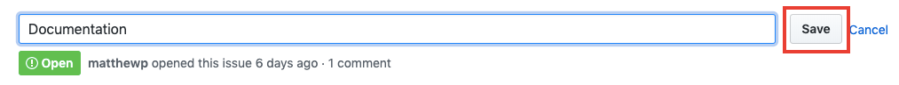

Robot

#  Robot

## Fast **1kB** functional library for creating Finite State Machines

- Home ●
- [API](https://thisrobot.life/api.html)  ●
- [Guides](https://thisrobot.life/guides.html)  ●
- [Integrations](https://thisrobot.life/integrations.html)  ●
- [GitHub](https://github.com/matthewp/robot)

- [Getting Started](https://thisrobot.life/#getting-started)
- [Why Finite State Machines](https://thisrobot.life/#why-finite-state-machines)

With **Robot** you can build [finite state machines](https://brilliant.org/wiki/finite-state-machines/) in a simple and flexible way.

`import { createMachine, state, transition } from 'robot3';[[NEWLINE]][[NEWLINE]]const machine = createMachine({[[NEWLINE]]  inactive: state([[NEWLINE]]    transition('toggle', 'active')[[NEWLINE]]  ),[[NEWLINE]]  active: state([[NEWLINE]]    transition('toggle', 'inactive')[[NEWLINE]]  )[[NEWLINE]]});[[NEWLINE]][[NEWLINE]]export default machine;`

Which you can use easily with any of our [integrations](https://thisrobot.life/integrations.html):

`import { h } from 'preact';[[NEWLINE]]import { useMachine } from 'preact-robot';[[NEWLINE]]import machine from './machine.js';[[NEWLINE]][[NEWLINE]]function Counter() {[[NEWLINE]]  const [current, send] = useMachine(machine);[[NEWLINE]]  const state = current.name;[[NEWLINE]][[NEWLINE]]  return ([[NEWLINE]]    <>[[NEWLINE]]      
State: {state}
[[NEWLINE]]      <button onClick={() => send('toggle')}>[[NEWLINE]]        Toggle[[NEWLINE]]      </button>[[NEWLINE]]    </>[[NEWLINE]]  );[[NEWLINE]]}`

Robot emphasizes:

- **Size**: at just *1kB* you get a big bang for your buck.
- **Composability**: Robot's API are built using *functions*, not a declative options object. This makes it easy to use [functional composition](https://thisrobot.life/guides/composition.html) to perform common tasks with little code.
- **Understandability**: Instead of conforming to an XML specification created decades ago, Robot takes the best ideas from both academia and real-world usage of finite state machines. This makes state machines easy to read and understand, as there is only one way to do most common tasks.

# [#](https://thisrobot.life/#getting-started) Getting Started

Install the `robot3` package via [npm](https://www.npmjs.com/) or [Yarn](https://yarnpkg.com/):

`npm install robot3 --dev`
`yarn add robot3`

This demo shows how to use a Robot to create a loading state machine, including using the state to declarative render different UI based on the state of the machine.

`import { createMachine, invoke, reduce, state, transition } from 'robot3';[[NEWLINE]]import { useMachine } from 'preact-robot';[[NEWLINE]]import { h, render } from 'preact';[[NEWLINE]][[NEWLINE]]const context = () => ({[[NEWLINE]]  users: [][[NEWLINE]]});[[NEWLINE]][[NEWLINE]]async function loadUsers() {[[NEWLINE]]  return [[[NEWLINE]]    { id: 1, name: 'Wilbur' },[[NEWLINE]]    { id: 2, name: 'Matthew' },[[NEWLINE]]    { id: 3, name: 'Anne' }[[NEWLINE]]  ];[[NEWLINE]]}[[NEWLINE]][[NEWLINE]]const machine = createMachine({[[NEWLINE]]  idle: state([[NEWLINE]]    transition('fetch', 'loading')[[NEWLINE]]  ),[[NEWLINE]]  loading: invoke(loadUsers,[[NEWLINE]]    transition('done', 'loaded',[[NEWLINE]]      reduce((ctx, ev) => ({ ...ctx, users: ev.data }))[[NEWLINE]]    )[[NEWLINE]]  ),[[NEWLINE]]  loaded: state()[[NEWLINE]]}, context);[[NEWLINE]][[NEWLINE]]function App() {[[NEWLINE]]  const [current, send] = useMachine(machine);[[NEWLINE]]  const state = current.name;[[NEWLINE]]  const { users } = current.context;[[NEWLINE]]  const disableButton = state === 'loading' || state === 'loaded';[[NEWLINE]][[NEWLINE]]  return ([[NEWLINE]]    <>[[NEWLINE]]      {state === 'loading' ? ([[NEWLINE]]        
Loading users...
[[NEWLINE]]      ) : state === 'loaded' ? ([[NEWLINE]]        [[NEWLINE]]        <ul>[[NEWLINE]]          {users.map(user => {[[NEWLINE]]            <li id={`user-${user.id}`}>{user.name}</li>[[NEWLINE]]          })}[[NEWLINE]]        </ul>[[NEWLINE]][[NEWLINE]]      ): ()}[[NEWLINE]][[NEWLINE]]      <button onClick={() => send('fetch')} disabled={disableButton}>[[NEWLINE]]        Load users[[NEWLINE]]      </button>[[NEWLINE]]    </>[[NEWLINE]]  )[[NEWLINE]]}[[NEWLINE]][[NEWLINE]]render(<App />, document.getElementById('app'));`

# [#](https://thisrobot.life/#why-finite-state-machines) Why Finite State Machines

With Finite State Machines the term **state** might not mean what you think. In the frontend we tend to think of state to mean *all* of the variables that control the UI. When we say **state** in Finite State Machines we mean a higher-level sort of state.

For example, on the GitHub issue page, the issue titles can be edited by the issue creator and repo maintainers. Initially a title is displayed like this:

The edit button (in red) changes the view so that the title is in an input for editing, and the buttons change as well:

If we call this **edit mode** you might be inclined to represent this state as a boolean and the title as a string:

`let editMode = false;[[NEWLINE]]let title = '';`

When the **Edit** button is clicked you would toggle the `editMode` varaible to `true`. When **Save** or **Cancel** are clicked, toggle it back to `false`.

But *oops*, we're missing something here. When you click **Save** it should keep the changed title and save that via an API call. When you click **Cancel** it should forget your changes and restore the previous title.

So we have some new states we've discovered, the **cancel** state and the **save** state. You might not think of these as states, but rather just some code that you run on events. Think of what happens when you click Save; it makes an external request to a server. That request could fail for a number of reasons. Or you might want to display a loading indicator while the save is taking place. This is definitely a state! Cancel, while more simple and immediate, is also a state, as it at least requires some logic to tell the application that the inputed new title can be ignored.

You can imagine this component having more states as well. What should happen if the user blanks out the input and then clicks save? You can't have an empty title. It seems that this component should have some sort of **validation** state as well. So we've identified at least 6 states:

- **preview**: The default view when on an issue page.
- **edit**: When in edit mode.
- **save**: When saving to a remote API.
- **error**: When the API server errors for some reason.
- **cancel**: When rolling back changes from edit mode.
- **validate**: When confirming the new input title is an acceptable string.

I'll spare you the code, but you can imagine that writing this logic imperatively can result in a number of bugs. You might be tempted to represent these states as a bunch of booleans:

`let editMode = false;[[NEWLINE]]let saving = false;[[NEWLINE]]let validating = false;[[NEWLINE]]let saveHadError = false;`

And then toggle these booleans in response to the appropriate event. We've all written code this way. You can pull it off, but why do so when you don't have to? Take, for example, what happens when new requirements are added, resulting in yet another new state of this component. You would need to add another boolean, and change all of your code to toggle the boolean as needed.

In recent years there has been a revolution in [declarative programming](https://en.wikipedia.org/wiki/Declarative_programming) in the front-end. We use tools such as [React](https://reactjs.org/) to represent our UI as a function of state. This is great, but we still write imperative code to manage our state like this:

`function resetState() {[[NEWLINE]]  setValidating(false);[[NEWLINE]]  setSaving(false);[[NEWLINE]]  setBlurred(false);[[NEWLINE]]  setEditing(false);[[NEWLINE]]  if(!focused) setTouched(false);[[NEWLINE]]  setDirty(true);[[NEWLINE]]}`

[Finite State Machines](https://en.wikipedia.org/wiki/Finite-state_machine) bring the declarative revolution to application (and component) state. By representing your states declaratively you can **eliminate invalid states** and prevent an entire category of bugs. Finite State Machines are like static typing for your states.

Robot is a Finite State Machine library meant to be simple, functional, and fun. With Robot you might represent this title component like so:

`import { createMachine, guard, immediate, invoke, state, transition } from 'robot3';[[NEWLINE]][[NEWLINE]]const machine = createMachine({[[NEWLINE]]  preview: state([[NEWLINE]]    transition('edit', 'editMode'[[NEWLINE]]      // Save the current title as oldTitle so we can reset later.[[NEWLINE]]      reduce(ctx => ({ ...ctx, oldTitle: ctx.title }))[[NEWLINE]]    )[[NEWLINE]]  ),[[NEWLINE]]  editMode: state([[NEWLINE]]    transition('input', 'editMode'[[NEWLINE]]      reduce((ctx, ev) => ({ ...ctx, title: ev.target.value }))[[NEWLINE]]    ),[[NEWLINE]]    transition('cancel', 'cancel'),[[NEWLINE]]    transition('save', 'validate')[[NEWLINE]]  ),[[NEWLINE]]  cancel: state([[NEWLINE]]    immediate('preview',[[NEWLINE]]      // Reset the title back to oldTitle[[NEWLINE]]      reduce(ctx => ({ ...ctx, title: ctx.oldTitle })[[NEWLINE]]    )[[NEWLINE]]  ),[[NEWLINE]]  validate: state([[NEWLINE]]    // Check if the title is valid. If so go[[NEWLINE]]    // to the save state, otherwise go back to editMode[[NEWLINE]]    immediate('save', guard(titleIsValid)),[[NEWLINE]]    immediate('editMode')[[NEWLINE]]  )[[NEWLINE]]  save: invoke(saveTitle[[NEWLINE]]    transition('done', 'preview')[[NEWLINE]]    transition('error', 'error')[[NEWLINE]]  ),[[NEWLINE]]  error: state([[NEWLINE]]    // Should we provide a retry or...?[[NEWLINE]]  )[[NEWLINE]]});`

This *might* seem like a lot of code, but consider that:

- This prevents the component from ever being in an invalid state.
- This captures *all* of the possible states. When writing imperative code you often ignore uncommon or inconvenient states like errors. With Finite State Machines it's much harder to ignore reality.
- States and transitions are validated at the moment that the machine is created and will throw when using [robot/debug](https://thisrobot.life/api.html#debugging).

# [#](https://thisrobot.life/#inspiration) Inspiration

Robot is inspired by a variety of projects involving finite state machines including:

- [Statecharts](http://www.inf.ed.ac.uk/teaching/courses/seoc/2005_2006/resources/statecharts.pdf): The specification that fixes some of the issues with Finite State Machines. Robot adopts a number of these changes.
- [XState](https://xstate.js.org/): The excellent JavaScript library that implements the Statecharts XML spec.
- [The P programming language](https://github.com/p-org/P/wiki/PingPong-program): A DSL for representing Finite State Machines.

Made with by [@matthewcp](https://twitter.com/matthewcp)