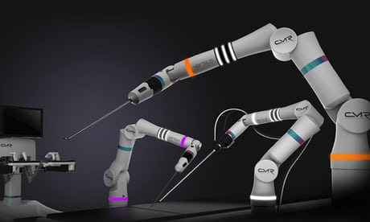

Robots will not lead to fewer jobs – but the hollowing out of the middle class | Larry Elliott

[Skip to main content](https://www.theguardian.com/business/2017/aug/20/robots-are-not-destroying-jobs-but-they-are-hollow-out-the-middle-class#maincontent)

Advertisement

[The Guardian - Back to home](https://www.theguardian.com/uk)

[become a supporter](https://support.theguardian.com/uk?INTCMP=gdnwb_copts_memco_sandc_support_baseline_support_header_become_supporter&REFPVID=j6rs3mj7podu4y5wtu55)[subscribe/](https://support.theguardian.com/uk?INTCMP=gdnwb_copts_memco_sandc_support_baseline_support_header_subscribe&REFPVID=j6rs3mj7podu4y5wtu55)[find a jobjobs](https://jobs.theguardian.com/?INTCMP=jobs_uk_web_newheader)

- [news](https://www.theguardian.com/uk)
- [opinion](https://www.theguardian.com/uk/commentisfree)
- [sport](https://www.theguardian.com/uk/sport)
- [arts](https://www.theguardian.com/uk/culture)
- [life](https://www.theguardian.com/uk/lifeandstyle)

All sections
-

    - [headlines](https://www.theguardian.com/uk)
    - [UK news](https://www.theguardian.com/uk-news)
    - [world news](https://www.theguardian.com/world)
    - [business](https://www.theguardian.com/uk/business)
    - [environment](https://www.theguardian.com/uk/environment)
    - [tech](https://www.theguardian.com/uk/technology)
    - [UK politics](https://www.theguardian.com/politics)
    - [science](https://www.theguardian.com/science)
    - [global development](https://www.theguardian.com/global-development)
    - [cities](https://www.theguardian.com/cities)
    - [obituaries](https://www.theguardian.com/tone/obituaries)

-

    - [opinion home](https://www.theguardian.com/uk/commentisfree)
    - [the guardian view](https://www.theguardian.com/profile/editorial)
    - [columnists](https://www.theguardian.com/index/contributors)
    - [cartoons](https://www.theguardian.com/cartoons/archive)
    - [opinion videos](https://www.theguardian.com/commentisfree/series/comment-is-free-weekly)
    - [letters](https://www.theguardian.com/tone/letters)
    - [Polly Toynbee](https://www.theguardian.com/profile/pollytoynbee)
    - [Owen Jones](https://www.theguardian.com/profile/owen-jones)
    - [Jonathan Freedland](https://www.theguardian.com/profile/jonathanfreedland)
    - [Marina Hyde](https://www.theguardian.com/profile/marinahyde)

-

    - [sport home](https://www.theguardian.com/uk/sport)
    - [football](https://www.theguardian.com/football)
    - [rugby union](https://www.theguardian.com/sport/rugby-union)
    - [cricket](https://www.theguardian.com/sport/cricket)
    - [tennis](https://www.theguardian.com/sport/tennis)
    - [cycling](https://www.theguardian.com/sport/cycling)
    - [F1](https://www.theguardian.com/sport/formulaone)
    - [rugby league](https://www.theguardian.com/sport/rugbyleague)
    - [racing](https://www.theguardian.com/sport/horse-racing)
    - [US sports](https://www.theguardian.com/sport/us-sport)
    - [golf](https://www.theguardian.com/sport/golf)

-

    - [culture home](https://www.theguardian.com/uk/culture)
    - [tv & radio](https://www.theguardian.com/uk/tv-and-radio)
    - [music](https://www.theguardian.com/music)
    - [film](https://www.theguardian.com/uk/film)
    - [stage](https://www.theguardian.com/stage)
    - [books](https://www.theguardian.com/books)
    - [games](https://www.theguardian.com/technology/games)
    - [art & design](https://www.theguardian.com/artanddesign)
    - [classical](https://www.theguardian.com/music/classicalmusicandopera)

-

    - [lifestyle home](https://www.theguardian.com/uk/lifeandstyle)
    - [fashion](https://www.theguardian.com/fashion)
    - [food](https://www.theguardian.com/lifeandstyle/food-and-drink)
    - [recipes](https://www.theguardian.com/tone/recipes)
    - [travel](https://www.theguardian.com/uk/travel)
    - [love & sex](https://www.theguardian.com/lifeandstyle/love-and-sex)
    - [family](https://www.theguardian.com/lifeandstyle/family)
    - [home & garden](https://www.theguardian.com/lifeandstyle/home-and-garden)
    - [health & fitness](https://www.theguardian.com/lifeandstyle/health-and-wellbeing)
    - [women](https://www.theguardian.com/lifeandstyle/women)
    - [money](https://www.theguardian.com/uk/money)

What term do you want to search?

- [become a supporter](https://membership.theguardian.com/uk/supporter?INTCMP=mem_uk_web_newheader)
- [subscribe](https://subscribe.theguardian.com/uk?INTCMP=NGW_NEWHEADER_uk_GU_SUBSCRIBE)
- [Sign in/up](https://profile.theguardian.com/signin?INTCMP=DOTCOM_NEWHEADER_SIGNIN)

-

-

    - [Comment activity]()
    - [Edit profile](https://profile.theguardian.com/public/edit)
    - [Email preferences](https://profile.theguardian.com/email-prefs)
    - [Change password](https://profile.theguardian.com/password/change)
    - [Sign out](https://profile.theguardian.com/signout)
- edition:
    - [switch to the UK](https://www.theguardian.com/preference/edition/uk)
    - [switch to the US editionUS](https://www.theguardian.com/preference/edition/us)
    - [switch to the Australia editionAU](https://www.theguardian.com/preference/edition/au)
    - [switch to the International editionINT](https://www.theguardian.com/preference/edition/int)
- [jobs](https://jobs.theguardian.com/?INTCMP=jobs_uk_web_newheader)
- [dating](https://soulmates.theguardian.com/?INTCMP=soulmates_uk_web_newheader)
- [holidays](https://holidays.theguardian.com/?INTCMP=holidays_uk_web_newheader)
- [masterclasses](https://www.theguardian.com/guardian-masterclasses?INTCMP=masterclasses_uk_web_newheader)
- [the guardian app](https://app.adjust.com/f8qm1x_8q69t7?campaign=NewHeader&amp;adgroup=Mobile&amp;creative=generic?INTCMP=apps_uk_web_newheader)
- [video](https://www.theguardian.com/video)
- [podcasts](https://www.theguardian.com/podcasts)
- [pictures](https://www.theguardian.com/inpictures)
- [newsletters](https://www.theguardian.com/email-newsletters)
- [today's paper](https://www.theguardian.com/theguardian)
- [the observer](https://www.theguardian.com/observer)
- [digital archive](https://theguardian.newspapers.com/)
- [professional networks](https://www.theguardian.com/guardian-professional)
- [crosswords](https://www.theguardian.com/crosswords)
- [Facebook](https://www.facebook.com/theguardian)
- [Twitter](https://twitter.com/guardian)
- [jobs](https://jobs.theguardian.com/?INTCMP=jobs_uk_web_newheader)
- /[dating](https://soulmates.theguardian.com/?INTCMP=soulmates_uk_web_newheader)
- /[holidays](https://holidays.theguardian.com/?INTCMP=holidays_uk_web_newheader)
- /[masterclasses](https://www.theguardian.com/guardian-masterclasses?INTCMP=masterclasses_uk_web_newheader)

/

- [money](https://www.theguardian.com/uk/money)
- [property](https://www.theguardian.com/money/property)
- [pensions](https://www.theguardian.com/money/pensions)
- [savings](https://www.theguardian.com/money/savings)
- [borrowing](https://www.theguardian.com/money/debt)
- [careers](https://www.theguardian.com/money/work-and-careers)

-

Moravec’s paradox says that robots find difficult things easy and easy things difficult, which might lead to humans taking lower-paid manual work. Photograph: Fabian Bimmer/Reuters

[Business](https://www.theguardian.com/uk/business)

[Economics viewpoint](https://www.theguardian.com/business/series/economicsmonday)

# Robots will not lead to fewer jobs – but the hollowing out of the middle class

[Larry Elliott](https://www.theguardian.com/profile/larryelliott)

Weak wage growth could already be a sign of automation creating an economy in which small number of very rich employ armies of poor

- [(L)](https://www.facebook.com/dialog/share?app_id=180444840287&href=https%3A%2F%2Fwww.theguardian.com%2Fbusiness%2F2017%2Faug%2F20%2Frobots-are-not-destroying-jobs-but-they-are-hollow-out-the-middle-class%3FCMP%3Dshare_btn_fb)
- [(L)](https://twitter.com/intent/tweet?text=Robots%20will%20not%20lead%20to%20fewer%20jobs%20%E2%80%93%20but%20the%20hollowing%20out%20of%20the%20middle%20class%20%7C%20Larry%20Elliott&url=https%3A%2F%2Fwww.theguardian.com%2Fbusiness%2F2017%2Faug%2F20%2Frobots-are-not-destroying-jobs-but-they-are-hollow-out-the-middle-class%3FCMP%3Dshare_btn_tw)
- [(L)](https://www.theguardian.com/business/2017/aug/20/robots-are-not-destroying-jobs-but-they-are-hollow-out-the-middle-classmailto:?subject=Robots%20will%20not%20lead%20to%20fewer%20jobs%20%E2%80%93%20but%20the%20hollowing%20out%20of%20the%20middle%20class%20%7C%20Larry%20Elliott&body=https%3A%2F%2Fwww.theguardian.com%2Fbusiness%2F2017%2Faug%2F20%2Frobots-are-not-destroying-jobs-but-they-are-hollow-out-the-middle-class%3FCMP%3Dshare_btn_link)

-

### Shares

1,407

[ ###   Comments   1,099](https://www.theguardian.com/business/2017/aug/20/robots-are-not-destroying-jobs-but-they-are-hollow-out-the-middle-class#comments)

Sunday 20 August 2017 11.22 BSTLast modified on Monday 21 August 2017 23.44 BST

Throughout modern history there has been a recurrent fear that jobs will be destroyed by technology. Everybody knows the story of the Luddites, bands of workers who smashed up machinery in the textile industry in the second decade of the 19th century.

The Luddites were wrong. There has been wave after wave of technological advance since the first Industrial Revolution, and yet more people are working than ever before. Jobs have certainly been destroyed. Banks, for example, no longer employ clerks to log every transaction in ledgers with quill pens. At this time of year, 150 years ago, the fields would have been full of people with scythes and pitchforks bringing in the harvest. That work is now done by motorised harvesters.

 

#   [Business Today: sign up for a morning shot of financial news]()

Read more

 [(L)](https://www.theguardian.com/info/2017/may/16/guardian-business-today-sign-up-financial-news-email)

The reason new technology has not been the cause of mass unemployment is that new kit will only be used when it makes the productive process more profitable. Higher productivity frees up the resources to buy other goods and services. The rural workers that Thomas Hardy described in Tess of the D’Urbervilles found work in factories and offices. What’s more, it was better paid work, and so the upshot was an increase in living standards.

Similarly, the age of robots will lead to more jobs. Kallum Pickering, analyst with Berenberg, says there is a big hole in the argument that artificial intelligence (AI) will lead to vast numbers of workers joining the dole queue.

“Producers will only automate if doing so is profitable. For profit to occur, producers need a market to sell to in the first place. Keeping this in mind helps to highlight the critical flaw of the argument: if robots replaced all workers, thereby creating mass unemployment, to whom would the producers sell? Because demand is infinite whereas supply is scarce, the displaced workers always have the opportunity to find fresh employment to produce something that satisfies demand elsewhere.”

Advertisement

[](https://googleads.g.doubleclick.net/aclk?sa=l&ai=CftAQbQagWY-BEufEzAa0q5MQiYqslEndj5Kh9wTc8ZH50QgQASC8luEQYLv-yYPcCqABxLi__wPIAQLgAgCoAwHIA5kEqgSJAk_Qm4z5AOILhhxePUrZvu4C0zfAAngdqI-Ymeyd_qKLmi_PWhtlim7UJ-qEn2UWsC-8JdUUQOWww-aUypIrWnbxCSwET2Y5c44Nz_3mG5DvK2SQszgvj2YOC2IAsbiw-D8J6YwRhQtZYIvn9TI1_uJY5CosAhouPIC-ze_AQQF5TrMjVvqkl7s7tQfzzkT3gMLD-PajqGl50jjbN6ZTI-SQ97ZXYSu39Rzbsj8pzqxyv671J7KkVgqxIwrvsYT9MiWoJ5pVf1a9IRDEfmoMZWVS1Rpyeq8PxIYUTyGP6adXA-rz2z1XJI3iV2MpI5UY8B5-ZyZn_UFIz6YR7hFd0njvcNM-F-JGFFPgBAGgBgKAB6THQKgHr8obqAemvhvYBwHSCAcIjGMQARgBsQlox6tWzMZhOdgTAg&num=1&sig=AOD64_1ARnCsVLt5x2PVCQrKOibEt6FrKA&client=ca-pub-2012933198307164&adurl=http://www.informationbuilders.com/iknow/lipari-foods%3Futm_source%3Dgoogle-banner%26utm_medium%3Dbanner%26utm_content%3Dlipari-300x250%26utm_campaign%3Diknow)

Ad closed by 

[Report this ad]()[Why this ad? ](https://www.google.com/ads/preferences/whythisad/en-US/5iNgcxxMZ9hhHubc/#/AB3afGEAAAJNeyJpbWFnZV93aHlfdGhpc19hZCI6eyJsYW5kaW5nX3VybCI6Imh0dHA6Ly93d3cuaW5mb3JtYXRpb25idWlsZGVycy5jb20vaWtub3cvbGlwYXJpLWZvb2RzP3V0bV9zb3VyY2U9Z29vZ2xlLWJhbm5lclx1MDAyNnV0bV9tZWRpdW09YmFubmVyXHUwMDI2dXRtX2NvbnRlbnQ9bGlwYXJpLTMwMHgyNTBcdTAwMjZ1dG1fY2FtcGFpZ249aWtub3ciLCJpbWFnZV91cmwiOiJodHRwczovL3RwYy5nb29nbGVzeW5kaWNhdGlvbi5jb20vc2ltZ2FkLzU3ODQwMjU5NjkxODM1MDU1MDYiLCJpbWFnZV93aWR0aCI6MzAwLCJpbWFnZV9oZWlnaHQiOjI1MH0sInRhcmdldGluZ19yZWFzb25zIjp7Im9wdF9vdXQiOnRydWUsImFkX3JlYXNvbiI6WzIsOSwxM10sImV4cGxhbmF0aW9uIjp7ImludHJvZHVjdGlvbiI6IllvdSBoYXZlIG9wdGVkIG91dCBvZiBpbnRlcmVzdCBiYXNlZCBhZHZlcnRpc2luZy4gIFRoaXMgYWQgd2FzIHNob3duIHRvIHlvdSBiZWNhdXNlIG9mIHRoZSB0aW1lIG9mIGRheSwgdGhlIHdlYnNpdGUgeW91IHdlcmUgdmlld2luZyBvciB5b3VyIGdlbmVyYWwgbG9jYXRpb24gKGZvciBleGFtcGxlIGNvdW50cnkgb3IgY2l0eSkuIn19fZxAga-tzO4vVgYpQa47o_syw0NQ7WbkpQI-0OdEbSquy6jq9uX39m-sSuEiN28XFguyWSikJBuV9cEFIjSzOos8Xf20R-5L4p3Iw0nflKPvRj5aeklYptzFn10WOhZoa2quRhuXvctFCGVPCCEn0HVDK2NrHR48W1zrrf1pg3LOX5VfkjPFLiFzksGk9ygfDhOETTBPT2q35OCjy8MxIfPcyMfdGcGaIIwrAZNFm7nOrvd_bATgylGZOz6HtBgxFDDkD_difvQqyTLkqs8c2BY4H54lboABaEgRjafgbtk7Ap69TUumwxUY3cWOxj0ndry45fwifn-dgmPJdb7p7Gk,caWW32fkOpL14_vzrZIxzg&fR-yZSoACq4I3Y-SofcEEP6tvmUY5MIDIh1pbmZvcm1hdGlvbmJ1aWxkZXJzLmNvbS9pa25vdzIICAUTGI2RCRRCF2NhLXB1Yi0yMDEyOTMzMTk4MzA3MTY0SABYAnAB&https://googleads.g.doubleclick.net/pagead/conversion/?ai=CftAQbQagWY-BEufEzAa0q5MQiYqslEndj5Kh9wTc8ZH50QgQASC8luEQYLv-yYPcCqABxLi__wPIAQLgAgCoAwHIA5kEqgSJAk_Qm4z5AOILhhxePUrZvu4C0zfAAngdqI-Ymeyd_qKLmi_PWhtlim7UJ-qEn2UWsC-8JdUUQOWww-aUypIrWnbxCSwET2Y5c44Nz_3mG5DvK2SQszgvj2YOC2IAsbiw-D8J6YwRhQtZYIvn9TI1_uJY5CosAhouPIC-ze_AQQF5TrMjVvqkl7s7tQfzzkT3gMLD-PajqGl50jjbN6ZTI-SQ97ZXYSu39Rzbsj8pzqxyv671J7KkVgqxIwrvsYT9MiWoJ5pVf1a9IRDEfmoMZWVS1Rpyeq8PxIYUTyGP6adXA-rz2z1XJI3iV2MpI5UY8B5-ZyZn_UFIz6YR7hFd0njvcNM-F-JGFFPgBAGgBgKAB6THQKgHr8obqAemvhvYBwHSCAcIjGMQARgBsQlox6tWzMZhOdgTAg&sigh=wLgdqPUy9KE)

[Seen this ad multiple times]()[Not interested in this ad]()[Ad covered content]()[Ad was inappropriate]()

We'll try not to show that ad again

Ad closed by 

That, though, is not the end of the story. [Robots](https://www.theguardian.com/technology/robots) will create more jobs, but what if these jobs are less good and less well paid than the jobs that automation kills off? Perhaps the weak wage growth of recent years is telling us something, namely that technology is hollowing out the middle class and creating a bifurcated economy in which a small number of very rich people employ armies of poor people to cater for their every whim.

This is certainly a much more likely threat than mass job destruction. What’s more, it fits with the history of the recent past, the theory of automation, and recent trends in the labour market.

Christian Siegel from the University of Kent’s school of economics has found that [labour markets in the advanced countries of the west started to polarise as far back as the 1950s](https://www.aeaweb.org/conference/2016/retrieve.php?pdfid=906) as they became more dominated by the service sector. Growth was strong during this period, but the job creation tended to be either at the top end of the pay scale or at the bottom end, while employment opportunities in traditional middle-class sectors of the economy declined. The arrival of IT in the 1980s merely accentuated a process already underway.

Robots are likely to result in a further hollowing out of middle-class jobs, and the reason is something known as [Moravec’s paradox](https://www.theguardian.com/sustainable-business/2015/feb/17/artificial-intelligence-future-of-work). This was a discovery by AI experts in the 1980s that robots find the difficult things easy and the easy things difficult. Hans Moravec, one of the researchers, said: “It is comparatively easy to make computers exhibit adult-level performance on intelligence tests or playing checkers, and difficult or impossible to give them the skills of a one-year-old when it comes to perception and mobility.” Put another way, if you wanted to beat Magnus Carlsen, the world chess champion, you would choose a computer. If you wanted to clean the chess pieces after the game, you would choose a human being.

Dhaval Joshi, economist at BCA research, believes Moravec’s paradox will have a big impact on the labour market. He considers two scenarios for a stylised economy with three jobs: a high-income innovator, a middle-income manufacturer and a low-income animal tender.

In scenario one, the innovator comes up with a machine that dispenses with the need for the animal tender. The machine is more productive than the animal tender and so the innovator uses his extra income to buy manufactured goods. That provides the opportunity for the animal tender to retrain as a more highly paid manufacturer.

 

#   [UK scientists create world’s smallest surgical robot to start a hospital revolution]()

Read more

 [(L)](https://www.theguardian.com/society/2017/aug/19/worlds-smallest-surgical-robot-versius-keyhole-hospital-revolution)

In scenario two, the innovator invents a machine that makes the middle-income manufacturer obsolete. Again, the innovator has more disposable income and uses it to purchase animal tending services. The middle-income manufacturer now has to make a living as a more lowly paid animal tender.

In the modern economy, the jobs that are prized tend to be the ones that involve skills such as logic. Those that are less well-rewarded tend to involve mobility and perception. Robots find logic easy but mobility and perception difficult.

“It follows,” says Joshi, “that the jobs that AI can easily replicate and replace are those that require recently evolved skills like logic and algebra. They tend to be middle-income jobs. Conversely, the jobs that AI cannot easily replicate are those that rely on the deeply evolved skills like mobility and perception. They tend to be lower-income jobs. Hence, the current wave of technological progress is following scenario 2. AI is hollowing out middle-income jobs and creating lots of lower-income jobs.”

Recent developments in the labour market suggest this process is already well under way. In both Britain and the US, economists have been trying to explain why it has been possible for jobs to be created without wage inflation picking up. [Britain has an unemployment rate of 4.4% but average earnings are rising by just 2.1%](https://www.theguardian.com/business/2017/aug/16/uk-pay-growth-unemployment-earnings-inflation). Something similar has happened in the US. The relationship between unemployment and pay – the Phillips curve – appears to have broken down.

 

#   [Elon Musk leads 116 experts calling for outright ban of killer robots]()

Read more

 [(L)](https://www.theguardian.com/technology/2017/aug/20/elon-musk-killer-robots-experts-outright-ban-lethal-autonomous-weapons-war)

But things become a bit easier to understand if the former analysts and machine operators are now being employed as dog walkers and waiting staff. Employment in total might be going up, but with higher-paid jobs being replaced by lower-paid jobs. Is there any hard evidence for this?

Well, Joshi says it is worth looking at the employment data for the US, which tends to be more granular than in Europe. For many years in America, the fastest-growing employment subsector has been food services and drinking places: bar tenders and waiters, in other words.

AI is still in its infancy, so the assumption has to be that this process has a lot further to run. Wage inflation is going to remain weak by historic standards, leading to debt-fuelled consumption with all its attendant risks. Interest rates will remain low. Inequality, without a sustained attempt at the redistribution of income, wealth and opportunity, will increase. And so will social tension and political discontent.

Topics

- [Business/](https://www.theguardian.com/uk/business)
- [Economics viewpoint/](https://www.theguardian.com/business/series/economicsmonday)
- [Artificial intelligence (AI)/](https://www.theguardian.com/technology/artificialintelligenceai)
- [Work & careers/](https://www.theguardian.com/money/work-and-careers)
- [Computing/](https://www.theguardian.com/technology/computing)
- [comment/](https://www.theguardian.com/tone/comment)
- [(L)](https://www.facebook.com/dialog/share?app_id=180444840287&href=https%3A%2F%2Fwww.theguardian.com%2Fbusiness%2F2017%2Faug%2F20%2Frobots-are-not-destroying-jobs-but-they-are-hollow-out-the-middle-class%3FCMP%3Dshare_btn_fb)
- [(L)](https://twitter.com/intent/tweet?text=Robots%20will%20not%20lead%20to%20fewer%20jobs%20%E2%80%93%20but%20the%20hollowing%20out%20of%20the%20middle%20class%20%7C%20Larry%20Elliott&url=https%3A%2F%2Fwww.theguardian.com%2Fbusiness%2F2017%2Faug%2F20%2Frobots-are-not-destroying-jobs-but-they-are-hollow-out-the-middle-class%3FCMP%3Dshare_btn_tw)
- [(L)](https://www.theguardian.com/business/2017/aug/20/robots-are-not-destroying-jobs-but-they-are-hollow-out-the-middle-classmailto:?subject=Robots%20will%20not%20lead%20to%20fewer%20jobs%20%E2%80%93%20but%20the%20hollowing%20out%20of%20the%20middle%20class%20%7C%20Larry%20Elliott&body=https%3A%2F%2Fwww.theguardian.com%2Fbusiness%2F2017%2Faug%2F20%2Frobots-are-not-destroying-jobs-but-they-are-hollow-out-the-middle-class%3FCMP%3Dshare_btn_link)
- [Share on LinkedIn](http://www.linkedin.com/shareArticle?mini=true&title=Robots%20will%20not%20lead%20to%20fewer%20jobs%20%E2%80%93%20but%20the%20hollowing%20out%20of%20the%20middle%20class%20%7C%20Larry%20Elliott&url=https%3A%2F%2Fwww.theguardian.com%2Fbusiness%2F2017%2Faug%2F20%2Frobots-are-not-destroying-jobs-but-they-are-hollow-out-the-middle-class)
- [Share on Pinterest](http://www.pinterest.com/pin/find/?url=https%3A%2F%2Fwww.theguardian.com%2Fbusiness%2F2017%2Faug%2F20%2Frobots-are-not-destroying-jobs-but-they-are-hollow-out-the-middle-class)
- [Share on Google+](https://plus.google.com/share?url=https%3A%2F%2Fwww.theguardian.com%2Fbusiness%2F2017%2Faug%2F20%2Frobots-are-not-destroying-jobs-but-they-are-hollow-out-the-middle-class%3FCMP%3Dshare_btn_gp&amp;hl=en-GB&amp;wwc=1)
- [Share on WhatsApp](https://www.theguardian.com/business/2017/aug/20/robots-are-not-destroying-jobs-but-they-are-hollow-out-the-middle-classwhatsapp://send?text=%22Robots%20will%20not%20lead%20to%20fewer%20jobs%20%E2%80%93%20but%20the%20hollowing%20out%20of%20the%20middle%20class%20%7C%20Larry%20Elliott%22%20https%3A%2F%2Fwww.theguardian.com%2Fbusiness%2F2017%2Faug%2F20%2Frobots-are-not-destroying-jobs-but-they-are-hollow-out-the-middle-class%3FCMP%3Dshare_btn_wa)
- [Share on Messenger](https://www.theguardian.com/business/2017/aug/20/robots-are-not-destroying-jobs-but-they-are-hollow-out-the-middle-classfb-messenger://share?link=https%3A%2F%2Fwww.theguardian.com%2Fbusiness%2F2017%2Faug%2F20%2Frobots-are-not-destroying-jobs-but-they-are-hollow-out-the-middle-class%3FCMP%3Dshare_btn_me&app_id=180444840287)

###   [(L)](https://adclick.g.doubleclick.net/pcs/click?xai=AKAOjsuTyUJ7Yy7irXr0N0-gcDhmuSCa5NdhGN-TrKQHF75SIxOZQZ1ej2mmlq9WVf1StlHj1Ja4Bd--pUygIW7PWQsp_V_h2lMewRs27XsFFKdTKZv4e9sLoMvp0AdP-s7FalrMERBXNbhd5bAugxdULgnwMgm66K9n8H7AiqwCZgbr9jltnfRVHR4U_3zut_Qv7kKhbSAhzrElNG4UIS7yu7_VBkh9g4mybhxlEcOwmR5-TeZnnDirsPAcK9zSzPJPgE6dB-2rna_CJvI&sig=Cg0ArKJSzL7vjaVX0KyjEAE&urlfix=1&adurl=https://jobs.theguardian.com/jobs/?INTCMP=gdnwb_copts_merchhgh_jobs_HRunusedOutbrain_component_home)

 [ Teaching jobs](https://adclick.g.doubleclick.net/pcs/click?xai=AKAOjsuTyUJ7Yy7irXr0N0-gcDhmuSCa5NdhGN-TrKQHF75SIxOZQZ1ej2mmlq9WVf1StlHj1Ja4Bd--pUygIW7PWQsp_V_h2lMewRs27XsFFKdTKZv4e9sLoMvp0AdP-s7FalrMERBXNbhd5bAugxdULgnwMgm66K9n8H7AiqwCZgbr9jltnfRVHR4U_3zut_Qv7kKhbSAhzrElNG4UIS7yu7_VBkh9g4mybhxlEcOwmR5-TeZnnDirsPAcK9zSzPJPgE6dB-2rna_CJvI&sig=Cg0ArKJSzL7vjaVX0KyjEAE&urlfix=1&adurl=https://jobs.theguardian.com/jobs/schools/direct-employer/?INTCMP=gdnwb_copts_merchhgh_jobs_HRunusedOutbrain_component_slot1)  [ Charity jobs](https://adclick.g.doubleclick.net/pcs/click?xai=AKAOjsuTyUJ7Yy7irXr0N0-gcDhmuSCa5NdhGN-TrKQHF75SIxOZQZ1ej2mmlq9WVf1StlHj1Ja4Bd--pUygIW7PWQsp_V_h2lMewRs27XsFFKdTKZv4e9sLoMvp0AdP-s7FalrMERBXNbhd5bAugxdULgnwMgm66K9n8H7AiqwCZgbr9jltnfRVHR4U_3zut_Qv7kKhbSAhzrElNG4UIS7yu7_VBkh9g4mybhxlEcOwmR5-TeZnnDirsPAcK9zSzPJPgE6dB-2rna_CJvI&sig=Cg0ArKJSzL7vjaVX0KyjEAE&urlfix=1&adurl=https://jobs.theguardian.com/jobs/charities/direct-employer/?INTCMP=gdnwb_copts_merchhgh_jobs_HRunusedOutbrain_component_slot2)  [ Arts & heritage jobs](https://adclick.g.doubleclick.net/pcs/click?xai=AKAOjsuTyUJ7Yy7irXr0N0-gcDhmuSCa5NdhGN-TrKQHF75SIxOZQZ1ej2mmlq9WVf1StlHj1Ja4Bd--pUygIW7PWQsp_V_h2lMewRs27XsFFKdTKZv4e9sLoMvp0AdP-s7FalrMERBXNbhd5bAugxdULgnwMgm66K9n8H7AiqwCZgbr9jltnfRVHR4U_3zut_Qv7kKhbSAhzrElNG4UIS7yu7_VBkh9g4mybhxlEcOwmR5-TeZnnDirsPAcK9zSzPJPgE6dB-2rna_CJvI&sig=Cg0ArKJSzL7vjaVX0KyjEAE&urlfix=1&adurl=https://jobs.theguardian.com/jobs/arts-and-heritage/direct-employer/?INTCMP=gdnwb_copts_merchhgh_jobs_HRunusedOutbrain_component_slot3)  [ Politics jobs](https://adclick.g.doubleclick.net/pcs/click?xai=AKAOjsuTyUJ7Yy7irXr0N0-gcDhmuSCa5NdhGN-TrKQHF75SIxOZQZ1ej2mmlq9WVf1StlHj1Ja4Bd--pUygIW7PWQsp_V_h2lMewRs27XsFFKdTKZv4e9sLoMvp0AdP-s7FalrMERBXNbhd5bAugxdULgnwMgm66K9n8H7AiqwCZgbr9jltnfRVHR4U_3zut_Qv7kKhbSAhzrElNG4UIS7yu7_VBkh9g4mybhxlEcOwmR5-TeZnnDirsPAcK9zSzPJPgE6dB-2rna_CJvI&sig=Cg0ArKJSzL7vjaVX0KyjEAE&urlfix=1&adurl=https://jobs.theguardian.com/jobs/government-and-politics//direct-employer/?INTCMP=gdnwb_copts_merchhgh_jobs_HRunusedOutbrain_component_slot4)

 [Economics viewpoint](https://www.theguardian.com/business/series/economicsmonday)

In depth economics analysis every week

-

## [      How Trump v Kim can wreck the world economy without a shot being fired](https://www.theguardian.com/business/2017/aug/13/how-trump-v-kim-can-wreck-the-world-economy-without-a-shot-being-fired)

Larry Elliott Economics editor

 13 Aug 2017

 [How Trump v Kim can wreck the world economy without a shot being fired](https://www.theguardian.com/business/2017/aug/13/how-trump-v-kim-can-wreck-the-world-economy-without-a-shot-being-fired)

-

## [      Employment statistics tell skewed story about UK jobs market](https://www.theguardian.com/business/2017/aug/06/employment-statistics-wages-uk-jobs-market)

Katie Allen

 6 Aug 2017

 [Employment statistics tell skewed story about UK jobs market](https://www.theguardian.com/business/2017/aug/06/employment-statistics-wages-uk-jobs-market)

-

## [      Slow economic growth is not the new normal, it's the old norm](https://www.theguardian.com/business/2017/jul/30/slow-economic-growth-gdp-old-norm)

Larry Elliott

 30 Jul 2017

 [Slow economic growth is not the new normal, it's the old norm](https://www.theguardian.com/business/2017/jul/30/slow-economic-growth-gdp-old-norm)

-

## [      While Hammond looks for a magic money tree, Labour has found one](https://www.theguardian.com/business/2017/jul/23/while-hammond-looks-for-a-magic-money-tree-labour-has-found-one)

Larry Elliott

 23 Jul 2017

 [While Hammond looks for a magic money tree, Labour has found one](https://www.theguardian.com/business/2017/jul/23/while-hammond-looks-for-a-magic-money-tree-labour-has-found-one)

## comments (1099)

[Sign in](https://profile.theguardian.com/signin?INTCMP=DOTCOM_COMMENTS_SIGNIN) or [create your Guardian account](https://profile.theguardian.com/register?INTCMP=DOTCOM_COMMENTS_REG) to join the discussion.

 1  [2](https://www.theguardian.com/discussion/p/73hax?page=2)  [3](https://www.theguardian.com/discussion/p/73hax?page=3)  [4](https://www.theguardian.com/discussion/p/73hax?page=4)  …  [14](https://www.theguardian.com/discussion/p/73hax?page=14)  [    next](https://www.theguardian.com/discussion/p/73hax?page=2)

Due to the large number of comments, they are being shown 100 per page.

- 

   [jennyjl90](https://profile.theguardian.com/user/id/15104416)
 [5d ago](https://discussion.theguardian.com/comment-permalink/103902353)

   58  59

If corporate don't need to employ people, then the case for the government 'buying shares' in all private corporations and then handing out the dividends to the people (who would have been employed!) in lieu of wages, is increasingly required. The dividends will contribute to the universal basic income that citizens should be able to rely on.

       Share

 [    Facebook](https://www.facebook.com/dialog/share?app_id=180444840287&href=https%3A%2F%2Fdiscussion.theguardian.com%2Fcomment-permalink%2F103902353&quote=jennyjl90%20commented%3A%20%22If%20corporate%20don%27t%20need%20to%20employ%20people%2C%20then%20the%20case%20for%20the%20government%20%27buying%20shares%27%20in%20all%20private%20corporations%20and%20then%20handing%20out%20the%20dividends%20to%20the%20people%20%28who%20would%20have%20been%20employed%21%29%20in%20lieu%20of%20wages%2C%20is%20increasingly%20required.%20The%20dividends%20will%20contribute%20to%20the%20universal%20basic%20income%20that%20citizens%20should%20be%20able%20to%20rely%20on.%22)  [    Twitter](https://twitter.com/intent/tweet?text=%22If%20corporate%20don%27t%20need%20to%20employ%20people%2C%20then%20the%20case%20for%20the%20government%20%27buying%20shares%27%20in%20all%20private%20corpo...%22&url=https%3A%2F%2Fdiscussion.theguardian.com%2Fcomment-permalink%2F103902353)

 [Report](https://www.theguardian.com/discussion/report-abuse/103902353)

    - 

   [Fatfree London](https://profile.theguardian.com/user/id/13029649)            [jennyjl90](https://www.theguardian.com/business/2017/aug/20/robots-are-not-destroying-jobs-but-they-are-hollow-out-the-middle-class#comment-103902353)

 [5d ago](https://discussion.theguardian.com/comment-permalink/103906153)

   62  63

It's called corporation tax, and the currently numpties are cutting it

       Share

 [    Facebook](https://www.facebook.com/dialog/share?app_id=180444840287&href=https%3A%2F%2Fdiscussion.theguardian.com%2Fcomment-permalink%2F103906153&quote=Fatfree%20London%20commented%3A%20%22It%27s%20called%20corporation%20tax%2C%20and%20the%20currently%20numpties%20are%20cutting%20it%22)  [    Twitter](https://twitter.com/intent/tweet?text=%22It%27s%20called%20corporation%20tax%2C%20and%20the%20currently%20numpties%20are%20cutting%20it%22&url=https%3A%2F%2Fdiscussion.theguardian.com%2Fcomment-permalink%2F103906153)

 [Report](https://www.theguardian.com/discussion/report-abuse/103906153)

    - 

   [NaMorris](https://profile.theguardian.com/user/id/10173007)            [jennyjl90](https://www.theguardian.com/business/2017/aug/20/robots-are-not-destroying-jobs-but-they-are-hollow-out-the-middle-class#comment-103902353)

 [5d ago](https://discussion.theguardian.com/comment-permalink/103907312)

   16  17

"Löntagarfonder" in Swedish. When the Swedish labor unions forced it upon the Social democratic government to try to implement this in the 1970s, the right wing parties, held on a leash by the owner class, mobilised and started waging a political and economic war of attrition that managed to stop it in its infancy. Then they went on to reverse a lot of other progress. Sweden is basically still in the grips of this backlash.

       Share

 [    Facebook](https://www.facebook.com/dialog/share?app_id=180444840287&href=https%3A%2F%2Fdiscussion.theguardian.com%2Fcomment-permalink%2F103907312&quote=NaMorris%20commented%3A%20%22%22L%C3%B6ntagarfonder%22%20in%20Swedish.%20When%20the%20Swedish%20labor%20unions%20forced%20it%20upon%20the%20Social%20democratic%20government%20to%20try%20to%20implement%20this%20in%20the%201970s%2C%20the%20right%20wing%20parties%2C%20held%20on%20a%20leash%20by%20the%20owner%20class%2C%20mobilised%20and%20started%20waging%20a%20political%20and%20economic%20war%20of%20attrition%20that%20managed%20to%20stop%20it%20in%20its%20infancy.%20Then%20they%20went%20on%20to%20reverse%20a%20lot%20of%20other%20progress.%20Sweden%20is%20basically%20still%20in%20the%20grips%20of%20this%20backlash.%22)  [    Twitter](https://twitter.com/intent/tweet?text=%22%22L%C3%B6ntagarfonder%22%20in%20Swedish.%20When%20the%20Swedish%20labor%20unions%20forced%20it%20upon%20the%20Social%20democratic%20government%20to%20t...%22&url=https%3A%2F%2Fdiscussion.theguardian.com%2Fcomment-permalink%2F103907312)

 [Report](https://www.theguardian.com/discussion/report-abuse/103907312)

    -

-
   [CarlFez](https://profile.theguardian.com/user/id/1657430)
 [5d ago](https://discussion.theguardian.com/comment-permalink/103902374)

   16  17

But who will the robots sell their products to if there are no people earning money to buy them?

       Share

 [    Facebook](https://www.facebook.com/dialog/share?app_id=180444840287&href=https%3A%2F%2Fdiscussion.theguardian.com%2Fcomment-permalink%2F103902374&quote=CarlFez%20commented%3A%20%22But%20who%20will%20the%20robots%20sell%20their%20products%20to%20if%20there%20are%20no%20people%20earning%20money%20to%20buy%20them%3F%22)  [    Twitter](https://twitter.com/intent/tweet?text=%22But%20who%20will%20the%20robots%20sell%20their%20products%20to%20if%20there%20are%20no%20people%20earning%20money%20to%20buy%20them%3F%22&url=https%3A%2F%2Fdiscussion.theguardian.com%2Fcomment-permalink%2F103902374)

 [Report](https://www.theguardian.com/discussion/report-abuse/103902374)

    -

   [Its_me](https://profile.theguardian.com/user/id/15188853)            [CarlFez](https://www.theguardian.com/business/2017/aug/20/robots-are-not-destroying-jobs-but-they-are-hollow-out-the-middle-class#comment-103902374)

 [5d ago](https://discussion.theguardian.com/comment-permalink/103902781)

   38  39

The rich, of course. They won't be affected.

There is a idea already around this - called the Walmartisation of jobs (in America) where manufacturing jobs were lost to China and people asked if the Americans who used to make things now can only find work at Walmart, who will buy the stuff that those employees are now selling with their new low wages?

They asked that at least a decade ago, turns out it wasn't a problem as the rich and the super-rich all got richer off it, and also managed to get even richer with pumping up property bubbles to make us all feel rich while they actually got rich. And the economy bobbed along with nobody noticing the foundations crumbling.... they still don't.

So the idea that robots will make it worse is false - its already got there.

       Share

 [    Facebook](https://www.facebook.com/dialog/share?app_id=180444840287&href=https%3A%2F%2Fdiscussion.theguardian.com%2Fcomment-permalink%2F103902781&quote=Its_me%20commented%3A%20%22The%20rich%2C%20of%20course.%20They%20won%27t%20be%20affected.%20There%20is%20a%20idea%20already%20around%20this%20-%20called%20the%20Walmartisation%20of%20jobs%20%28in%20America%29%20where%20manufacturing%20jobs%20were%20lost%20to%20China%20and%20people%20asked%20if%20the%20Americans%20who%20used%20to%20make%20things%20now%20can%20only%20find%20work%20at%20Walmart%2C%20who%20will%20buy%20the%20stuff%20that%20those%20employees%20are%20now%20selling%20with%20their%20new%20low%20wages%3F%20They%20asked%20that%20at%20least%20a%20decade%20ago%2C%20turns%20out%20it%20wasn%27t%20a%20problem%20as%20the%20rich%20and%20the%20super-rich%20all%20got%20richer%20off%20it%2C%20and%20also%20managed%20to%20get%20even%20richer%20with%20pumping%20up%20property%20bubbles%20to%20make%20us%20all%20feel%20rich%20while%20they%20actually%20got%20rich.%20And%20the%20economy%20bobbed%20along%20with%20nobody%20noticing%20the%20foundations%20crumbling....%20they%20still%20don%27t.%20So%20the%20idea%20that%20robots%20will%20make%20it%20worse%20is%20false%20-%20its%20already%20got%20there.%22)  [    Twitter](https://twitter.com/intent/tweet?text=%22The%20rich%2C%20of%20course.%20They%20won%27t%20be%20affected.%20There%20is%20a%20idea%20already%20around%20this%20-%20called%20the%20Walmartisation%20of...%22&url=https%3A%2F%2Fdiscussion.theguardian.com%2Fcomment-permalink%2F103902781)

 [Report](https://www.theguardian.com/discussion/report-abuse/103902781)

    -

   [mrsdoom](https://profile.theguardian.com/user/id/1318631)            [Its_me](https://www.theguardian.com/business/2017/aug/20/robots-are-not-destroying-jobs-but-they-are-hollow-out-the-middle-class#comment-103902781)

 [5d ago](https://discussion.theguardian.com/comment-permalink/103905226)

   34  35

The people who used to actually earn a living wage and could afford to buy those products are now having to borrow to buy. This can only go on for so long.

       Share

 [    Facebook](https://www.facebook.com/dialog/share?app_id=180444840287&href=https%3A%2F%2Fdiscussion.theguardian.com%2Fcomment-permalink%2F103905226&quote=mrsdoom%20commented%3A%20%22The%20people%20who%20used%20to%20actually%20earn%20a%20living%20wage%20and%20could%20afford%20to%20buy%20those%20products%20are%20now%20having%20to%20borrow%20to%20buy.%20This%20can%20only%20go%20on%20for%20so%20long.%22)  [    Twitter](https://twitter.com/intent/tweet?text=%22The%20people%20who%20used%20to%20actually%20earn%20a%20living%20wage%20and%20could%20afford%20to%20buy%20those%20products%20are%20now%20having%20to%20bor...%22&url=https%3A%2F%2Fdiscussion.theguardian.com%2Fcomment-permalink%2F103905226)

 [Report](https://www.theguardian.com/discussion/report-abuse/103905226)

    -

## [most viewed](https://www.theguardian.com/most-read/business)

- [money](https://www.theguardian.com/uk/money)
- [property](https://www.theguardian.com/money/property)
- [pensions](https://www.theguardian.com/money/pensions)
- [savings](https://www.theguardian.com/money/savings)
- [borrowing](https://www.theguardian.com/money/debt)
- [careers](https://www.theguardian.com/money/work-and-careers)

[ back to top**](https://www.theguardian.com/business/2017/aug/20/robots-are-not-destroying-jobs-but-they-are-hollow-out-the-middle-class#top)

## Sign up to our daily email

Email address

- [jobs](https://jobs.theguardian.com/?INTCMP=NGW_FOOTER_UK_GU_JOBS)
- [dating](https://soulmates.theguardian.com/?INTCMP=NGW_FOOTER_UK_GU_SOULMATES)
- [become a supporter](https://membership.theguardian.com/supporter?INTCMP=NGW_FOOTER_UK_GU_MEMBERSHIP)
- [make a contribution](https://contribute.theguardian.com/?INTCMP=gdnwb_copts_memco_dotcom_footer)
- [Guardian labs](https://www.theguardian.com/guardian-labs)
- [about us](https://www.theguardian.com/info)
- [work for us](https://workforus.theguardian.com/locations/london)
- [advertise with us](https://advertising.theguardian.com/)
- [contact us](https://www.theguardian.com/help/contact-us)
- [report technical issue](https://www.theguardian.com/info/tech-feedback)
- [terms & conditions](https://www.theguardian.com/help/terms-of-service)
- [privacy policy](https://www.theguardian.com/info/privacy)
- [cookie policy](https://www.theguardian.com/info/cookies)
- [securedrop](https://securedrop.theguardian.com/)
- [digital newspaper archive](https://theguardian.newspapers.com/)
- [complaints & corrections](https://www.theguardian.com/info/complaints-and-corrections)
- [all topics](https://www.theguardian.com/index/subjects/a)
- [all contributors](https://www.theguardian.com/index/contributors)
- [modern slavery act](https://www.theguardian.com/info/2016/jul/27/modern-slavery-and-our-supply-chains?INTCMP=NGW_FOOTER_UK_GU_MODERN_SLAVERY_ACT)
- [Facebook](https://www.facebook.com/theguardian)
- [Twitter](https://twitter.com/guardian)
- [subscribe](https://subscribe.theguardian.com/?INTCMP=NGW_FOOTER_UK_GU_SUBSCRIBE)

© 2017 Guardian News and Media Limited or its affiliated companies. All rights reserved.

[(L)](https://www.theguardian.com/business/2017/aug/20/robots-are-not-destroying-jobs-but-they-are-hollow-out-the-middle-class#)Window size:  x

Viewport size:  x

- [Share on Twitter](https://www.theguardian.com/business/2017/aug/20/robots-are-not-destroying-jobs-but-they-are-hollow-out-the-middle-class#)

- [Share via Email](https://www.theguardian.com/business/2017/aug/20/robots-are-not-destroying-jobs-but-they-are-hollow-out-the-middle-class#)

mobile