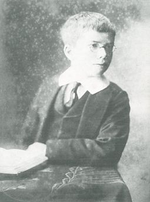
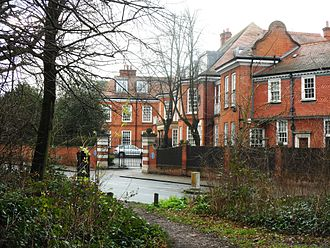
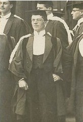
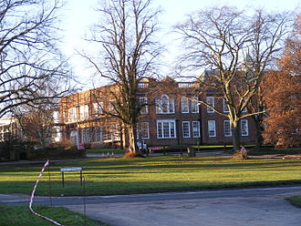
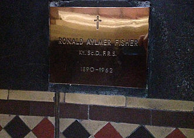
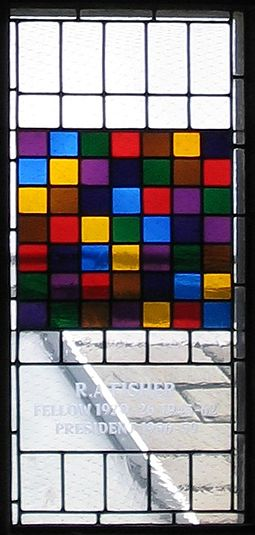
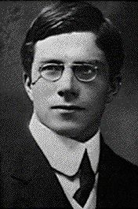

Ronald Fisher - Wikipedia

# Ronald Fisher

From Wikipedia, the free encyclopedia

[Jump to navigation](https://en.wikipedia.org/wiki/Ronald_Fisher#mw-head)[Jump to search](https://en.wikipedia.org/wiki/Ronald_Fisher#p-search)

| [Sir](https://en.wikipedia.org/wiki/Sir) Ronald Fisher [FRS](https://en.wikipedia.org/wiki/Fellow_of_the_Royal_Society) |
| --- |
|  Fisher in 1913 |
| Born | Ronald Aylmer Fisher 17 February 1890 [East Finchley](https://en.wikipedia.org/wiki/East_Finchley), [London](https://en.wikipedia.org/wiki/London), [England](https://en.wikipedia.org/wiki/England), United Kingdom |
| Died | 29 July 1962 (aged 72) [Adelaide](https://en.wikipedia.org/wiki/Adelaide), [South Australia](https://en.wikipedia.org/wiki/South_Australia), Australia |
| Nationality | British |
| Education | [Harrow School](https://en.wikipedia.org/wiki/Harrow_School) |
| Alma mater | [University of Cambridge](https://en.wikipedia.org/wiki/University_of_Cambridge) |
| Known for | [Fisher's principle](https://en.wikipedia.org/wiki/Fisher%27s_principle) [Fisher information](https://en.wikipedia.org/wiki/Fisher_information) |
| Awards | - [Weldon Memorial Prize](https://en.wikipedia.org/wiki/Weldon_Memorial_Prize) (1930) - [Royal Medal](https://en.wikipedia.org/wiki/Royal_Medal) (1938) - [Guy Medal](https://en.wikipedia.org/wiki/Guy_Medal) (1946) - [Copley Medal](https://en.wikipedia.org/wiki/Copley_Medal) (1955) |
| **Scientific career** |
| Fields | [Statistics](https://en.wikipedia.org/wiki/Statistics), [genetics](https://en.wikipedia.org/wiki/Genetics), and [evolutionary biology](https://en.wikipedia.org/wiki/Evolutionary_biology) |
| Institutions | - [Rothamsted Experimental Station](https://en.wikipedia.org/wiki/Rothamsted_Research) - [University College London](https://en.wikipedia.org/wiki/University_College_London) - [University of Cambridge](https://en.wikipedia.org/wiki/University_of_Cambridge) - [University of Adelaide](https://en.wikipedia.org/wiki/University_of_Adelaide) - [Commonwealth Scientific and Industrial Research Organisation](https://en.wikipedia.org/wiki/Commonwealth_Scientific_and_Industrial_Research_Organisation) |
| Academic advisors | [James Hopwood Jeans](https://en.wikipedia.org/wiki/James_Hopwood_Jeans) [F. J. M. Stratton](https://en.wikipedia.org/wiki/F._J._M._Stratton)[[1]](https://en.wikipedia.org/wiki/Ronald_Fisher#cite_note-1) |
| Doctoral students | - [Walter Bodmer](https://en.wikipedia.org/wiki/Walter_Bodmer)[[2]](https://en.wikipedia.org/wiki/Ronald_Fisher#cite_note-mathgene-2) - [D. J. Finney](https://en.wikipedia.org/wiki/D._J._Finney)[[2]](https://en.wikipedia.org/wiki/Ronald_Fisher#cite_note-mathgene-2) - [Mary F. Lyon](https://en.wikipedia.org/wiki/Mary_F._Lyon)[[3]](https://en.wikipedia.org/wiki/Ronald_Fisher#cite_note-zimmer-3) - [C. R. Rao](https://en.wikipedia.org/wiki/C._R._Rao)[[2]](https://en.wikipedia.org/wiki/Ronald_Fisher#cite_note-mathgene-2) |

**Sir Ronald Aylmer Fisher**  [FRS](https://en.wikipedia.org/wiki/Fellow_of_the_Royal_Society)[[4]](https://en.wikipedia.org/wiki/Ronald_Fisher#cite_note-frs-4) (17 February 1890 – 29 July 1962) was a British [statistician](https://en.wikipedia.org/wiki/Statistics) and [geneticist](https://en.wikipedia.org/wiki/Geneticist). For his work in statistics, he has been described as "a genius who almost single-handedly created the foundations for modern statistical science"[[5]](https://en.wikipedia.org/wiki/Ronald_Fisher#cite_note-Hald98-5) and "the single most important figure in 20th century statistics".[[6]](https://en.wikipedia.org/wiki/Ronald_Fisher#cite_note-6) In genetics, his work used [mathematics](https://en.wikipedia.org/wiki/Mathematics) to combine [Mendelian genetics](https://en.wikipedia.org/wiki/Mendelian_genetics) and [natural selection](https://en.wikipedia.org/wiki/Natural_selection); this contributed to the revival of [Darwinism](https://en.wikipedia.org/wiki/Darwinism) in the early 20th-century revision of the theory of [evolution](https://en.wikipedia.org/wiki/Evolution) known as the [modern synthesis](https://en.wikipedia.org/wiki/Modern_synthesis_(20th_century)). For his contributions to biology, Fisher has been called "the greatest of Darwin’s successors".[[7]](https://en.wikipedia.org/wiki/Ronald_Fisher#cite_note-Edwards_pp._421%E2%80%93430-7)

From 1919 onward, he worked at the [Rothamsted Experimental Station](https://en.wikipedia.org/wiki/Rothamsted_Research) for 14 years;[[8]](https://en.wikipedia.org/wiki/Ronald_Fisher#cite_note-russ-8) there, he analysed its immense data from crop experiments since the 1840s, and developed the [analysis of variance](https://en.wikipedia.org/wiki/Analysis_of_variance) (ANOVA). He established his reputation there in the following years as a [biostatistician](https://en.wikipedia.org/wiki/Biostatistics).

He is known as one of the three principal founders of [population genetics](https://en.wikipedia.org/wiki/Population_genetics). He outlined [Fisher's principle](https://en.wikipedia.org/wiki/Fisher%27s_principle), the [Fisherian runaway](https://en.wikipedia.org/wiki/Fisherian_runaway) and [sexy son hypothesis](https://en.wikipedia.org/wiki/Sexy_son_hypothesis) theories of [sexual selection](https://en.wikipedia.org/wiki/Sexual_selection). His contributions to statistics include the [maximum likelihood](https://en.wikipedia.org/wiki/Maximum_likelihood), [fiducial inference](https://en.wikipedia.org/wiki/Fiducial_inference), the derivation of various sampling distributions, founding principles of the [design of experiments](https://en.wikipedia.org/wiki/Design_of_experiments), and much more.

Fisher held strong views on [race](https://en.wikipedia.org/wiki/Race_(classification_of_humans)). Throughout his life, he was a prominent supporter of [eugenics](https://en.wikipedia.org/wiki/Eugenics), an interest which led to his work on statistics and genetics.[[9]](https://en.wikipedia.org/wiki/Ronald_Fisher#cite_note-NewScientist-9) Notably, he was a dissenting voice in the 1950 [UNESCO](https://en.wikipedia.org/wiki/UNESCO) statement *[The Race Question](https://en.wikipedia.org/wiki/The_Race_Question)*, insisting on racial differences.[[10]](https://en.wikipedia.org/wiki/Ronald_Fisher#cite_note-UNESCO1952-10)

## Contents

[hide]

- [1  Early life and education](https://en.wikipedia.org/wiki/Ronald_Fisher#Early_life_and_education)
- [2  Career](https://en.wikipedia.org/wiki/Ronald_Fisher#Career)
    - [2.1  Rothamsted Experimental Station, 1919–1933](https://en.wikipedia.org/wiki/Ronald_Fisher#Rothamsted_Experimental_Station,_1919%E2%80%931933)
    - [2.2  University College London, 1933–39](https://en.wikipedia.org/wiki/Ronald_Fisher#University_College_London,_1933%E2%80%9339)
    - [2.3  University of Cambridge, 1940–1956](https://en.wikipedia.org/wiki/Ronald_Fisher#University_of_Cambridge,_1940%E2%80%931956)
    - [2.4  Adelaide, 1957–1962](https://en.wikipedia.org/wiki/Ronald_Fisher#Adelaide,_1957%E2%80%931962)
- [3  Personal life and beliefs](https://en.wikipedia.org/wiki/Ronald_Fisher#Personal_life_and_beliefs)
    - [3.1  Parapsychology](https://en.wikipedia.org/wiki/Ronald_Fisher#Parapsychology)
    - [3.2  Eugenics](https://en.wikipedia.org/wiki/Ronald_Fisher#Eugenics)
    - [3.3  Race](https://en.wikipedia.org/wiki/Ronald_Fisher#Race)
- [4  Legacy](https://en.wikipedia.org/wiki/Ronald_Fisher#Legacy)
- [5  Recognition](https://en.wikipedia.org/wiki/Ronald_Fisher#Recognition)
- [6  Bibliography](https://en.wikipedia.org/wiki/Ronald_Fisher#Bibliography)
- [7  References](https://en.wikipedia.org/wiki/Ronald_Fisher#References)
    - [7.1  Citations](https://en.wikipedia.org/wiki/Ronald_Fisher#Citations)
    - [7.2  Sources](https://en.wikipedia.org/wiki/Ronald_Fisher#Sources)
- [8  Further reading](https://en.wikipedia.org/wiki/Ronald_Fisher#Further_reading)
- [9  External links](https://en.wikipedia.org/wiki/Ronald_Fisher#External_links)

## Early life and education[[edit](https://en.wikipedia.org/w/index.php?title=Ronald_Fisher&action=edit&section=1)]

[(L)](https://en.wikipedia.org/wiki/File:Ronald_Fisher_as_a_child.JPG)
As a child

[(L)](https://en.wikipedia.org/wiki/File:Sir_Ronald_Aylmer_Fisher_-_Inverforth_House_North_End_Way_NW3.jpg)

Inverforth House North End Way NW3, where Fisher lived from 1896 to 1904

Fisher was born in [East Finchley](https://en.wikipedia.org/wiki/East_Finchley) in [London, England](https://en.wikipedia.org/wiki/London,_England), into a middle-class household; his father, George, was a successful partner in Robinson & Fisher, auctioneers and fine art dealers.[[11]](https://en.wikipedia.org/wiki/Ronald_Fisher#cite_note-Heritage-11) He was one of twins, with the other twin being still-born[[12]](https://en.wikipedia.org/wiki/Ronald_Fisher#cite_note-12) and grew up the youngest, with three sisters and one brother.[[13]](https://en.wikipedia.org/wiki/Ronald_Fisher#cite_note-13) From 1896 until 1904 they lived at [Inverforth House](https://en.wikipedia.org/wiki/Inverforth_House) in London, where [English Heritage](https://en.wikipedia.org/wiki/English_Heritage) installed a [blue plaque](https://en.wikipedia.org/wiki/Blue_plaque) in 2002, before moving to [Streatham](https://en.wikipedia.org/wiki/Streatham).[[14]](https://en.wikipedia.org/wiki/Ronald_Fisher#cite_note-BluePlaque-14) His mother, Kate, died from acute [peritonitis](https://en.wikipedia.org/wiki/Peritonitis) when he was 14, and his father lost his business 18 months later.[[11]](https://en.wikipedia.org/wiki/Ronald_Fisher#cite_note-Heritage-11)

Lifelong poor eyesight caused his rejection by the [British Army](https://en.wikipedia.org/wiki/British_Army) for [World War I](https://en.wikipedia.org/wiki/World_War_I),[[15]](https://en.wikipedia.org/wiki/Ronald_Fisher#cite_note-Wiley-15) but also developed his ability to visualize problems in [geometrical](https://en.wikipedia.org/wiki/Geometry) terms, not in writing mathematical solutions, or proofs. He entered [Harrow School](https://en.wikipedia.org/wiki/Harrow_School) age 14 and won the school's Neeld Medal in mathematics. In 1909, he won a scholarship to study [Mathematics](https://en.wikipedia.org/wiki/Mathematics) at [Gonville and Caius College, Cambridge](https://en.wikipedia.org/wiki/Gonville_and_Caius_College,_Cambridge). In 1912, he gained a First in [Mathematics](https://en.wikipedia.org/wiki/Mathematics).[[16]](https://en.wikipedia.org/wiki/Ronald_Fisher#cite_note-16) In 1915 he published a paper *The evolution of sexual preference*[[17]](https://en.wikipedia.org/wiki/Ronald_Fisher#cite_note-17) on [sexual selection](https://en.wikipedia.org/wiki/Sexual_selection) and [mate choice](https://en.wikipedia.org/wiki/Mate_choice).

## Career[[edit](https://en.wikipedia.org/w/index.php?title=Ronald_Fisher&action=edit&section=2)]

During 1913–1919, Fisher worked for six years as a statistician in the City of London and taught [physics](https://en.wikipedia.org/wiki/Physics) and maths at a sequence of [public schools](https://en.wikipedia.org/wiki/Public_school_(UK)), at the [Thames Nautical Training College](https://en.wikipedia.org/wiki/Thames_Nautical_Training_College), and at [Bradfield College](https://en.wikipedia.org/wiki/Bradfield_College). There he settled with his new bride, Eileen Guinness, with whom he had two sons and six daughters.[[18]](https://en.wikipedia.org/wiki/Ronald_Fisher#cite_note-box-18)

In 1918 he published "[The Correlation Between Relatives on the Supposition of Mendelian Inheritance](https://en.wikipedia.org/wiki/The_Correlation_Between_Relatives_on_the_Supposition_of_Mendelian_Inheritance)", in which he introduced the term [variance](https://en.wikipedia.org/wiki/Variance) and proposed its formal analysis.[[19]](https://en.wikipedia.org/wiki/Ronald_Fisher#cite_note-19) He put forward a [genetics](https://en.wikipedia.org/wiki/Genetics)  [conceptual model](https://en.wikipedia.org/wiki/Conceptual_model) showing that [continuous variation](https://en.wikipedia.org/wiki/Quantitative_trait_locus) amongst [phenotypic traits](https://en.wikipedia.org/wiki/Phenotypic_trait) measured by biostatisticians could be produced by the combined action of many discrete genes and thus be the result of [Mendelian inheritance](https://en.wikipedia.org/wiki/Mendelian_inheritance). This was the first step towards establishing [population genetics](https://en.wikipedia.org/wiki/Population_genetics) and [quantitative genetics](https://en.wikipedia.org/wiki/Quantitative_genetics), which demonstrated that [natural selection](https://en.wikipedia.org/wiki/Natural_selection) could change [allele frequencies](https://en.wikipedia.org/wiki/Allele_frequency) in a population, resulting in reconciling its discontinuous nature with gradual [evolution](https://en.wikipedia.org/wiki/Evolution).[[20]](https://en.wikipedia.org/wiki/Ronald_Fisher#cite_note-20) Joan Box, Fisher's biographer and daughter says that Fisher had resolved this problem already in 1911.[[21]](https://en.wikipedia.org/wiki/Ronald_Fisher#cite_note-21)

### Rothamsted Experimental Station, 1919–1933[[edit](https://en.wikipedia.org/w/index.php?title=Ronald_Fisher&action=edit&section=3)]

In 1919, he began working at the [Rothamsted Experimental Station](https://en.wikipedia.org/wiki/Rothamsted_Research) for 14 years,[[8]](https://en.wikipedia.org/wiki/Ronald_Fisher#cite_note-russ-8) where he analysed its immense data from crop experiments since the 1840s, and developed the [analysis of variance](https://en.wikipedia.org/wiki/Analysis_of_variance) (ANOVA). In 1919, he was offered a position at the [Galton Laboratory](https://en.wikipedia.org/wiki/Galton_Laboratory) in [University College London](https://en.wikipedia.org/wiki/University_College_London) led by [Karl Pearson](https://en.wikipedia.org/wiki/Karl_Pearson), but instead accepted a temporary job at Rothamsted in [Harpenden](https://en.wikipedia.org/wiki/Harpenden) to investigate the possibility of analysing the vast amount of crop data accumulated since 1842 from the "Classical Field Experiments". He analysed the data recorded over many years and in 1921, published *Studies in Crop Variation*, and his first application of the analysis of variance [ANOVA](https://en.wikipedia.org/wiki/ANOVA).[[22]](https://en.wikipedia.org/wiki/Ronald_Fisher#cite_note-22) In 1928, [Joseph Oscar Irwin](https://en.wikipedia.org/wiki/Joseph_Oscar_Irwin) began a three-year stint at Rothamsted and became one of the first people to master Fisher's innovations. Between 1912 and 1922 Fisher recommended, analyzed (with flawed attempts at [proofs](https://en.wikipedia.org/wiki/Mathematical_proof)) and vastly popularized [Maximum likelihood](https://en.wikipedia.org/wiki/Maximum_likelihood).[[23]](https://en.wikipedia.org/wiki/Ronald_Fisher#cite_note-23)

[(L)](https://en.wikipedia.org/wiki/File:Ronald_Fisher_1912_graduation_Cambridge.JPG)

On graduating from Cambridge University, 1912

[(L)](https://en.wikipedia.org/wiki/File:Peacock_Flying.jpg)
The peacock tail in flight, the classic example of a Fisherian runaway

[(L)](https://en.wikipedia.org/wiki/File:Rothamstead_Research_Centre_-_geograph.org.uk_-_1724254.jpg)

Rothamsted Research

Fisher's 1924 article *On a distribution yielding the error functions of several well known statistics* presented [Pearson's chi-squared test](https://en.wikipedia.org/wiki/Pearson%27s_chi-squared_test) and [William Gosset](https://en.wikipedia.org/wiki/William_Sealy_Gosset)'s [Student's t-distribution](https://en.wikipedia.org/wiki/Student%27s_t-distribution) in the same framework as the [Gaussian distribution](https://en.wikipedia.org/wiki/Gaussian_distribution) and is where he developed [Fisher's z-distribution](https://en.wikipedia.org/wiki/Fisher%27s_z-distribution) a new statistical method, commonly used decades later as the [F distribution](https://en.wikipedia.org/wiki/F_distribution). He pioneered the principles of the [design of experiments](https://en.wikipedia.org/wiki/Design_of_experiments) and the statistics of small samples and the analysis of real data.

In 1925 he published *[Statistical Methods for Research Workers](https://en.wikipedia.org/wiki/Statistical_Methods_for_Research_Workers)*, one of the 20th century's most influential books on statistical methods.[[24]](https://en.wikipedia.org/wiki/Ronald_Fisher#cite_note-Conniffe-24)  [Fisher's method](https://en.wikipedia.org/wiki/Fisher%27s_method)[[25]](https://en.wikipedia.org/wiki/Ronald_Fisher#cite_note-25)[[26]](https://en.wikipedia.org/wiki/Ronald_Fisher#cite_note-26) is a technique for [data fusion](https://en.wikipedia.org/wiki/Data_fusion) or "[meta-analysis](https://en.wikipedia.org/wiki/Meta-analysis)" (analysis of analyses). This book also popularized the [p-value](https://en.wikipedia.org/wiki/P-value), and plays a central role in his approach. Fisher proposes the level p=0.05, or a 1 in 20 chance of being exceeded by chance, as a limit for statistical significance, and applies this to a normal distribution (as a two-tailed test), thus yielding the rule of two standard deviations (on a normal distribution) for statistical significance.[[27]](https://en.wikipedia.org/wiki/Ronald_Fisher#cite_note-27) The [1.96](https://en.wikipedia.org/wiki/1.96), the approximate value of the 97.5 percentile point of the normal distribution used in probability and statistics, also originated in this book.

> "The value for which P=0.05, or 1 in 20, is 1.96 or nearly 2 ; it is convenient to take this point as a limit in judging whether a deviation is to be considered significant or not."> [> [28]](https://en.wikipedia.org/wiki/Ronald_Fisher#cite_note-28)

In Table 1 of the work, he gave the more precise value 1.959964.[[29]](https://en.wikipedia.org/wiki/Ronald_Fisher#cite_note-29)

In 1928, Fisher was the first to use [diffusion equations](https://en.wikipedia.org/wiki/Diffusion_equation) to attempt to calculate the distribution of [allele](https://en.wikipedia.org/wiki/Allele) frequencies and the estimation of [genetic linkage](https://en.wikipedia.org/wiki/Genetic_linkage) by maximum likelihood methods among populations.[[30]](https://en.wikipedia.org/wiki/Ronald_Fisher#cite_note-30)

In 1930, *[The Genetical Theory of Natural Selection](https://en.wikipedia.org/wiki/The_Genetical_Theory_of_Natural_Selection)* was first published by [Clarendon Press](https://en.wikipedia.org/wiki/Oxford_University_Press) and is dedicated to [Leonard Darwin](https://en.wikipedia.org/wiki/Leonard_Darwin). A core work of the neo-Darwinian [modern evolutionary synthesis](https://en.wikipedia.org/wiki/Modern_synthesis_(20th_century)),[[31]](https://en.wikipedia.org/wiki/Ronald_Fisher#cite_note-31) it helped define [population genetics](https://en.wikipedia.org/wiki/Population_genetics), which Fisher founded alongside [Sewall Wright](https://en.wikipedia.org/wiki/Sewall_Wright) and [J. B. S. Haldane](https://en.wikipedia.org/wiki/J._B._S._Haldane), and revived Darwins neglected idea of [sexual selection](https://en.wikipedia.org/wiki/Sexual_selection).[[32]](https://en.wikipedia.org/wiki/Ronald_Fisher#cite_note-32) One of Fisher's favorite aphorisms was "Natural selection is a mechanism for generating an exceedingly high degree of improbability."[[33]](https://en.wikipedia.org/wiki/Ronald_Fisher#cite_note-33)

Fisher's fame grew and he began to travel and lecture widely. In 1931, he spent six weeks at the Statistical Laboratory at [Iowa State College](https://en.wikipedia.org/wiki/Iowa_State_College) where he gave three lectures per week, and met many American statisticians, including [George W. Snedecor](https://en.wikipedia.org/wiki/George_W._Snedecor). He returned there again in 1936.[*[citation needed](https://en.wikipedia.org/wiki/Wikipedia:Citation_needed)*]

### University College London, 1933–39[[edit](https://en.wikipedia.org/w/index.php?title=Ronald_Fisher&action=edit&section=4)]

In 1933, Fisher became the head of the Department of [Eugenics](https://en.wikipedia.org/wiki/Eugenics) at [University College London](https://en.wikipedia.org/wiki/University_College_London).[[34]](https://en.wikipedia.org/wiki/Ronald_Fisher#cite_note-34) In 1935, he published *[The Design of Experiments](https://en.wikipedia.org/wiki/The_Design_of_Experiments)*, which was "also fundamental, [and promoted] statistical technique and application... The mathematical justification of the methods was not stressed and proofs were often barely sketched or omitted altogether .... [This] led [H.B. Mann](https://en.wikipedia.org/wiki/Henry_Mann) to fill the gaps with a rigorous mathematical treatment".[[24]](https://en.wikipedia.org/wiki/Ronald_Fisher#cite_note-Conniffe-24)[[35]](https://en.wikipedia.org/wiki/Ronald_Fisher#cite_note-35) In this book Fisher also outlined the [Lady tasting tea](https://en.wikipedia.org/wiki/Lady_tasting_tea), now a famous [design](https://en.wikipedia.org/wiki/Design_of_experiments) of a statistical [randomized experiment](https://en.wikipedia.org/wiki/Randomized_experiment) which uses [Fisher's exact test](https://en.wikipedia.org/wiki/Fisher%27s_exact_test) and is the original exposition of Fisher's notion of a [null hypothesis](https://en.wikipedia.org/wiki/Null_hypothesis).[[36]](https://en.wikipedia.org/wiki/Ronald_Fisher#cite_note-36)[[37]](https://en.wikipedia.org/wiki/Ronald_Fisher#cite_note-37)

The same year he also published a paper on [fiducial inference](https://en.wikipedia.org/wiki/Fiducial_inference)[[38]](https://en.wikipedia.org/wiki/Ronald_Fisher#cite_note-38)[[39]](https://en.wikipedia.org/wiki/Ronald_Fisher#cite_note-39) and applied it to the [Behrens–Fisher problem](https://en.wikipedia.org/wiki/Behrens%E2%80%93Fisher_problem), the solution to which, proposed first by [Walter Behrens](https://en.wikipedia.org/wiki/Walter_Behrens_(statistician)) and a few years later by Fisher, is the [Behrens–Fisher distribution](https://en.wikipedia.org/wiki/Behrens%E2%80%93Fisher_distribution).

In 1936 he introduced the [Iris flower data set](https://en.wikipedia.org/wiki/Iris_flower_data_set) as an example of [discriminant analysis](https://en.wikipedia.org/wiki/Discriminant_analysis).[[40]](https://en.wikipedia.org/wiki/Ronald_Fisher#cite_note-40)

In his 1937 paper *The wave of advance of advantageous genes* he proposed [Fisher's equation](https://en.wikipedia.org/wiki/Fisher%27s_equation) in the context of [population dynamics](https://en.wikipedia.org/wiki/Population_dynamics) to describe the spatial spread of an advantageous [allele](https://en.wikipedia.org/wiki/Allele) and explored its travelling wave solutions.[[41]](https://en.wikipedia.org/wiki/Ronald_Fisher#cite_note-41) Out of this also came the [Fisher–Kolmogorov equation](https://en.wikipedia.org/wiki/Fisher%E2%80%93Kolmogorov_equation).[[42]](https://en.wikipedia.org/wiki/Ronald_Fisher#cite_note-42)In 1937, he visited the [Indian Statistical Institute](https://en.wikipedia.org/wiki/Indian_Statistical_Institute) in Calcutta, and its one part-time employee, [P. C. Mahalanobis](https://en.wikipedia.org/wiki/P._C._Mahalanobis), often returning to encourage its development. He was the guest of honour at its 25th anniversary in 1957, when it had 2000 employees.[[43]](https://en.wikipedia.org/wiki/Ronald_Fisher#cite_note-43)

In 1938, Fisher and [Frank Yates](https://en.wikipedia.org/wiki/Frank_Yates) described the [Fisher–Yates shuffle](https://en.wikipedia.org/wiki/Fisher%E2%80%93Yates_shuffle) in their book *Statistical tables for biological, agricultural and medical research*.[[44]](https://en.wikipedia.org/wiki/Ronald_Fisher#cite_note-44) Their description of the algorithm used pencil and paper; a table of random numbers provided the randomness.

### University of Cambridge, 1940–1956[[edit](https://en.wikipedia.org/w/index.php?title=Ronald_Fisher&action=edit&section=5)]

In 1943, along with [A.S. Corbet](https://en.wikipedia.org/wiki/Alexander_Steven_Corbet) and [C.B. Williams](https://en.wikipedia.org/wiki/C.B._Williams) he published a paper on [relative species abundance](https://en.wikipedia.org/wiki/Relative_species_abundance) where he developed the logseries to fit two different abundance data sets[[45]](https://en.wikipedia.org/wiki/Ronald_Fisher#cite_note-45) In the same year he took the [Balfour Chair of Genetics](https://en.wikipedia.org/wiki/Balfour_Chair_of_Genetics) where the Italian researcher [Luigi Luca Cavalli-Sforza](https://en.wikipedia.org/wiki/Luigi_Luca_Cavalli-Sforza) was recruited in 1948, establishing a one-man unit of bacterial genetics.

In 1936, Fisher used a [Pearson's chi-squared test](https://en.wikipedia.org/wiki/Pearson%27s_chi-squared_test) to analyze Mendel's data and concluded that Mendel's results with the predicted ratios were far too perfect, suggesting that adjustments (intentional or unconscious) had been made to the data to make the observations fit the hypothesis.[[46]](https://en.wikipedia.org/wiki/Ronald_Fisher#cite_note-46) Later authors have claimed Fisher's analysis was flawed, proposing various statistical and botanical explanations for Mendel's numbers.[[47]](https://en.wikipedia.org/wiki/Ronald_Fisher#cite_note-47)[[48]](https://en.wikipedia.org/wiki/Ronald_Fisher#cite_note-48) In 1947, Fisher cofounded the journal *[Heredity](https://en.wikipedia.org/wiki/Heredity_(journal))* with [Cyril Darlington](https://en.wikipedia.org/wiki/Cyril_Darlington) and in 1949 he published *The Theory of Inbreeding.*

In 1950 he published "Gene Frequencies in a Cline Determined by Selection and Diffusion".[[49]](https://en.wikipedia.org/wiki/Ronald_Fisher#cite_note-49) He developed computational [algorithms](https://en.wikipedia.org/wiki/Algorithm) for analyzing data from his balanced experimental designs,[[50]](https://en.wikipedia.org/wiki/Ronald_Fisher#cite_note-50) with various editions and translations, becoming a standard reference work for scientists in many disciplines. In [ecological genetics](https://en.wikipedia.org/wiki/Ecological_genetics) he and [E. B. Ford](https://en.wikipedia.org/wiki/E._B._Ford) showed how the force of natural selection was much stronger than had been assumed, with many ecogenetic situations (such as [polymorphism](https://en.wikipedia.org/wiki/Polymorphism_(biology))) being maintained by the force of selection.

During this time he also worked on mouse chromosome mapping; breeding the mice in laboratories in his own house.[[51]](https://en.wikipedia.org/wiki/Ronald_Fisher#cite_note-51)

Fisher publicly spoke out against the 1950 study showing that smoking [tobacco](https://en.wikipedia.org/wiki/Tobacco) causes [lung cancer](https://en.wikipedia.org/wiki/Lung_cancer), arguing that [correlation does not imply causation](https://en.wikipedia.org/wiki/Correlation_does_not_imply_causation).[[52]](https://en.wikipedia.org/wiki/Ronald_Fisher#cite_note-52)[[53]](https://en.wikipedia.org/wiki/Ronald_Fisher#cite_note-53)[[54]](https://en.wikipedia.org/wiki/Ronald_Fisher#cite_note-54)[[55]](https://en.wikipedia.org/wiki/Ronald_Fisher#cite_note-55)[[56]](https://en.wikipedia.org/wiki/Ronald_Fisher#cite_note-56)[[57]](https://en.wikipedia.org/wiki/Ronald_Fisher#cite_note-57) To quote his biographers Yates and Mather, "It has been suggested that the fact that Fisher was employed as consultant by the [tobacco](https://en.wikipedia.org/wiki/Tobacco) firms in this controversy casts doubt on the value of his arguments. This is to misjudge the man. He was not above accepting financial reward for his labours, but the reason for his interest was undoubtedly his dislike and mistrust of puritanical tendencies of all kinds; and perhaps also the personal solace he had always found in tobacco."[[4]](https://en.wikipedia.org/wiki/Ronald_Fisher#cite_note-frs-4)

He gave the 1953 [Croonian lecture](https://en.wikipedia.org/wiki/Croonian_lecture) on population genetics.[[58]](https://en.wikipedia.org/wiki/Ronald_Fisher#cite_note-58)

In the winter of 1954–1955 Fisher met [Debabrata Basu](https://en.wikipedia.org/wiki/Debabrata_Basu), the [Indian](https://en.wikipedia.org/wiki/India) statistician who wrote in 1988, "With his reference set argument, Sir Ronald was trying to find a *[via media](https://en.wikipedia.org/wiki/Via_media)* between the two poles of Statistics – Berkeley and Bayes.[[59]](https://en.wikipedia.org/wiki/Ronald_Fisher#cite_note-59) My efforts to understand this Fisher compromise led me to the [likelihood principle](https://en.wikipedia.org/wiki/Likelihood_principle)".[[60]](https://en.wikipedia.org/wiki/Ronald_Fisher#cite_note-60)

### Adelaide, 1957–1962[[edit](https://en.wikipedia.org/w/index.php?title=Ronald_Fisher&action=edit&section=6)]

[(L)](https://en.wikipedia.org/wiki/File:Ronald_Aylmer_Fisher.jpg)

Memorial plaque over his remains, lectern-side aisle of St Peter's Cathedral, Adelaide

In 1957, a retired Fisher emigrated to [Australia](https://en.wikipedia.org/wiki/Australia), where he spent time as a senior research fellow at the Australian [Commonwealth Scientific and Industrial Research Organisation](https://en.wikipedia.org/wiki/Commonwealth_Scientific_and_Industrial_Research_Organisation) (CSIRO) in [Adelaide](https://en.wikipedia.org/wiki/Adelaide). He died there in 1962, and his remains were interred within [St Peter's Cathedral](https://en.wikipedia.org/wiki/St_Peter%27s_Cathedral,_Adelaide), Adelaide.[[61]](https://en.wikipedia.org/wiki/Ronald_Fisher#cite_note-61)

## Personal life and beliefs[[edit](https://en.wikipedia.org/w/index.php?title=Ronald_Fisher&action=edit&section=7)]

He married Eileen Guinness, with whom he had two sons and six daughters.[[18]](https://en.wikipedia.org/wiki/Ronald_Fisher#cite_note-box-18)His marriage disintegrated during [World War II](https://en.wikipedia.org/wiki/World_War_II), and his older son George, an [aviator](https://en.wikipedia.org/wiki/Aviator), was killed in combat.[[62]](https://en.wikipedia.org/wiki/Ronald_Fisher#cite_note-62) His daughter Joan, who wrote a biography of her father, married the statistician [George E. P. Box](https://en.wikipedia.org/wiki/George_E._P._Box).[[63]](https://en.wikipedia.org/wiki/Ronald_Fisher#cite_note-63)

[(L)](https://en.wikipedia.org/wiki/File:Fisher-stainedglass-gonville-caius.jpg)

Stained glass window in the dining hall of [Caius College](https://en.wikipedia.org/wiki/Gonville_and_Caius_College,_Cambridge), in Cambridge, commemorating Ronald Fisher and representing a [Latin square](https://en.wikipedia.org/wiki/Latin_square), discussed by him in *[The Design of Experiments](https://en.wikipedia.org/wiki/The_Design_of_Experiments)*

According to Yates and Mather, "His large family, in particular, reared in conditions of great financial stringency, was a personal expression of his genetic and evolutionary convictions."[[4]](https://en.wikipedia.org/wiki/Ronald_Fisher#cite_note-frs-4) Fisher was noted for being loyal, and was seen as a patriot, a member of the [Church of England](https://en.wikipedia.org/wiki/Church_of_England), politically [conservative](https://en.wikipedia.org/wiki/Conservative), as well as a scientific rationalist. He developed a reputation for carelessness in his dress and was the archetype of the absent-minded professor. [H. Allen Orr](https://en.wikipedia.org/wiki/H._Allen_Orr) describes him in the *Boston Review* as a "deeply devout [Anglican](https://en.wikipedia.org/wiki/Anglican) who, between founding modern statistics and population genetics, penned articles for church magazines".[[64]](https://en.wikipedia.org/wiki/Ronald_Fisher#cite_note-64) In a 1955 broadcast on Science and Christianity,[[4]](https://en.wikipedia.org/wiki/Ronald_Fisher#cite_note-frs-4) he said:

> The custom of making abstract dogmatic assertions is not, certainly, derived from the teaching of > [> Jesus](https://en.wikipedia.org/wiki/Jesus)> , but has been a widespread weakness among religious teachers in subsequent centuries. I do not think that the word for the Christian virtue of faith should be prostituted to mean the credulous acceptance of all such piously intended assertions. Much self-deception in the young believer is needed to convince himself that he knows that of which in reality he knows himself to be ignorant. That surely is hypocrisy, against which we have been most conspicuously warned.

### Parapsychology[[edit](https://en.wikipedia.org/w/index.php?title=Ronald_Fisher&action=edit&section=8)]

Fisher was involved with the [Society for Psychical Research](https://en.wikipedia.org/wiki/Society_for_Psychical_Research).[[65]](https://en.wikipedia.org/wiki/Ronald_Fisher#cite_note-65)[[66]](https://en.wikipedia.org/wiki/Ronald_Fisher#cite_note-66)

### Eugenics[[edit](https://en.wikipedia.org/w/index.php?title=Ronald_Fisher&action=edit&section=9)]

[(L)](https://en.wikipedia.org/wiki/File:RonaldFisher1912.jpg)

As a steward at the First [International Eugenics Conference](https://en.wikipedia.org/wiki/International_Eugenics_Conference), 1912

In 1910 Fisher joined the [Eugenics Society (UK)](https://en.wikipedia.org/wiki/Eugenics_Society_(UK)) at University of Cambridge, whose members included [John Maynard Keynes](https://en.wikipedia.org/wiki/John_Maynard_Keynes), [R. C. Punnett](https://en.wikipedia.org/wiki/R._C._Punnett), and [Horace Darwin](https://en.wikipedia.org/wiki/Horace_Darwin). He saw [eugenics](https://en.wikipedia.org/wiki/Eugenics) as addressing pressing social and scientific issues that encompassed and drove his interest in both genetics and statistics. During World War I Fisher started writing book reviews for the *Eugenic Review* and volunteered to undertake all such reviews for the journal, being hired for a part-time position.

The last third of *The Genetical Theory of Natural Selection* focussed on eugenics, attributing the fall of [civilizations](https://en.wikipedia.org/wiki/Civilization) to the fertility of their upper classes being diminished, and used British 1911 census data to show an inverse relationship between fertility and social class, partly due, he claimed, to the lower financial costs and hence increasing social status of families with fewer children. He proposed the abolition of extra allowances to large families, with the allowances proportional to the earnings of the father. He served in several official committees to promote eugenics. In 1934, he resigned from the Eugenics Society over a dispute about increasing the power of scientists within the movement.[[67]](https://en.wikipedia.org/wiki/Ronald_Fisher#cite_note-Adelaide-67)[[9]](https://en.wikipedia.org/wiki/Ronald_Fisher#cite_note-NewScientist-9)[[68]](https://en.wikipedia.org/wiki/Ronald_Fisher#cite_note-Cruz-68)

### Race[[edit](https://en.wikipedia.org/w/index.php?title=Ronald_Fisher&action=edit&section=10)]

In 1950, Fisher opposed [UNESCO](https://en.wikipedia.org/wiki/UNESCO)'s [The Race Question](https://en.wikipedia.org/wiki/The_Race_Question), believing that evidence and everyday experience showed that human groups differ profoundly "in their innate capacity for intellectual and emotional development" and concluded that the "practical international problem is that of learning to share the resources of this planet amicably with persons of materially different nature", and that "this problem is being obscured by entirely well-intentioned efforts to minimize the real differences that exist". The revised statement titled "The Race Concept: Results of an Inquiry" (1951) was accompanied by Fisher's dissenting commentary.[[10]](https://en.wikipedia.org/wiki/Ronald_Fisher#cite_note-UNESCO1952-10)

## Legacy[[edit](https://en.wikipedia.org/w/index.php?title=Ronald_Fisher&action=edit&section=11)]

Fisher's former doctoral students include [Walter Bodmer](https://en.wikipedia.org/wiki/Walter_Bodmer),[[2]](https://en.wikipedia.org/wiki/Ronald_Fisher#cite_note-mathgene-2)  [D. J. Finney](https://en.wikipedia.org/wiki/D._J._Finney),[[2]](https://en.wikipedia.org/wiki/Ronald_Fisher#cite_note-mathgene-2)  [Mary F. Lyon](https://en.wikipedia.org/wiki/Mary_F._Lyon)[[3]](https://en.wikipedia.org/wiki/Ronald_Fisher#cite_note-zimmer-3)and [C. R. Rao](https://en.wikipedia.org/wiki/C._R._Rao)[[2]](https://en.wikipedia.org/wiki/Ronald_Fisher#cite_note-mathgene-2) Although a prominent opponent of [Bayesian statistics](https://en.wikipedia.org/wiki/Bayesian_statistics), Fisher was the first to use the term "Bayesian", in 1950.[[69]](https://en.wikipedia.org/wiki/Ronald_Fisher#cite_note-69) The 1930 *[The Genetical Theory of Natural Selection](https://en.wikipedia.org/wiki/The_Genetical_Theory_of_Natural_Selection)* is commonly cited in biology books, and outlines many important concepts, such as:

- [Parental investment](https://en.wikipedia.org/wiki/Parental_investment), is any parental expenditure (time, energy etc.) that benefits one [offspring](https://en.wikipedia.org/wiki/Offspring) at a cost to [parents](https://en.wikipedia.org/wiki/Parent)' ability to invest in other components of [fitness](https://en.wikipedia.org/wiki/Fitness_(biology)),[[70]](https://en.wikipedia.org/wiki/Ronald_Fisher#cite_note-Clutton-Brock1991-70)[[71]](https://en.wikipedia.org/wiki/Ronald_Fisher#cite_note-Trivers1972-71)
- [Fisherian runaway](https://en.wikipedia.org/wiki/Fisherian_runaway), explaining how the desire for a [phenotypic trait](https://en.wikipedia.org/wiki/Phenotypic_trait) in one sex combined with the trait in the other sex (for example a [peacock](https://en.wikipedia.org/wiki/Peafowl)'s tail) creates a runaway development of the trait.
- [Fisher's principle](https://en.wikipedia.org/wiki/Fisher%27s_principle), which explains why the [sex ratio](https://en.wikipedia.org/wiki/Sex_ratio) is mostly 1:1 in nature.
- [Reproductive value](https://en.wikipedia.org/wiki/Reproductive_value_(population_genetics)) which implies that [sexually reproductive](https://en.wikipedia.org/wiki/Sexual_reproduction) value measures the contribution of an individual of a given age to the future growth of the [population](https://en.wikipedia.org/wiki/Population).[[72]](https://en.wikipedia.org/wiki/Ronald_Fisher#cite_note-72)[[73]](https://en.wikipedia.org/wiki/Ronald_Fisher#cite_note-73)
- [Fisher's fundamental theorem of natural selection](https://en.wikipedia.org/wiki/Fisher%27s_fundamental_theorem_of_natural_selection), which states that "the rate of increase in [fitness](https://en.wikipedia.org/wiki/Fitness_(biology)) of any [organism](https://en.wikipedia.org/wiki/Organism) at any time is equal to its [genetic variance](https://en.wikipedia.org/wiki/Genetic_variance) in fitness at that time."[[74]](https://en.wikipedia.org/wiki/Ronald_Fisher#cite_note-Fisher-74)
- [Fisher's geometric model](https://en.wikipedia.org/wiki/Fisher%27s_geometric_model), an [evolutionary](https://en.wikipedia.org/wiki/Evolution) model of the [effect sizes](https://en.wikipedia.org/wiki/Effect_size) on [fitness](https://en.wikipedia.org/wiki/Fitness_(biology)) of spontaneous [mutations](https://en.wikipedia.org/wiki/Mutations) proposed by Fisher to explain the distribution of effects of mutations that could contribute to [adaptive](https://en.wikipedia.org/wiki/Adaptation_(biology)) evolution.[[75]](https://en.wikipedia.org/wiki/Ronald_Fisher#cite_note-brief-history-75)
- [Sexy son hypothesis](https://en.wikipedia.org/wiki/Sexy_son_hypothesis), which hypothesizes that females may choose arbitrarily attractive male mates simply because they are attractive, thus increasing the attractiveness of their sons who attract more mates of their own. This is in contrast to theories of female mate choice based on the assumption that females choose attractive males because the attractive traits are markers of male fitness.[[76]](https://en.wikipedia.org/wiki/Ronald_Fisher#cite_note-76)
- [Mimicry](https://en.wikipedia.org/wiki/Mimicry), a similarity of one species to another that protects one or both
- [Dominance](https://en.wikipedia.org/wiki/Dominance_(genetics)), a relationship between [alleles](https://en.wikipedia.org/wiki/Allele) of one [gene](https://en.wikipedia.org/wiki/Gene), in which the effect on [phenotype](https://en.wikipedia.org/wiki/Phenotype) of one allele masks the contribution of a second allele at the same [locus](https://en.wikipedia.org/wiki/Locus_(genetics)).[[77]](https://en.wikipedia.org/wiki/Ronald_Fisher#cite_note-77)
- [Heterozygote advantage](https://en.wikipedia.org/wiki/Heterozygote_advantage)[[78]](https://en.wikipedia.org/wiki/Ronald_Fisher#cite_note-78) which was later found to play a frequent role in genetic polymorphism.
- Demonstrating that the probability of a mutation increasing the [fitness](https://en.wikipedia.org/wiki/Fitness_(biology)) of an organism decreases proportionately with the magnitude of the mutation and that larger populations carry more variation so that they have a greater chance of survival.

Fisher is also known for:

- [Linear discriminant analysis](https://en.wikipedia.org/wiki/Linear_discriminant_analysis) is a generalization of Fisher's linear discriminant[[79]](https://en.wikipedia.org/wiki/Ronald_Fisher#cite_note-79)[[80]](https://en.wikipedia.org/wiki/Ronald_Fisher#cite_note-80)
- [Fisher information](https://en.wikipedia.org/wiki/Fisher_information), see also [scoring algorithm](https://en.wikipedia.org/wiki/Scoring_algorithm) also known as Fisher's scoring, and [Minimum Fisher information](https://en.wikipedia.org/wiki/Minimum_Fisher_information), a variational principle which, when applied with the proper constraints needed to reproduce empirically known expectation values, determines the best probability distribution that characterizes the system.[[81]](https://en.wikipedia.org/wiki/Ronald_Fisher#cite_note-81)
- [F-distribution](https://en.wikipedia.org/wiki/F-distribution), arises frequently as the null distribution of a [test statistic](https://en.wikipedia.org/wiki/Test_statistic), most notably in the analysis of variance
- [Fisher–Tippett–Gnedenko theorem](https://en.wikipedia.org/wiki/Fisher%E2%80%93Tippett%E2%80%93Gnedenko_theorem) Fisher's contribution to this was made in 1927
- [Fisher–Tippett distribution](https://en.wikipedia.org/wiki/Fisher%E2%80%93Tippett_distribution)
- [Von Mises–Fisher distribution](https://en.wikipedia.org/wiki/Von_Mises%E2%80%93Fisher_distribution)[[82]](https://en.wikipedia.org/wiki/Ronald_Fisher#cite_note-82)
- [Inverse probability](https://en.wikipedia.org/wiki/Inverse_probability), a term Fisher used in 1922, referring to "the fundamental paradox of inverse probability" as the source of the confusion between statistical terms which refer to the true value to be estimated, with the actual value arrived at by estimation, which is subject to error.[[83]](https://en.wikipedia.org/wiki/Ronald_Fisher#cite_note-83)
- [Fisher's permutation test](https://en.wikipedia.org/wiki/Resampling_(statistics))
- [Fisher's inequality](https://en.wikipedia.org/wiki/Fisher%27s_inequality)[[84]](https://en.wikipedia.org/wiki/Ronald_Fisher#cite_note-84)
- [Sufficient statistic](https://en.wikipedia.org/wiki/Sufficient_statistic), when a statistic is *sufficient* with respect to a [statistical model](https://en.wikipedia.org/wiki/Statistical_model) and its associated unknown parameter if "no other statistic that can be calculated from the same [sample](https://en.wikipedia.org/wiki/Sample_(statistics)) provides any additional information as to the value of the parameter".[[85]](https://en.wikipedia.org/wiki/Ronald_Fisher#cite_note-Fisher1922-85)
- [Fisher's noncentral hypergeometric distribution](https://en.wikipedia.org/wiki/Fisher%27s_noncentral_hypergeometric_distribution), a generalization of the [hypergeometric distribution](https://en.wikipedia.org/wiki/Hypergeometric_distribution), where sampling probabilities are modified by weight factors.
- [Student's *t*-distribution](https://en.wikipedia.org/wiki/Student%27s_t-distribution), widely used in statistics.[[86]](https://en.wikipedia.org/wiki/Ronald_Fisher#cite_note-Fisher_1925_90%E2%80%93104-86)[[87]](https://en.wikipedia.org/wiki/Ronald_Fisher#cite_note-87)

## Recognition[[edit](https://en.wikipedia.org/w/index.php?title=Ronald_Fisher&action=edit&section=12)]

Fisher was elected to the [Royal Society](https://en.wikipedia.org/wiki/Royal_Society) in 1929. He was made a [Knight Bachelor](https://en.wikipedia.org/wiki/Knight_Bachelor) by Queen [Elizabeth II](https://en.wikipedia.org/wiki/Elizabeth_II) in 1952 and awarded the [Linnean Society of London](https://en.wikipedia.org/wiki/Linnean_Society_of_London)  [Darwin–Wallace Medal](https://en.wikipedia.org/wiki/Darwin%E2%80%93Wallace_Medal) in 1958.

He won Copley Medal and the Royal Medal. He was an Invited Speaker of the [ICM](https://en.wikipedia.org/wiki/International_Congress_of_Mathematicians) in 1924 in Toronto and in 1928 in Bologna.[[88]](https://en.wikipedia.org/wiki/Ronald_Fisher#cite_note-88)

In 1950, [Maurice Wilkes](https://en.wikipedia.org/wiki/Maurice_Wilkes) and [David Wheeler](https://en.wikipedia.org/wiki/David_Wheeler_(British_computer_scientist)) used the [Electronic Delay Storage Automatic Calculator](https://en.wikipedia.org/wiki/Electronic_Delay_Storage_Automatic_Calculator) to solve a [differential equation](https://en.wikipedia.org/wiki/Differential_equation) relating to gene frequencies in a paper by Ronald Fisher.[[89]](https://en.wikipedia.org/wiki/Ronald_Fisher#cite_note-89) This represents the first use of a computer for a problem in the field of biology. The [Kent distribution](https://en.wikipedia.org/wiki/Kent_distribution) (also known as the Fisher–Bingham distribution) was named after him and [Christopher Bingham](https://en.wikipedia.org/wiki/Christopher_Bingham) in 1982 while [Fisher kernel](https://en.wikipedia.org/wiki/Fisher_kernel) was named after Fisher in 1998.[[90]](https://en.wikipedia.org/wiki/Ronald_Fisher#cite_note-90)

The [R. A. Fisher Lectureship](https://en.wikipedia.org/wiki/R._A._Fisher_Lectureship) is a North American annual lecture prize, established in 1963. On 28 April 1998 a minor planet, [21451 Fisher](https://en.wikipedia.org/wiki/21451_Fisher), was named after him.[[91]](https://en.wikipedia.org/wiki/Ronald_Fisher#cite_note-91)

In 2010, the R.A. Fisher Chair in Statistical Genetics was established in University College London to recognise Fisher's extraordinary contributions to both statistics and genetics.

[Anders Hald](https://en.wikipedia.org/wiki/Anders_Hald) called Fisher "a genius who almost single-handedly created the foundations for modern statistical science",[[5]](https://en.wikipedia.org/wiki/Ronald_Fisher#cite_note-Hald98-5) while [Richard Dawkins](https://en.wikipedia.org/wiki/Richard_Dawkins) named him "the greatest biologist since [Darwin](https://en.wikipedia.org/wiki/Charles_Darwin)":

> Not only was he the most original and constructive of the architects of the neo-Darwinian synthesis, Fisher also was the father of modern statistics and experimental design. He therefore could be said to have provided researchers in biology and medicine with their most important research tools, as well as with the modern version of biology's central theorem.> [> [92]](https://en.wikipedia.org/wiki/Ronald_Fisher#cite_note-92)>

[Geoffrey Miller](https://en.wikipedia.org/wiki/Geoffrey_Miller_(psychologist)) said of him:

> To biologists, he was an architect of the "modern synthesis" that used mathematical models to integrate Mendelian genetics with Darwin's selection theories. To psychologists, Fisher was the inventor of various statistical tests that are still supposed to be used whenever possible in psychology journals. To farmers, Fisher was the founder of experimental agricultural research, saving millions from starvation through rational crop breeding programs.> [> [93]](https://en.wikipedia.org/wiki/Ronald_Fisher#cite_note-Miller00-93)

## Bibliography[[edit](https://en.wikipedia.org/w/index.php?title=Ronald_Fisher&action=edit&section=13)]

For a more comprehensive list, see [Ronald Fisher bibliography](https://en.wikipedia.org/wiki/Ronald_Fisher_bibliography).

## References[[edit](https://en.wikipedia.org/w/index.php?title=Ronald_Fisher&action=edit&section=14)]

### Citations[[edit](https://en.wikipedia.org/w/index.php?title=Ronald_Fisher&action=edit&section=15)]

1. **[^](https://en.wikipedia.org/wiki/Ronald_Fisher#cite_ref-1)**  Owen, A. R. G. (1962). "An appreciation for the Life and Work of Sir Ronald Aylmer Fisher". *The Statistician*. **12** (4): 313. [doi](https://en.wikipedia.org/wiki/Digital_object_identifier):[10.2307/2986951](https://doi.org/10.2307%2F2986951). [JSTOR](https://en.wikipedia.org/wiki/JSTOR) [2986951](https://www.jstor.org/stable/2986951).

2. ^ [Jump up to: ***a***](https://en.wikipedia.org/wiki/Ronald_Fisher#cite_ref-mathgene_2-0)  [***b***](https://en.wikipedia.org/wiki/Ronald_Fisher#cite_ref-mathgene_2-1)  [***c***](https://en.wikipedia.org/wiki/Ronald_Fisher#cite_ref-mathgene_2-2)  [***d***](https://en.wikipedia.org/wiki/Ronald_Fisher#cite_ref-mathgene_2-3)  [***e***](https://en.wikipedia.org/wiki/Ronald_Fisher#cite_ref-mathgene_2-4)  [***f***](https://en.wikipedia.org/wiki/Ronald_Fisher#cite_ref-mathgene_2-5)  [Ronald Fisher](https://www.genealogy.math.ndsu.nodak.edu/id.php?id=46924) at the [Mathematics Genealogy Project](https://en.wikipedia.org/wiki/Mathematics_Genealogy_Project)

3. ^ [Jump up to: ***a***](https://en.wikipedia.org/wiki/Ronald_Fisher#cite_ref-zimmer_3-0)  [***b***](https://en.wikipedia.org/wiki/Ronald_Fisher#cite_ref-zimmer_3-1)  Zimmer, Carl (29 May 2018). [*She Has Her Mother's Laugh: The Powers, Perversions, and Potential of Heredity*](https://books.google.ca/books?id=YBI2DwAAQBAJ&pg=PT419). p. 419. [ISBN](https://en.wikipedia.org/wiki/International_Standard_Book_Number) [978-1101984604](https://en.wikipedia.org/wiki/Special:BookSources/978-1101984604).

4. ^ [Jump up to: ***a***](https://en.wikipedia.org/wiki/Ronald_Fisher#cite_ref-frs_4-0)  [***b***](https://en.wikipedia.org/wiki/Ronald_Fisher#cite_ref-frs_4-1)  [***c***](https://en.wikipedia.org/wiki/Ronald_Fisher#cite_ref-frs_4-2)  [***d***](https://en.wikipedia.org/wiki/Ronald_Fisher#cite_ref-frs_4-3)  Yates, F.; Mather, K. (1963). "Ronald Aylmer Fisher 1890–1962". *[Biographical Memoirs of Fellows of the Royal Society](https://en.wikipedia.org/wiki/Biographical_Memoirs_of_Fellows_of_the_Royal_Society)*. **9**: 91–129. [doi](https://en.wikipedia.org/wiki/Digital_object_identifier):[10.1098/rsbm.1963.0006](https://doi.org/10.1098%2Frsbm.1963.0006).

5. ^ [Jump up to: ***a***](https://en.wikipedia.org/wiki/Ronald_Fisher#cite_ref-Hald98_5-0)  [***b***](https://en.wikipedia.org/wiki/Ronald_Fisher#cite_ref-Hald98_5-1)  [Hald, Anders](https://en.wikipedia.org/wiki/Anders_Hald) (1998). *A History of Mathematical Statistics*. New York: Wiley. [ISBN](https://en.wikipedia.org/wiki/International_Standard_Book_Number) [978-0-471-17912-2](https://en.wikipedia.org/wiki/Special:BookSources/978-0-471-17912-2).

6. **[^](https://en.wikipedia.org/wiki/Ronald_Fisher#cite_ref-6)**  [Efron, Bradley](https://en.wikipedia.org/wiki/Bradley_Efron) (1998), ["R. A. Fisher in the 21st century"](https://projecteuclid.org/DPubS?service=UI&version=1.0&verb=Display&handle=euclid.ss/1028905930), *[Statistical Science](https://en.wikipedia.org/wiki/Statistical_Science)*, **13** (2): 95–122, [doi](https://en.wikipedia.org/wiki/Digital_object_identifier):[10.1214/ss/1028905930](https://doi.org/10.1214%2Fss%2F1028905930).

7. **[^](https://en.wikipedia.org/wiki/Ronald_Fisher#cite_ref-Edwards_pp._421%E2%80%93430_7-0)**  Edwards, A. W. F. (2011). ["Mathematizing Darwin"](https://www.ncbi.nlm.nih.gov/pmc/articles/PMC3038233). *Behavioral Ecology and Sociobiology*. **65** (3): 421–430. [doi](https://en.wikipedia.org/wiki/Digital_object_identifier):[10.1007/s00265-010-1122-x](https://doi.org/10.1007%2Fs00265-010-1122-x). [PMC](https://en.wikipedia.org/wiki/PubMed_Central) [3038233](https://www.ncbi.nlm.nih.gov/pmc/articles/PMC3038233). [PMID](https://en.wikipedia.org/wiki/PubMed_Identifier) [21423339](https://pubmed.ncbi.nlm.nih.gov/21423339).

8. ^ [Jump up to: ***a***](https://en.wikipedia.org/wiki/Ronald_Fisher#cite_ref-russ_8-0)  [***b***](https://en.wikipedia.org/wiki/Ronald_Fisher#cite_ref-russ_8-1)  Russell, E. John Russell. ["Sir Ronald Fisher"](http://www-history.mcs.st-and.ac.uk/Obits/Fisher_2.gif). *MacTutor History of Mathematics archive*. Retrieved 23 August 2017.

9. ^ [Jump up to: ***a***](https://en.wikipedia.org/wiki/Ronald_Fisher#cite_ref-NewScientist_9-0)  [***b***](https://en.wikipedia.org/wiki/Ronald_Fisher#cite_ref-NewScientist_9-1)  Norton, Bernard (27 April 1978). ["A 'fashionable fallacy' defended"](https://books.google.co.uk/books?id=YvpI6azxNaoC&pg=PA223&lpg=PA223). *New Scientist*. "Fisher worked as he did *because he was an ardent eugenist.* (original italics) ... Careful study of Fisher's writings, moreover, enables one to establish strong connections between the problems that Fisher faced *qua* eugenist and the work in genetics outlined above."

10. ^ [Jump up to: ***a***](https://en.wikipedia.org/wiki/Ronald_Fisher#cite_ref-UNESCO1952_10-0)  [***b***](https://en.wikipedia.org/wiki/Ronald_Fisher#cite_ref-UNESCO1952_10-1)  http://unesdoc.unesco.org/images/0007/000733/073351eo.pdf "The Race Concept: Results of an Inquiry", p. 27. UNESCO 1952

11. ^ [Jump up to: ***a***](https://en.wikipedia.org/wiki/Ronald_Fisher#cite_ref-Heritage_11-0)  [***b***](https://en.wikipedia.org/wiki/Ronald_Fisher#cite_ref-Heritage_11-1)  [Heritage: The Hampstead years of Sir Ronald Aylmer Fisher – most significant British statistician of the 20th century](http://www.hamhigh.co.uk/news/heritage/heritage_the_hampstead_years_of_sir_ronald_aylmer_fisher_most_significant_british_statistician_of_the_20th_century_1_2235800) hamhigh.co.uk

12. **[^](https://en.wikipedia.org/wiki/Ronald_Fisher#cite_ref-12)**  [Fisher biography](http://www-history.mcs.st-andrews.ac.uk/Biographies/Fisher.html) history.mcs.st-andrews.ac.uk

13. **[^](https://en.wikipedia.org/wiki/Ronald_Fisher#cite_ref-13)**  Box, *R. A. Fisher*, pp. 8–16

14. **[^](https://en.wikipedia.org/wiki/Ronald_Fisher#cite_ref-BluePlaque_14-0)**  Aldrich, John. ["A Blue Plaque for Ronald Fisher's Childhood Home"](http://www.economics.soton.ac.uk/staff/aldrich/fisherguide/blueplaque.htm). *Economics, Soton University*. Soton.ac.uk. Retrieved 9 December 2013.

15. **[^](https://en.wikipedia.org/wiki/Ronald_Fisher#cite_ref-Wiley_15-0)**  Box, Joan Fisher; [Edwards, A. W. F.](https://en.wikipedia.org/wiki/A._W._F._Edwards) (2005). "Fisher, Ronald Aylmer". *Encyclopedia of Biostatistics, 8 Volume Set*. *Encyclopedia of Biostatistics*. [John Wiley & Sons](https://en.wikipedia.org/wiki/John_Wiley_%26_Sons). [doi](https://en.wikipedia.org/wiki/Digital_object_identifier):[10.1002/0470011815.b2a17045](https://doi.org/10.1002%2F0470011815.b2a17045). [ISBN](https://en.wikipedia.org/wiki/International_Standard_Book_Number) [978-0470849071](https://en.wikipedia.org/wiki/Special:BookSources/978-0470849071)..

16. **[^](https://en.wikipedia.org/wiki/Ronald_Fisher#cite_ref-16)**  The Historical Register of the University of Cambridge, Supplement, 1911–1920

17. **[^](https://en.wikipedia.org/wiki/Ronald_Fisher#cite_ref-17)**  Fisher, R. A. (1915). ["The evolution of sexual preference"](https://www.ncbi.nlm.nih.gov/pmc/articles/PMC2987134). *Eugenic Review*. **7** (3): 184–192. [PMC](https://en.wikipedia.org/wiki/PubMed_Central) [2987134](https://www.ncbi.nlm.nih.gov/pmc/articles/PMC2987134). [PMID](https://en.wikipedia.org/wiki/PubMed_Identifier) [21259607](https://pubmed.ncbi.nlm.nih.gov/21259607).

18. ^ [Jump up to: ***a***](https://en.wikipedia.org/wiki/Ronald_Fisher#cite_ref-box_18-0)  [***b***](https://en.wikipedia.org/wiki/Ronald_Fisher#cite_ref-box_18-1)  Box, *R. A. Fisher*, pp. 35–50

19. **[^](https://en.wikipedia.org/wiki/Ronald_Fisher#cite_ref-19)**  Fisher, Ronald A. (1918). "The Correlation Between Relatives on the Supposition of Mendelian Inheritance". *Transactions of the Royal Society of Edinburgh*. **52** (2): 399–433. [doi](https://en.wikipedia.org/wiki/Digital_object_identifier):[10.1017/s0080456800012163](https://doi.org/10.1017%2Fs0080456800012163).

20. **[^](https://en.wikipedia.org/wiki/Ronald_Fisher#cite_ref-20)**  Box, *R. A. Fisher*, pp. 50–61

21. **[^](https://en.wikipedia.org/wiki/Ronald_Fisher#cite_ref-21)**  [R A Fisher: the life of a scientist Preface](http://www-history.mcs.st-and.ac.uk/Extras/Fisher_Life.html) www-history.mcs.st-and.ac

22. **[^](https://en.wikipedia.org/wiki/Ronald_Fisher#cite_ref-22)**  Fisher, Ronald A. (1921). "On the "Probable Error" of a Coefficient of Correlation Deduced from a Small Sample". *Metron*. **1**: 3–32.

23. **[^](https://en.wikipedia.org/wiki/Ronald_Fisher#cite_ref-23)**  Pfanzagl, Johann; Hamböker, R. (1994). *Parametric statistical theory*. Berlin: Walter de Gruyter. pp. 207–208. [ISBN](https://en.wikipedia.org/wiki/International_Standard_Book_Number) [978-3-11-013863-4](https://en.wikipedia.org/wiki/Special:BookSources/978-3-11-013863-4).

24. ^ [Jump up to: ***a***](https://en.wikipedia.org/wiki/Ronald_Fisher#cite_ref-Conniffe_24-0)  [***b***](https://en.wikipedia.org/wiki/Ronald_Fisher#cite_ref-Conniffe_24-1)  Conniffe, Denis (1991). "R.A. Fisher and the development of statistics – a view in his centenary year". *Journal of the Statistical and Social Inquiry Society of Ireland*. **26** (3): 55–108.

25. **[^](https://en.wikipedia.org/wiki/Ronald_Fisher#cite_ref-25)**  Fisher, R.A. (1925). [*Statistical Methods for Research Workers*](https://archive.org/details/statisticalmethoe7fish). Oliver and Boyd (Edinburgh). [ISBN](https://en.wikipedia.org/wiki/International_Standard_Book_Number) [978-0-05-002170-5](https://en.wikipedia.org/wiki/Special:BookSources/978-0-05-002170-5).

26. **[^](https://en.wikipedia.org/wiki/Ronald_Fisher#cite_ref-26)**  Fisher, R.A.; Fisher, R. A (1948). "Questions and answers #14". *The American Statistician*. **2** (5): 30–31. [doi](https://en.wikipedia.org/wiki/Digital_object_identifier):[10.2307/2681650](https://doi.org/10.2307%2F2681650). [JSTOR](https://en.wikipedia.org/wiki/JSTOR) [2681650](https://www.jstor.org/stable/2681650).

27. **[^](https://en.wikipedia.org/wiki/Ronald_Fisher#cite_ref-27)**  Dallal, Gerard E. (2012). [*The Little Handbook of Statistical Practice*](http://www.jerrydallal.com/LHSP/LHSP.htm).

28. **[^](https://en.wikipedia.org/wiki/Ronald_Fisher#cite_ref-28)**  Fisher, Ronald (1925). [*Statistical Methods for Research Workers*](https://archive.org/details/statisticalmethoe7fish/page/47). Edinburgh: Oliver and Boyd. p. [47](https://archive.org/details/statisticalmethoe7fish/page/47). [ISBN](https://en.wikipedia.org/wiki/International_Standard_Book_Number) [978-0-05-002170-5](https://en.wikipedia.org/wiki/Special:BookSources/978-0-05-002170-5).

29. **[^](https://en.wikipedia.org/wiki/Ronald_Fisher#cite_ref-29)**  Fisher, Ronald (1925). [*Statistical Methods for Research Workers*](https://en.wikipedia.org/wiki/Statistical_Methods_for_Research_Workers). Edinburgh: Oliver and Boyd. [ISBN](https://en.wikipedia.org/wiki/International_Standard_Book_Number) [978-0-05-002170-5](https://en.wikipedia.org/wiki/Special:BookSources/978-0-05-002170-5)., [Table 1](http://psychclassics.yorku.ca/Fisher/Methods/tabI-II.gif)

30. **[^](https://en.wikipedia.org/wiki/Ronald_Fisher#cite_ref-30)**  Fisher, R. A.; Balmukand, B. (1928). "The estimation of linkage from the offspring of selfed heterozygotes". *[Journal of Genetics](https://en.wikipedia.org/wiki/Journal_of_Genetics)*. **20**: 79–92. [doi](https://en.wikipedia.org/wiki/Digital_object_identifier):[10.1007/bf02983317](https://doi.org/10.1007%2Fbf02983317).

31. **[^](https://en.wikipedia.org/wiki/Ronald_Fisher#cite_ref-31)**  [Grafen, Alan](https://en.wikipedia.org/wiki/Alan_Grafen); Ridley, Mark (2006). [*Richard Dawkins: How A Scientist Changed the Way We Think*](https://archive.org/details/richarddawkinsho00alan/page/69). New York: Oxford University Press. p. [69](https://archive.org/details/richarddawkinsho00alan/page/69). [ISBN](https://en.wikipedia.org/wiki/International_Standard_Book_Number) [978-0-19-929116-8](https://en.wikipedia.org/wiki/Special:BookSources/978-0-19-929116-8).

32. **[^](https://en.wikipedia.org/wiki/Ronald_Fisher#cite_ref-32)**  [Sexual Selection and Summary of Population Genetics](http://bio.research.ucsc.edu/~barrylab/classes/evolution/SEXUAL.HTM) Accessed from uscs.edu 2 August 2015

33. **[^](https://en.wikipedia.org/wiki/Ronald_Fisher#cite_ref-33)**  [*The Genetical Theory of Natural Selection*](http://www.genetics.org/content/154/4/1419.full). It was first reported in 1936 by Julian Huxley and often repeated in Huxley's work (e.g., 1942, 1954) until it finally passed into the language unattributed through the writings of C. H. Waddington, Gavin de Beer, Ernst Mayr, and Richard Dawkins.

34. **[^](https://en.wikipedia.org/wiki/Ronald_Fisher#cite_ref-34)**  [Department History](http://www.ucl.ac.uk/statistics/department/history), Department of Statistics, [University College London](https://en.wikipedia.org/wiki/University_College_London).

35. **[^](https://en.wikipedia.org/wiki/Ronald_Fisher#cite_ref-35)**  Mann, H.B. (1949). *Analysis and design of experiments: Analysis of variance and analysis of variance designs*. New York: Dover. [MR](https://en.wikipedia.org/wiki/Mathematical_Reviews) [0032177](https://www.ams.org/mathscinet-getitem?mr=0032177).

36. **[^](https://en.wikipedia.org/wiki/Ronald_Fisher#cite_ref-36)**  Fisher, R. A. (1971) *[The Design of Experiments](https://en.wikipedia.org/wiki/The_Design_of_Experiments)*. Chapter II. The Principles of Experimentation, Illustrated by a Psycho-physical Experiment, Section 8. The Null Hypothesis

37. **[^](https://en.wikipedia.org/wiki/Ronald_Fisher#cite_ref-37)**  OED quote: **1935** R. A. Fisher, *[The Design of Experiments](https://en.wikipedia.org/wiki/The_Design_of_Experiments)* ii. 19, "We may speak of this hypothesis as the 'null hypothesis'...the null hypothesis is never proved or established, but is possibly disproved, in the course of experimentation."

38. **[^](https://en.wikipedia.org/wiki/Ronald_Fisher#cite_ref-38)**  Fisher, R. A. (1935). "The fiducial argument in statistical inference". *Annals of Eugenics*. **8** (4): 391–398. [doi](https://en.wikipedia.org/wiki/Digital_object_identifier):[10.1111/j.1469-1809.1935.tb02120.x](https://doi.org/10.1111%2Fj.1469-1809.1935.tb02120.x). [hdl](https://en.wikipedia.org/wiki/Handle_System):[2440/15222](https://hdl.handle.net/2440%2F15222).

39. **[^](https://en.wikipedia.org/wiki/Ronald_Fisher#cite_ref-39)**  ["R. A. Fisher's Fiducial Argument and Bayes' Theorem by Teddy Seidenfeld"](http://www.hss.cmu.edu/philosophy/seidenfeld/relating%20to%20Fisher/Fisher's%20Fiducial%20Argument%20and%20Bayes%20Theorem.pdf)  (PDF).

40. **[^](https://en.wikipedia.org/wiki/Ronald_Fisher#cite_ref-40)**  R. A. Fisher (1936). ["The use of multiple measurements in taxonomic problems"](http://digital.library.adelaide.edu.au/coll/special//fisher/138.pdf)  (PDF). *[Annals of Eugenics](https://en.wikipedia.org/wiki/Annals_of_Eugenics)*. **7** (2): 179–188. [doi](https://en.wikipedia.org/wiki/Digital_object_identifier):[10.1111/j.1469-1809.1936.tb02137.x](https://doi.org/10.1111%2Fj.1469-1809.1936.tb02137.x). [hdl](https://en.wikipedia.org/wiki/Handle_System):[2440/15227](https://hdl.handle.net/2440%2F15227).

41. **[^](https://en.wikipedia.org/wiki/Ronald_Fisher#cite_ref-41)**  Fisher, R. A. (1937). ["The wave of advance of advantageous genes"](http://digital.library.adelaide.edu.au/dspace/handle/2440/15125). *Annals of Eugenics* (7): 353–369.

42. **[^](https://en.wikipedia.org/wiki/Ronald_Fisher#cite_ref-42)**  ["Fisher 2"](https://people.maths.ox.ac.uk/trefethen/pdectb/fisher2.pdf)  (PDF).

43. **[^](https://en.wikipedia.org/wiki/Ronald_Fisher#cite_ref-43)**  Box, *R. A. Fisher*, p. 337

44. **[^](https://en.wikipedia.org/wiki/Ronald_Fisher#cite_ref-44)**  [Fisher, Ronald A.](https://en.wikipedia.org/wiki/Ronald_A._Fisher); [Yates, Frank](https://en.wikipedia.org/wiki/Frank_Yates) (1948) [1938]. *Statistical tables for biological, agricultural and medical research* (3rd ed.). London: Oliver & Boyd. pp. 26–27. [OCLC](https://en.wikipedia.org/wiki/OCLC) [14222135](https://www.worldcat.org/oclc/14222135). Note: the 6th edition, [ISBN](https://en.wikipedia.org/wiki/International_Standard_Book_Number) [0-02-844720-4](https://en.wikipedia.org/wiki/Special:BookSources/0-02-844720-4), is [available on the web](http://hdl.handle.net/2440/10701), but gives a different shuffling algorithm by [C. R. Rao](https://en.wikipedia.org/wiki/C._R._Rao).

45. **[^](https://en.wikipedia.org/wiki/Ronald_Fisher#cite_ref-45)**  Fisher, R. A.; Corbet, A. S.; Williams, C. B. (1943). "The relation between the number of species and the number of individuals in a random sample of an animal population". *Journal of Animal Ecology*. **12** (1): 42–58. [doi](https://en.wikipedia.org/wiki/Digital_object_identifier):[10.2307/1411](https://doi.org/10.2307%2F1411). [JSTOR](https://en.wikipedia.org/wiki/JSTOR) [1411](https://www.jstor.org/stable/1411).

46. **[^](https://en.wikipedia.org/wiki/Ronald_Fisher#cite_ref-46)**  Fisher, R. A. (1936). "Has Mendel's work been rediscovered?". *Annals of Science*. **1** (2): 115–126. [doi](https://en.wikipedia.org/wiki/Digital_object_identifier):[10.1080/00033793600200111](https://doi.org/10.1080%2F00033793600200111). [hdl](https://en.wikipedia.org/wiki/Handle_System):[2440/15123](https://hdl.handle.net/2440%2F15123).

47. **[^](https://en.wikipedia.org/wiki/Ronald_Fisher#cite_ref-47)**  Franklin, Allan; Edwards, A. W. F.; Fairbanks, Daniel J.; Hartl, Daniel L.; Seidenfeld, Teddy (2008). *Ending the Mendel-Fisher Controversy*. University of Pittsburgh Press. [ISBN](https://en.wikipedia.org/wiki/International_Standard_Book_Number) [978-0822973409](https://en.wikipedia.org/wiki/Special:BookSources/978-0822973409).

48. **[^](https://en.wikipedia.org/wiki/Ronald_Fisher#cite_ref-48)**  Sturtevant, A. H. (2001). [*A History of Genetics*](https://archive.org/details/historyofgenetic00stur/page/13). Cold Springs Harbor, New York: Cold Springs Harbor Laboratory Press. pp. [13–16](https://archive.org/details/historyofgenetic00stur/page/13). [ISBN](https://en.wikipedia.org/wiki/International_Standard_Book_Number) [978-0-87969-607-8](https://en.wikipedia.org/wiki/Special:BookSources/978-0-87969-607-8).

49. **[^](https://en.wikipedia.org/wiki/Ronald_Fisher#cite_ref-49)**  Fisher, R. A. (1950). "Gene Frequencies in a Cline Determined by Selection and Diffusion". *[Biometrics](https://en.wikipedia.org/wiki/Biometrics_(journal))*. **6** (4): 353–361. [doi](https://en.wikipedia.org/wiki/Digital_object_identifier):[10.2307/3001780](https://doi.org/10.2307%2F3001780). [hdl](https://en.wikipedia.org/wiki/Handle_System):[2440/15146](https://hdl.handle.net/2440%2F15146). [JSTOR](https://en.wikipedia.org/wiki/JSTOR) [3001780](https://www.jstor.org/stable/3001780). [PMID](https://en.wikipedia.org/wiki/PubMed_Identifier) [14791572](https://pubmed.ncbi.nlm.nih.gov/14791572).

50. **[^](https://en.wikipedia.org/wiki/Ronald_Fisher#cite_ref-50)**  Box, *R. A. Fisher*, pp. 93–166

51. **[^](https://en.wikipedia.org/wiki/Ronald_Fisher#cite_ref-51)**  William G. Hill, Trudy F.C. Mackay (1 August 2004). ["D. S. Falconer and Introduction to Quantitative Genetics"](http://www.genetics.org/content/167/4/1529.full). *Genetics*. **167** (4): 1529–1536. [PMC](https://en.wikipedia.org/wiki/PubMed_Central) [1471025](https://www.ncbi.nlm.nih.gov/pmc/articles/PMC1471025). [PMID](https://en.wikipedia.org/wiki/PubMed_Identifier) [15342495](https://pubmed.ncbi.nlm.nih.gov/15342495).

52. **[^](https://en.wikipedia.org/wiki/Ronald_Fisher#cite_ref-52)**  Fisher, Ronald (6 July 1957), "Dangers of Cigarette-Smoking", *[The British Medical Journal](https://en.wikipedia.org/wiki/The_BMJ)*, [London](https://en.wikipedia.org/wiki/London): [British Medical Association](https://en.wikipedia.org/wiki/British_Medical_Association), **2** (5035): 297–298, [doi](https://en.wikipedia.org/wiki/Digital_object_identifier):[10.1136/bmj.2.5035.43](https://doi.org/10.1136%2Fbmj.2.5035.43), [JSTOR](https://en.wikipedia.org/wiki/JSTOR) [25383068](https://www.jstor.org/stable/25383068), [PMC](https://en.wikipedia.org/wiki/PubMed_Central) [1961712](https://www.ncbi.nlm.nih.gov/pmc/articles/PMC1961712)

53. **[^](https://en.wikipedia.org/wiki/Ronald_Fisher#cite_ref-53)**  Fisher, Ronald (3 August 1957), "Dangers of Cigarette-Smoking", *[The British Medical Journal](https://en.wikipedia.org/wiki/The_BMJ)*, [London](https://en.wikipedia.org/wiki/London): [British Medical Association](https://en.wikipedia.org/wiki/British_Medical_Association), **2** (5039): 297–298, [doi](https://en.wikipedia.org/wiki/Digital_object_identifier):[10.1136/bmj.2.5039.297-b](https://doi.org/10.1136%2Fbmj.2.5039.297-b), [JSTOR](https://en.wikipedia.org/wiki/JSTOR) [25383439](https://www.jstor.org/stable/25383439), [PMC](https://en.wikipedia.org/wiki/PubMed_Central) [1961712](https://www.ncbi.nlm.nih.gov/pmc/articles/PMC1961712)

54. **[^](https://en.wikipedia.org/wiki/Ronald_Fisher#cite_ref-54)**  Fisher, Ronald (1958), ["Cigarettes, Cancer, and Statistics"](https://www.york.ac.uk/depts/maths/histstat/fisher274.pdf)  (PDF), *The Centennial Review of Arts & Science*, [East Lansing, Michigan](https://en.wikipedia.org/wiki/East_Lansing,_Michigan): [Michigan State University Press](https://en.wikipedia.org/wiki/Michigan_State_University_Press), **2**: 151–166

55. **[^](https://en.wikipedia.org/wiki/Ronald_Fisher#cite_ref-55)**  Fisher, Ronald (1958), ["The Nature of Probability"](https://www.york.ac.uk/depts/maths/histstat/fisher272.pdf)  (PDF), *The Centennial Review of Arts & Science*, [East Lansing, Michigan](https://en.wikipedia.org/wiki/East_Lansing,_Michigan): [Michigan State University Press](https://en.wikipedia.org/wiki/Michigan_State_University_Press), **2**: 261–274

56. **[^](https://en.wikipedia.org/wiki/Ronald_Fisher#cite_ref-56)**  Fisher, Ronald (12 July 1958), ["Lung Cancer and Cigarettes"](https://www.york.ac.uk/depts/maths/histstat/fisher275.pdf)  (PDF), *[Nature](https://en.wikipedia.org/wiki/Nature_(journal))*, [London](https://en.wikipedia.org/wiki/London): [Nature Publishing Group](https://en.wikipedia.org/wiki/Nature_Publishing_Group), **182** (4628): 108, [Bibcode](https://en.wikipedia.org/wiki/Bibcode):[1958Natur.182..108F](https://ui.adsabs.harvard.edu/abs/1958Natur.182..108F), [doi](https://en.wikipedia.org/wiki/Digital_object_identifier):[10.1038/182108a0](https://doi.org/10.1038%2F182108a0), [PMID](https://en.wikipedia.org/wiki/PubMed_Identifier) [13566198](https://pubmed.ncbi.nlm.nih.gov/13566198)

57. **[^](https://en.wikipedia.org/wiki/Ronald_Fisher#cite_ref-57)**  Fisher, Ronald (30 August 1958), ["Cancer and Smoking"](https://www.york.ac.uk/depts/maths/histstat/fisher276.pdf)  (PDF), *[Nature](https://en.wikipedia.org/wiki/Nature_(journal))*, [London](https://en.wikipedia.org/wiki/London): [Nature Publishing Group](https://en.wikipedia.org/wiki/Nature_Publishing_Group), **182** (4635): 596, [Bibcode](https://en.wikipedia.org/wiki/Bibcode):[1958Natur.182..596F](https://ui.adsabs.harvard.edu/abs/1958Natur.182..596F), [doi](https://en.wikipedia.org/wiki/Digital_object_identifier):[10.1038/182596a0](https://doi.org/10.1038%2F182596a0), [PMID](https://en.wikipedia.org/wiki/PubMed_Identifier) [13577916](https://pubmed.ncbi.nlm.nih.gov/13577916)

58. **[^](https://en.wikipedia.org/wiki/Ronald_Fisher#cite_ref-58)**  Fisher, Ronald (9 September 1953). "Croonian Lecture – Population genetics". *Proceedings of the Royal Society of London. Series B, Biological Sciences*. **141** (905): 510–523. [Bibcode](https://en.wikipedia.org/wiki/Bibcode):[1953RSPSB.141..510F](https://ui.adsabs.harvard.edu/abs/1953RSPSB.141..510F). [doi](https://en.wikipedia.org/wiki/Digital_object_identifier):[10.1098/rspb.1953.0058](https://doi.org/10.1098%2Frspb.1953.0058). [PMID](https://en.wikipedia.org/wiki/PubMed_Identifier) [13100409](https://pubmed.ncbi.nlm.nih.gov/13100409).

59. **[^](https://en.wikipedia.org/wiki/Ronald_Fisher#cite_ref-59)**  The term "Berkeley" has several meanings, here. Basu refers to the leadership of [Jerzy Neyman](https://en.wikipedia.org/wiki/Jerzy_Neyman)'s department of statistics at the University of California at Berkeley in the world of frequentist statistics. Secondly, Basu alludes to the British philosopher [George Berkeley](https://en.wikipedia.org/wiki/George_Berkeley) who criticized the use of [infinitesimals](https://en.wikipedia.org/wiki/Infinitesimal) in [mathematical analysis](https://en.wikipedia.org/wiki/Mathematical_analysis); Berkeley's criticisms were answered by [Thomas Bayes](https://en.wikipedia.org/wiki/Thomas_Bayes) in a pamphlet.

60. **[^](https://en.wikipedia.org/wiki/Ronald_Fisher#cite_ref-60)**  p. xvii in Ghosh (ed.)

61. **[^](https://en.wikipedia.org/wiki/Ronald_Fisher#cite_ref-61)**  [RA Fisher](http://samhs.org.au/Virtual%20Museum/Notable-individuals/rafisher/index-rafisher.htm) samhs.org.au

62. **[^](https://en.wikipedia.org/wiki/Ronald_Fisher#cite_ref-62)**  Box, *R. A. Fisher*, p. 396

63. **[^](https://en.wikipedia.org/wiki/Ronald_Fisher#cite_ref-63)**  Box, Joan Fisher (1978) *R. A. Fisher: The Life of a Scientist*  [Preface](http://www-groups.dcs.st-and.ac.uk/~history/Extras/Fisher_Life.html), [ISBN](https://en.wikipedia.org/wiki/International_Standard_Book_Number) [0-471-09300-9](https://en.wikipedia.org/wiki/Special:BookSources/0-471-09300-9)

64. **[^](https://en.wikipedia.org/wiki/Ronald_Fisher#cite_ref-64)**  [Gould on God: Can religion and science be happily reconciled?](http://bostonreview.net/BR24.5/orr.html) bostonreview.net

65. **[^](https://en.wikipedia.org/wiki/Ronald_Fisher#cite_ref-65)**  Carter, Chris (2012). [*Science and the Afterlife Experience: Evidence for the Immortality of Consciousness*](https://books.google.com/?id=FVsoDwAAQBAJ). Simon and Schuster. [ISBN](https://en.wikipedia.org/wiki/International_Standard_Book_Number) [978-1594774997](https://en.wikipedia.org/wiki/Special:BookSources/978-1594774997).[*[page needed](https://en.wikipedia.org/wiki/Wikipedia:Citing_sources)*]

66. **[^](https://en.wikipedia.org/wiki/Ronald_Fisher#cite_ref-66)**  ["(Research with Ronald Fisher)"](https://books.google.com/books?id=WwR-AAAAMAAJ). *Journal of the Society for Psychical Research*. Society for Psychical Research. **44** (738): 392. 1967. "The targets (one-figure numbers and letters of the alphabet) were pasted on the backs of visiting cards, which were put into random order either by shuffling or by the use of random number tables loaned us by Professor Sir Ronald Fisher."

67. **[^](https://en.wikipedia.org/wiki/Ronald_Fisher#cite_ref-Adelaide_67-0)**  ["Series 12. Sir Ronald Aylmer Fisher (1890–1962) Statistician and geneticist. Papers 1911–2005. Papers on Eugenics. 1911–1920, 1936"](https://www.adelaide.edu.au/library/special/mss/fisher/). University of Adelaide. Retrieved 7 September 2017.

68. **[^](https://en.wikipedia.org/wiki/Ronald_Fisher#cite_ref-Cruz_68-0)**  Andrade da Cruz, Rodrigo (1980). *Ronald Fisher and eugenics: Statistics, evolution and genetics in the quest for permanent civilization*. Pontifical Catholic University of São Paulo, Brazil (PhD Thesis). [doi](https://en.wikipedia.org/wiki/Digital_object_identifier):[10.23925/1980-7651.2017v19;p53](https://doi.org/10.23925%2F1980-7651.2017v19%3Bp53) (inactive 5 April 2020).

69. **[^](https://en.wikipedia.org/wiki/Ronald_Fisher#cite_ref-69)**  Agresti, Alan; David B. Hichcock (2005). ["Bayesian Inference for Categorical Data Analysis"](http://www.stat.ufl.edu/~aa/articles/agresti_hitchcock_2005.pdf)  (PDF). *Statistical Methods & Applications*. **14** (3): 298. [doi](https://en.wikipedia.org/wiki/Digital_object_identifier):[10.1007/s10260-005-0121-y](https://doi.org/10.1007%2Fs10260-005-0121-y).

70. **[^](https://en.wikipedia.org/wiki/Ronald_Fisher#cite_ref-Clutton-Brock1991_70-0)**  Clutton-Brock, T.H. (1991). *The Evolution of Parental Care*. Princeton, NJ: Princeton U. Press. p. 9.

71. **[^](https://en.wikipedia.org/wiki/Ronald_Fisher#cite_ref-Trivers1972_71-0)**  Trivers, R.L. (1972), "Parental investment and sexual selection", in Campbell, B. (ed.), *Sexual selection and the descent of man 1871–1971*, Chicago, IL: Aldine, pp. 136–179, [ISBN](https://en.wikipedia.org/wiki/International_Standard_Book_Number) [978-0-435-62157-5](https://en.wikipedia.org/wiki/Special:BookSources/978-0-435-62157-5)

72. **[^](https://en.wikipedia.org/wiki/Ronald_Fisher#cite_ref-72)**  Grafen, A (2006). "A theory of Fisher's reproductive value". *J Math Biol*. **53** (1): 15–60. [doi](https://en.wikipedia.org/wiki/Digital_object_identifier):[10.1007/s00285-006-0376-4](https://doi.org/10.1007%2Fs00285-006-0376-4). [PMID](https://en.wikipedia.org/wiki/PubMed_Identifier) [16791649](https://pubmed.ncbi.nlm.nih.gov/16791649).

73. **[^](https://en.wikipedia.org/wiki/Ronald_Fisher#cite_ref-73)**  Etheridge, Alison M.; Barton, Nicholas H. (1 August 2011). ["The Relation Between Reproductive Value and Genetic Contribution"](https://www.genetics.org/content/188/4/953). *Genetics*. **188** (4): 953–973. [doi](https://en.wikipedia.org/wiki/Digital_object_identifier):[10.1534/genetics.111.127555](https://doi.org/10.1534%2Fgenetics.111.127555). [PMC](https://en.wikipedia.org/wiki/PubMed_Central) [3176105](https://www.ncbi.nlm.nih.gov/pmc/articles/PMC3176105). [PMID](https://en.wikipedia.org/wiki/PubMed_Identifier) [21624999](https://pubmed.ncbi.nlm.nih.gov/21624999) – via www.genetics.org.

74. **[^](https://en.wikipedia.org/wiki/Ronald_Fisher#cite_ref-Fisher_74-0)**  [Fisher, R.A.](https://en.wikipedia.org/wiki/R.A._Fisher) (1930) *[The Genetical Theory of Natural Selection](https://en.wikipedia.org/wiki/The_Genetical_Theory_of_Natural_Selection)*, Clarendon Press, Oxford

75. **[^](https://en.wikipedia.org/wiki/Ronald_Fisher#cite_ref-brief-history_75-0)**  Orr, Allen (2005). "The genetic theory of adaptation: a brief history". *Nature Reviews Genetics*. **6** (2): 119–127. [doi](https://en.wikipedia.org/wiki/Digital_object_identifier):[10.1038/nrg1523](https://doi.org/10.1038%2Fnrg1523). [PMID](https://en.wikipedia.org/wiki/PubMed_Identifier) [15716908](https://pubmed.ncbi.nlm.nih.gov/15716908).

76. **[^](https://en.wikipedia.org/wiki/Ronald_Fisher#cite_ref-76)**  Kokko, Hanna; Brooks, Robert; Jennions, Michael D.; Morely, Josephine (17 February 2003). ["The evolution of mate choice and mating biases"](https://www.ncbi.nlm.nih.gov/pmc/articles/PMC1691281). *Proceedings of the Royal Society of London B: Biological Sciences*. **270** (1515): 653–664. [doi](https://en.wikipedia.org/wiki/Digital_object_identifier):[10.1098/rspb.2002.2235](https://doi.org/10.1098%2Frspb.2002.2235). [PMC](https://en.wikipedia.org/wiki/PubMed_Central) [1691281](https://www.ncbi.nlm.nih.gov/pmc/articles/PMC1691281). [PMID](https://en.wikipedia.org/wiki/PubMed_Identifier) [12769467](https://pubmed.ncbi.nlm.nih.gov/12769467).

77. **[^](https://en.wikipedia.org/wiki/Ronald_Fisher#cite_ref-77)**  ["dominance"](https://www.oxforddictionaries.com/definition/english/dominance). *Oxford Dictionaries Online*. Oxford University Press. Retrieved 14 May 2014.

78. **[^](https://en.wikipedia.org/wiki/Ronald_Fisher#cite_ref-78)**  Fisher R. A. 1930. *The Genetical Theory of Natural Selection*.

79. **[^](https://en.wikipedia.org/wiki/Ronald_Fisher#cite_ref-79)**  Fisher, R. A. (1936). ["The Use of Multiple Measurements in Taxonomic Problems"](https://digital.library.adelaide.edu.au/dspace/bitstream/2440/15227/1/138.pdf)  (PDF). *[Annals of Eugenics](https://en.wikipedia.org/wiki/Annals_of_Eugenics)*. **7** (2): 179–188. [doi](https://en.wikipedia.org/wiki/Digital_object_identifier):[10.1111/j.1469-1809.1936.tb02137.x](https://doi.org/10.1111%2Fj.1469-1809.1936.tb02137.x). [hdl](https://en.wikipedia.org/wiki/Handle_System):[2440/15227](https://hdl.handle.net/2440%2F15227).

80. **[^](https://en.wikipedia.org/wiki/Ronald_Fisher#cite_ref-80)**  McLachlan, G. J. (2004). *Discriminant Analysis and Statistical Pattern Recognition*. Wiley Series in Probability and Statistics. Wiley Interscience. [doi](https://en.wikipedia.org/wiki/Digital_object_identifier):[10.1002/0471725293](https://doi.org/10.1002%2F0471725293). [ISBN](https://en.wikipedia.org/wiki/International_Standard_Book_Number) [978-0-471-69115-0](https://en.wikipedia.org/wiki/Special:BookSources/978-0-471-69115-0). [MR](https://en.wikipedia.org/wiki/Mathematical_Reviews) [1190469](https://www.ams.org/mathscinet-getitem?mr=1190469).

81. **[^](https://en.wikipedia.org/wiki/Ronald_Fisher#cite_ref-81)**  B. R. Frieden, *Science from Fisher Information*, Cambridge University Press, Cambridge, England, 2004.

82. **[^](https://en.wikipedia.org/wiki/Ronald_Fisher#cite_ref-82)**  Fisher, R. A. (1953). "Dispersion on a sphere". *Proc. Roy. Soc. Lond. A*. **217** (217): 295–305. [Bibcode](https://en.wikipedia.org/wiki/Bibcode):[1953RSPSA.217..295F](https://ui.adsabs.harvard.edu/abs/1953RSPSA.217..295F). [doi](https://en.wikipedia.org/wiki/Digital_object_identifier):[10.1098/rspa.1953.0064](https://doi.org/10.1098%2Frspa.1953.0064).

83. **[^](https://en.wikipedia.org/wiki/Ronald_Fisher#cite_ref-83)**  Fisher, R. A. (1922). "On the Mathematical Foundations of Theoretical Statistics". *Philos. Trans. R. Soc. London A*. **222A**: 309–368.

84. **[^](https://en.wikipedia.org/wiki/Ronald_Fisher#cite_ref-84)**  Fisher, R. A. (1940). "An examination of the different possible solutions of a problem in incomplete blocks". *Annals of Eugenics*. **10**: 52–75. [doi](https://en.wikipedia.org/wiki/Digital_object_identifier):[10.1111/j.1469-1809.1940.tb02237.x](https://doi.org/10.1111%2Fj.1469-1809.1940.tb02237.x). [hdl](https://en.wikipedia.org/wiki/Handle_System):[2440/15239](https://hdl.handle.net/2440%2F15239).

85. **[^](https://en.wikipedia.org/wiki/Ronald_Fisher#cite_ref-Fisher1922_85-0)**  Fisher, R.A. (1922). ["On the mathematical foundations of theoretical statistics"](http://digital.library.adelaide.edu.au/dspace/handle/2440/15172). *Philosophical Transactions of the Royal Society A*. **222** (594–604): 309–368. [Bibcode](https://en.wikipedia.org/wiki/Bibcode):[1922RSPTA.222..309F](https://ui.adsabs.harvard.edu/abs/1922RSPTA.222..309F). [doi](https://en.wikipedia.org/wiki/Digital_object_identifier):[10.1098/rsta.1922.0009](https://doi.org/10.1098%2Frsta.1922.0009). [JFM](https://en.wikipedia.org/wiki/Jahrbuch_%C3%BCber_die_Fortschritte_der_Mathematik) [48.1280.02](https://zbmath.org/?format=complete&q=an:48.1280.02). [JSTOR](https://en.wikipedia.org/wiki/JSTOR) [91208](https://www.jstor.org/stable/91208).

86. **[^](https://en.wikipedia.org/wiki/Ronald_Fisher#cite_ref-Fisher_1925_90%E2%80%93104_86-0)**  Fisher, R. A. (1925), ["Applications of "Student's" distribution"](https://hekyll.services.adelaide.edu.au/dspace/bitstream/2440/15187/1/43.pdf)  (PDF), *Metron*, **5**: 90–104.

87. **[^](https://en.wikipedia.org/wiki/Ronald_Fisher#cite_ref-87)**  Walpole, Ronald; Myers, Raymond; Myers, Sharon; Ye, Keying (2002). *Probability and Statistics for Engineers and Scientists* (7th ed.). Pearson Education. p. 237. [ISBN](https://en.wikipedia.org/wiki/International_Standard_Book_Number) [978-81-7758-404-2](https://en.wikipedia.org/wiki/Special:BookSources/978-81-7758-404-2).

88. **[^](https://en.wikipedia.org/wiki/Ronald_Fisher#cite_ref-88)**  Fisher, R. A. "On a property connecting the χ2 measure of discrepancy with the method of maximum likelihood". **In:* Atti del Congresso Internazionale dei Matematici: Bologna del 3 al 10 de settembre di 1928*. vol. 6. pp. 95–100.

89. **[^](https://en.wikipedia.org/wiki/Ronald_Fisher#cite_ref-89)**  [Gene Frequencies in a Cline Determined by Selection and Diffusion](https://www.jstor.org/stable/3001780), R. A. Fisher, Biometrics, Vol. 6, No. 4 (Dec. 1950), pp. 353–361

90. **[^](https://en.wikipedia.org/wiki/Ronald_Fisher#cite_ref-90)**  Tommi Jaakkola and David Haussler (1998), Exploiting Generative Models in Discriminative Classifiers. In *Advances in Neural Information Processing Systems 11*, pages 487–493. MIT Press. [ISBN](https://en.wikipedia.org/wiki/International_Standard_Book_Number) [978-0-262-11245-1](https://en.wikipedia.org/wiki/Special:BookSources/978-0-262-11245-1)  [PS](http://people.csail.mit.edu/tommi/papers/gendisc.ps), [Citeseer](http://citeseer.ist.psu.edu/jaakkola98exploiting.html)

91. **[^](https://en.wikipedia.org/wiki/Ronald_Fisher#cite_ref-91)**  ["JPL Small-Body Database Browser"](https://ssd.jpl.nasa.gov/sbdb.cgi?sstr=21451). *ssd.jpl.nasa.gov*.

92. **[^](https://en.wikipedia.org/wiki/Ronald_Fisher#cite_ref-92)**  [Dawkins, Richard](https://en.wikipedia.org/wiki/Richard_Dawkins) (2010). [Edge "Who is the Greatest Biologist Since Darwin? Why?"](http://www.edge.org/3rd_culture/leroi11/leroi11_index.html#dawkins) Check `|url=` value ([help](https://en.wikipedia.org/wiki/Help:CS1_errors#bad_url)). "Who is the greatest biologist since Darwin? That's far less obvious, and no doubt many good candidates will be put forward. My own nominee would be Ronald Fisher. Not only was he the most original and constructive of the architects of the neo-Darwinian synthesis. Fisher also was the father of modern statistics and experimental design. He therefore could be said to have provided researchers in biology and medicine with their most important research tools, as well as with the modern version of biology's central theorem."

93. **[^](https://en.wikipedia.org/wiki/Ronald_Fisher#cite_ref-Miller00_93-0)**  [Miller, Geoffrey](https://en.wikipedia.org/wiki/Geoffrey_Miller_(psychologist)) (2000). *The Mating Mind: how sexual choice shaped the evolution of human nature*, London: Heineman, [ISBN](https://en.wikipedia.org/wiki/International_Standard_Book_Number) [0-434-00741-2](https://en.wikipedia.org/wiki/Special:BookSources/0-434-00741-2) (also Doubleday, [ISBN](https://en.wikipedia.org/wiki/International_Standard_Book_Number) [0-385-49516-1](https://en.wikipedia.org/wiki/Special:BookSources/0-385-49516-1)) p.54.

### Sources[[edit](https://en.wikipedia.org/w/index.php?title=Ronald_Fisher&action=edit&section=16)]

- Box, Joan Fisher (1978). *R. A. Fisher: The Life of a Scientist*. Wiley. [ISBN](https://en.wikipedia.org/wiki/International_Standard_Book_Number) [978-0-471-09300-8](https://en.wikipedia.org/wiki/Special:BookSources/978-0-471-09300-8).
- Howie, David (2002). *Interpreting Probability: Controversies and Developments in the Early Twentieth Century*. [Cambridge University Press](https://en.wikipedia.org/wiki/Cambridge_University_Press).
- [Kruskal, William H.](https://en.wikipedia.org/wiki/William_Kruskal) (1980). "The significance of Fisher: A review of *R. A. Fisher. The Life of a Scientist,* by Joan Fisher Box". *[Journal of the American Statistical Association](https://en.wikipedia.org/wiki/Journal_of_the_American_Statistical_Association)*. **75** (372): 1019–1030. [doi](https://en.wikipedia.org/wiki/Digital_object_identifier):[10.2307/2287199](https://doi.org/10.2307%2F2287199). [JSTOR](https://en.wikipedia.org/wiki/JSTOR) [2287199](https://www.jstor.org/stable/2287199).
- Salsburg, David (2002). *The Lady Tasting Tea: How Statistics Revolutionized Science in the Twentieth Century*. [Henry Holt and Company](https://en.wikipedia.org/wiki/Henry_Holt_and_Company). [ISBN](https://en.wikipedia.org/wiki/International_Standard_Book_Number) [978-0-8050-7134-4](https://en.wikipedia.org/wiki/Special:BookSources/978-0-8050-7134-4).

## Further reading[[edit](https://en.wikipedia.org/w/index.php?title=Ronald_Fisher&action=edit&section=17)]

- Aldrich, John (1997). ["R.A. Fisher and the making of maximum likelihood 1912–1922"](https://web.archive.org/web/20070223105625/http://projecteuclid.org/Dienst/UI/1.0/Summarize/euclid.ss/1030037906). *[Statistical Science](https://en.wikipedia.org/wiki/Statistical_Science)*. **12** (3): 162–176. [doi](https://en.wikipedia.org/wiki/Digital_object_identifier):[10.1214/ss/1030037906](https://doi.org/10.1214%2Fss%2F1030037906). Archived from [the original](http://projecteuclid.org/Dienst/UI/1.0/Summarize/euclid.ss/1030037906) on 23 February 2007. Retrieved 14 March 2007.
- [Fienberg, S. E.](https://en.wikipedia.org/wiki/Stephen_Fienberg); [Hinkley, D. V.](https://en.wikipedia.org/wiki/David_V._Hinkley), eds. (1980). [*R.A. Fisher: An Appreciation*](https://books.google.co.uk/books?id=NQTaBwAAQBAJ). Springer-Verlag. [ISBN](https://en.wikipedia.org/wiki/International_Standard_Book_Number) [9781461260790](https://en.wikipedia.org/wiki/Special:BookSources/9781461260790).
- [Rao, C. R.](https://en.wikipedia.org/wiki/C._R._Rao) (1992). "R. A. Fisher: The founder of modern statistics". *[Statistical Science](https://en.wikipedia.org/wiki/Statistical_Science)*. **7**: 34–48. [doi](https://en.wikipedia.org/wiki/Digital_object_identifier):[10.1214/ss/1177011442](https://doi.org/10.1214%2Fss%2F1177011442).
- [Savage, L. J.](https://en.wikipedia.org/wiki/Leonard_Jimmie_Savage) (1976). "On rereading R. A. Fisher". *[Annals of Statistics](https://en.wikipedia.org/wiki/Annals_of_Statistics)*. **4** (3): 441–500. [doi](https://en.wikipedia.org/wiki/Digital_object_identifier):[10.1214/aos/1176343456](https://doi.org/10.1214%2Faos%2F1176343456).

## External links[[edit](https://en.wikipedia.org/w/index.php?title=Ronald_Fisher&action=edit&section=18)]

**Ronald Fisher**at Wikipedia's [sister projects](https://en.wikipedia.org/wiki/Wikipedia:Wikimedia_sister_projects)

- [Media](https://commons.wikimedia.org/wiki/Ronald_Fisher) from Wikimedia Commons
- [Quotations](https://en.wikiquote.org/wiki/Ronald_Fisher) from Wikiquote
- [Data](https://www.wikidata.org/wiki/q216723) from Wikidata
- [O'Connor, John J.](https://en.wikipedia.org/wiki/John_J._O%27Connor_(mathematician)); [Robertson, Edmund F.](https://en.wikipedia.org/wiki/Edmund_F._Robertson), ["Ronald Fisher"](http://www-history.mcs.st-andrews.ac.uk/Biographies/Fisher.html), *[MacTutor History of Mathematics archive](https://en.wikipedia.org/wiki/MacTutor_History_of_Mathematics_archive)*, [University of St Andrews](https://en.wikipedia.org/wiki/University_of_St_Andrews).
- [A Guide to R. A. Fisher by John Aldrich](http://www.economics.soton.ac.uk/staff/aldrich/fisherguide/rafreader.htm)
- [University of Adelaide Library for bibliography, biography, 2 volumes of correspondence and many articles](https://www.adelaide.edu.au/library/special/mss/fisher/)
- [Classics in the History of Psychology for the first edition of *Statistical Methods for Research Workers*](http://psychclassics.yorku.ca/Fisher/Methods/)
- [A collection of Fisher quotations compiled by A. W. F. Edwards](http://www.economics.soton.ac.uk/staff/aldrich/fisherguide/quotations.htm)

| Academic offices |
| --- |
| Preceded by [Austin Bradford Hill](https://en.wikipedia.org/wiki/Austin_Bradford_Hill) | ** Presidents of the [Royal Statistical Society](https://en.wikipedia.org/wiki/Royal_Statistical_Society)** 1952–1954 | Succeeded by [William Piercy](https://en.wikipedia.org/wiki/William_Piercy,_1st_Baron_Piercy) |

| [[show]()] - [v](https://en.wikipedia.org/wiki/Template:Copley_Medallists_1951%E2%80%932000) · - [t](https://en.wikipedia.org/wiki/Template_talk:Copley_Medallists_1951%E2%80%932000) · - [e](https://en.wikipedia.org/w/index.php?title=Template:Copley_Medallists_1951%E2%80%932000&action=edit) [Copley Medallists](https://en.wikipedia.org/wiki/Copley_Medal) (1951–2000) |
| --- |

| [[show]()] - [v](https://en.wikipedia.org/wiki/Template:Guy_Medal) · - [t](https://en.wikipedia.org/wiki/Template_talk:Guy_Medal) · - [e](https://en.wikipedia.org/w/index.php?title=Template:Guy_Medal&action=edit) [Guy Medallists](https://en.wikipedia.org/wiki/Guy_Medal) |
| --- |

| [[show]()] - [v](https://en.wikipedia.org/wiki/Template:Population_genetics) · - [t](https://en.wikipedia.org/wiki/Template_talk:Population_genetics) · - [e](https://en.wikipedia.org/w/index.php?title=Template:Population_genetics&action=edit) [Population genetics](https://en.wikipedia.org/wiki/Population_genetics) |
| --- |

| [[show]()] - [v](https://en.wikipedia.org/wiki/Template:Statistics) · - [t](https://en.wikipedia.org/wiki/Template_talk:Statistics) · - [e](https://en.wikipedia.org/w/index.php?title=Template:Statistics&action=edit) [Statistics](https://en.wikipedia.org/wiki/Statistics) |
| --- |

| [[show]()] - [v](https://en.wikipedia.org/wiki/Template:Experimental_design) · - [t](https://en.wikipedia.org/wiki/Template_talk:Experimental_design) · - [e](https://en.wikipedia.org/w/index.php?title=Template:Experimental_design&action=edit) [Design of experiments](https://en.wikipedia.org/wiki/Design_of_experiments) |
| --- |

| [[show]()] - [v](https://en.wikipedia.org/wiki/Template:Balfour_Professor) · - [t](https://en.wikipedia.org/w/index.php?title=Template_talk:Balfour_Professor&action=edit&redlink=1) · - [e](https://en.wikipedia.org/w/index.php?title=Template:Balfour_Professor&action=edit) [Arthur Balfour Professor of Genetics](https://en.wikipedia.org/wiki/Arthur_Balfour_Professor_of_Genetics) at the [University of Cambridge](https://en.wikipedia.org/wiki/University_of_Cambridge) |
| --- |

| [Authority control](https://en.wikipedia.org/wiki/Help:Authority_control)   | - [BNF](https://en.wikipedia.org/wiki/Biblioth%C3%A8que_nationale_de_France): [cb12278567t](https://catalogue.bnf.fr/ark:/12148/cb12278567t)  [(data)](https://data.bnf.fr/ark:/12148/cb12278567t) · - [CANTIC](https://en.wikipedia.org/wiki/Name_and_Title_Authority_File_of_Catalonia): [a11600147](http://cantic.bnc.cat/registres/CUCId/a11600147) · - [GND](https://en.wikipedia.org/wiki/Integrated_Authority_File): [11853355X](https://d-nb.info/gnd/11853355X) · - [ISNI](https://en.wikipedia.org/wiki/International_Standard_Name_Identifier): [0000 0001 0891 3400](http://isni.org/isni/0000000108913400) · - [LCCN](https://en.wikipedia.org/wiki/Library_of_Congress_Control_Number): [n79045333](https://id.loc.gov/authorities/names/n79045333) · - [MGP](https://en.wikipedia.org/wiki/Mathematics_Genealogy_Project): [46924](https://genealogy.math.ndsu.nodak.edu/id.php?id=46924) · - [NDL](https://en.wikipedia.org/wiki/National_Diet_Library): [00439622](https://id.ndl.go.jp/auth/ndlna/00439622) · - [NKC](https://en.wikipedia.org/wiki/National_Library_of_the_Czech_Republic): [vse2011663156](https://aleph.nkp.cz/F/?func=find-c&local_base=aut&ccl_term=ica=vse2011663156&CON_LNG=ENG) · - [NTA](https://en.wikipedia.org/wiki/Royal_Library_of_the_Netherlands): [068461887](http://data.bibliotheken.nl/id/thes/p068461887) · - [SELIBR](https://en.wikipedia.org/wiki/LIBRIS): [186957](https://libris.kb.se/auth/186957) · - [SNAC](https://en.wikipedia.org/wiki/SNAC): [w6bs0hj7](https://snaccooperative.org/ark:/99166/w6bs0hj7) · - [SUDOC](https://en.wikipedia.org/wiki/Syst%C3%A8me_universitaire_de_documentation): [031602843](https://www.idref.fr/031602843) · - [Trove](https://en.wikipedia.org/wiki/Trove): [822505](https://trove.nla.gov.au/people/822505) · - [VIAF](https://en.wikipedia.org/wiki/Virtual_International_Authority_File): [41900609](https://viaf.org/viaf/41900609) · - [WorldCat Identities](https://en.wikipedia.org/wiki/WorldCat_Identities): [lccn-n79045333](https://www.worldcat.org/identities/lccn-n79045333) |
| --- | --- |

[Categories](https://en.wikipedia.org/wiki/Help:Category):

- [1890 births](https://en.wikipedia.org/wiki/Category:1890_births)
- [1962 deaths](https://en.wikipedia.org/wiki/Category:1962_deaths)
- [20th-century English mathematicians](https://en.wikipedia.org/wiki/Category:20th-century_English_mathematicians)
- [Academics of University College London](https://en.wikipedia.org/wiki/Category:Academics_of_University_College_London)
- [English Christians](https://en.wikipedia.org/wiki/Category:English_Christians)
- [Alumni of Gonville and Caius College, Cambridge](https://en.wikipedia.org/wiki/Category:Alumni_of_Gonville_and_Caius_College,_Cambridge)
- [Biostatisticians](https://en.wikipedia.org/wiki/Category:Biostatisticians)
- [English Anglicans](https://en.wikipedia.org/wiki/Category:English_Anglicans)
- [English eugenicists](https://en.wikipedia.org/wiki/Category:English_eugenicists)
- [English geneticists](https://en.wikipedia.org/wiki/Category:English_geneticists)
- [English statisticians](https://en.wikipedia.org/wiki/Category:English_statisticians)
- [Evolutionary biologists](https://en.wikipedia.org/wiki/Category:Evolutionary_biologists)
- [Fellows of Gonville and Caius College, Cambridge](https://en.wikipedia.org/wiki/Category:Fellows_of_Gonville_and_Caius_College,_Cambridge)
- [Fellows of the Royal Society](https://en.wikipedia.org/wiki/Category:Fellows_of_the_Royal_Society)
- [Foreign associates of the National Academy of Sciences](https://en.wikipedia.org/wiki/Category:Foreign_associates_of_the_National_Academy_of_Sciences)
- [Knights Bachelor](https://en.wikipedia.org/wiki/Category:Knights_Bachelor)
- [People educated at Harrow School](https://en.wikipedia.org/wiki/Category:People_educated_at_Harrow_School)
- [People from East Finchley](https://en.wikipedia.org/wiki/Category:People_from_East_Finchley)
- [Population geneticists](https://en.wikipedia.org/wiki/Category:Population_geneticists)
- [Presidents of the Royal Statistical Society](https://en.wikipedia.org/wiki/Category:Presidents_of_the_Royal_Statistical_Society)
- [Recipients of the Copley Medal](https://en.wikipedia.org/wiki/Category:Recipients_of_the_Copley_Medal)
- [Rothamsted statisticians](https://en.wikipedia.org/wiki/Category:Rothamsted_statisticians)
- [Royal Medal winners](https://en.wikipedia.org/wiki/Category:Royal_Medal_winners)
- [Modern synthesis (20th century)](https://en.wikipedia.org/wiki/Category:Modern_synthesis_(20th_century))
- [Probability theorists](https://en.wikipedia.org/wiki/Category:Probability_theorists)
- [Theoretical biologists](https://en.wikipedia.org/wiki/Category:Theoretical_biologists)
- [Academics of the University of Cambridge](https://en.wikipedia.org/wiki/Category:Academics_of_the_University_of_Cambridge)