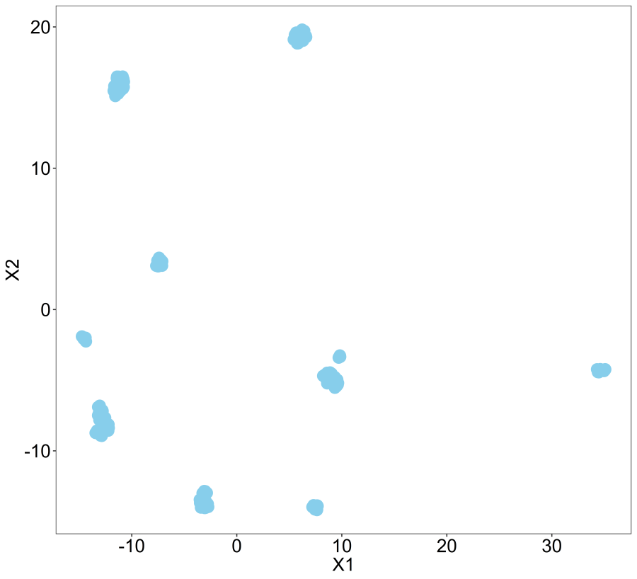
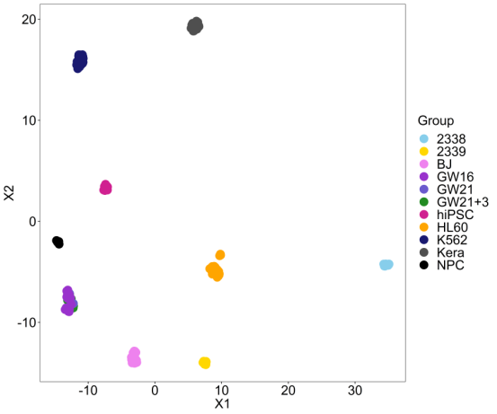
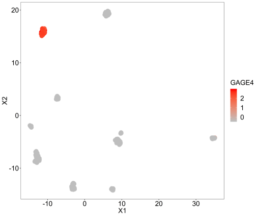
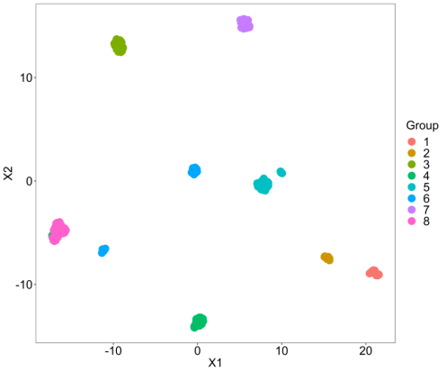
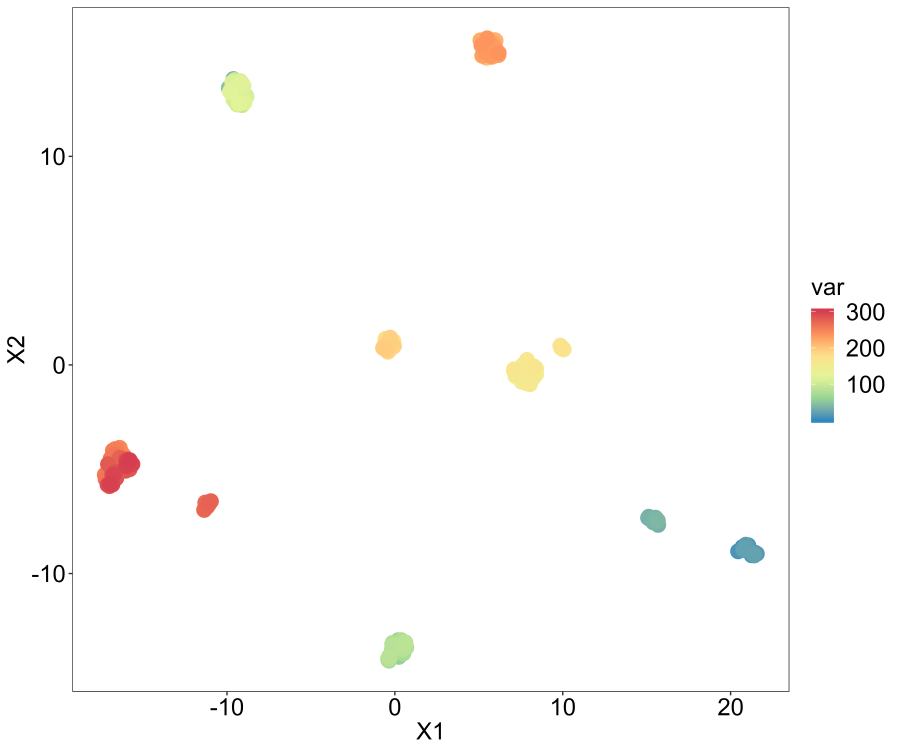

Running UMAP for data visualisation in R

# Running UMAP for data visualisation in R

June 8, 2019
By [chris2016](https://www.r-bloggers.com/author/chris2016/)

|     |     |
| --- | --- |
|     | [(L)](https://www.facebook.com/sharer/sharer.php?u=https%3A%2F%2Fwww.r-bloggers.com%2Frunning-umap-for-data-visualisation-in-r%2F&display=popup&ref=plugin&src=like&kid_directed_site=0) |

[**Tweet](https://twitter.com/intent/tweet?original_referer=https%3A%2F%2Fwww.r-bloggers.com%2Frunning-umap-for-data-visualisation-in-r%2F&ref_src=twsrc%5Etfw&text=Running%20UMAP%20for%20data%20visualisation%20in%20R&tw_p=tweetbutton&url=https%3A%2F%2Fwww.r-bloggers.com%2Frunning-umap-for-data-visualisation-in-r%2F&via=rbloggers)

(This article was first published on **[R – intobioinformatics](https://intobioinformatics.wordpress.com/2019/06/08/running-umap-for-data-visualisation-in-r/)**, and kindly contributed to [R-bloggers)](https://www.r-bloggers.com/)

[Share](https://www.facebook.com/sharer.php?u=https%3A%2F%2Fwww.r-bloggers.com%2Frunning-umap-for-data-visualisation-in-r%2F)[Tweet](https://twitter.com/intent/tweet?text=Running%20UMAP%20for%20data%20visualisation%20in%20R&url=https://www.r-bloggers.com/running-umap-for-data-visualisation-in-r/&via=Rbloggers)

UMAP is a non linear dimensionality reduction algorithm in the same family as t-SNE. In the first phase of UMAP a weighted k nearest neighbour graph is computed, in the second a low dimensionality layout of this is then calculated. Then the embedded data points can be visualised in a new space and compared with other variables of interest.

It can be used for the analysis of many types of data, including, single cell RNA-seq and cancer omic data. One easy way to run UMAP on your data and visualise the results is to make a wrapper function that uses the umap R package and ggplot2, this is easy to do yourself, but in this post we are going to have a look at the one included in the M3C package (https://bioconductor.org/packages/devel/bioc/html/M3C.html). The code for this simple function can be found here (https://github.com/crj32/M3C/blob/master/R/umap.R).

M3C is a clustering algorithm for finding the number of clusters in a given dataset, but it also has several other useful functions that can be used more generally. I don’t use M3C for single cell RNA-seq clustering it is better for other types of omic data, such as RNA-seq and standard omic platforms, however, its visualisation functions are useful for a number of different analyses I do. Otherwise I end up copy and pasting lengthy blocks of ggplot2 code again and again.

There have been two previous posts on the related [PCA](https://intobioinformatics.wordpress.com/2019/05/22/easy-quick-pca-analysis-in-r/) and [t-SNE](https://intobioinformatics.wordpress.com/2019/05/30/quick-and-easy-t-sne-analysis-in-r/) functions contained in the M3C package which both contain the same helpful parameters for extra labelling of the data points.

Let’s load some single cell RNA-seq data, this is the [pollen_test_data](https://intobioinformatics.files.wordpress.com/2019/06/pollen_test_data.zip) we used in the last post when running t-SNE.

So this is just a basic UMAP plot. So in this data within clusters the samples are very similar so they are very compact in these plots.

1
2
3
[object Object]
[object Object]
[object Object]

This is for labelling the sample points with our ground truth labels, i.e. cell types. The colour scale is set to be controlled manually and this using some internal colours inside the function.

1
[object Object]

This is for looking at an individual genes expression across the samples, so we are just labelling the points with a continuous variable, in this case GAGE4 because its variance is among the highest standardised to the mean.

1
2
[object Object]
[object Object]

Let’s just cluster this data with M3C and then display the clustering assignments on the UMAP plot.

1
2
[object Object]
[object Object]

So that’s pretty neat, simple functions like this can be quite a lot of fun.

Let’s do one more plot, we will make up a continuous variable that could be a co-variate we are interested in and display that on the plot. I’ll show the code for printing the plot here which is done internally to simplify things.

Scale=1 means we use the spectral palette for colouring the data points. We have to set controlscale=TRUE for using custom colours, it is also possible to set a ‘high’ and ‘low’ colour manually through changing the scale parameter to 2. Type ?umap for the relevant documentation.

1
2
3
4
5
[object Object]
[object Object]
[object Object]
[object Object]
[object Object]

Note that if you want to control the various parameters that UMAP uses internally rather than a quick analysis like this, you’ll have to make your own function to wrap ggplot2 and umap  (https://cran.r-project.org/web/packages/umap/index.html) or just run them as individual steps.

So, that bring us to the end of this little blog series on the M3C data visualisation functions. Hope you all enjoyed it!

[Share](https://www.facebook.com/sharer.php?u=https%3A%2F%2Fwww.r-bloggers.com%2Frunning-umap-for-data-visualisation-in-r%2F)[Tweet](https://twitter.com/intent/tweet?text=Running%20UMAP%20for%20data%20visualisation%20in%20R&url=https://www.r-bloggers.com/running-umap-for-data-visualisation-in-r/&via=Rbloggers)

To **leave a comment** for the author, please follow the link and comment on their blog: **[R – intobioinformatics](https://intobioinformatics.wordpress.com/2019/06/08/running-umap-for-data-visualisation-in-r/)**.

* * *

[R-bloggers.com](https://www.r-bloggers.com/) offers **[daily e-mail updates](https://feedburner.google.com/fb/a/mailverify?uri=RBloggers)** about [R](https://www.r-project.org/) news and [tutorials](https://www.r-bloggers.com/search/tutorial) on topics such as: [Data science](https://www.r-bloggers.com/search/data%20science), [Big Data,](https://www.r-bloggers.com/search/Big%20Data)[R jobs](https://www.r-users.com/), visualization ([ggplot2](https://www.r-bloggers.com/search/ggplot2), [Boxplots](https://www.r-bloggers.com/search/boxplot), [maps](https://www.r-bloggers.com/search/map), [animation](https://www.r-bloggers.com/search/animation)), programming ([RStudio](https://www.r-bloggers.com/search/RStudio), [Sweave](https://www.r-bloggers.com/search/sweave), [LaTeX](https://www.r-bloggers.com/search/LaTeX), [SQL](https://www.r-bloggers.com/search/SQL), [Eclipse](https://www.r-bloggers.com/search/eclipse), [git](https://www.r-bloggers.com/search/git), [hadoop](https://www.r-bloggers.com/search/hadoop), [Web Scraping](https://www.r-bloggers.com/search/Web+Scraping)) statistics ([regression](https://www.r-bloggers.com/search/regression), [PCA](https://www.r-bloggers.com/search/PCA), [time series](https://www.r-bloggers.com/search/time+series), [trading](https://www.r-bloggers.com/search/trading)) and more...

* * *

* * *

If you got this far, why not ***subscribe for updates*  **from the site? Choose your flavor: [e-mail](https://feedburner.google.com/fb/a/mailverify?uri=RBloggers), [twitter](https://twitter.com/#!/rbloggers), [RSS](https://feeds.feedburner.com/RBloggers), or [facebook](https://www.facebook.com/pages/R-bloggers/191414254890)...

|     |     |
| --- | --- |
|     | [(L)](https://www.facebook.com/sharer/sharer.php?u=https%3A%2F%2Fwww.r-bloggers.com%2Frunning-umap-for-data-visualisation-in-r%2F&display=popup&ref=plugin&src=like&kid_directed_site=0) |

[**Tweet](https://twitter.com/intent/tweet?original_referer=https%3A%2F%2Fwww.r-bloggers.com%2Frunning-umap-for-data-visualisation-in-r%2F&ref_src=twsrc%5Etfw&text=Running%20UMAP%20for%20data%20visualisation%20in%20R&tw_p=tweetbutton&url=https%3A%2F%2Fwww.r-bloggers.com%2Frunning-umap-for-data-visualisation-in-r%2F&via=rbloggers)