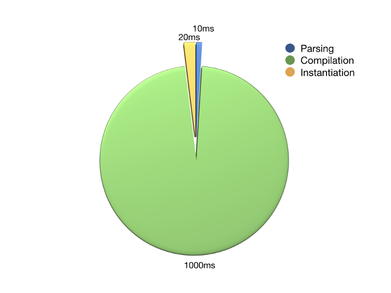
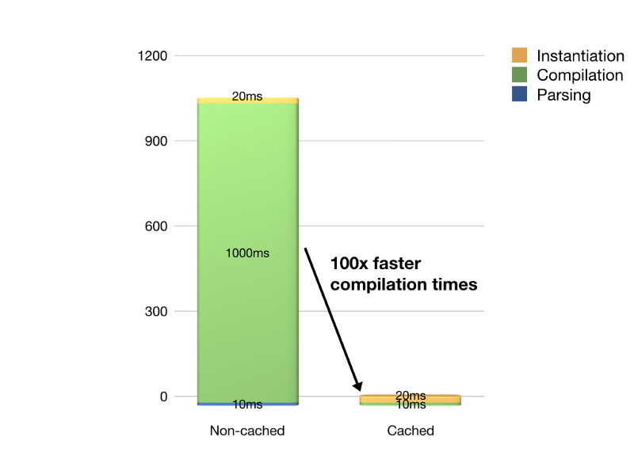

Running WebAssembly 100x faster 🔥 – Wasmer – Medium

# Running WebAssembly 100x faster

[Syrus Akbary](https://medium.com/@syrusakbary)
Feb 25·3 min read

We’ve been working steadily to get [Wasmer](https://wasmer.io/) to execute WebAssembly modules on the server-side as fast as possible.

> TL;DR — We got 100x improvement on startup time on Wasmer 0.2.0

Before getting into details, it’s essential to understand how Wasmer works under the hood to see what could be improved.

### How WebAssembly runtimes work

When a user executes a WebAssembly file with Wasmer, the following happens:

1. 1 "."**Parsing**: Wasmer parses the wasm file, assuring its validity according to the spec.

2. 2 "."**Function compilation**: the function bodies defined in WebAssembly *bytecode* are compiled to machine code via a compiler framework (Cranelift, LLVM, …), so they can be executed at native speed. This process generates a `Module` object.

3. 3 "."**Instantiation**: at this step, we create the memories (where data lives) and tables (where functions pointers are stored) that the WebAssembly `Instance` will use.

Once we have everything in place, we call the start function in the instance (usually that’s the `main` function in C, C++ or Rust)

So, how can we improve the timing for executing WebAssembly files?

### Timings

Let’s start analyzing where Wasmer spends the most time when we run a heavy WebAssembly application. Nginx can serve us as a great example:

Nginx startup time analysis

After analyzing the timings, it was clear that most of the time that `wasmer` spends on running `nginx.wasm` is just on the **compilation** side. That means compiling the functions from *WebAssembly bytecode* to *machine code*.

*Can we do something to improve it?*

### Caching

We started to think about what was a good option to accelerate compilation times. Since the machine code that is generated ahead of time for the functions of a given WebAssembly module is **completely deterministic**… why not cache it?

So we started working on it. We identified as possible solutions:

- •Making `Module` serialize/deserialize to a custom data format.
- •Converting a `Module` to and from a standardized shared library, and use the native code directly from our runtime.

We opted for the first strategy since it was a bit easier to implement and it gave us a bit more control of how to deal with the internal structures.

> Note: some browsers improve the “compilation” times by using streaming compilation (compile as the module is being downloaded).

> However, since Wasmer is initially designed to **> run locally**> , the access to the files is quite fast and therefore we can’t really take advantage of the fact that the network is slower than the compiler.

After a few weeks of work, we got our prototype ready and…
I guess an image is better than 1000 words!

Nginx startup time comparison (non-cached vs cached)

*Note: the cache is implemented synchronously and slows-down about 1% the initial compilation time (serializing the module). It can also be skipped easily via

*`*wasmer run --disable-cache ...*`

#### Bonus: Hashing times

Ok, we got caching working… what else can we do to improve timing?

We set up our caching system by generating a **unique hash** that identifies the WebAssembly module binary and using it as the key to retrieve the cached content when available.

We started using `sha256` to generate a hash given the WebAssembly bytecode. However, `sha256` can only hash at 200Mb/s… it seems fast, but it adds an overhead of 5ms for hashing a 1Mb WebAssembly module.

After some research, we found the `meowhash` crate and with it we were able to speed up hashing time by 125x, from 5ms to just 40us (0.04ms).

> Note: after publishing the article we received feedback on how we can’t infer safely that if `meowhash(x) == meowhash(y)`>  then `x == y`> . We updated our hashing algorithm since to use > [> blake2bp instead of meowhash](https://github.com/wasmerio/wasmer/pull/214)>  (hashes at 500us).

* * *

*...*

### Wasmer 0.2.0 ✨

All these new caching improvements have been included in the **Wasmer 0.2.0** release, which we **just published** today.

The runtime internals have been completely refactored and now we pass 100% the WebAssembly spectests.

Apart from including the new caching mechanism, it also includes experimental support for Windows!

#### Install Wasmer

`curl https://get.wasmer.io -sSfL | sh`

> (Note: for Windows just head to our > [> release page](https://github.com/wasmerio/wasmer/releases/tag/0.2.0)> , and download the > [> .exe installer](https://github.com/wasmerio/wasmer/releases/download/0.2.0/WasmerInstaller-0.2.0.exe)> )

#### -or- Upgrade Wasmer

wasmer self-update
And run your WebAssembly files at the speed of light! ⚡️