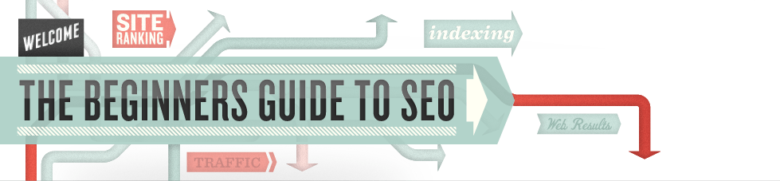
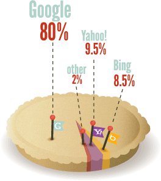

SEO: The Beginner's Guide to Search Engine Optimization from Moz

 

New to SEO? Need to polish up your knowledge? The Beginner's Guide to SEO has been read **over 3 million times** and provides comprehensive information you need to get on the road to professional quality Search Engine Optimization, or SEO.

1. [How Search Engines Operate](https://moz.com/beginners-guide-to-seo/how-search-engines-operate)

2. [How People Interact With Search Engines](https://moz.com/beginners-guide-to-seo/how-people-interact-with-search-engines)

3. [Why Search Engine Marketing is Necessary](https://moz.com/beginners-guide-to-seo/why-search-engine-marketing-is-necessary)

4. [The Basics of Search Engine Friendly Design & Development](https://moz.com/beginners-guide-to-seo/basics-of-search-engine-friendly-design-and-development)

5. [Keyword Research](https://moz.com/beginners-guide-to-seo/keyword-research)

1. [How Usability, Experience, & Content Affect Rankings](https://moz.com/beginners-guide-to-seo/how-usability-experience-and-content-affect-search-engine-rankings)

2. [Growing Popularity and Links](https://moz.com/beginners-guide-to-seo/growing-popularity-and-links)

3. [Search Engine's Tools for Webmasters Intro](https://moz.com/beginners-guide-to-seo/search-engine-tools-and-services)

4. [Myths & Misconceptions About Search Engines](https://moz.com/beginners-guide-to-seo/myths-and-misconceptions-about-search-engines)

5. [Measuring and Tracking Success](https://moz.com/beginners-guide-to-seo/measuring-and-tracking-success)

## What is Search Engine Optimization (SEO)?

SEO is a marketing discipline focused on growing visibility in organic (non-paid) search engine results. SEO encompasses both the technical and creative elements required to improve rankings, drive traffic, and increase awareness in search engines. There are many aspects to SEO, from the words on your page to the way other sites [link](https://moz.com/learn/seo/external-link) to you on the web. Sometimes SEO is simply a matter of making sure your site is structured in a way that search engines understand.

SEO isn't just about building search engine-friendly websites. It's about making your site better for people too. At Moz we believe these principles go hand-in-hand.

This guide is designed to describe all areas of SEO—from finding the terms and phrases (keywords) that generate traffic to your website, to making your site friendly to search engines, to building links and marketing the unique value of your site. If you are confused about this stuff, you are not alone, and we're here to help.

 

## Why does my website need SEO?

The majority of web traffic is driven by the major commercial search engines, [Google](http://www.google.com/), [Bing](http://www.bing.com/), and [Yahoo!](http://www.yahoo.com/). Although social media and other types of traffic can generate visits to your website, search engines are the primary method of navigation for most Internet users. This is true whether your site provides content, services, products, information, or just about anything else.

Search engines are unique in that they provide targeted traffic—people looking for what you offer. [Search engines are the roadways](https://moz.com/beginners-guide-to-seo/how-search-engines-operate) that make this happen. If search engines cannot find your site, or add your content to their databases, you miss out on incredible opportunities to drive traffic to your site.

**Search queries**—the words that users type into the search box—carry extraordinary value. Experience has shown that search engine traffic can make (or break) an organization's success. Targeted traffic to a website can provide publicity, revenue, and exposure like no other channel of marketing. Investing in SEO can have an exceptional rate of return compared to other types of marketing and promotion.

## Why can't the search engines figure out my site without SEO?

Search engines are smart, but they still need help. The major engines are always working to improve their technology to crawl the web more deeply and return better results to users. However, there is a limit to how search engines can operate. Whereas [the right SEO](https://moz.com/products/pro) can net you thousands of visitors and increased attention, the wrong moves can hide or bury your site deep in the search results where visibility is minimal.

In addition to making content available to search engines, SEO also helps boost rankings so that content will be placed where searchers will more readily find it. The Internet is becoming increasingly competitive, and those companies who perform SEO will have a decided advantage in visitors and customers.

## Can I do SEO for myself?

The world of SEO is complex, but most people can easily understand the basics. Even a small amount of knowledge can make a big difference. Free SEO education is widely available on the web, including in guides like this. Combine this with a little practice and you are well on your way to becoming a guru.

Depending on your time commitment, your willingness to learn, and the complexity of your website(s), you may decide you need an expert to handle things for you. Firms that practice SEO can vary; some have a highly specialized focus, while others take a broader and more general approach.

In any case, it's good to have a firm grasp of the core concepts.

## How much of this article do I need to read?

If you are serious about improving search traffic and are unfamiliar with SEO, **we recommend reading this guide front-to-back**. We've tried to make it as concise as possible and easy to understand. There's a [printable PDF version](http://d2eeipcrcdle6.cloudfront.net/guides/Moz-The-Beginners-Guide-To-SEO.pdf) for those who'd prefer, and dozens of linked-to resources on other sites and pages that are also worthy of your attention.

Each section of this guide is important to understanding the most effective practices of search engine optimization.

## Let's Get You Started

### In the wonderful world of SEO!

The Beginner's Guide to Search Engine Optimization (SEO) is an in-depth tutorial on how search engines work. This guide covers the fundamental strategies that make your websites search engine–friendly. Download your copy of the world's most-read guide on SEO!

## Try out Moz Pro

Subscribe to Moz Pro free for 30 days. In addition to marketing analytics software, you’ll get to access dozens of SEO and inbound marketing resources.

 [Start My Free 30-Day Trial](https://moz.com/checkout/freetrial)

   

 [To Chapter 1](https://moz.com/beginners-guide-to-seo/how-search-engines-operate)

12.18.2015

Written by [Rand Fishkin](https://moz.com/community/users/63) and Moz Staff