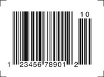
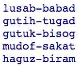
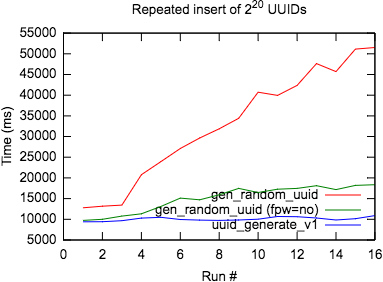

SQL Keys in Depth

### SQL Keys in Depth

##### January 1, 2018

#####   [Newsletter ↳](https://begriffs.com/posts/2018-01-01-sql-keys-in-depth.html#newsletter)

The internet is full of dogmatic commandments for choosing and using keys in relational databases. At times it verges on a holy war: should you use natural or artificial keys? Auto-incrementing integers, UUIDs?

After wading through sixty-four articles, skimming sections in five books, and asking questions on IRC and StackOverflow I think I’ve put the pieces together and have a recommendation to harmonize the various camps. Many arguments about keys boil down to false dichotomies and failures to acknowledge other points of view.

### Table of Contents

- [What are keys, really?](https://begriffs.com/posts/2018-01-01-sql-keys-in-depth.html#what-are-keys-really)
- [The curious case of primary keys](https://begriffs.com/posts/2018-01-01-sql-keys-in-depth.html#the-curious-case-of-primary-keys)
- [Finding natural keys](https://begriffs.com/posts/2018-01-01-sql-keys-in-depth.html#finding-natural-keys)
- [Artificial keys](https://begriffs.com/posts/2018-01-01-sql-keys-in-depth.html#artificial-keys)
- [Surrogate keys](https://begriffs.com/posts/2018-01-01-sql-keys-in-depth.html#surrogate-keys)
    - [Auto-incrementing bigint](https://begriffs.com/posts/2018-01-01-sql-keys-in-depth.html#auto-incrementing-bigint)
    - [UUID](https://begriffs.com/posts/2018-01-01-sql-keys-in-depth.html#uuid)
- [Summary and suggestion](https://begriffs.com/posts/2018-01-01-sql-keys-in-depth.html#summary-and-suggestion)

Let’s break the problem down, and then put it all together at the end. First, what’s a key?

### What are keys, really?

For the moment forget about *primary* keys, we’re looking for the general idea. A key is a column or columns that together have no duplicate values across rows. Also the columns must be irreducibly unique, meaning no subset of the columns has this uniqueness.

For example, consider a table for counting cards in a card game:

	CREATE TABLE cards_seen (
	  suit text,
	  face text
	);

If we’re tracking a single deck (no repeated cards), then the combination of suit and face is unique. We don’t want to list the same suit and face twice in the table because that would be redundant. If a card is in the table we’ve seen it, otherwise we haven’t.

We can and should ask the database to enforce this constraint by adding:

	CREATE TABLE cards_seen (
	  suit text,
	  face text,

	  UNIQUE (suit, face)
	);

Neither `suit` nor `face` is unique on its own. We can see multiple cards with the same suit, or with the same face. Because `(suit, face)` is unique, but the individual columns are not, we say that the combination is irreducible, and `(suit, face)` is a key.

Expanding the situation a bit, if we were tracking multiple packs of cards, we could include a new field to record the number of times a card was seen:

	CREATE TABLE cards_seen (
	  suit text,
	  face text,
	  seen int
	);

Although the triple `(suit, face, seen)` should be unique, it’s not a key because the subset `(suit, face)` should be unique too. That’s because two rows having the same suit and face but different values for `seen` would be contradictory information. So `(suit, face)` is a key and there are no other keys for this table.

#### Uniqueness constraints

In PostgreSQL the preferred way to add a unique constraint is to declare it directly as we did. The use of indexes to enforce unique constraints could be considered an implementation detail that should not be accessed directly. There’s no need to manually create indexes on columns already declared unique; doing so would just duplicate the automatically-created index.

A table can have more than one key, it’s no problem. In fact we should declare *all* keys so the database can enforce them.

Here are two examples of tables that have multiple keys.

	*-- Three keys*
	CREATE TABLE tax_brackets (
	  min_income  numeric(8,2),
	  max_income  numeric(8,2),
	  tax_percent numeric(3,1),

	  UNIQUE(min_income),
	  UNIQUE(max_income),
	  UNIQUE(tax_percent)
	);

	*-- Two keys*
	CREATE TABLE flight_roster (
	  departure timestamptz,
	  gate text,
	  pilot text

	  UNIQUE(departure, gate),
	  UNIQUE(departure, pilot)
	);

For brevity the examples so far are missing other constraints that in reality they should enforce. For instance cards should not be seen a negative number of times. Also we should forbid NULL values for most columns considered so far (except the `max_income` column for tax brackets where NULL could could represent infinity).

### The curious case of primary keys

What we simply called keys in the previous section are traditionally called candidate keys. “Candidate” is terminology which implies that the keys are all competing for the esteemed position of “primary key,” with the remainder relegated to “alternate keys.”

It took a while for SQL implementations to clear up misunderstandings about keys and the relational model. The earliest database products fixated on what was then a low-level conception of primary key.

Primary keys were required by these database systems to identify the physical location of a row on sequential access media. Joe Celko explains:

> The term “key” meant the sort-key of a file that was required to do any reasonable processing with the original sequential file systems. A deck of punch cards is read in one and only one order; you cannot “back space” a card reader. The first magnetic tape drives mimicked that design and did not allow bi-directional access. In fact, the original Sybase SQL Server required that cursors had to “re-wind” a table to the start and move forward to read a prior row.

Modern SQL is supposed to abstract from the physical representation. Tables model relations, and should not expose an implicit order in their rows. However even today SQL Server creates a clustered index by default for primary keys, physically ordering rows in the old tradition.

In most databases primary keys have survived as a vestige, and nowadays merely provide some conveniences rather than reflecting or determining physical layout. For instance declaring a primary key includes a NOT NULL constraint automatically, and defines the default foreign key target in a PostgreSQL table. Primary keys also give a hint that their columns are preferred for joins.

A primary key does not prevent declaring other keys. In fact a table with keys will function fine when none is designated as primary. Lightning will not come out of the sky and strike you.

### Finding natural keys

The keys we’ve seen so far are “natural,” so called because they are properties of the thing modeled, properties that have intrinsic interest even if nobody was looking to create a key.

The first thing to keep in mind when examining a table for possible natural keys is not to overthink it. StackExchange user sqlvogel advises:

> Some people seem to struggle with the choice of “natural” key attributes because they hypothesize situations where a particular key might not be unique in some given population. This misses the point. The point of a key is to impose a business rule that attributes must and will be unique for the population of data within a particular table at any given point in time. The table always represents data in a particular and hopefully well-understood context (the “business domain” AKA “domain of discourse”). It is the intention/requirement to apply a uniqueness constraint within that domain that matters.

The rule of thumb is to add a key constraint when a column is unique for the values at hand and will remain so in reasonable scenarios. You can always remove the constraint if necessary. (If this worries you, we’ll talk about key stability later.)

For instance, a database of hobbyist club members could include uniqueness on the two columns first_name, last_name of members. Duplicates are likely unintentional at this scale, and if necessary the constraint can be dropped. Until an actual conflict happens the key is a reasonable precaution.

As a database grows to cover more ambitious material, finding natural keys can be more difficult. The data we store is a simplification of external reality, and doesn’t capture some of the things that otherwise distinguish objects in the world, such as their changing position over time. In the absence of some kind of item code, what distinguishes two cans of soda or boxes of cereal other than their position in space or tiny deviations in weight or packaging?

This is why standards bodies create and add distinguishing marks to products. Cars have Vehicle Identification Numbers (VIN) stamped onto them, books have ISBNs printed inside, commodity food packaging has UPC. You might argue that these numbers don’t seem natural. Why am I calling them natural keys?

The naturalness or artificiality of unique properties in a database is relative to the outside world. A key which was artificial at birth in some standards body or government agency becomes natural to us because it’s generally agreed upon in the world at large, and/or imprinted on objects.

There are many industry, public and international standards for a broad variety of things including currencies, languages, financial instruments, chemical compounds and medical diagnoses.

Here are some values that often work as natural keys:

- ISO 3166 country codes
- ISO 639 language codes
- ISO 4217 currency codes
- ISIN stock symbols
- UPC/EAN, VIN, GTIN, ISBN
- login names
- email addresses
- room numbers
- mac address on a network
- (lat,lon) for points on the earth

As advised, declare keys when you can and when reasonable, even multiple keys per table. But remember there are some caveats to keep in mind with the ideas above.

- Not everyone has an email address. May be fine for the intended use of the database. Also people do change their email addresses from time to time. (More about key stability later.)
- ISIN stock symbols do alter over time, for instance the symbols GOOG and GOOGL do not accurately represent the reorganization of the company from Google to Alphabet. They can sometimes be confusing, e.g. TWTR vs TWTRQ. Some investors incorrectly bought the latter during Twitter’s IPO.
- Social security numbers are specific to American citizens, have privacy implications, and are reused after death. Also people can get new ones after identity theft. Finally the same number can identify both a person and a business tax id.
- Postal mail zip codes are a bad choice for towns. Multiple towns share a zip, and there are often multiple zips in a town.

### Artificial keys

Given that a key is a column with unique values in each row, one way to create one is to cheat and throw made-up unique values into each row. Artificial keys are just that: an invented code used for referring to facts or objects.

Crucially this code derives from the database itself and is not known by anyone except users of the database. That’s what distinguishes artificial keys from standards-based natural keys.

Whereas natural keys’ advantage is preventing table row duplication or contradiction, artificial keys are useful because they make it easy for people or other systems to refer to a row, and also improve lookup and join speed by avoiding string (or multi-column) key comparisons.

#### Surrogates

People also use artificial keys as an anchor so that no matter how business rules and columns change, the same row can always be identified the same way. An artificial key used for this purpose is called a “surrogate key” and requires special care. We’ll consider surrogates later.

Non-surrogate artificial keys are convenient for referring to a row from *outside* a database. Whether exposed in a URL, affixed to an invoice, spoken over the phone, redeemed at a checkout counter or printed on a license plate, an artificial key succinctly identifies a fact or object. (A license plate is a natural key to you and me, but designed as an artificial key by the Dept of Motor Vehicles.)

Artificial keys should be chosen with communication media in mind, to minimize typos and mistakes. Consider whether the key must be pronounced, read in print, sent via SMS, read in handwriting, entered into a pinpad, or embedded in a URL. Additionally some artificial keys like credit card numbers contain a [checksum](https://begriffs.com/posts/2017-10-21-sql-domain-integrity.html#credit-card-validation) so that if certain errors happen they can at least be detected.

Examples:

- US license plates have [rules](https://en.wikipedia.org/wiki/United_States_license_plate_designs_and_serial_formats#Skipping_characters) about ambiguous characters such as `O` vs `0`.
- Hospitals and pharmacies are especially careful, considering doctors’ handwriting. See [misidentification of alphanumeric symbols](https://www.ismp.org/newsletters/acutecare/showarticle.aspx?id=81) for lots of examples.
- Texting a confirmation code? Remember to stay within the [GSM 03.38](https://en.wikipedia.org/wiki/GSM_03.38) character set.
- Unlike Base64 encoding for arbitrary byte data, [Base32](https://philzimmermann.com/docs/human-oriented-base-32-encoding.txt) uses a restricted set of symbols which can be conveniently used by humans and processed by old computer systems which recognize only restricted character sets.
- [Proquints](https://arxiv.org/html/0901.4016) are readable, spellable, pronounceable ids. They are PRO-nouncable QUINT-uplets of alternating unambiguous consonants and vowels.

Be advised that whenever you expose an artificial key to the world people have weird reasons to request custom exceptional values. Look no further than vanity license plates or the system for making pronounceable ids that became the infamous [automated curse generator](http://thedailywtf.com/articles/The-Automated-Curse-Generator).

Sticking with numeric keys can work, although even in that case people have numerical taboos like omitting the [thirteenth floor](https://en.wikipedia.org/wiki/Thirteenth_floor). But numbers work well in many places like URLs, pinpads, and for handwritten legibility if the recipient knows the key is comprised of all digits. Although proquints carry more information density per spoken syllable, numbers are pretty good.

One thing to avoid in publicly exposed numbers is sequential order. It allows people to probe for resources (`/videos/1.mpeg`, `/videos/2.mpeg` etc) and also leaks cardinality information. Add a Feistel cipher on top of a sequence. This hides the ordering while maintaining uniqueness.

The PostgreSQL [pseudo encrypt wiki](https://wiki.postgresql.org/wiki/Pseudo_encrypt) gives an example cipher function:

	CREATE OR REPLACE FUNCTION pseudo_encrypt(VALUE int) returns int AS $$
	DECLARE
	l1 int;
	l2 int;
	r1 int;
	r2 int;
	i int:=0;
	BEGIN
	 l1:= (VALUE >> 16) & 65535;
	 r1:= VALUE & 65535;
	 WHILE i < 3 LOOP
	   l2 := r1;
	   r2 := l1 # ((((1366 * r1 + 150889) % 714025) / 714025.0) * 32767)::int;
	   l1 := l2;
	   r1 := r2;
	   i := i + 1;
	 END LOOP;
	 RETURN ((r1 << 16) + l1);
	END;
	$$ LANGUAGE plpgsql strict immutable;

This particular function is its own inverse (i.e. `pseudo_encrypt(pseudo_encrypt(x)) = x`). Using the function verbatim is sort of security through obscurity and if someone guesses you used Feistel from the PostgreSQL docs then it’s easy to obtain the inverse to return to the original sequence. However you can change it up by supplying your own function in place of `(((1366 * r1 + 150889) % 714025) / 714025.0)`. Your function must produce a value between 0 and 1. You could simply tweak the numbers in the previous expression.

Here’s how to use pseudo_encrypt:

	CREATE SEQUENCE my_table_seq;

	CREATE TABLE my_table (
	  short_id int NOT NULL
	    DEFAULT pseudo_encrypt(
	      nextval('my_table_seq')::int
	    ),
	  *-- other columns …*

	  UNIQUE (short_id)
	);

This solution stores the randomized values in the `short_id` column. If the database needs to support high data ingestion rates you may instead choose to store the incrementing sequence itself in the table and convert it for display on demand with `pseudo_encrypt`. Indexing randomized values can lead to write amplification as we’ll explore later.

The previous example used a regular sized integer for the `short_id` column. To use `bigint` we’d need a different Feistel function like [XTEA](https://en.wikipedia.org/wiki/XTEA).

Another way to obscure an integer sequence as by transforming it into short strings. Try the [pg_hashids](https://github.com/iCyberon/pg_hashids) extension:

	CREATE EXTENSION pg_hashids;

	CREATE SEQUENCE my_table_seq;

	CREATE TABLE my_table (
	  short_id text NOT NULL
	    DEFAULT id_encode(
	      nextval('my_table_seq'),
	      'long string as table-specific salt'
	    ),
	  *-- other columns …*

	  UNIQUE (short_id)
	);

	INSERT INTO my_table VALUES
	  (DEFAULT), (DEFAULT), (DEFAULT);

	SELECT * FROM my_table;
	*/**
	*┌──────────┐*
	*│ short_id │*
	*├──────────┤*
	*│ R4       │*
	*│ ya       │*
	*│ Ll       │*
	*└──────────┘*
	**/*

Once again it may be more performant to store the integers themselves in the table and convert on demand, but benchmark it and see if you really need to add the complexity.

With a clear notion of artificial and natural keys we can see that the natural-vs-artificial debate is a false dichotomy. Artificial and natural keys are not mutually exclusive! The same table can have both. In fact a table with artificial key ought to enforce a natural key as well, except in the few cases where no natural key exists, such as a table of coupon codes:

	*-- A rare table: no natural key candidates to*
	*-- declare along with the artificial "code" key*

	CREATE TABLE coupons (
	  code text NOT NULL,
	  amount numeric(5,2) NOT NULL,
	  redeemed boolean NOT NULL DEFAULT false,

	  UNIQUE (code)
	);

Having an artificial key and not declaring natural keys when they exist leaves the latter unprotected:

	CREATE TABLE cars (
	  car_id bigserial NOT NULL,
	  vin varchar(17) NOT NULL,
	  year int NOT NULL,

	  UNIQUE (car_id)
	  *-- should have added*
	  *-- UNIQUE (vin)*
	);

	*-- This unfortunately succeeds*
	INSERT INTO cars (vin, year) VALUES
	  ('1FTJW36F2TEA03179', 1996),
	  ('1FTJW36F2TEA03179', 1997);

The only argument against declaring extra keys is that each one will entail another unique index which will increase the cost of table writes. Depends on how much you value data correctness, so probably worth declaring the keys.

It’s worth declaring multiple artificial keys too if they exist. For instance, a business has Applicants and Employees. Every employee was once an applicant and refers to Applicants by their own id, which is should be a key of employee as well. Another example would be setting employee id and login name as two keys on Employees.

### Surrogate Keys

As mentioned above, an important kind of artificial key is called a surrogate key. It’s not meant to be succinct or shareable like other artificial keys, it’s meant as an internal placeholder that identifies a row forevermore. It’s used in SQL and joins but not explicitly referenced by an application.

If you know about PostgreSQL [system columns](https://www.postgresql.org/docs/10/static/ddl-system-columns.html) you could think of surrogates as almost a database implementation detail like a ctid except never changing. A surrogate value should be chosen once for each row and then never changed.

Surrogates make great targets for foreign keys, and the foreign keys should be marked as `ON UPDATE RESTRICT` to help enforce the immutability of the surrogate. On the other hand, foreign keys to publicly shared keys should be marked `ON UPDATE CASCADE`, which allows maximum flexibility to change those keys’ values. (The cascading update runs with the same [isolation level](https://begriffs.com/posts/2017-08-01-practical-guide-sql-isolation.html) as its surrounding transaction, so don’t worry about concurrency problems, the database can handle that if you choose a strict isolation level.)

Don’t “naturalize” surrogate keys. As soon as you display the value of a surrogate key to your end users, or worse yet allow users to work with the value (perhaps via search), you have effectively given the key business meaning. The exposed key in our database could then be considered a natural key in someone else’s.

Forcing external systems to use other artificial keys explicitly designed for sharing allows us to change the exposed keys as needed to accommodate changing requirements, while joining and maintaining referential integrity with surrogates internally.

#### Auto-incrementing bigint

The most common choice for surrogate keys is the auto-incrementing “bigserial” column, aka the `IDENTITY` column. (In fact, PostgreSQL 10 now supports the IDENTITY construct like Oracle does, see [CREATE TABLE](https://www.postgresql.org/docs/10/static/sql-createtable.html).)

However I believe an auto-incrementing int is usually the wrong choice for surrogate keys. My opinion is uncommon, so let me explain.

Disadvantages of serial keys:

- Starting all sequences at 1 and counting up means that rows from different tables will share many of the same key values. This isn’t ideal. Disjoint sets of keys per table would be preferred so that queries can’t accidentally mix up the constants in a join, say, and still return results. (As a workaround you could arrange each sequence as multiples of distinct prime numbers to achieve disjointness, but that’s painstaking.)
- Calling `nextval()` on sequences introduces shared schema state that scales less easily across nodes in new distributed SQL systems being developed.
- Merging data from another database that also uses bigserial keys will conflict with existing data. The sequential values simply aren’t unique across systems.
- Philosophically the incrementing number harkens back to old systems with an implicit row order. If you want to order rows, do it explicitly with a timestamp column or something meaningful in the data itself. Doing otherwise violates the first normal form.
- (Weak reason, but) those little ids are tempting to expose.

#### UUID

Let’s consider another option: using bigger integers (128 bits) generated in a randomized pattern. Algorithms for generating such universally unique identifiers (UUIDs) are extremely unlikely to ever generate the same value twice, even when run simultaneously on different CPUs.

UUIDs seem to be the natural choice for surrogate keys, right? If you want to label rows uniquely then nothing beats a unique label!

So why doesn’t everyone use them on PostgreSQL? There are some bogus reasons and one legitimate reason. Also there’s a workaround for the legitimate reason, and I’ll present benchmarks to illustrate.

First the bogus reasons. Some people think UUIDs are strings because of the traditional dashed hexadecimal representation: 5bd68e64-ff52-4f54-ace4-3cd9161c8b7f. In fact some databases don’t have a compact (128-bit) uuid type, but PostgreSQL [does](https://www.postgresql.org/docs/current/static/datatype-uuid.html). It’s the size of two bigints, and that’s not an appreciable overhead when compared with the bulk of other information in the database.

Another invalid criticism of UUIDs is that they are unwieldy: who wants to pronounce them, type them, or see them? That’s valid for an exposed artificial key, but (by design) nobody will ever see a surrogate UUID. Maybe a developer running SQL commands in psql to debug the system might deal with the UUIDs, but that’s about it. The developer could also refer to rows with friendlier keys if those are defined.

**The real problem with UUIDs is that highly randomized values cause write amplification due to full-page writes in the write-ahead log (WAL).** This means worse performance when inserting rows. It really depends on the algorithm used for generating UUIDs, though.

Let’s measure the write amplification. The fault lies with old filesystems, really. When PostgreSQL writes data to disk it does so by modifying a “page” on disk. If a computer loses power at a critical time then most filesystems may still report the write as successful before the data is safe on disk. If PostgreSQL naively considered the action complete then the database would be corrupted when the system goes back online.

PostgreSQL cannot trust that most OS/filesystem/disk configurations will enforce atomicity, so the database saves the entire state of a newly modified disk page to the write-ahead log for use in restoration after a potential crash. Indexing highly random values like UUIDs tends to touch a whole lot of different disk pages, which means writing the full page size (usually 4k or 8k) to the WAL for each insertion. That’s called a full-page write (FPW).

Some UUID generation algorithms (like Twitter’s “snowflake” or `uuid_generate_v1()` in the [uuid-ossp](https://www.postgresql.org/docs/10/static/uuid-ossp.html) extension for PostgreSQL) produce monotonically increasing values per machine. This consolidates writes into fewer disk pages, reducing FPW.

We can measure the PFW penalty for different UUID generation algorithms and also inspect WAL statistics. To do this I set up the following benchmark.

- EC2 instance running ami-aa2ea6d0
    - Ubuntu Server 16.04 LTS (HVM)
    - EBS General Purpose (SSD)
    - c3.xlarge
    - vCPU: 4
    - RAM GiB: 7.5
    - Disk GB: 2 x 40 (SSD)
- PostgreSQL built from source
    - https://ftp.postgresql.org/pub/source/v10.1/postgresql-10.1.tar.gz
    - `./configure --with-uuid=ossp CFLAGS="-O3"`
- Default database configuration except:
    - max_wal_size=‘10GB’;
    - checkpoint_timeout=‘2h’;
    - synchronous_commit=‘off’;

Schema:

	CREATE EXTENSION "uuid-ossp";
	CREATE EXTENSION pgcrypto;

	CREATE TABLE u_v1 ( u uuid PRIMARY KEY );
	CREATE TABLE u_crypto ( u uuid PRIMARY KEY );

Before inserting UUIDs into each table, I found the current position of the write-ahead log.

	SELECT pg_walfile_name(pg_current_wal_lsn());

	*/* For instance,*

	*     pg_walfile_name*
	*--------------------------*
	* 000000010000000000000001*
	**/*

I used that position to get statistics about WAL usage after benchmarking. This gets the stats from events occurring subsequent to a start position:

`pg_waldump --stats 000000010000000000000001`
I ran tests for three scenarios:

1. Inserting UUIDs generated by `gen_random_uuid()` (provided by [pgcrypto](https://www.postgresql.org/docs/10/static/pgcrypto.html))

2. Inserting from `uuid_generate_v1()` (provided by [uuid-ossp] (https://www.postgresql.org/docs/10/static/uuid-ossp.html)

3. Inserting from `gen_random_uuid()` again, but with `full_page_writes='off'` in the db configuration. This shows how fast it would be without FPW amplification.

For each of these scenarios I started from an empty table and inserted 2^20 UUIDs. I repeated the insertions over sixteen rounds, timing each to see how the performance changed with more data in the table.

	*-- for instance, I ran this 16 times with \timing in psql*

	INSERT INTO u_crypto (
	  SELECT gen_random_uuid()
	  FROM generate_series(1, 1024*1024)
	);

Here are the speed results:

Here are the WAL statistics for each method:

	gen_random_uuid()

	Type         N      (%)   Record size      (%)   FPI size      (%)
	----         -      ---   -----------      ---   --------      ---
	XLOG       260 (  0.15)         13139 (  0.09)     484420 ( 30.94)
	Heap2      765 (  0.45)        265926 (  1.77)     376832 ( 24.07)
	Heap     79423 ( 46.55)       6657121 ( 44.20)     299776 ( 19.14)
	Btree    89354 ( 52.37)       7959710 ( 52.85)     404832 ( 25.85)

	uuid_generate_v1()

	Type         N      (%)   Record size      (%)   FPI size      (%)
	----         -      ---   -----------      ---   --------      ---
	XLOG         0 (  0.00)             0 (  0.00)          0 (  0.00)
	Heap2        0 (  0.00)             0 (  0.00)          0 (  0.00)
	Heap    104326 ( 49.88)       7407146 ( 44.56)          0 (  0.00)
	Btree   104816 ( 50.12)       9215394 ( 55.44)          0 (  0.00)

	gen_random_uuid() with fpw=off

	Type         N      (%)   Record size      (%)   FPI size      (%)
	----         -      ---   -----------      ---   --------      ---
	XLOG         4 (  0.00)           291 (  0.00)         64 (  0.84)
	Heap2        0 (  0.00)             0 (  0.00)          0 (  0.00)
	Heap    107778 ( 49.88)       7654268 ( 46.08)          0 (  0.00)
	Btree   108260 ( 50.11)       8956097 ( 53.91)       7556 ( 99.16)

This confirms that `gen_random_uuid` generates a lot of WAL activity as full-page images (FPI) and the other methods do not. The last one of course because I prevented the database from doing so. Suppressing FPW is not a technique you want to use for real though, unless you’re very certain of your filesystem and disk configuration. [This article](https://blog.2ndquadrant.com/pg-phriday-postgres-zfs/) suggests that ZFS may be safe for disabling FPW, but use caution.

The clear winner in my benchmark is `uuid_generate_v1()`. It’s fast and doesn’t seem to slow down as rows accumulate. Also the uuid-ossp extension is pre-installed on hosted databases like RDS and Citus Cloud, so the function will be available with no extra work.

The docs warn about uuid_generate_v1 that

> This involves the MAC address of the computer and a time stamp. Note that UUIDs of this kind reveal the identity of the computer that created the identifier and the time at which it did so, which might make it unsuitable for certain security-sensitive applications.

However I don’t think this is a problem for us because the surrogate key won’t be exposed. The library does offer a `uuid_generate_v1mc()` that obscures the mac address if you’re still concerned.

### Summary and Suggestion

Now that we know the various types of keys and their uses, here’s my suggestion for choosing them in your own database.

For each table:
1. Identify and declare all natural keys.

2. Create a `<table_name>_id` surrogate key of type `uuid` with default value `uuid_generate_v1()`. You can even mark it as a primary key if you like. Including the table name in this id makes joins simpler. It’s `JOIN foo USING (bar_id)` vs `JOIN foo ON (foo.bar_id = bar.id)`. Do not expose this key to clients or anywhere outside the database.

3. For “join tables” declare all foreign key columns as a single composite primary key.

4. Add an artificial key if desired for use in a URL or anywhere else you want to share a reference to a row. Use a Feistel cipher or pg_hashids to conceal auto-incrementing integers.

5. Mark foreign keys to surrogate UUIDs as `ON UPDATE RESTRICT` and to external artificial keys as `ON UPDATE CASCADE`. Use your own judgement for natural keys.

This approach provides internal key stability while acknowledging and protecting natural keys. It also decouples externally-facing artificial keys from either. With the proper understanding we can move beyond a “primary key” fixation and appreciate the various roles that keys play.