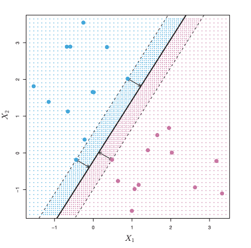
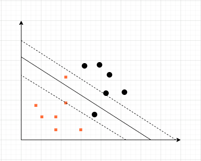
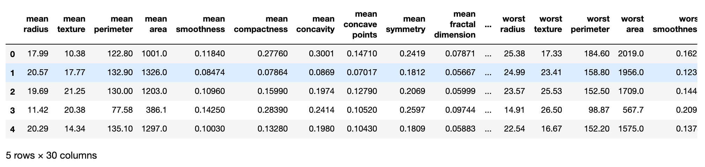
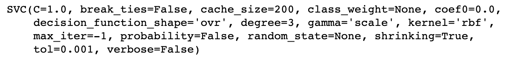
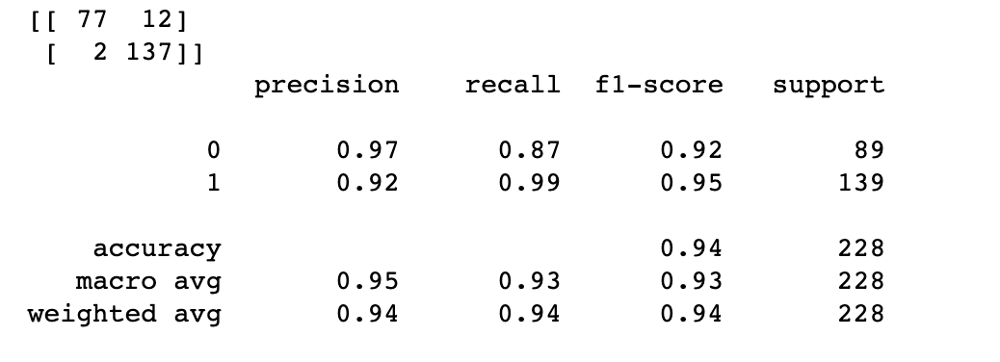

SVM Introduction to Support Vector Machines with Sklearn in Machine Learning | Ranvir’s Blog

# SVM | Introduction to Support Vector Machines with Sklearn in Machine Learning

**Updated on:** April 27, 2020 · 15 mins read

**Categories:**[machinelearning](https://ranvir.xyz/blog/categories/#machinelearning)  **|**[datascience](https://ranvir.xyz/blog/categories/#datascience)  **|**[python](https://ranvir.xyz/blog/categories/#python)  **|**[sklearn](https://ranvir.xyz/blog/categories/#sklearn)**|**

SVM or support vector machines are [supervised learning models](https://ranvir.xyz/blog/how-to-evaluate-your-machine-learning-model-like-a-pro-metrics/#supervised-learning-and-classification-problems) that analyze data and recognize patterns on its own. They are used for both classification and regression analysis.

An SVM model is the representation of the dataset as points in space so that the example of the separate categories is divided by a clear gap which is as wide as possible.

[1. Maximal Margin Classifier](https://ranvir.xyz/blog/svm-support-vector-machines-in-machine-learning/#maximal-margin-classifier)

[2. Support vector classifier](https://ranvir.xyz/blog/svm-support-vector-machines-in-machine-learning/#support-vector-classifier)

[3. Support Vector Machines](https://ranvir.xyz/blog/svm-support-vector-machines-in-machine-learning/#support-vector-machines)

[4. Support Vector Machine for more than two classes](https://ranvir.xyz/blog/svm-support-vector-machines-in-machine-learning/#support-vector-machine-for-more-than-two-classes)

[5. Support Vector Machine using Sklearn](https://ranvir.xyz/blog/svm-support-vector-machines-in-machine-learning/#support-vector-machine-using-sklearn)

Any new incoming data is then mapped to one of these few categories based on which side of the gap they fall on.

For example, in the above image, we can clearly see that there are two categories in the dataset. Category blue and category pink.

Our aim is to differentiate between the two categories. One simple way of doing that is to draw a line between the two categories. But as we can see, there is an infinite number of lines that can clearly divide the dataset into two parts.

What we actually do is that we can choose a hyperplane that maximizes the margin between the classes. The data points (Vectors) touching the two outer lines are called support vectors.

This simple example of two-dimension linear plots can be further used in a dataset having more dimensions. Each time our idea will be to draw a hyperplane that can divide the data into different categories.

Now we are going to talk about some related mathematics and discuss different terms related to SVM.

In general, the discussion of SVM is divided into three parts according to how SVM evolved.

- Maximal Margin Classifier
- Support Vector Classifier
- Support Vector Machine

We will slowly move the article toward the Support Vector Machine but for a proper understanding of SVM’s we have to go through, Maximal Margin Classifier and Support Vector Classifier.

## Maximal Margin Classifier

Maximal Margin Classifier is a model that is used to classify the observations into two parts using a hyperplane.

### What is a Hyperplane?

Simply put, a hyperplane is a subspace in `p-dimensional` space having `p -1` dimensions. For example, in two-dimensional space, the hyperplane will be of 1 dimension, or it will be a line. Similarly, in the case of 3 dimensions, it will be a two-dimensional plane.

In two dimensions the equation of the hyperplane are given by,

β0+β1X1+β2X2=0β0+β1X1+β2X2=0

where vector (X1, X2) is on the hyperplanewhere vector (X1, X2) is on the hyperplane

We can also find some similarities of this equation with the equation of a line.

It’s fairly easy to extend this equation and find the equation of a hyperplane in `p` dimensions.

β0+β1X1+β2X2+...+βpXp=0β0+β1X1+β2X2+...+βpXp=0
Now if,

β0+β1X1+β2X2+...+βpXp=0>0β0+β1X1+β2X2+...+βpXp=0>0
Then the vector is on the one side of the hyperplane and if,

β0+β1X1+β2X2+...+βpXp=0<0β0+β1X1+β2X2+...+βpXp=0<0
The vector is on the other side of the plane.

To sum it up, our main aim in case of Maximal Margin Classifier is to create a hyperplane fitted on a training data of `n X p` matrix `X`, containing `n` training observations in `p`-dimensional space such that all these vectors falls in one of the two classes divided by the hyperplane.

If we represent the classes(labels) for all the n values,

y1,...,yn ϵ{−1,1}y1,...,yn ϵ{−1,1}
Where -1 represents one class and 1 represents the other class.

Our main aim for any incoming test vector,

x∗=(x∗1 ... x∗p)Tx∗=(x1∗ ... xp∗)T

is that our model has to allot this incoming test vector to one of the two classes. This equation given the class of the incoming test vector.

f∗x=β0+β1x∗1+β2x∗2+...+βpx∗pfx∗=β0+β1x1∗+β2x2∗+...+βpxp∗

If the value of this function is positive, we assign it to class 1, otherwise, we assign it to class -1.

A simple issue in this approach is that there are infinite number of hyperplanes possible that can divide a perfect distribution.

The problem reduces to choosing the best hyperplane possible which divides the observations into two parts.

A natural choice is to find the perpendicular distance of each observation from the potential hyperplanes, the one which produces the maximum `margin` from both the sides is chosen as the hyperplane.

Once we have the hyperplane, it is fairly easy to predict the classes of test observations.

The only assumption that we are making here is that a hyperplane dividing the observations in the training set will also divide the observations in the test set, which is not always true. Therefore, this model can lead to overfitting when `p` is large.

We have already discussed that the points on dashed line are called support vectors and it has been found that the position of hyperplane only depends on support vector and is not dependent on the other observations in the dataset.

This is how we define a Maximal margin classifier. There are a few issues with Maximal Margin Classifier.

- It doesn’t work on observations where no clear hyperplane is present between different classes.
- A small addition of observation near the hyperplane can lead to a lot of change in the hyperplane making it a lot volatile.

To cope with the disadvantages of Maximal Margin classifiers, we are introduced to the concept of soft margin.

Simly put, we create a hyperplane which almost separates all of the classes, rather than surely separating all of the classes. This brings us to the concept of Support Vector Classifier.

## Support vector classifier

In case of Support vector classifiers, we allow a few observations to be on the wrong side of hyperplane making the model a little more robust to individual observation and helps us to better classify other and most of the observations.

**> Support vector classifier is also known as a soft margin classifier.

**

The observations on the wrong side of the hyperplane are obviously misclassified by the model. But this helps to improve the overall accuracy of the model.

 

There is not much difference in the idea behind the generation of the model. In case of support vector classifier as well, we want to maximize the value of Margin.

yi(β0+β1xi1+β2xi2+...+βpxip)≥M(1−ϵi)yi(β0+β1xi1+β2xi2+...+βpxip)≥M(1−ϵi)
where ϵi≥0 and n∑i=1ϵi≤Cwhere ϵi≥0 and ∑i=1nϵi≤C

For any given observation vector on either side of plane, `epsilon`( also called a slack variable), gives the point at which it is located, relative to the hyperplane and margin.

If `i`th slack variable is on the right side of the hyperplane then the value of that variable is 0. Also, if

ϵi>0ϵi>0
then the point `i` is on the wrong side of the margin. But if,

ϵi>1ϵi>1
then the slack variable is on the wrong side of the hyperplane.

If we extend this observation to the tuning variable, `C`, we can deduce that `C` is the number which determines the count and severity of the violations to the margins and the hyperplane.

The value of `C` is considered as the tuning parameter which is generally chosen by cross-validation. `C` also controls the bias-variance trade-off for the model.

If the value of `C` is small, we allow a lesser number of observations to be on the wrong side which will fit perfectly to a data set having data with high bias and low variance and vice-versa.

Again similar to Maximal Margin Classifier, it was found that all the observations don’t get to decide the position of a hyperplane of the Margin. It is only dependent on the observations on or inside the margins.

If we expand these points a little we can get to the Support Vector Machines. Let’s discuss them in some detail.

## Support Vector Machines

In the Support vector Machine, we introduce another factor called the kernel, which is the result of enlarging of support vector classifiers in a specific way.

According to our discussions in support vector classifier, its equation can be re-written as,

f(x)=β0+n∑i=1αi<x,xi>f(x)=β0+∑i=1nαi<x,xi>

where <x,xi> is the inner product between the new point x and other xi pointswhere <x,xi> is the inner product between the new point x and other xi points

**> The implementation of the inner product is hidden on purpose and we should be good without knowing the details of it.

**

We can directly replace all the instances of the inner product with a general term called the kernel.

f(x)=β0+∑iϵSαiK(x,xi)f(x)=β0+∑iϵSαiK(x,xi)
as only support vectors are responsible for the creation of the hyperplane.

For `p` planes equation of kernel becomes,

K(xi,xi‘)=(1+p∑j=1xijxi‘j)dK(xi,xi‘)=(1+∑j=1pxijxi‘j)d

which is known as a polynomial kernel of degree `d`. This type of model leads to much flexible decision boundary.

## Support Vector Machine for more than two classes

During the discussion for support vector machines, we haven’t really talked about the case when the number of possible classifications can be more than 2.

We can solve these problems by extending the simple SVM in two ways.

- **One versus One Classification**

In this type of classification, we compare each class with another class one by one and trying to classify each incoming vector to one of the two possible classes chosen at the given instance.

Finally, for a vector, we will choose the class to which it belonged to most of the time during the training of the model.

- **One versus All Classification**

At each instance, we compare of the `K` class to the remaining `K - 1` classes. Finally, we will assign any upcoming test vector to the class which produces the highest values of the constant, or we want to maximize.

β0k+β1kx∗1+β2kx∗2+...+βpkx∗pβ0k+β1kx1∗+β2kx2∗+...+βpkxp∗

## Support Vector Machine using Sklearn

Now we will try to train a Support Vector Machine model using sklearn. We are going to work on the already available cancer data which we have used in [other posts](https://ranvir.xyz/blog/beginners-guide-to-classification-decision-trees-sklearn/#classification-trees-using-sklearn) as well.

So, the idea behind the data is that, we have been given some cancer patients info, for example what is the perimeter, radius and whole lot of other stuff about the cancer. Our goal is to find whether the cancer is `WDBC-Malignant` or `WDBC-Benign`.

Let’s import everything first.

	import pandas as pd
	import numpy as np

Let’s import the data and put in a Data Frame.

	from sklearn.datasets import load_breast_cancer
	cancer = load_breast_cancer()

	df = pd.DataFrame(cancer['data'], columns=cancer['feature_names'])
	df.head()

Read more about data using the following code,

	print(cancer['DESCR'])

Target values are present in other key.

	cancer['target']

Let’s split the data into training and test data.

	from sklearn.model_selection import train_test_split

	X_train, X_test, y_train, y_test = train_test_split(df, cancer['target'], test_size=0.40)

Let’s train the model.

	from sklearn.svm import SVC

	model = SVC()
	model.fit(X_train, y_train)

You can see the default values of tuning variables is used. There are a lot of values which we can change. We will talk about them in our later posts. Please [subscribe](https://ranvir.xyz/blog/subscribe) to know when I publish that post.

Let’s [evaluate the model](https://ranvir.xyz/blog/how-to-evaluate-your-machine-learning-model-like-a-pro-metrics/).

	from sklearn.metrics import classification_report
	from sklearn.metrics import confusion_matrix

	predictions = model.predict(X_test)

	print(confusion_matrix(y_test, predictions))
	print(classification_report(y_test, predictions))

Thats it for this version of Support Vector Machine discussion. Feel free to express your thoughts in the comments and share this post with your friends.

Resources:

1. [ISLR](https://faculty.marshall.usc.edu/gareth-james/ISL/ISLR%20Seventh%20Printing.pdf)

#### Share this:

[* facebook*](https://www.facebook.com/sharer/sharer.php?u=https://ranvir.xyz/blog/svm-support-vector-machines-in-machine-learning/)[* twitter*](https://twitter.com/intent/tweet?text=SVM%20|%20Introduction%20to%20Support%20Vector%20Machines%20with%20Sklearn%20in%20Machine%20Learning&url=https://ranvir.xyz/blog/svm-support-vector-machines-in-machine-learning/)[* pinterest*](https://pinterest.com/pin/create/button/?url=https://ranvir.xyz/blog/svm-support-vector-machines-in-machine-learning/)[* tumblr*](https://www.tumblr.com/share/link?url=https://ranvir.xyz/blog/svm-support-vector-machines-in-machine-learning/)[* reddit*](https://www.reddit.com/submit?url=https://ranvir.xyz/blog/svm-support-vector-machines-in-machine-learning/)[* linkedin*](https://www.linkedin.com/shareArticle?mini=true&url=https://ranvir.xyz/blog/svm-support-vector-machines-in-machine-learning/&title=SVM%20|%20Introduction%20to%20Support%20Vector%20Machines%20with%20Sklearn%20in%20Machine%20Learning&summary=SVM%20or%20support%20vector%20machines%20are%20supervised%20learning%20models%20that%20analyze%20data%20and%20recognize%20patterns%20on%20its%20own.%20They%20are%20used%20for%20both%20classification%20and%20regression%20analysis.%20In%20this%20post%20we%20are%20going%20to%20talk%20about%20Hyperplanes,%20Maximal%20Margin%20Classifier,%20Support%20vector%20classifier,%20support%20vector%20machines%20and%20will%20create%20a%20model%20using%20sklearn.&source=Ranvir%27s%20Blog)[* email*](https://ranvir.xyz/blog/svm-support-vector-machines-in-machine-learning/mailto:?subject=SVM%20|%20Introduction%20to%20Support%20Vector%20Machines%20with%20Sklearn%20in%20Machine%20Learning&body=Check%20out%20this%20site%20https://ranvir.xyz/blog/svm-support-vector-machines-in-machine-learning/)[* hackernews*](https://news.ycombinator.com/submitlink?u=https://ranvir.xyz/blog/svm-support-vector-machines-in-machine-learning/&t=SVM%20|%20Introduction%20to%20Support%20Vector%20Machines%20with%20Sklearn%20in%20Machine%20Learning)

#### You May Also Enjoy

##### 1. [Basic Mathematics for Neural Networks | Vectors and Matrices with Matplotlib](https://ranvir.xyz/blog/neural-networks_maths-vectors-matrices-matplotlib-numpy/)

##### 2. [A simple mathematical guide to classification Trees using sklearn | Decision Trees](https://ranvir.xyz/blog/beginners-guide-to-classification-decision-trees-sklearn/)

##### 3. [A practical approach to Tree Pruning using sklearn | Decision Trees](https://ranvir.xyz/blog/practical-approach-to-tree-pruning-using-sklearn/)

##### 4. [A Beginner's guide to Regression Trees using Sklearn | Decision Trees](https://ranvir.xyz/blog/guide-to-decision-regression-trees/)

**Please share your Feedback:**

Did you enjoy reading or think it can be improved? Don’t forget to leave your thoughts in the comments section below! If you liked this article, please share it with your friends, and read a few more!

Subscribe for the weekly updates!
We don't share your details with others

**Edit Post on GitHub**

This post is available on GitHub, If you found something off,[Please open a PR on GitHub.](https://github.com/singh1114/blog/edit/gh-pages/_posts/2020-04-25-svm-support-vector-machines-in-machine-learning.md)