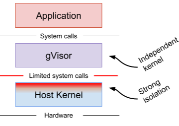

Sandboxing Docker with Google’s gVisor

Sandboxing Docker with Google’s gVisor

https://zwischenzugs.com/2018/05/05/sandboxing-docker-with-googles-gvisor/

gVisor Someone pointed me at this press release from Google announcing a Docker / container sandbox for Linux. I was intrigued enough to write a ‘quick look’ article on it here W…