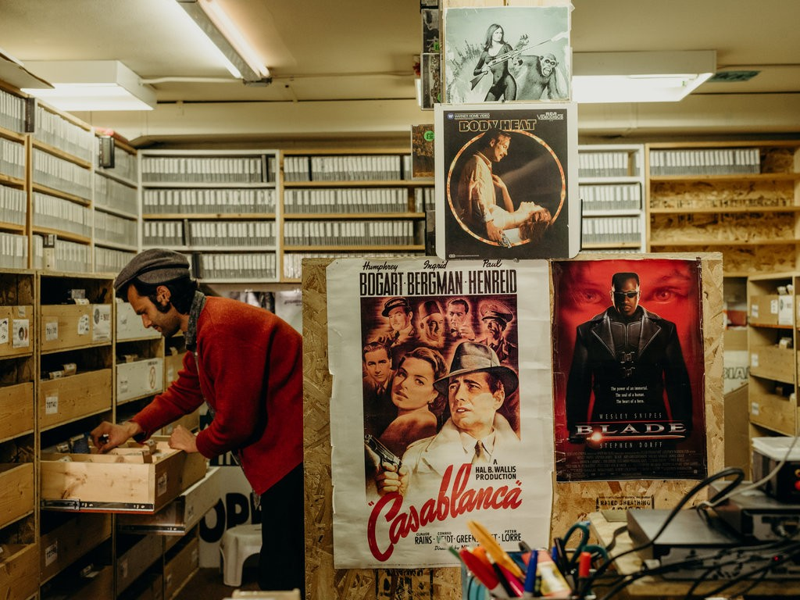
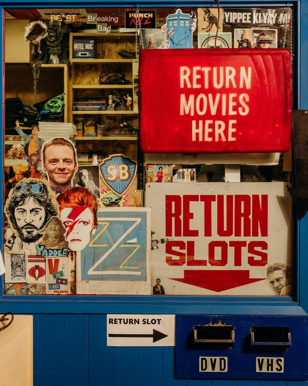
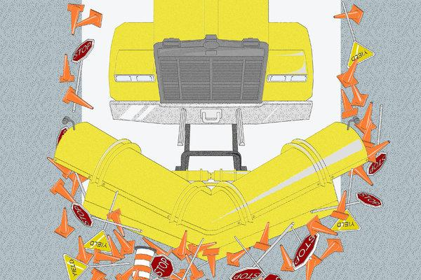

Scarecrow Video in Seattle Might Be the Last of Its Kind. Can It Survive?

 

 

One gift. Endless insight.

Give The New York Times for up to 40% less.

see my options

[(L)](https://adclick.g.doubleclick.net/pcs/click%253Fxai%253DAKAOjsvRodYYV1raaxPRlpOCmJiRmTjWplFz9sTDelF1-my68hUJmLoM8eSSeiRrrlfjgb8R-Ve9p0VkoZlJyZw0bCWvnc4OTYvHkWYLghDYEk72fxgg6v5jK1pOdQ8-LdB9IRvUOS3DFrW3lhrXHqdAyFZXGCgG8GNh10iw7lLBTZskL7klEM9WWmoPf24fuOe0fKL9qDePF3ES7GcIE4x6JIxBsia58nKmvLAmIefXTvPMAPidhDCbaqAU1hn03VhfP5MuRVK6%2526sig%253DCg0ArKJSzGHJ-0iDZPwtEAE%2526urlfix%253D1%2526adurl%253Dhttps://ad.doubleclick.net/ddm/trackclk/N296811.6440THENEWYORKTIMESCOMPA/B22283637.240432619%3Bdc_trk_aid%3D437400224%3Bdc_trk_cid%3D112366959%3Bdc_lat%3D%3Bdc_rdid%3D%3Btag_for_child_directed_treatment%3D%3Btfua%3D)

# Scarecrow Video in Seattle Might Be the Last of Its Kind. Can It Survive?Scarecrow Video in Seattle Might Be the Last of Its Kind. Can It Survive?

The store has more than 132,000 titles, many of them not available on the internet, or anywhere else. “We will fight to the death to keep this open.”

Scarecrow Video offers 132,000 titles: Italian horror. French films. And lots of Japanese animation.

Image

Scarecrow Video offers 132,000 titles: Italian horror. French films. And lots of Japanese animation.

By [Laura M. Holson](https://www.nytimes.com/by/laura-m-holson)
Photographs by Kyle Johnson

- March 18, 2019

-

    - 
    - 
    - [](https://www.nytimes.com/2019/03/18/business/scarecrow-video-seattle.html?action=click&module=Features&pgtype=Homepagemailto:?subject=NYTimes.com%3A%20Scarecrow%20Video%20in%20Seattle%20Might%20Be%20the%20Last%20of%20Its%20Kind.%20Can%20It%20Survive%3F&body=From%20The%20New%20York%20Times%3A%0A%0AScarecrow%20Video%20in%20Seattle%20Might%20Be%20the%20Last%20of%20Its%20Kind.%20Can%20It%20Survive%3F%0A%0AThe%20store%20has%20more%20than%20132%2C000%20titles%2C%20many%20of%20them%20not%20available%20on%20the%20internet%2C%20or%20anywhere%20else.%20%E2%80%9CWe%20will%20fight%20to%20the%20death%20to%20keep%20this%20open.%E2%80%9D%0A%0Ahttps%3A%2F%2Fwww.nytimes.com%2F2019%2F03%2F18%2Fbusiness%2Fscarecrow-video-seattle.html)

    -
    -
    -

There is a story Russell Williams likes to tell about his favorite video store. It was the mid-1990s, and Mr. Williams, a Seattle computer game executive, was searching for a place to rent vintage films. He was thrilled to find a store called Taboo, then realized it offered only adult movies. He sniffed at the local Blockbuster, which mainly stocked mainstream fare. One day, he passed a small storefront plastered with brightly lit posters. His curiosity was piqued.

He had stumbled upon [Scarecrow, a video emporium](http://blog.scarecrow.com/) founded by a Greek immigrant named George Latsios, who had amassed a collection of cultural ephemera and hard-to-find films.

Inside, Mr. Williams found VHS cassette tapes of Yoko Ono and John Lennon when they were [co-hosts on “The Mike Douglas Show”](https://www.youtube.com/watch?v=dxh5fY4p720) in 1972. He found [a 1907 silent film adaptation](https://www.imdb.com/title/tt0000575/) of Jules Verne’s “Twenty Thousand Leagues Under the Sea.” And he also came across a 1953 copy of “The 5,000 Fingers of Dr. T,” the only live-action fantasy film written by Dr. Seuss. (Yes,* that* Dr. Seuss.)

Advertisement

“It began my love affair with Scarecrow,” Mr. Williams said in a recent interview. So much so that his wife teases when he stops there on his way home from work. “I go in, and I’m there for two hours,” he said. “It’s like spelunking. You find treasure after treasure.”

Jensen Ward, a Scarecrow employee, with a few of his favorite films.

Image
Jensen Ward, a Scarecrow employee, with a few of his favorite films.

Consider Quentin Tarantino, who learned movie history as a video store clerk himself in the 1980s. Once video stores were the only place cinephiles could find favorite films after they left theaters. Then came the internet. The rise of online streaming services was a convenience for movie lovers, but it spelled, too, the end of an era. Last month, Blockbuster, which used to operate 9,000 stores, announced that [only one remained](https://www.nytimes.com/2019/03/06/business/last-blockbuster-store.html?module=inline), in Bend, Ore.

As for Scarecrow, it survived bankruptcy, the threat of closing and the death of its charismatic founder. In 2014, it became a nonprofit. And now, with more than 132,000 titles — many on VHS, laser disc and DVD — it is as much a cultural warehouse as anything else.

And that gives Kate Barr, Scarecrow’s president, pause. Film lovers today have access to a prescribed number of movies on streaming services like Netflix, Amazon and Hulu, and other niche channels. Old treasures — many of which are unavailable online because of rights issues or technological hurdles — are being locked away, forgotten or even destroyed.

Of Scarecrow, Ms. Barr said, “We will fight to the death to keep this open.”

Sure, most people no longer want to trudge to the video store on a Friday night, as they once did in droves. Streaming movies are available through on-demand cable, Amazon, Apple, Netflix and many other sources. But the emphasis tends to be on current titles, or TV series. Netflix, which pioneered renting DVDs by mail and streaming, has been moving steadily into original programming, for example.

## Editors’ Picks

[### I Deleted Facebook Last Year. Here’s What Changed (and What Didn’t).](https://www.nytimes.com/2019/03/21/technology/personaltech/facebook-deleted.html?fallback=0&recId=1ImRt8VKv17YiYZgSXEwSDIGNfJ&locked=0&geoContinent=EU&geoRegion=CMD&recAlloc=story&geoCountry=GB&blockId=home-featured&imp_id=1232793&action=click&module=editorContent&pgtype=Article&region=CompanionColumn&contentCollection=Trending)

[### The ‘Enigma’ Who Is the Chief Justice of the United States](https://www.nytimes.com/2019/03/18/books/review/joan-biskupic-chief-life-turbulent-times-chief-justice-john-roberts.html?fallback=0&recId=1ImRt8VKv17YiYZgSXEwSDIGNfJ&locked=0&geoContinent=EU&geoRegion=CMD&recAlloc=story&geoCountry=GB&blockId=home-featured&imp_id=774342153&action=click&module=editorContent&pgtype=Article&region=CompanionColumn&contentCollection=Trending)

[### When the Dominatrix Moved In Next Door](https://www.nytimes.com/2019/03/15/nyregion/brooklyn-dominatrix-dungeon.html?fallback=0&recId=1ImRt8VKv17YiYZgSXEwSDIGNfJ&locked=0&geoContinent=EU&geoRegion=CMD&recAlloc=story&geoCountry=GB&blockId=home-featured&imp_id=279546202&action=click&module=editorContent&pgtype=Article&region=CompanionColumn&contentCollection=Trending)

 [ PAID POST: HUAWEI](https://adclick.g.doubleclick.net/pcs/click?xai=AKAOjsu0mMDpBf13VJStE5lC7J5ArtAAwYOdKetSsuKsi7p6oUWXBIlBhaLAFen-oaxu4qXElv0RWdTiSXTuGXR24QtklC6B3UQbkuXAqq6Qv6eAnhlwJZx6IVAAByiOBmLGdK_sA-8QXWFCPo7zNsQ7C4F78bO4qFXOT7pnbikWaZXM7inCIimSdTpdn-F2iGOSGtTH2SMlUBm7wwZGldPtiIxjjPGYL8LWa8cFCYirhWMO-zIsYW7-AQDB1qHE1ms&sig=Cg0ArKJSzDiKeVZW3ioEEAE&urlfix=1&adurl=https://www.nytimes.com/paidpost/huawei/huawei-redefines-video-experience-with-5g-live-networks.html%3Fcpv_dsm_id%3D191241201%26sr_source%3Dlift_ed%26tbs_nyt%3D2019-March-nytnative_ed)[ Faster Gaming Experience Comes to Smartphones via 5G](https://adclick.g.doubleclick.net/pcs/click?xai=AKAOjsu0mMDpBf13VJStE5lC7J5ArtAAwYOdKetSsuKsi7p6oUWXBIlBhaLAFen-oaxu4qXElv0RWdTiSXTuGXR24QtklC6B3UQbkuXAqq6Qv6eAnhlwJZx6IVAAByiOBmLGdK_sA-8QXWFCPo7zNsQ7C4F78bO4qFXOT7pnbikWaZXM7inCIimSdTpdn-F2iGOSGtTH2SMlUBm7wwZGldPtiIxjjPGYL8LWa8cFCYirhWMO-zIsYW7-AQDB1qHE1ms&sig=Cg0ArKJSzDiKeVZW3ioEEAE&urlfix=1&adurl=https://www.nytimes.com/paidpost/huawei/huawei-redefines-video-experience-with-5g-live-networks.html%3Fcpv_dsm_id%3D191241201%26sr_source%3Dlift_ed%26tbs_nyt%3D2019-March-nytnative_ed)

Advertisement

Ms. Barr worries that a dearth of vintage movies means voices from earlier generations won’t be heard. She points to [hard-to-find documentaries](https://www.amazon.com/Gertrude-Stein-When-This-Remember/dp/6303832423) and little-known gems by black or gay writers and directors. “Who is making decisions about what titles get seen?” she asked. “I think it is important to not lose sight of the importance of movies. They reflect culture. They are cinematic history. It is important to keep these documents.”

George LatsiosCreditScarecrow

Image

George LatsiosCreditScarecrow

At first, Scarecrow was fueled by the passion of one man: Mr. Latsios. He learned English in Greece by watching American movies, his ex-wife, Rebecca Soriano, said. Starting as a teenager, he gathered a collection of 400 videotapes. In 1983, Mr. Latsios moved to Seattle and began renting them out at the back of a friend’s store.

A few years later, he had his own shop: Scarecrow officially opened on Dec. 8, 1988, in a small storefront next to a pub. “Our first day we made $30 dollars, so we went and bought drinks,” Ms. Soriano said.

Mr. Latsios worked two jobs to pay rent and build the collection. He traveled to Europe and acquired Italian horror movies and works by French auteurs. He went to Tokyo, Ms. Soriano said, and came back with crates of Japanese animation on laser discs.

Ms. Barr said Mr. Latsios found copies of movies not available in America. One was “Song of the South,” a 1946 Walt Disney film condemned for its racial stereotyping of African-Americans after the Civil War. It was never released on video in the United States.

## Subscribe to With Interest

Catch up and prep for the week ahead with this newsletter of the most important business insights, delivered Sundays.

Krishanu Ray, who works at Scarecrow, grabbed videos for a customer.

Image

Krishanu Ray, who works at Scarecrow, grabbed videos for a customer.
Advertisement

Success eluded Mr. Latsios until the mid-1990s, when word of his collection spread to Hollywood and beyond. By then, he owned tens of thousands of videos, including a [rare 1968 copy of “Savage Seven](https://www.rottentomatoes.com/m/savage_seven),” an outlaw biker movie featuring the director Penny Marshall in her first movie role.

“That’s when we became a destination for people who couldn’t find stuff,” Ms. Soriano said.

Quentin Tarantino showed up, she said. Roger Ebert, the movie critic [who died in 2013](https://www.nytimes.com/2013/04/05/movies/roger-ebert-film-critic-dies.html?module=inline), was a frequent visitor. “He would wait on people in the store,” Ms. Soriano said. “He would walk through the aisles, grab cassettes and tell people, ‘Don’t leave without getting this!’”

In 1995, Mr. Latsios learned he had brain cancer and began buying every movie he could get his hands on. Soon after, the Internal Revenue Service came calling. Ms. Soriano said her ex-husband had spent the money set aside for payroll and other taxes on videos, leaving the store more than $500,000 in debt.

“Everyone was mad,” she said. “I was mad. The employees were mad. No one knew if the I.R.S. was going to walk through the door and take everything. Still, here, we had this historic collection of movies.”

Image

Return slots.
Image

A rare film on VHS.

His buying spree was too much for the store to bear, and in 1998, Scarecrow filed for bankruptcy. By then, Mr. Williams had befriended Mr. Latsios. He and a group of friends guaranteed Scarecrow’s $55,000 lease until a new buyer could be found. Scarecrow was sold to investors a year later, and ultimately ended up in the hands of [Carl Tostevin and Mickey McDonough](http://blog.scarecrow.com/about-us-3/).

After the sale, Mr. Latsios and Ms. Soriano divorced. He moved back to Greece, where he died in 2003.

Advertisement

[      The truth is worth it.         See the stories](https://adclick.g.doubleclick.net/pcs/click?xai=AKAOjstRJjYvP0xKtgEy08LNWgp8fmUXwTCOsLyuE1K4EZaoBXbSVp1tO_E5uUUMysg5AOpqrWcOZjOPxBVZj1yv-Kuap7BfkFHf-pK6SjTi2F0fkn_x-fhQjnRoCINC0qLPQRaTsn6mv7uS4cex-BlB8x9au7G1KPEJrcZfCEvb9ag-Fq3EfSd4-wNUVJBoJVpU_pVA7zYsuGGZBechzXIkxhEFOLC_ekt-L-b0d1oTZvDhaQk4KKH2hg6NC9ctUsHBb3A&sig=Cg0ArKJSzGiD879xgUKaEAE&urlfix=1&adurl=https://ad.doubleclick.net/ddm/trackclk/N296811.6440THENEWYORKTIMESCOMPA/B22187340.237970964%3Bdc_trk_aid%3D435228218%3Bdc_trk_cid%3D111025435%3Bdc_lat%3D%3Bdc_rdid%3D%3Btag_for_child_directed_treatment%3D%3Btfua%3D)

“He wanted Scarecrow to be a monument to his life,” Mr. Williams said.

Scarecrow’s money woes, though, persisted, fueled by the decline in home video rentals. “Convenience and price has trumped an experience which was generally considered pleasurable,” said Daniel Herbert, a media professor at the University of Michigan in Ann Arbor and author of “Videoland: Movie Culture at the American Video Store.”

In October 2013, Mr. Tostevin and Ms. McDonough [posted a public letter to customers asking for help](https://www.scarecrow.com/40/9681/scarecrow-video-needs-your-help.html). Video rentals, they said, were down 40 percent in the last six years. If the store were to thrive, customers needed to rent more movies.

Image

Scarecrow Video’s storefront.
Image

A model of Billy, the puppet from the “Saw” movie franchise.

“Scarecrow has never been about making money, but it has to support itself,” they wrote. “It’s no longer doing that, and hasn’t for a while.”

Rentals jumped the next month, Ms. Barr said, then plummeted. Four months later, she and more than two dozen Scarecrow staff members met with the owners to discuss their fate. Mr. Tostevin and Ms. McDonough told them they were seeking a buyer. They, too, considered whether to donate the assets to someone who would keep the collection together and run it as a nonprofit. Were the employees interested? They were. In mid-2014, they took over management. Mr. Herbert, a supporter, joined the nonprofit’s board.

Running Scarecrow, Ms. Barr said, is harder than she imagined. The store has added community events to attract new customers, sought donations and offered perks to members, including renting out video players. But the Hollywood filmmakers who used to venture north have not come to the rescue.

“It’s odd,” Ms. Barr said. “But filmmakers and people in the film industry are far less invested in what happens after a film is completed. They make the film and they are done. They move on.”

Laura M. Holson is an award-winning feature writer from New York. She joined The Times in 1998 and has written about Hollywood, Wall Street and Silicon Valley. A movie producer once held a butter knife to her neck.   [@lauramholson](https://twitter.com/lauramholson)

- 
- 
- [](https://www.nytimes.com/2019/03/18/business/scarecrow-video-seattle.html?action=click&module=Features&pgtype=Homepagemailto:?subject=NYTimes.com%3A%20Scarecrow%20Video%20in%20Seattle%20Might%20Be%20the%20Last%20of%20Its%20Kind.%20Can%20It%20Survive%3F&body=From%20The%20New%20York%20Times%3A%0A%0AScarecrow%20Video%20in%20Seattle%20Might%20Be%20the%20Last%20of%20Its%20Kind.%20Can%20It%20Survive%3F%0A%0AThe%20store%20has%20more%20than%20132%2C000%20titles%2C%20many%20of%20them%20not%20available%20on%20the%20internet%2C%20or%20anywhere%20else.%20%E2%80%9CWe%20will%20fight%20to%20the%20death%20to%20keep%20this%20open.%E2%80%9D%0A%0Ahttps%3A%2F%2Fwww.nytimes.com%2F2019%2F03%2F18%2Fbusiness%2Fscarecrow-video-seattle.html)

-

## [More in Business](https://www.nytimes.com/section/business?action=click&module=MoreInSection&pgtype=Article&region=Footer&contentCollection=Business)

[   Ruth Fremson/The New York Times](https://www.nytimes.com/2019/03/21/business/boeing-safety-features-charge.html?action=click&module=MoreInSection&pgtype=Article&region=Footer&contentCollection=Business)

[## Doomed Boeing Jets Lacked 2 Safety Features That Company Sold Only as Extras](https://www.nytimes.com/2019/03/21/business/boeing-safety-features-charge.html?action=click&module=MoreInSection&pgtype=Article&region=Footer&contentCollection=Business)11h ago

[   Gabby Jones for The New York Times](https://www.nytimes.com/2019/03/21/business/levis-stock.html?action=click&module=MoreInSection&pgtype=Article&region=Footer&contentCollection=Business)

[## Levi’s Goes Public, With Jeans on the Trading Floor](https://www.nytimes.com/2019/03/21/business/levis-stock.html?action=click&module=MoreInSection&pgtype=Article&region=Footer&contentCollection=Business)3h ago

 [   PAID POST: HUAWEI](https://adclick.g.doubleclick.net/pcs/click?xai=AKAOjss3MC3JgDTh3b6uH5Mnv-dCQZ3RcaO2auPVStgnKdZclkfbpOVtwrFmjfwTSmj4Hr9RLC1Gq_gmqXwA_x8ZSPindihjzvMLjGqimoPDRpjFFyKeHniT-lOLRkpmKxNtf0_xocT6zWeWRoDPOwoUgydUbSrL0gVw1NBboUxR2cPO_fssf_GVTRGSSyF_3niqN8qFrf32v3fyjX3tWz4vPAp5pOfM_6visqxeBDdBTov6h3zKzcDVeiHQPQNPj_M&sig=Cg0ArKJSzGNocFAW8sYKEAE&urlfix=1&adurl=https://www.nytimes.com/paidpost/huawei/huawei-redefines-video-experience-with-5g-live-networks.html%3Fcpv_dsm_id%3D191241201%26sr_source%3Dlift_morein%26tbs_nyt%3D2019-March-nytnative_morein)  [2019, a Breakthrough Year for Video and Games via 5G](https://adclick.g.doubleclick.net/pcs/click?xai=AKAOjss3MC3JgDTh3b6uH5Mnv-dCQZ3RcaO2auPVStgnKdZclkfbpOVtwrFmjfwTSmj4Hr9RLC1Gq_gmqXwA_x8ZSPindihjzvMLjGqimoPDRpjFFyKeHniT-lOLRkpmKxNtf0_xocT6zWeWRoDPOwoUgydUbSrL0gVw1NBboUxR2cPO_fssf_GVTRGSSyF_3niqN8qFrf32v3fyjX3tWz4vPAp5pOfM_6visqxeBDdBTov6h3zKzcDVeiHQPQNPj_M&sig=Cg0ArKJSzGNocFAW8sYKEAE&urlfix=1&adurl=https://www.nytimes.com/paidpost/huawei/huawei-redefines-video-experience-with-5g-live-networks.html%3Fcpv_dsm_id%3D191241201%26sr_source%3Dlift_morein%26tbs_nyt%3D2019-March-nytnative_morein)

[](https://adclick.g.doubleclick.net/pcs/click?xai=AKAOjss3MC3JgDTh3b6uH5Mnv-dCQZ3RcaO2auPVStgnKdZclkfbpOVtwrFmjfwTSmj4Hr9RLC1Gq_gmqXwA_x8ZSPindihjzvMLjGqimoPDRpjFFyKeHniT-lOLRkpmKxNtf0_xocT6zWeWRoDPOwoUgydUbSrL0gVw1NBboUxR2cPO_fssf_GVTRGSSyF_3niqN8qFrf32v3fyjX3tWz4vPAp5pOfM_6visqxeBDdBTov6h3zKzcDVeiHQPQNPj_M&sig=Cg0ArKJSzGNocFAW8sYKEAE&urlfix=1&adurl=https://www.nytimes.com/paidpost/huawei/huawei-redefines-video-experience-with-5g-live-networks.html%3Fcpv_dsm_id%3D191241201%26sr_source%3Dlift_morein%26tbs_nyt%3D2019-March-nytnative_morein)

[   Stephen Lam/Reuters](https://www.nytimes.com/2019/03/21/technology/personaltech/facebook-passwords.html?action=click&module=MoreInSection&pgtype=Article&region=Footer&contentCollection=Business)

[## Facebook Did Not Securely Store Passwords. Here’s What You Need to Know.](https://www.nytimes.com/2019/03/21/technology/personaltech/facebook-passwords.html?action=click&module=MoreInSection&pgtype=Article&region=Footer&contentCollection=Business)3h ago

[   Glenn Harvey](https://www.nytimes.com/2019/03/21/technology/personaltech/facebook-deleted.html?action=click&module=MoreInSection&pgtype=Article&region=Footer&contentCollection=Business)

[## I Deleted Facebook Last Year. Here’s What Changed (and What Didn’t).](https://www.nytimes.com/2019/03/21/technology/personaltech/facebook-deleted.html?action=click&module=MoreInSection&pgtype=Article&region=Footer&contentCollection=Business)March 21

[   George Etheredge for The New York Times](https://www.nytimes.com/2019/03/21/business/rent-the-runway-unicorn.html?action=click&module=MoreInSection&pgtype=Article&region=Footer&contentCollection=Business)

[## Rent the Runway Now Valued at $1 Billion With New Funding](https://www.nytimes.com/2019/03/21/business/rent-the-runway-unicorn.html?action=click&module=MoreInSection&pgtype=Article&region=Footer&contentCollection=Business)5h ago

## Editors’ Picks

[   Illustration by The New York Times](https://www.nytimes.com/2019/03/16/style/snowplow-parenting-scandal.html?fallback=0&recId=1ImSLXxEMhZDNiSokJVWWRKCdwR&locked=0&geoContinent=EU&geoRegion=CMD&recAlloc=story&geoCountry=GB&blockId=home-featured&imp_id=728789624&action=click&module=editorsPicks&pgtype=Article&region=Footer)

[## How Parents Are Robbing Their Children of Adulthood](https://www.nytimes.com/2019/03/16/style/snowplow-parenting-scandal.html?fallback=0&recId=1ImSLXxEMhZDNiSokJVWWRKCdwR&locked=0&geoContinent=EU&geoRegion=CMD&recAlloc=story&geoCountry=GB&blockId=home-featured&imp_id=728789624&action=click&module=editorsPicks&pgtype=Article&region=Footer)March 16

[   Adam Rose/Netflix](https://www.nytimes.com/2019/03/14/arts/television/one-day-at-a-time-canceled-netflix.html?fallback=0&recId=1ImSLXxEMhZDNiSokJVWWRKCdwR&locked=0&geoContinent=EU&geoRegion=CMD&recAlloc=story&geoCountry=GB&blockId=home-featured&imp_id=991727304&action=click&module=editorsPicks&pgtype=Article&region=Footer)

[## ‘One Day at a Time’ and Why Netflix Is Not Your Friend](https://www.nytimes.com/2019/03/14/arts/television/one-day-at-a-time-canceled-netflix.html?fallback=0&recId=1ImSLXxEMhZDNiSokJVWWRKCdwR&locked=0&geoContinent=EU&geoRegion=CMD&recAlloc=story&geoCountry=GB&blockId=home-featured&imp_id=991727304&action=click&module=editorsPicks&pgtype=Article&region=Footer)March 14

[   Hiroko Masuike/The New York Times](https://www.nytimes.com/2019/03/17/sports/nathan-chen-yale.html?fallback=0&recId=1ImSLXxEMhZDNiSokJVWWRKCdwR&locked=0&geoContinent=EU&geoRegion=CMD&recAlloc=story&geoCountry=GB&blockId=home-featured&imp_id=811431710&action=click&module=editorsPicks&pgtype=Article&region=Footer)

[## Nathan Chen’s Yale Juggling Act](https://www.nytimes.com/2019/03/17/sports/nathan-chen-yale.html?fallback=0&recId=1ImSLXxEMhZDNiSokJVWWRKCdwR&locked=0&geoContinent=EU&geoRegion=CMD&recAlloc=story&geoCountry=GB&blockId=home-featured&imp_id=811431710&action=click&module=editorsPicks&pgtype=Article&region=Footer)March 17

Most Popular

- [What’s Wrong With This Diorama? You Can Read All About It](https://www.nytimes.com/2019/03/20/arts/design/natural-history-museum-diorama.html?fallback=0&recId=1ImSLWkxgqTLXFc5vDC4Yc23Gez&locked=0&geoContinent=EU&geoRegion=CMD&recAlloc=top_conversion&geoCountry=GB&blockId=most-popular&imp_id=297465482&action=click&module=trending&pgtype=Article&region=Footer)
- [‘Us’ Review: Jordan Peele’s Creepy Latest Turns a Funhouse Mirror on Us](https://www.nytimes.com/2019/03/20/movies/us-movie-review.html?fallback=0&recId=1ImSLWkxgqTLXFc5vDC4Yc23Gez&locked=0&geoContinent=EU&geoRegion=CMD&recAlloc=top_conversion&geoCountry=GB&blockId=most-popular&imp_id=635343543&action=click&module=trending&pgtype=Article&region=Footer)
- [I Deleted Facebook Last Year. Here’s What Changed (and What Didn’t).](https://www.nytimes.com/2019/03/21/technology/personaltech/facebook-deleted.html?fallback=0&recId=1ImSLWkxgqTLXFc5vDC4Yc23Gez&locked=0&geoContinent=EU&geoRegion=CMD&recAlloc=top_conversion&geoCountry=GB&blockId=most-popular&imp_id=617266826&action=click&module=trending&pgtype=Article&region=Footer)
- [Opinion: A ‘Disgusting’ Yale Professor Moves On](https://www.nytimes.com/2019/03/19/opinion/nicholas-christakis-yale.html?fallback=0&recId=1ImSLWkxgqTLXFc5vDC4Yc23Gez&locked=0&geoContinent=EU&geoRegion=CMD&recAlloc=top_conversion&geoCountry=GB&blockId=most-popular&imp_id=652543617&action=click&module=trending&pgtype=Article&region=Footer)
- [Trevor Noah Pillories Trump for ‘Beefing With a Dead Man’](https://www.nytimes.com/2019/03/21/arts/television/trevor-noah-trump-john-mccain.html?fallback=0&recId=1ImSLWkxgqTLXFc5vDC4Yc23Gez&locked=0&geoContinent=EU&geoRegion=CMD&recAlloc=top_conversion&geoCountry=GB&blockId=most-popular&imp_id=131901275&action=click&module=trending&pgtype=Article&region=Footer)
- [Doomed Boeing Jets Lacked 2 Safety Features That Company Sold Only as Extras](https://www.nytimes.com/2019/03/21/business/boeing-safety-features-charge.html?fallback=0&recId=1ImSLWkxgqTLXFc5vDC4Yc23Gez&locked=0&geoContinent=EU&geoRegion=CMD&recAlloc=top_conversion&geoCountry=GB&blockId=most-popular&imp_id=923909475&action=click&module=trending&pgtype=Article&region=Footer)
- [There Is No Reason to Cross the U.S. by Train. But I Did It Anyway.](https://www.nytimes.com/interactive/2019/03/20/magazine/train-across-america-amtrak.html?fallback=0&recId=1ImSLWkxgqTLXFc5vDC4Yc23Gez&locked=0&geoContinent=EU&geoRegion=CMD&recAlloc=top_conversion&geoCountry=GB&blockId=most-popular&imp_id=588378352&action=click&module=trending&pgtype=Article&region=Footer)
- [Watches Are Yet Another Easy Way Rich People Make Their Money Into More Money](https://www.nytimes.com/2019/03/20/style/collectible-watches.html?fallback=0&recId=1ImSLWkxgqTLXFc5vDC4Yc23Gez&locked=0&geoContinent=EU&geoRegion=CMD&recAlloc=top_conversion&geoCountry=GB&blockId=most-popular&imp_id=964835709&action=click&module=trending&pgtype=Article&region=Footer)
- [Confusion, Then Prayer, in Cockpit of Doomed Lion Air Jet](https://www.nytimes.com/2019/03/20/world/asia/lion-air-crash-boeing.html?fallback=0&recId=1ImSLWkxgqTLXFc5vDC4Yc23Gez&locked=0&geoContinent=EU&geoRegion=CMD&recAlloc=top_conversion&geoCountry=GB&blockId=most-popular&imp_id=123040377&action=click&module=trending&pgtype=Article&region=Footer)
- [She Was Given a Deadline, but Married on Her Own Terms](https://www.nytimes.com/2019/03/20/fashion/weddings/fired-dance-coach-marries-on-her-terms-not-deadline-set-by-minnesota-roman-catholic-school.html?fallback=0&recId=1ImSLWkxgqTLXFc5vDC4Yc23Gez&locked=0&geoContinent=EU&geoRegion=CMD&recAlloc=top_conversion&geoCountry=GB&blockId=most-popular&imp_id=864176655&action=click&module=trending&pgtype=Article&region=Footer)

Advertisement