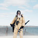
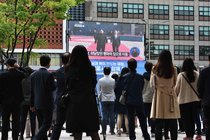

Scenes Unseen: The Summer of ’78

# Scenes Unseen: The Summer of ’78

  By [JIM DWYER](http://www.nytimes.com/by/jim-dwyer)    APRIL 27, 2018

 Long-forgotten pictures capture escape and discovery in the city’s parks.

 [(L)](https://www.nytimes.com/)

# Scenes Unseen: The Summer of ’78

Long-forgotten pictures capture escape and discovery in the city’s parks.

##### **By JIM DWYER**  APRIL 27, 2018

Paul Hosefros

 Tap to continue  [tap-to-advance-arrow.svg](../_resources/81fd72a5ace251ce2d4d033737b3405a.bin)

[(L)](https://www.nytimes.com/)

Six months ago, a conservancy official cleaning out an office came across two cardboard boxes that had been sitting around for decades.

 Tap to continue

[(L)](https://www.nytimes.com/)

Inside were 2,924 color slides, pictures made in parks across New York City’s five boroughs late in the summer of 1978. No one had looked at them for 40 years.

 Tap to continue

 [(L)](https://www.nytimes.com/)

Here are multitudes.

Neal Boenzi

 [(L)](https://www.nytimes.com/)

Cricket players, kite flyers, fishermen, old people in floppy hats and young ones in hardly anything.

Paul Hosefros

 [(L)](https://www.nytimes.com/)

A golfer wheeling his cart out of a majestic mist in Forest Park, Queens.

Neal Boenzi

 [(L)](https://www.nytimes.com/)

Girls tip-toeing along a splintered boardwalk at Coney Island, Brooklyn.

Neal Boenzi

[(L)](https://www.nytimes.com/)

Until now, none of these images have ever been displayed or published. A selection of them are here and in a special print section. More will be on view from May 3 through June 14 at the Arsenal Gallery in Central Park, 830 Fifth Avenue, near 64th Street.

 Tap to continue

[(L)](https://www.nytimes.com/)

These images were the work of eight staff photographers whose pictures normally ran in The New York Times, but who were idled for nearly three months in 1978 by a strike at the city’s newspapers.

 Tap to continue

[(L)](https://www.nytimes.com/)

Not long after the strike began that August, a contingent of the photographers — Neal Boenzi, Joyce Dopkeen, D. Gorton, Eddie Hausner, Paul Hosefros, Bob Klein, Larry Morris, and Gary Settle — met with Gordon J. Davis, the city parks commissioner.

 Tap to continue

 [(L)](https://www.nytimes.com/)

They proposed to wander the city and make pictures of the parks and the people in them.

 [(L)](https://www.nytimes.com/)

No one holds a smartphone.

 [(L)](https://www.nytimes.com/)

Life, uncurated.

 [(L)](https://www.nytimes.com/)

“I was skeptical,” Mr. Davis said, “but what they came back with made me cry.”

Joyce Dopkeen

 [(L)](https://www.nytimes.com/)

New Yorkers drank beer and licked Popsicles and smoked weed.

D. Gorton

 [(L)](https://www.nytimes.com/)

They sunned themselves…

Paul Hosefros

 [(L)](https://www.nytimes.com/)

big grown adult people double-dutched…

Paul Hosefros

 [(L)](https://www.nytimes.com/)

and little ones squatted on haunches to go eyeball to eyeball with pets.

D. Gorton

 [(L)](https://www.nytimes.com/)

They painted landscapes.

Larry Morris

 [(L)](https://www.nytimes.com/)

Roasted entire pigs over pits of coals.

Neal Boenzi

 [(L)](https://www.nytimes.com/)

The city was a financial ruin and stuff was busted and it seemed it would be that way forever.

Gary Settle

 [(L)](https://www.nytimes.com/)

People napped on rock slabs at beaches and tottered along piers so rickety-tilted that it was hard to see how everyone didn’t slide right into the water.

Paul Hosefros

[(L)](https://www.nytimes.com/)

No one is sure, any more, how long the photographers worked or how much they were paid. Probably not long and not much.

 Tap to continue

[(L)](https://www.nytimes.com/)

Mr. Davis, then less than a year into his job as commissioner, remembered the emotional jolt of reviewing a few sample frames. “Then they all disappeared,” he said.

 Tap to continue

 [(L)](https://www.nytimes.com/)

The infamous wretched New York of the 1970s and 1980s can be glimpsed here, true to the pages of outlaw history.

Paul Hosefros

 [(L)](https://www.nytimes.com/)

But that version has never been truth enough.

[(L)](https://www.nytimes.com/)

The photos speak a commanding, unwritten narrative of escape and discovery. “You see that people were not going to the parks just to get away from it all, but also to find other people,” said Jonathan Kuhn, the director of art and antiquities for the department.

 Tap to continue

[(L)](https://www.nytimes.com/)

From the trove, Mr. Kuhn has selected 65 pictures to mount for the exhibit at the Arsenal Gallery, which is open Monday through Friday, 9 a.m. to 5 p.m.

 Tap to continue

[(L)](https://www.nytimes.com/)

Like the starlight that travels millions of years before we see it, the four little boys stand in their underpants at Coney Island on an August day in 1978, and it is only now, in a found photograph, that we behold them.

 Tap to continue

 [(L)](https://www.nytimes.com/)

The ocean has not quite left their hair. Four decades later, they are still flexing their muscles, still just about 10-going-on-11.

Paul Hosefros

 [(L)](https://www.nytimes.com/)

Admission to the exhibit, like the parks and starlight, is free.  *The NYC Parks/New York Times Photo Project will be on view from May 3 – June 14, 2018.*

Paul Hosefros

 [(L)](https://www.nytimes.com/)

 **Restart**

**Jim Dwyer**, a native New Yorker, has written the About New York column for The Times since 2007.

Produced by Fred Bierman, Beth Flynn, Wayne Kamidoi, Andrew Sondern and Rumsey Taylor.

More stories like this

[**Touring the Rust Belt of New York City**](https://www.nytimes.com/2018/04/22/nyregion/touring-the-rust-belt-of-new-york-city.html)

[**Arthur Kopelman Works the Other Hamptons**](https://www.nytimes.com/2018/04/26/nyregion/arthur-kopelman-works-the-other-hamptons.html)

## More on NYTimes.com

- [  ### News Analysis  ## Koreans Set the Table for a Deal That Trump Will Try to Close Apr. 28, 2018](https://www.nytimes.com/2018/04/27/world/asia/koreans-set-the-table-for-a-deal-that-trump-will-try-to-close.html)
- [  ### The Interpreter  ## How Trump’s Mixed Signals Complicate America’s Role in the World Apr. 28, 2018](https://www.nytimes.com/2018/04/27/world/asia/korea-iran-trump-interpreter.html)
- [  ### News Analysis  ## Korean Accord Draws Praise, and Caution, From North’s Neighbors Apr. 28, 2018](https://www.nytimes.com/2018/04/28/world/asia/north-korea-china-japan-russia.html)
- [  ## Firing of House Chaplain Causes Uproar on Capitol Hill Apr. 28, 2018](https://www.nytimes.com/2018/04/27/us/politics/house-chaplain-fired.html)

Advertisement