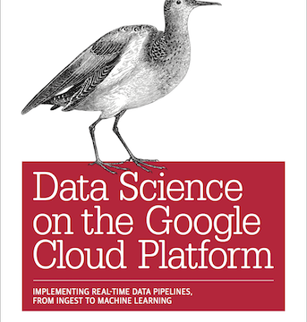

Scheduling data ingest using Cloud Functions and Cloud Scheduler

Scheduling data ingest using Cloud Functions and Cloud Scheduler

https://medium.com/@lakshmanok/scheduling-data-ingest-using-cloud-functions-and-cloud-scheduler-b24c8b0ec0a5

As Google Cloud continues to evolve, some of the solutions I presented in my book “Data Science on the Google Cloud Platform” get…