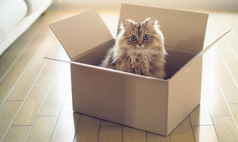

Schrödinger's cat could be saved, say scientists

[Physics](https://www.theguardian.com/science/physics)

# Schrödinger's cat could be saved, say scientists

New research casts doubt on idea that a quantum jump is instant and unpredictable

[Nicola Davis](https://www.theguardian.com/profile/nicola-davis)

[@NicolaKSDavis](https://twitter.com/NicolaKSDavis)

Mon 3 Jun 2019 17.55 BSTFirst published on Mon 3 Jun 2019 17.06 BST

- 
- 
- 

Shares

358

Schrödinger’s cat is a thought experiment exploring the fate of an animal placed in a box with poison and radioactive material. Photograph: Benjamin Torode/Getty Images/Flickr Open

Schrödinger’s cat might not only be dead or alive, but also brought back from the brink, according to scientists who said they have discovered a warning sign for quantum transitions once thought to be instantaneous and unpredictable.

The upshot is that the fate of Schrödinger’s cat can not only be predicted shortly in advance but even reversed once under way, the scientists said.

Although the famous feline is simply a thought experiment, it encapsulates a key conundrum in quantum theory. The idea revolves around a cat that is put in a box with a poison that is released if an atom of radioactive material in the box decays. However, whether the radioactive decay has occurred or not, and hence whether the cat is dead or alive, can only be known by looking in the box. Until that point the cat is both dead and alive at the same time.

Advertisement

Crucially, based on the quantum jump theory proposed by Danish physicist Niels Bohr, it was thought the fate of the cat was both unpredictable and instantaneous upon peeking inside the box.

But now, scientists [writing in the Nature journal](https://www.nature.com/articles/s41586-019-1287-z) believe the jump is not instantaneous, just very fast, and that it is actually more of a glide than a jump. What’s more, there are telltale signs that a quantum jump is about to occur, even if in a broader sense it remains unpredictable.

Dr Zlatko Minev, first author of the research from [Yale University](https://www.theguardian.com/education/yale-university), said: “When you open the box – in other words, when you begin your observation – usually in that time [the transition] appears abrupt and instantaneous.” But looking on a shorter timescale, it seems the situation is very different.

 

##   [Guardian Today: the headlines, the analysis, the debate - sent direct to you]()

   

Read more

 [(L)](https://www.theguardian.com/info/2015/dec/08/daily-email-uk)

In other words, once the box is opened there is a process in which the cat keels over or not, with an early warning sign of when that process kicks off. Crucially it also seems the “jump” can be reversed midway through the transition, meaning Schrödinger’s cat might be brought back from the brink.

“You are taking a lens to it … and if you zoom into the dynamics then you can look at the process by which the jump occurs,” said Minev.

The team made their discovery using an experimental setup involving an electrical circuit that mimics an atom with three energy levels, cooled to a fraction of a degree above absolute zero, enclosed in a metal box and irradiated with microwave light. One beam of microwave light provided the energy for the quantum jump and the other allowed scientists to monitor the situation. They were then able to detect quantum jumps as the “atom” became excited or lost energy.

The team said the work also shows “quantum jumps” are not so much abrupt leaps between energy levels, as Bohr proposed, but gradual transitions more akin to a glide. The team also found the duration and nature of the transition was consistent across 6.8m quantum jumps.

Minev said the research could prove valuable to quantum computing. “In a quantum computer, when a quantum jump occurs, that can be an error in the calculation,” he said.

Although a lot of research is going into detecting and correcting such errors, Minev said the new study raised another possibility, suggesting it might be possible to spot when errors are about to arise and thereby prevent them.

Other experts in the field welcomed the research, with Prof Vlatko Vedral of the University of Oxford describing the work as “a very beautiful experiment”.

##  Since you're here...

… we have a small favour to ask. More people are reading and supporting our independent, investigative reporting than ever before. And unlike many news organisations, we have chosen an approach that allows us to keep our journalism accessible to all, regardless of where they live or what they can afford.

The Guardian is editorially independent, meaning we set our own agenda. Our journalism is free from commercial bias and not influenced by billionaire owners, politicians or shareholders. No one edits our editor. No one steers our opinion. This is important as it enables us to give a voice to those less heard, challenge the powerful and hold them to account. It’s what makes us different to so many others in the media, at a time when factual, honest reporting is critical.

Every contribution we receive from readers like you, big or small, goes directly into funding our journalism. This support enables us to keep working as we do – but we must maintain and build on it for every year to come. **Support The Guardian from as little as £1 – and it only takes a minute. Thank you.**

 [Support The Guardian](https://support.theguardian.com/uk/contribute?REFPVID=jwi1ntr4y1165dybf38z&INTCMP=gdnwb_copts_memco_2019-05-31_contribs_global_epic_control2_control&acquisitionData=%7B%22source%22%3A%22GUARDIAN_WEB%22%2C%22componentId%22%3A%22gdnwb_copts_memco_2019-05-31_contribs_global_epic_control2_control%22%2C%22componentType%22%3A%22ACQUISITIONS_EPIC%22%2C%22campaignCode%22%3A%22gdnwb_copts_memco_2019-05-31_contribs_global_epic_control2_control%22%2C%22abTest%22%3A%7B%22name%22%3A%222019-05-31_contribs_global_epic_control2%22%2C%22variant%22%3A%22control%22%7D%2C%22referrerPageviewId%22%3A%22jwi1ntr4y1165dybf38z%22%2C%22referrerUrl%22%3A%22https%3A%2F%2Fwww.theguardian.com%2Fscience%2F2019%2Fjun%2F03%2Ffeline-fine-fate-of-schrodingers-cat-can-be-reversed-study%22%7D)

 

Topics

- [Physics/](https://www.theguardian.com/science/physics)
- [Yale University/](https://www.theguardian.com/education/yale-university)
- [news/](https://www.theguardian.com/tone/news)
- 
- 
- 
- [Share on LinkedIn](http://www.linkedin.com/shareArticle?mini=true&title=Schr%C3%B6dinger%27s%20cat%20could%20be%20saved%2C%20say%20scientists&url=https%3A%2F%2Fwww.theguardian.com%2Fscience%2F2019%2Fjun%2F03%2Ffeline-fine-fate-of-schrodingers-cat-can-be-reversed-study)
- [Share on Pinterest](http://www.pinterest.com/pin/find/?url=https%3A%2F%2Fwww.theguardian.com%2Fscience%2F2019%2Fjun%2F03%2Ffeline-fine-fate-of-schrodingers-cat-can-be-reversed-study)
- [Reuse this content](https://syndication.theguardian.com/automation/?url=https%3A%2F%2Fwww.theguardian.com%2Fscience%2F2019%2Fjun%2F03%2Ffeline-fine-fate-of-schrodingers-cat-can-be-reversed-study&type=article&internalpagecode=6225207)