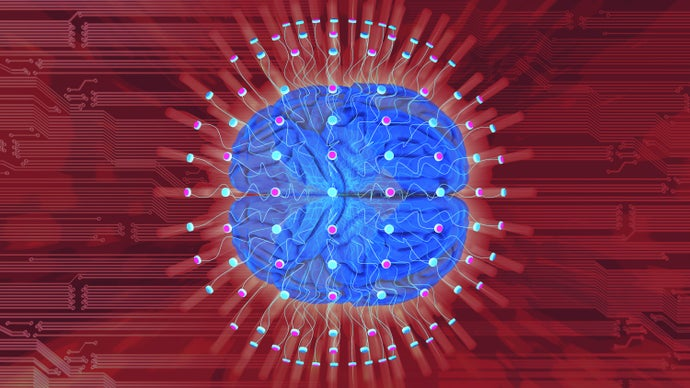

Scientists Demonstrate Direct Brain-to-Brain Communication in Humans

[Neuroscience](https://www.scientificamerican.com/neuroscience/)

# Scientists Demonstrate Direct Brain-to-Brain Communication in Humans

Work on an “Internet of brains” takes another step

- By [Robert Martone](https://www.scientificamerican.com/author/robert-martone/) on October 29, 2019

Credit: [Getty Images](https://www.gettyimages.com/detail/photo/human-brain-on-technology-background-royalty-free-image/948832886?adppopup=true&uiloc=thumbnail_same_series_adp)

We humans have evolved a rich repertoire of communication, from gesture to sophisticated languages. All of these forms of communication link otherwise separate individuals in such a way that they can share and express their singular experiences and work together collaboratively. In a [new study](https://www.nature.com/articles/s41598-019-41895-7)), technology replaces language as a means of communicating by directly linking the activity of human brains. Electrical activity from the brains of a pair of human subjects was transmitted to the brain of a third individual in the form of magnetic signals, which conveyed an instruction to perform a task in a particular manner. This study opens the door to extraordinary new means of human collaboration while, at the same time, blurring fundamental notions about individual identity and autonomy in disconcerting ways.

Direct brain-to-brain communication has been a subject of intense interest for many years, driven by motives as diverse as futurist enthusiasm and military exigency. In his book *[Beyond Boundaries](https://us.macmillan.com/books/9781250002617) *one of the leaders in the field, Miguel Nicolelis, described the merging of human brain activity as the future of humanity, the next stage in our species’ evolution. (Nicolelis serves on *Scientific American*’s board of advisers.) He has already conducted a study in which he linked together the brains of several rats using complex implanted electrodes known as brain-to-brain interfaces. Nicolelis and his co-authors described this achievement as the first “[organic computer](https://www.nature.com/articles/srep11869)” with living brains tethered together as if they were so many microprocessors. The animals in this network learned to synchronize the electrical activity of their nerve cells to the same extent as those in a single brain. The networked brains were tested for things such as their ability to discriminate between two different patterns of electrical stimuli, and they routinely outperformed individual animals.

If networked rat brains are “smarter” than a single animal, imagine the capabilities of a biological supercomputer of networked human brains. Such a network could enable people to work across language barriers. It could provide those whose ability to communicate is impaired with a new means of doing so. Moreover, if the rat study is correct, networking human brains might enhance performance. Could such a network be a faster, more efficient and smarter way of working together?

Advertisement

The new paper addressed some of these questions by linking together the brain activity of a small network of humans. Three individuals sitting in separate rooms collaborated to correctly orient a block so that it could fill a gap between other blocks in a video game. Two individuals who acted as “senders” could see the gap and knew whether the block needed to be rotated to fit. The third individual, who served as the “receiver,” was blinded to the correct answer and needed to rely on the instructions sent by the senders.

The two senders were equipped with electroencephalographs (EEGs) that recorded their brain’s electrical activity. Senders were able to see the orientation of the block and decide whether to signal the receiver to rotate it. They focused on a light flashing at a high frequency to convey the instruction to rotate or focused on one flashing at a low frequency to signal not to do so. The differences in the flashing frequencies caused disparate brain responses in the senders, which were captured by the EEGs and sent, via computer interface, to the receiver. A magnetic pulse was delivered to the receiver using a transcranial magnetic stimulation (TMS) device if a sender signaled to rotate. That magnetic pulse caused a flash of light (a phosphene) in the receiver’s visual field as a cue to turn the block. The absence of a signal within a discrete period of time was the instruction not to turn the block.

After gathering instructions from both senders, the receiver decided whether to rotate the block. Like the senders, the receiver was equipped with an EEG, in this case to signal that choice to the computer.**  ** Once the receiver decided on the orientation of the block, the game concluded, and the results were given to all three participants. This provided the senders with a chance to evaluate the receiver’s actions and the receiver with a chance to assess the accuracy of each sender.

The team was then given a second chance to improve its performance. Overall, five groups of individuals were tested using this network, called the “BrainNet,” and, on average, they achieved greater than 80 percent accuracy in completing the task.

In order to escalate the challenge, investigators sometimes added noise to the signal sent by one of the senders. Faced with conflicting or ambiguous directions, the receivers quickly learned to identify and follow the instructions of the more accurate sender. This process emulated some of the features of “conventional” social networks, according to the report.

Advertisement

This study is a natural extension of work previously done in laboratory animals. In addition to the work linking together rat brains, Nicolelis’s laboratory is responsible for linking multiple primate brains into a “[Brainet](https://www.nature.com/articles/srep10767)” (not to be confused with the BrainNet discussed above), in which the primates learned to cooperate in the performance of a common task via brain-computer interfaces (BCIs). This time, three primates were connected to the same computer with implanted BCIs and simultaneously tried to move a cursor to a target. The animals were not directly linked to each other in this case, and the challenge was for them to perform a feat of parallel processing, each directing its activity toward a goal while continuously compensating for the activity of the others.

Brain-to-brain interfaces also span across species, with humans using noninvasive methods similar to those in the BrainNet study to control [cockroaches](https://journals.plos.org/plosone/article?id=10.1371/journal.pone.0150667) or rats that had surgically implanted brain interfaces. In one [report](https://journals.plos.org/plosone/article?id=10.1371/journal.pone.0060410), a human using a noninvasive brain interface linked, via computer, to the BCI of an anesthetized rat was able to move the animal’s tail. While in another study, a human controlled a rat as a freely moving [cyborg](https://www.nature.com/articles/s41598-018-36885-0).

The investigators in the new paper point out that it is the first report in which the brains of multiple humans have been linked in a completely noninvasive manner. They claim that the number of individuals whose brains could be networked is essentially unlimited. Yet the information being conveyed is currently very simple: a yes-or-no binary instruction. Other than being a very complex way to play a Tetris-like video game, where could these efforts lead?

Sign up for *Scientific American*’s free newsletters.

[(L)](https://www.scientificamerican.com/page/newsletter-sign-up/?origincode=2018_sciam_ArticlePromo_NewsletterSignUp)

The authors propose that information transfer using noninvasive approaches could be improved by simultaneously imaging brain activity using functional magnetic resonance imaging (fMRI) in order to increase the information a sender could transmit. But fMRI is not a simple procedure, and it would expand the complexity of an already extraordinarily complex approach to sharing information. The researchers also propose that TMS could be delivered, in a focused manner, to specific brain regions in order to elicit awareness of particular semantic content in the receiver’s brain.

Meanwhile the tools for more invasive—and perhaps more efficient—brain interfacing are developing rapidly. Elon Musk [recently announced](https://www.scientificamerican.com/article/elon-musks-secretive-brain-tech-company-debuts-a-sophisticated-neural-implant1/) the development of a robotically implantable BCI containing 3,000 electrodes to provide extensive interaction between computers and nerve cells in the brain. While impressive in scope and sophistication, these efforts are dwarfed by government plans. The Defense Advanced Research Projects Agency (DARPA) has been leading engineering efforts to develop an implantable neural interface capable of engaging [one million](https://www.darpa.mil/news-events/2017-07-10) nerve cells simultaneously. While these BCIs are not being developed specifically for brain–to-brain interfacing, it is not difficult to imagine that they could be recruited for such purposes.

Advertisement

Even though the methods used here are noninvasive and therefore appear far less ominous than if a DARPA neural interface had been used, the technology still raises [ethical](https://www.frontiersin.org/articles/10.3389/fneng.2014.00004/full) concerns, particularly because the associated technologies are advancing so rapidly. For example, could some future embodiment of a brain-to-brain network enable a sender to have a coercive effect on a receiver, altering the latter’s sense of agency? Could a brain recording from a sender contain information that might someday be extracted and infringe on that person’s privacy? Could these efforts, at some point, compromise an individual’s sense of personhood?

This work takes us a step closer to the future Nicolelis imagined, in which, in the words of the late Nobel Prize–winning physicist Murray Gell-Man, “thoughts and feelings would be completely shared with none of the selectivity or deception that language permits.”**  **In addition to being somewhat voyeuristic in this pursuit of complete openness, Nicolelis misses the point. One of the nuances of human language is that often what is not said is as important as what is. The content concealed in privacy of one’s mind is the core of individual autonomy. Whatever we stand to gain in collaboration or computing power by directly linking brains may come at the cost of things that are far more important.

[Rights & Permissions](https://www.scientificamerican.com/article/scientists-demonstrate-direct-brain-to-brain-communication-in-humans/#)

*Are you a scientist who specializes in neuroscience, cognitive science, or psychology? And have you read a recent peer-reviewed paper that you would like to write about? Please send suggestions to Mind Matters editor *[*Gareth Cook*](http://bit.ly/1q1kTZx)*. Gareth, a Pulitzer prize-winning journalist, is the series editor of *[*Best American Infographics*](http://bit.ly/10DO4l2)* and can be reached at garethideas AT gmail.com or Twitter *@garethideas*.*

### ABOUT THE AUTHOR(S)

#### Robert Martone

Robert Martone is a research scientist with expertise in neurodegeneration. He spends his free time kayaking and translating Renaissance Italian literature.

#### Recent Articles

- [New Clues Found in Understanding Near-Death Experiences](https://www.scientificamerican.com/article/new-clues-found-in-understanding-near-death-experiences/)
- [A Successful Artificial Memory Has Been Created](https://www.scientificamerican.com/article/a-successful-artificial-memory-has-been-created/)
- [Early Life Experience: It's in Your DNA](https://www.scientificamerican.com/article/early-life-experience-its-in-your-dna/)

## Read This Next

[ Computing ### AI Beats Top Human Players at Strategy Game StarCraft II  8 hours ago — Dan Garisto and Nature magazine](https://www.scientificamerican.com/article/ai-beats-top-human-players-at-strategy-game-starcraft-ii/)

[ Climate ### Even the Dead Cannot Escape Climate Change  8 hours ago — Adam Aton and E&E News](https://www.scientificamerican.com/article/even-the-dead-cannot-escape-climate-change/)

[ Evolution ### We Owe Our Pumpkins to Pooping Megafauna  9 hours ago — Christopher Intagliata](https://www.scientificamerican.com/podcast/episode/we-owe-our-pumpkins-to-pooping-megafauna/)

[ The Body ### Measles Infection Could Leave Kids Vulnerable to Other Diseases  10 hours ago — Karen Weintraub](https://www.scientificamerican.com/article/measles-infection-could-leave-kids-vulnerable-to-other-diseases/)

[(L)](https://blogs.scientificamerican.com/observations/obesity-is-in-the-genes/)

[(L)](https://blogs.scientificamerican.com/observations/obesity-is-in-the-genes/)

[Behavior & Society ### Obesity Is in the Genes](https://blogs.scientificamerican.com/observations/obesity-is-in-the-genes/)

[11 hours ago — Jeffrey M. Friedman |](https://blogs.scientificamerican.com/observations/obesity-is-in-the-genes/)[Opinion](https://www.scientificamerican.com/section/opinion/)

[(L)](https://blogs.scientificamerican.com/observations/unraveling-the-history-of-avalanches-in-juneau/)

[(L)](https://blogs.scientificamerican.com/observations/unraveling-the-history-of-avalanches-in-juneau/)

[Natural Disasters ### Unraveling the History of Avalanches in Juneau](https://blogs.scientificamerican.com/observations/unraveling-the-history-of-avalanches-in-juneau/)

[12 hours ago — Molly Tankersley |](https://blogs.scientificamerican.com/observations/unraveling-the-history-of-avalanches-in-juneau/)[Opinion](https://www.scientificamerican.com/section/opinion/)

Advertisement