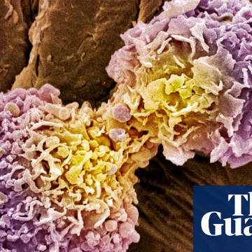

Scientists develop 10-minute universal cancer test

Scientists develop 10-minute universal cancer test

https://www.theguardian.com/science/2018/dec/04/scientists-develop-10-minute-universal-cancer-test

Inexpensive procedure shows whether patient has cancerous cells in the body, but does not reveal where or how serious it is