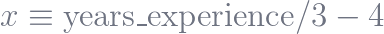
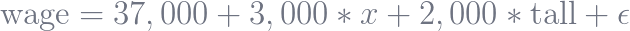
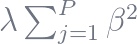
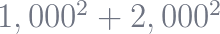
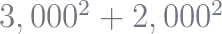

Scikit-learn’s Defaults are Wrong

# Scikit-learn’s Defaults are Wrong

Posted on [August 30, 2019](https://ryxcommar.com/2019/08/30/scikit-learns-defaults-are-wrong/) by [W.D.](https://ryxcommar.com/author/ward314/)

This recent Tweet erupted a discussion about how logistic regression in Scikit-learn uses L2 penalization with a lambda of 1 as default options. If you don’t care about data science, this sounds like the most incredibly banal thing ever. If you do care about data science, especially from the statistics side of things, well, have fun reading this thread:

I want to be clear: scikit-learn is a great and expansive library for machine learning in Python. You can’t do machine learning in Python without it, and the contributors to this library are awesome for volunteering their time to make this available to everyone.

That said, there is something really discomforting about their approach. The philosophy behind scikit-learn’s layout and development reinforces not only common stereotypes about machine learning people, it also reinforces the bad habits that create these stereotypes. The default keyword arguments for `LogisticRegression` are a very good example of what I’m talking about.

Nicolas Hug, a developer on scikit-learn, [remarks](https://twitter.com/hug_nicolas/status/1167508365083369478?s=20) that “scikit-learn is a machine learning package. Don’t expect it to be like a statistics package.” I’m thankful for Nicolas for chiming in and providing his opinion, but this is missing the point. One of the more common concerns you’ll hear–not only from formally trained statisticians, but also DS and ML practitioners–is that many people being churned through boot camps and other CS/DS programs respect neither statistics nor general good practices for data management. I do not think Nicolas appreciates the extent to which simple things such as default settings affect what people actually end up using, whether or not that is intended. In other words, they are not adhering to the most common practices, they are to some extent dictating those practices.

But even if we accept for the sake of argument that most or all of your logistic regressions should be penalized, is there reason to believe that this default functionality is bad? Yes, absolutely.

## Writing good code 101.

>  If it looks like a duck, swims like a duck, and quacks like a duck, then it probably *> is*>  a duck.

“My code is self-documenting” is a meme, and you should be extremely weary of anyone who says this if they’re not providing docstrings and occasional comments. But the goal to make your code as self-documenting as possible is admirable. There are two important things that help you achieve this:

- Stick to the conventions and best practices of the language you’re writing in.
- Use good names.

The “[duck test](https://en.wikipedia.org/wiki/Duck_typing)” is typically used to describe dynamic typing, dynamic polymorphism, and inheritance. But it also applies to namespaces more generally:

1
2
3
[object Object][object Object]  [object Object]
[object Object]
[object Object][object Object]  [object Object][object Object][object Object]

You don’t need to know anything about the `DeckOfCards()` class to have a good sense of what the above code is doing. Trivially, you can tell what the code is *not *doing: it’s not rolling a die, it’s not inputting a paycheck into a payroll system, and so on. The reason you can make a guess at what the code does is not magic; it’s all thanks to short-and-sweet, descriptive names.

What we don’t know for sure is what kind of card deck is being shuffled and drawn from. Presumably it’s a standard 52 French playing card deck without jokers. We’d expect this to be reflected in default keyword arguments and in the documentation. A very bare bones version of the code might look something like this:

1
2
3
4
5
6
7
8
[object Object]  [object Object]

[object Object][object Object]  [object Object][object Object][object Object][object Object][object Object][object Object][object Object][object Object][object Object][object Object][object Object]

[object Object][object Object][object Object][object Object]  [object Object]
[object Object][object Object][object Object][object Object]  [object Object]

[object Object][object Object]  [object Object][object Object][object Object]  [object Object][object Object]

[object Object][object Object][object Object][object Object]  [object Object]
[object Object][object Object]  [object Object]

[object Object][object Object][object Object][object Object][object Object]  [object Object]

If you’re a smartypants, or someone whose brain was ruined by machine learning, you might say that these options are default for information entropy reasons: because these are the most common options, using these options as defaults reduces the average number of questions we need to ask to convey objects made from `DeckOfCards`.

This sounds correct, but it’s not. One reason why these default options reduce the amount of typing is because they follow directly and intuitively from the name “DeckOfCards,” and the intuitive definition is also the most common definition. But the actual goal was to create options that follow intuitively from the name; that this on average reduces the options specified we use is a nice side-effect, but not the goal.

How do I know this is the case that “reducing typing” and “intuitive defaults” are different? Well, consider a class called `PileOfCardboard`. Let’s say 90% of this class’s uses are for creating a deck of playing cards. The `PileOfCardboard` class works by looping through a directory of plain-text files that contain information about each card, such as whether it is a queen of hearts, and imports that information into a dictionary stored in the class.

1
2
3
4
5
6
[object Object]  [object Object][object Object][object Object]

[object Object][object Object]  [object Object][object Object][object Object][object Object][object Object][object Object]

[object Object][object Object][object Object][object Object]  [object Object]
[object Object][object Object][object Object][object Object]
[object Object][object Object]  [object Object][object Object]  [object Object]
[object Object][object Object]

The maintainers of the package for `PileOfCardboard` run into a conundrum: their class is supposed to be used to represent all piles of cardboard, not only playing cards but also folded up boxes and stacks of construction paper. In their next major version release, would it be appropriate to make it so the default `file_dir` for `PileOfCardboard` is a deck of standard 52 French playing cards?

No, silly! That doesn’t obviously follow from the name “PileOfCardboard.” It is not intuitive to users that this will happen. No software engineer worth their salt would do this, and if you don’t viscerally feel in your gut that this is wrong, then you are too far gone.

Obviously, the real problem with the `PileOfCardboard` class is that it is being used too much for an oddly specific use case, which may necessitate the use of a subclass (such as `DeckOfCards`) if it gets too out of hand.

## sklearn’s LogisticRegression default keyword arguments are insane.

All of the above is a simple *ad absurdum* argument demonstrating that it is better for a class’s default kwargs to be either obvious or forgettable, and not necessarily to reduce the amount of typing that people do by a few characters.

I don’t know if it’s true that a plurality of people doing logistic regressions are using L2 regularization and lambda = 1, but the point is that *it doesn’t matter*. Unregularized logistic regression is the most obvious interpretation of a bare bones logistic regression, so it should be the default, and `RegularizedLogisticRegression` could have its own class:

1
2
3
4
5
[object Object]  [object Object]

[object Object][object Object]  [object Object][object Object][object Object][object Object][object Object][object Object][object Object][object Object]

[object Object][object Object]  [object Object]  [object Object]  [object Object]  [object Object]

[object Object][object Object][object Object][object Object][object Object]  [object Object]

[object Object][object Object]  [object Object][object Object][object Object][object Object][object Object][object Object][object Object][object Object][object Object]

The absurdity doesn’t end simply at unintuitive namespace usage, though.

#### Regularization is dangerous without preprocessing.

If you’re not [normalizing](https://en.wikipedia.org/wiki/Feature_scaling) your data, then you really can’t penalize the parameters in a sensible way. This follows very straightforwardly from the math of regularization, explained in **Appendix A** of this post.

Why is this a problem? Because one might expect that the most basic version of a function should broadly work for most cases. Except that’s not actually what happens for `LogisticRegression`. Scikit-learn requires you to either preprocess your data *or* specify options that let you work with data that has not been preprocessed in this specific way. You cannot simply put your data into sklearn’s logistic regression for exploratory purposes and get sensible results. In other words, the ostensible simplicity and lack of fuss of these default parameters for machine learning creates an odd road bump in the case where you really want simplicity, i.e. exploratory analysis.

If you type “logistic regression sklearn example” into Google, the [first result](https://towardsdatascience.com/logistic-regression-using-python-sklearn-numpy-mnist-handwriting-recognition-matplotlib-a6b31e2b166a) does not mention that this preprocessing is necessary and does not mention that what is happening is not logistic regression but specifically penalized logistic regression. Furthermore, the lambda is never selected using a grid search. Someone learning from this tutorial who also learned about logistic regression in a stats or intro ML class would have no idea that the default options for sklearn’s `LogisticRegression` class are wonky, not scale invariant, and utilizing untuned hyperparameters.

#### Having a default value for lambda makes no sense.

As previously explained, `LogisticRegression`‘s default options don’t “work” with typical, unnormalized data. What’s even crazier is that `LogisticRegression`‘s default options don’t work on *most* data, even when normalized, unless lambda = 1 maximizes whatever score you’re evaluating your model on.

Even if it makes sense for all logistic regressions to be penalized and have lambda > 0, it does not follow that lambda = 1 is a good default. To be clear, this is totally arbitrary, and to get the lambda you want, you need to use something like grid search to tune your model to the lambda that maximizes whatever score you’re using to evaluate it.

Of course, you don’t run into this issue if you just represent `LogisticRegression` as an unpenalized model. You run into the “issue” that your model is no longer penalized, but you know exactly what you’re getting and it’s totally intuitive. Yes, lambda = 0 is “wrong” if all models should be penalized, but lambda = 1 is *also* wrong for most models.

Also, on the topic of lambda, I don’t really know why sklearn’s `LogisticRegression` uses `C` (the reciprocal of lambda) instead of `alpha` (sklearn’s name for lambda) other than that it follows the convention of [SVMs](https://en.wikipedia.org/wiki/Support-vector_machine), another classification method. On that note, I’m not really sure why it’s called `alpha` instead of lambda; the term “lambda” () follows from the fact that this magic number is actually a [Lagrange multiplier](https://en.wikipedia.org/wiki/Lagrange_multiplier). sklearn’s `LogisticRegression` documentation describes `C` as the “inverse of regularization strength,” not mentioning lambda or even alpha. This is a relatively small complaint, but the issue here is that this terminology is two steps removed from how penalization is described in textbooks, which strikes me as odd and an unnecessary hurdle when translating textbook knowledge to practical knowledge. R does not have this problem; R’s `glmnet` takes `lambda` as an argument for the penalty, as one might expect. What’s extremely confusing though is that in R, `alpha` tunes the [elastic net](https://en.wikipedia.org/wiki/Elastic_net_regularization). Frankly, I’m on R’s side with this one.

#### Scikit-learn deviates from standards in other languages, textbooks, and so on.

Logistic regression has a very clear definition laid out in statistics textbooks and machine learning textbooks and other languages, such as R, Stata, and SAS. Imagine the shock on many people’s faces who are migrating from another language to Python that what scikit-learn is doing when you run `LogisticRegression` is not actually logistic regression. This bit of information is such a waste of brain space and an unnecessary hurdle.

This is why “read the docs” is a cop-out answer. You shouldn’t need to carefully read every line of documentation to have a sense that what you are doing is working the way it intuitively should be working. It’s easy to miss that the normalization is happening from a quick skim, and I wouldn’t blame someone who already knows what logit is if they simply skimmed the docs.

99% of the people upset by me saying that you shouldn’t have to read all docs carefully probably haven’t done so for every single function they are using in their own work. In some cases, it’s because the nuances of those functions aren’t critical; you can get a sense from the output that it’s working correctly, and there may not even be much nuance to it. In other cases, it’s because the function is assumed to work in an obvious way, which is a reasonable assumption for extremely popular, mainstream libraries.

For example, I’ve built a whole website in [Flask](https://github.com/pallets/flask) by reading a mere fraction of the documentation, and my website works fine. Let’s say hypothetically that Flask was doing something really bad and unexpected like exposing user data, but that somewhere in the docs this was addressed as default behavior. In this case, “read the docs” would be such a lousy answer to a problem that could be solved instead by making it work intuitively and not doing the bad thing people don’t expect.

* * *

##### Appendix A: Why you should normalize when using regularization.

If you linearly transform the feature space of an unpenalized model, you don’t actually affect the fit of the model; the parameters adjust instead. To understand why, imagine the following fitted linear regression model that measures the effect of being tall on your wages:

What would happen if we linearly transformed  and inserted that into the model? You’d get this:

. 

We adjusted the parameters, but otherwise nothing interesting happened. The model’s fit hasn’t changed. Neither model predicts better than the other.

This is not the case when regularizing. Recall that the L2 norm penalty term is . Expressed in terms of , the non-intercept s are 1,000 and 2,000. Expressed in terms of , the non-intercept s are 3,000 and 2,000. Clearly,  is not equal to , so this will affect how your model’s parameters look in the end. In a nutshell, this is why it is important to normalize your data when regularizing, i.e. to ensure you are weighing your penalties against relative magnitudes and not nominal magnitudes.

### Share this:

- [Twitter](https://ryxcommar.com/2019/08/30/scikit-learns-defaults-are-wrong/?share=twitter&nb=1)
- [Facebook](https://ryxcommar.com/2019/08/30/scikit-learns-defaults-are-wrong/?share=facebook&nb=1)

-

[Like](https://widgets.wp.com/likes/index.html?ver=20190321#)

- 
- 
- 
- 

[4 bloggers](https://widgets.wp.com/likes/index.html?ver=20190321#) like this.

### *Related*

[How I Learned Python](https://ryxcommar.com/2019/10/24/how-i-learned-python/)

[On Moving from Statistics to Machine Learning, the Final Stage of Grief](https://ryxcommar.com/2019/07/14/on-moving-from-statistics-to-machine-learning-the-final-stage-of-grief/)

[FizzBuzz, Redux](https://ryxcommar.com/2019/07/20/fizzbuzz-redux/)In "humor"

Posted in [Uncategorized](https://ryxcommar.com/category/uncategorized/)Tagged [machine learning](https://ryxcommar.com/tag/machine-learning/), [python](https://ryxcommar.com/tag/python/)