Search Query Embeddings using query2vec

# Query2vec: Search query expansion with query embeddings

[Alex Egg](https://bytes.grubhub.com/@eggie5?source=post_page-----f5931df27d79----------------------)

[Nov 4](https://bytes.grubhub.com/search-query-embeddings-using-query2vec-f5931df27d79?source=post_page-----f5931df27d79----------------------) · 11 min read

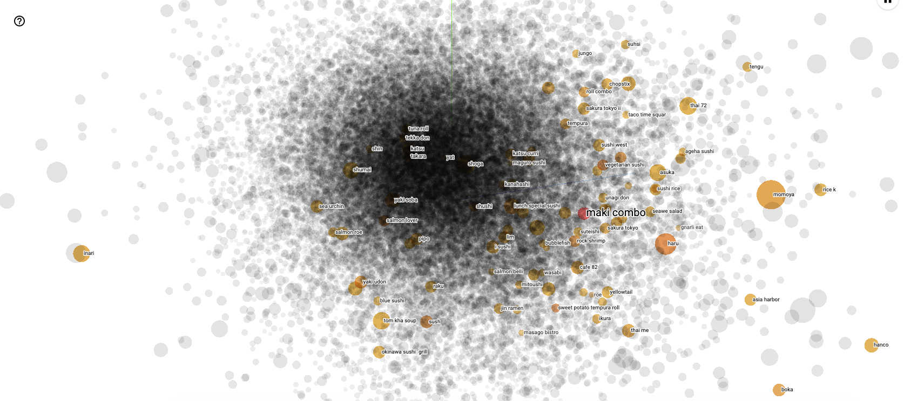
query2vec: Latent Query 3D Embedding Space for “Maki Combo” search query

Discovery and understanding of a product catalog is an important part of any e-commerce business. The traditional — and difficult — method is to learn product interactions by building manual taxonomies. However, at Grubhub we leverage recent advancements in Representation Learning — namely Sequential Modeling and Language Modeling — to learn a Latent Food Graph. With our strong and scalable understanding of the product catalog, we are able to power better search and recommendations — and in a much more sustainable fashion — than if we were maintaining an expensive handmade taxonomy.

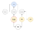
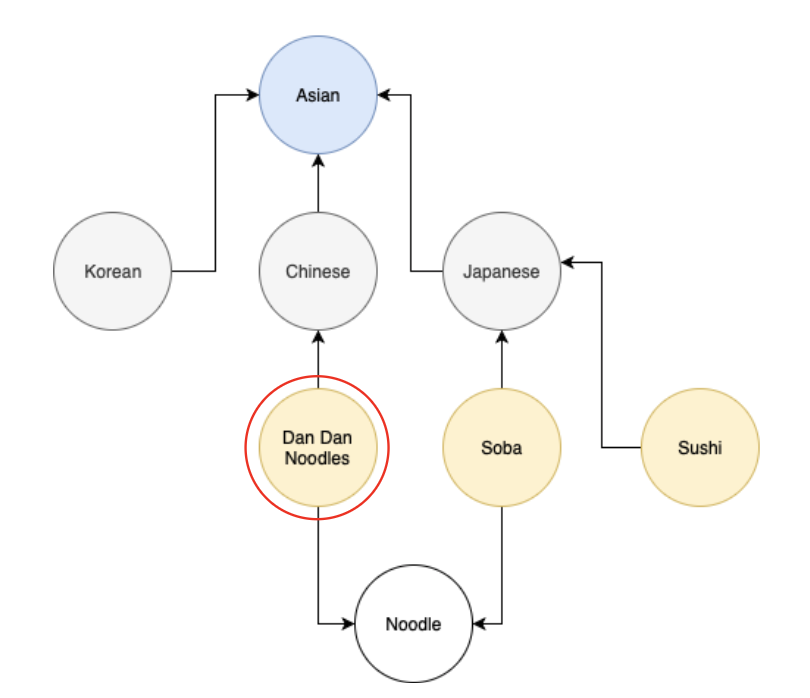

*Figure 1: An example food knowledge graph. Yellow nodes are Dish types, grey nodes are Cuisine types, and white nodes are particular subcategories.*

# Knowledge Graphs

E-commerce companies have the difficult challenge of understanding their inventory catalog, especially when the catalog can grow unbounded, and where new data (for example, restaurants and menus) is unstructured. The goal is to be able to systematically answer questions such as:

- What Dish type is Dan Dan Noodles?
- What Cuisine type is Dan Dan Noodles?
- What are some trending Asian noodle dishes?
- What are 3 semantically similar restaurants to Le Prive NYC? (cuisine-level semantics)
- What are some related cuisines to Udon Noodles? (cuisine graph traversal)
- What are menu items similar to Blueberry Pancake Breakfast? (semantic matching)
- What are some synonyms for Pierogi? (cross-lingual query expansion)
- What are 3 dishes similar to Kimchi-jjigae? (dish-level semantics)

At Grubhub, it is instrumental to our business to be able to answer taxonomic questions about any item in our inventory. The typical way to answer these questions is to build a product Knowledge Graph. These graphs tend to be rule-based systems, and they come with certain flaws: namely, they’re expensive, and can be difficult to scale and maintain.

An example knowledge graph is depicted above in Figure 1. Consider the query item, “Dan Dan Noodles.” Without a knowledge graph, it might be difficult to know where this item sits in the universe of food. Using fuzzy matching, a machine can possibly infer from the name that the dish has noodles. However, it cannot know that it is Chinese cuisine from text matching alone. We might be able to develop a set of rules with lookup tables to store the cuisine relationship, but such a system would likely be difficult to maintain, and it wouldn’t be able to handle all cases.

Currently, Grubhub has a rule-based knowledge graph system in place, although it faces some of the same issues described above: accuracy, scalability, expense, and maintenance. In order to overcome these issues, our hypothesis is that we can augment the current system using recent advances in Representation Learning and Neural Language Modeling.

# Representation Learning

Representation Learning is a special application of Deep Learning in which latent representations of items (latent meaning they cannot be observed directly) are learned from data. Given these representations of items in the Grubhub universe — for example, menu item dishes and cuisines — we can start making connections between these items, and therefore make relationships. In other words, these representations can be viewed as a latent food knowledge graph.

Some popular techniques for representation learning are:

- Unsupervised Pretraining
- Transfer Learning and Domain Adaptation
- Distributed Representations

In this post, I’m focusing on the most popular techniques: Distributed Representations and Transfer Learning, which is mostly Neural Language Modeling in practice.

# Language Models

Due to the large and unbounded scale of our catalog, we must leverage automation in order to understand our unstructured text menu data. If presented in a certain way, language models can learn the semantics of natural human language. Our hypothesis is that if we can train a language model on our unstructured menu data, then we can gain an understanding of menus and restaurants.

The output of most language models are embeddings. Embeddings are dense vectors that typically describe words. For example, the words “chicken” and “roast” should be close together in the three dimensional embedding vector space shown below in Figure 2.

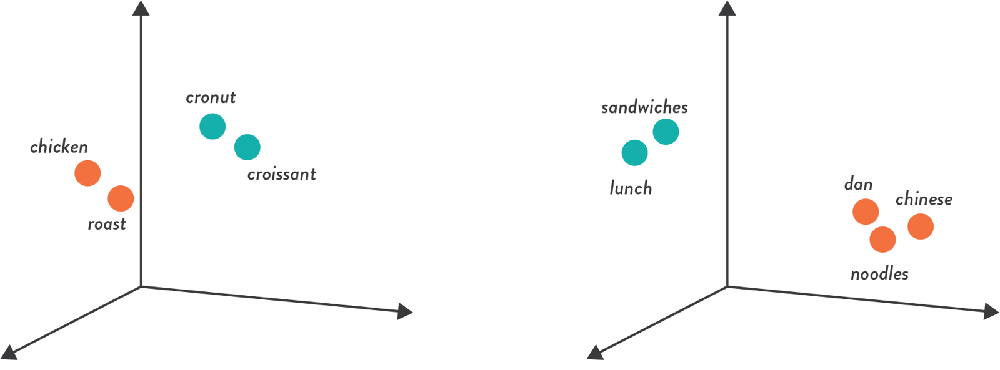

*Figure 2: Two example menu embeddings. Relations are projected into three dimensions.*

Language Models are often trained generically on a few common tasks, and their ancillary embeddings are then used for transfer learning or domain adaptation for a specialized downstream objective such as classification or ranking. Popular language modeling tasks include: Neural Machine Translation and Next Word Prediction. A common and simple implementation of next word prediction language modeling is the class of word2vec algorithms.

## Word2vec

The word2vec class of algorithms has been instrumental in driving innovation in neural language modeling. Due to its simple structure and interpretable outputs (embeddings), it has proven popular in both industry and academia.

The Word2vec algorithm maps words to semantic distributed vectors. The resulting vector representation of a word is called a word embedding. Words that are semantically similar correspond to vectors that are close together. That way, word embeddings capture the semantic relationships between words.

The algorithm learns semantic representation (embeddings) of language based on the Distributed Hypothesis. The Distributed Hypothesis states: *words that occur in the same contexts tend to have similar meanings*. Therefore, if we can generate pairs of words in the same context and then learn to predict those pairs in a classification setting, we can have a model of language. Consider the example text below from a real Grubhub restaurant menu:

*Magret de Canard: Roasted parsnips and celeriac puree with gastrique.*
After Preprocessing Normalization:
*magret canard roasted parsnip celeriac puree gastrique*
The algorithm then runs a window over the sentence and makes pairs of words:
1. *magret ****canard**** roasted* parsnip celeriac puree gastrique
2. magret *canard ****roasted**** parsnip* celeriac puree gastrique
3. magret canard *roasted ****parsnip**** celeriac* puree gastrique
4. magret canard roasted *parsnip ****celeriac**** puree* gastrique
5. magret canard roasted parsnip *celeriac ****puree**** gastrique*

*List 1: window size 3 with center context pairs. Bold is center word and italicized is context window.*

Table 1 below shows an example of some of the possible generated pairs.

- **Context, Target**
- canard, margret
- canard, roasted
- roasted, canard
- roasted, parsnip
- parsnip, roasted
- parsnip, celeriac
- celeriac, parsnip
- celeriac, puree

*Table 1: Window size 3 pairs (not exhaustive).*

These pairs are then passed through the skipgram architecture below in Figure 3. For example, if the context word is “canard,” and the target word is “roasted,” then the algorithm will learn the conditional probability of “roasted” given “canard” by minimizing a standard Maximum Likelihood Loss Function in Equation 1.

*Equation 1: Skipgram probabilistic interpretation: the softmax probability distribution over word pairs in the same context (Table 1).*

It should be clear that after going through all the pairs on a large dataset, words such as “canard” and “parsnip” will be clustered around the word “roasted” in the embedding space in a French cuisine cluster.

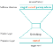
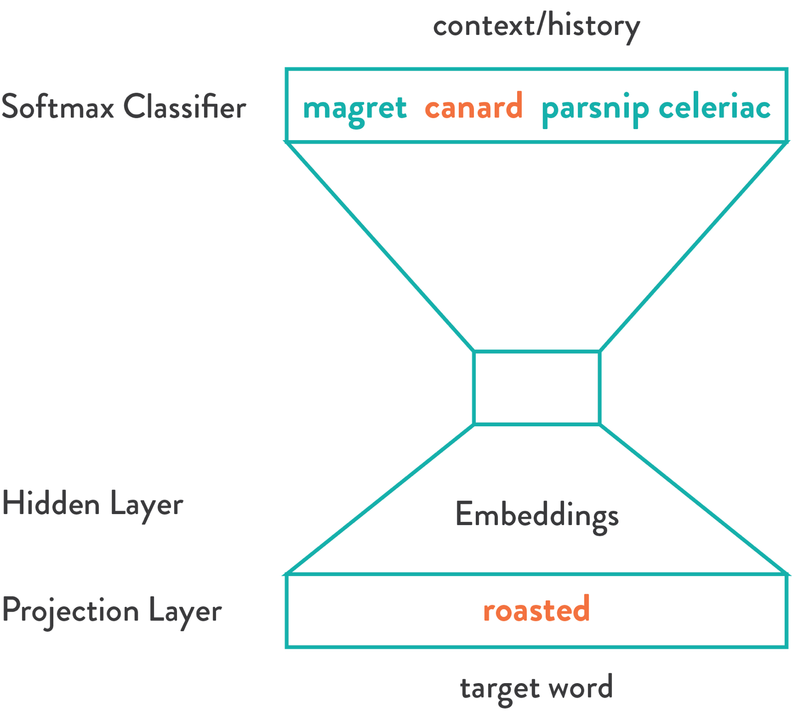

*Figure 3: Skipgram Architecture where “roasted” should predict “canard” in the softmax layer.*

An important point to highlight is that we call this a content-based embedding, meaning it is based solely on curated text content. However at Grubhub, most of our data comes from user-feedback data via logs which we collect and call “behavioral data.”

# Embedded Search Queries and Behavioral Feedback Data

When you search and browse on Grubhub, you are providing implicit and explicit feedback on your preferences. More importantly, you are giving Grubhub feedback on how particular items are related. For example, if you search for the delicious French dish “*Magret de Canard” *and convert on the restaurant Le Prive, and if someone else searches for the cuisine “French” and clicks on Le Prive, then at scale there is strong collaborative feedback that Le Prive offers French cuisine and Margret de Canard is French cuisine.

Below in Table 2 are example user search queries that are clearly windows into user preferences.

- User A, shepherd pie italian sambar irish stew shepherd pie Irish stew
- User B, seafood lie stella keto
- User C, ice cream el salvadoran dim sum octopus cereal bella tres leche grill shrimp chocolate

*Table 2: Behavioral Data Example search tokens for three users.*

You might wonder: if we can embed words, what else can we embed? Restaurants, menu items, even search queries? In order to do so, we’d have to adapt the Distributed Hypothesis from language modeling to a non-language setting. The goal of the Distributed Hypothesis is simply to have a heuristic to generate pairs of items (words) from sequences (sentences). But we’re in luck: skipgram pairs are automatically generated by user behavioral feedback, when users enter a search query and convert on a restaurant.

The difference between this and word2vec is that the primitive atomic unit we are embedding isn’t a word, but a search query. Therefore this isn’t a language model, but a query model.

# Query Expansion

There are many applications of our latent food graph, but the one we’ll be highlighting in this post is an application in Grubhub search, particularly Query Expansion.

To understand the importance of Query Expansion, consider this illustration of the Grubhub search pipeline below in Figure 3.

After a query is submitted by the user, it is preprocessed using standard normalization techniques, then sent to the next stage, where a query is prepared for the search backend. This step includes Query Expansion, where we hope to boost the recall of the query. Moving onto Candidate Selection, full text search is performed using exact and inexact text matching. Finally, candidates are processed with a high precision ranker according to a number of criteria such as revenue, relevance, and personalization, before being prepared for the presentation layer.

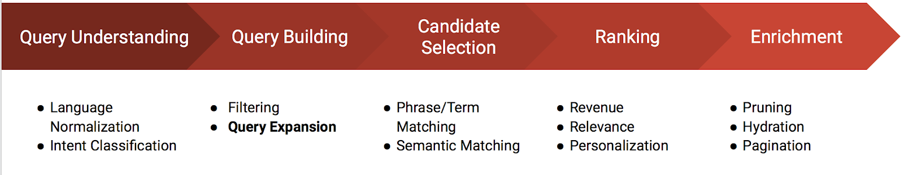

*Figure 5: Grubhub Search Pipeline. During the Query Building phase, Query Expansion helps to generalize the users intent.*

The goal of Query Expansion is to generalize the user’s intent in order to increase recall. Recall is an Information Retrieval metric that quantifies how well a search system finds all relevant items. A query expansion system is useful in these two cases: Long-tail queries (uncommon or very specific, like “blintz;”) and Small Markets (where inventory is limited).

Even in Large Markets like New York City, certain queries cannot be serviced — for example, a regional cross-lingual name such as “blintz,” which in New York City would be called a Pierogi. There are many Blintz to be served in New York, just not by that name. In the case of the Small Market, there may be only three restaurants available, and even if we can’t match the user’s query exactly, we want to be able to show *something* instead of nothing. In both of these cases, it is useful to generalize the user’s intent, or in other words, expand the query.

Consider the theoretical query expansion example below for Dan Dan Noodles:

*Figure 6: A good application of query expansion (theoretical).*

If this was a large market like New York City, or a small market like Barstow, CA, the effect of this expansion is higher recall and a better search experience. In New York, the user will find their exact noodles and in Barstow, they’ll probably find some type of Asian cuisine.

How does query expansion work? The classical technique uses synonyms.

# Classic Query Expansion

A contrived example of classical query expansion using a thesaurus to find query synonyms is highlighted below for the example query “Dan Dan Noodles” :

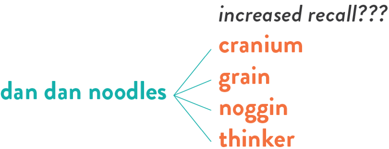
*Figure 7: A contrived example of classical query expansion.*

The only common English noun in the query is “noodle,” which is also an expression for a human brain. Obviously, this is a bad expansion and serves to show some of the difficulties in using a thesaurus, especially in domain specific situations like food.

More robust techniques leverage user feedback data and Representation Learning.

# Semantic Query Expansion

By clustering user search queries around converted restaurants and using Representation Learning, we can, in the word2vec fashion, learn a query model. Meaning, through behavior feedback we can gain a semantic understanding of query intent.

If we revisit the contrived “Dan Dan Noodles” example in Table 4, we can now apply the same experiment to a semantic model. Figure 8 shows a screenshot from a tool that we use to QA our embeddings — Tensorflow Embedding Projector. The input query is under the “Search” field and the ten nearest neighbors are listed below.

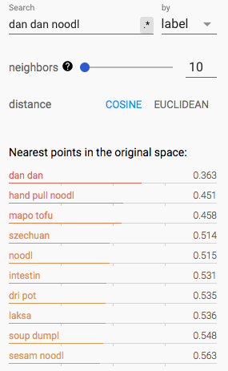

*Figure 8: 10 NN Results for “Dan Dan Noodles” on Semantic Query Model. Note that the strange spellings are a result of the text normalization process.*

As you can see, the results of the expansion are very close to the theoretical baseline in Figure 6. It did not make the same mistake as the classical approach, in Figure 7, by using lexical matching.

## Query2vec

The model in Figure 9 is called query2vec, as it embeds search queries. The training routine takes pairs, as with any skipgram architecture. However, in this case it is not working on the word level. Rather, the context is search queries, and the targets are restaurants. This is visualized in Figure 8.

*Figure 8: Converted queries and their respective restaurants.*

After the query2vec training routine is complete, the output artifact — an embedding matrix (query_embedding in Figure 10) — is used to make expansions. To perform query expansion, a K-Nearest Neighbor routine must be performed in the embedding space.

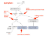
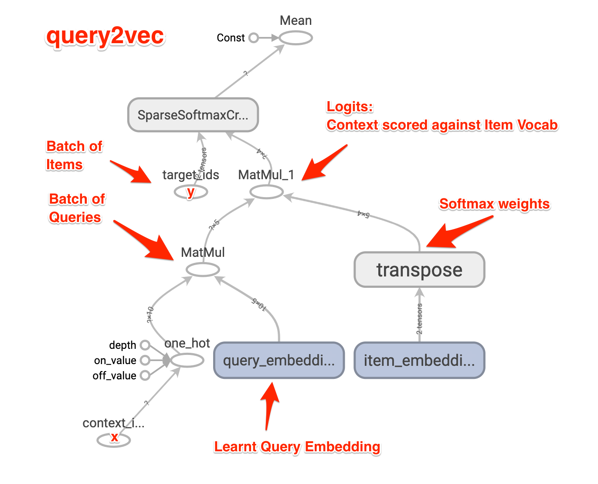

*Figure 10: Prototypical skipgram architecture. In practice, the softmax layer at the end of the network is replaced with some type of approximation, like NCE, for performance reasons.*

We generated one year of (search query, restaurant) pairs and then trained the model until the loss stopped decreasing based on the Tensorflow architecture in Figure 8. Tunable model hyperparameters are related to the NCE loss and the dimensionality of the embeddings.

At runtime, the model’s embeddings are exported into an Approximate K Nearest Neighbour index for fast run-time KNN lookup. For QA, we explore the embeddings with the Tensorflow Embedding Projector.

To highlight the expressive power of query embeddings, these are examples of expanded queries as annotated screenshots from the Embedding Projector:

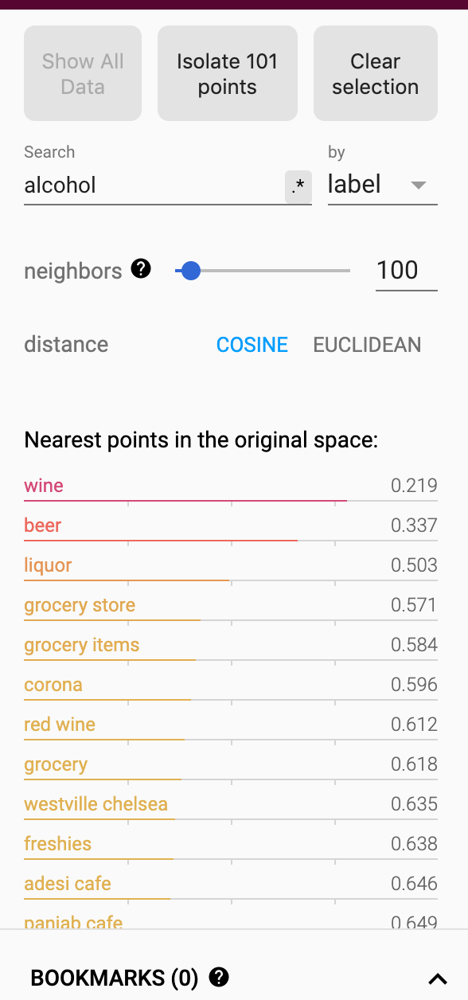

Example 1: Semantic Lookup of “alcohol.” A simple lexical match couldn’t do this.

Example 2: Observe the model has a semantic understanding of Italian cuisine, as if it referenced a food knowledge graph.

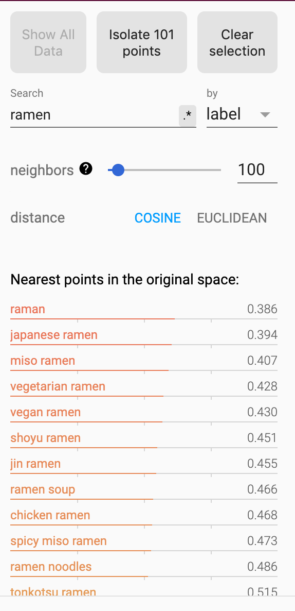

Example 3: Observe the perceived Food Knowledge Graph lookup with various types of Japanese ramen.

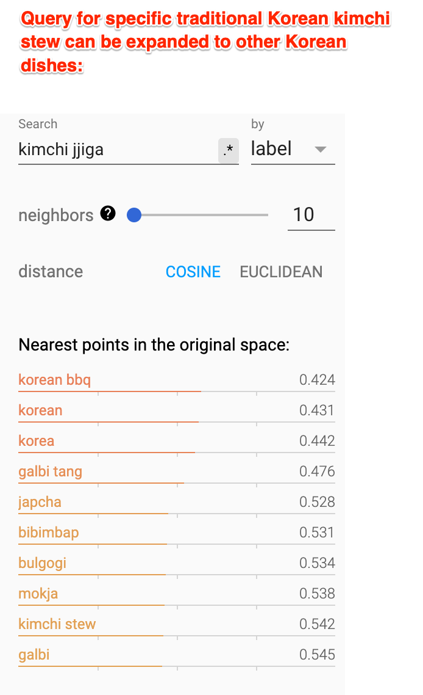

Example 4: Observe the cross-language understanding: Kimchi Jjigae is a traditional Korean stew; results show many other Korean dishes.

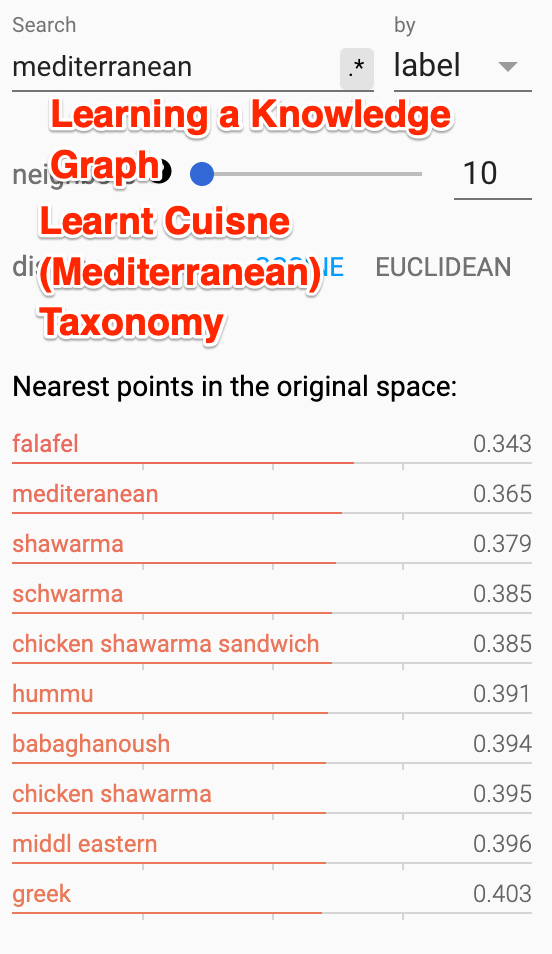

Example 5: Mediterranean cuisine understanding. Note that it also catches the typos

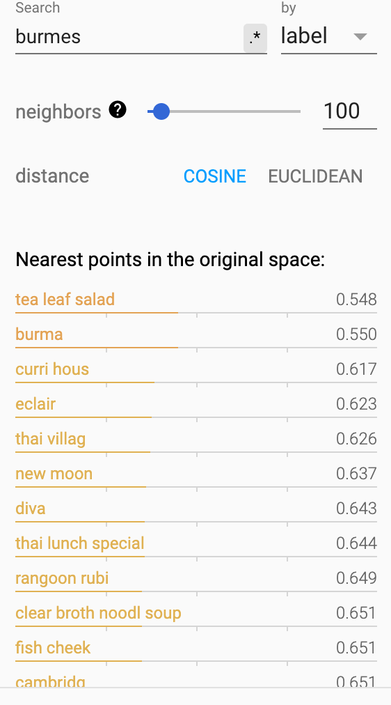

Example 6: Query for Burmese Cuisine comes up with a strong match for “tea leaf salad” and “burma.”

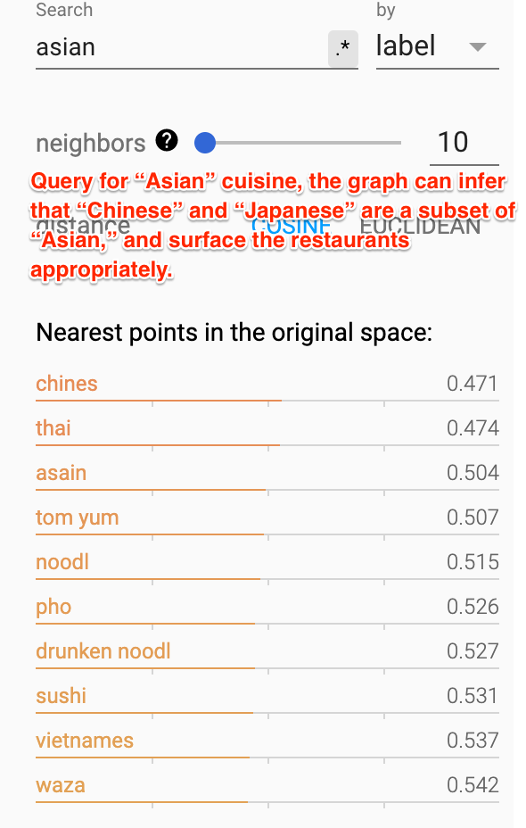

Example 7: Query for Asian returns Chinese, Thai, Vietnamese, and Japanese cuisine.

This query expansion project, along with other Representation Learning projects such as proper language models and recommender systems, helps us to understand and explore the Grubhub universe even without a proper food graph.

I’ll close with two final annotated examples. Below, in Figure 11, the nearest neighbors of “udon” almost map 1:1 with a reference hand-made food graph. This is an exciting proposition, as it paves the way for answering the tough questions that users want to know when they search for food.

Figure 11: Latent Food Graph: Query for “udon.” The graph would use query expansion to rewrite the query to include related terms such as “ramen,” “soba,” and “Japanese.”

A similar experiment, in which we map nodes from a proper Mediterranean Food Graph to results from our model, is depicted below in Figure 12.

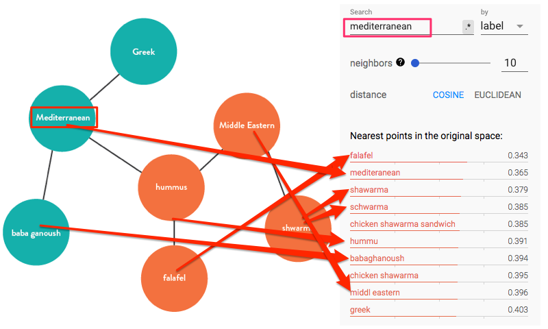
Figure 12: Latent Food Graph for “mediterranean” query.

As you can see, the model objectively learns the relationships on both a semantic cuisine and a dish level.

# Applications and Future Work

To recap, Representation Learning at Grubhub drives search, personalization and general product understanding, and we are excited to share more of our breakthroughs and novel applications in the future.