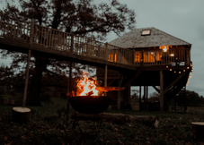
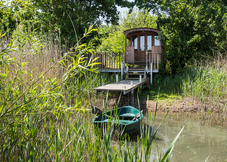
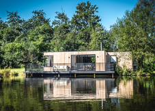
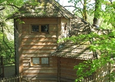
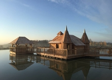
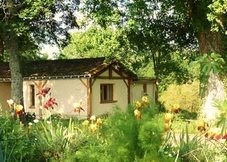
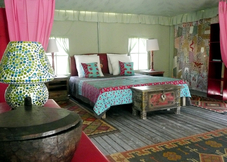
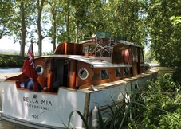
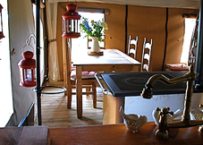

Search | Canopy & Stars

[Netherby Treehouse](https://www.canopyandstars.co.uk/britain/england/cumbria/netherby-estate/netherby-treehouse#search_type=keyword&search_text=&)

Special offer available!

 

[**Add Netherby Treehouse to favourites]()

## Netherby Treehouse

**   Netherby Estate, Cumbria

Take in the Scottish Borders from the hot tub at this hilltop treehouse, with breezes rustling the treetops and the river winding below

- Treehouse for 2

##### Extra space for 2 children

##### Price per night from:

£150

Book this place

[(L)](https://www.canopyandstars.co.uk/find/undefined#search_type=keyword&search_text=&)

Special Offer:15% OFF STAYS IN MAY & JUNE! - All stays in May and June 2018 at 15% discount!

Valid from 18/04/2018 till 28/06/2018

Offer applies to new bookings only. Price discounts have been automatically applied unless otherwise stated.

Follow #CSOffers on [Twitter](https://twitter.com/canopyandstars#search_type=keyword&search_text=&) or join us on [Facebook](https://www.facebook.com/canopyandstars#search_type=keyword&search_text=&) to hear about new offers

-

[The Lodge](https://www.canopyandstars.co.uk/britain/england/cumbria/edenhall/the-lodge#search_type=keyword&search_text=&)

 
[**Add The Lodge to favourites]()

## The Lodge

**   Edenhall, Cumbria

The ‘Gone Fishing’ sign was made for The Lodge. Catch your own trout for supper, then soak in the hot tub while watching otters swim by...

- Cabin for 6

##### Extra space for 1 adult

##### Price per night from:

£264

Book this place

-

[The Nancy Blackett](https://www.canopyandstars.co.uk/britain/england/somerset/highgates-farm/the-nancy-blackett#search_type=keyword&search_text=&)

 
[**Add The Nancy Blackett to favourites]()

## The Nancy Blackett

**   Highgates Farm, Somerset

Wake up on your own island! To the campfire for a spot of breakfast, then row across for a swing in the hammock or take a soak in the hot tub

- Shepherd's hut for 2

##### Price per night from:

£99

Book this place

-

[Buck's Coppice](https://www.canopyandstars.co.uk/britain/england/dorset/buck-s-coppice/buck-s-coppice#search_type=keyword&search_text=&)

 

[**Add Buck's Coppice to favourites]()

## Buck's Coppice

**   Buck's Coppice, Dorset

Ease into the Scandi style of a country cabin in ancient Dorset woodland and dive into your own private lake

- Cabin for 2

##### Extra space for 2 children

##### Price per night from:

£145

Book this place

-

[Gauthié Lakeside Treehouse](https://www.canopyandstars.co.uk/france/aquitaine/dordogne/chateau-gauthie/gauthie-lakeside-treehouse#search_type=keyword&search_text=&)

 

[**Add Gauthié Lakeside Treehouse to favourites]()

## Gauthié Lakeside Treehouse

**   Château Gauthié, Dordogne

A large, pentagonal treehouse on stilts, overlooking the fishing lake and a short walk from the outdoor hot tub and swimming pool

- Treehouse for 2

##### Extra space for 3 adults

##### Price per night from:

£112

Book this place

-

[Château Biron](https://www.canopyandstars.co.uk/france/aquitaine/dordogne/chateaux-dans-les-arbres/chateau-biron#search_type=keyword&search_text=&)

 

[**Add Château Biron to favourites]()

## Château Biron

**   Châteaux dans les Arbres, Dordogne

Délicieux! This utterly decadent floating mini-château with an open air hot tub is fit for a king

- Cabin for 2

##### Price per night from:

£206

Book this place

-

[Paille et Terre](https://www.canopyandstars.co.uk/france/aquitaine/dordogne/terre-et-toi/paille-et-terre#search_type=keyword&search_text=&)

 

[**Add Paille et Terre to favourites]()

## Paille et Terre

**   Terre et Toi, Dordogne

An eco design built in harmony with nature, with a private patio and views over the clear lake below

- Double for 2

##### Price per night from:

£77

Book this place

-

[Peppercorn Lodge](https://www.canopyandstars.co.uk/france/aquitaine/landes/palika-lodge/peppercorn-lodge#search_type=keyword&search_text=&)

 
[**Add Peppercorn Lodge to favourites]()

## Peppercorn Lodge

**   Palika Lodge, Landes
A pistachio-green Indian-inspired lodge suite with private lake terrace

- Safari tent for 2

##### Price per night from:

£145

Book this place

-

[Bella Mia](https://www.canopyandstars.co.uk/france/languedoc-roussillon/aude/le-somail/bella-mia#search_type=keyword&search_text=&)

 
[**Add Bella Mia to favourites]()

## Bella Mia

**   Le Somail, Aude

A classic river cruiser on the Canal du Midi - less than an hour from Carcassonne & Beziers airports!

- Boat for 2

##### Extra space for 2 adults

##### Price per night from:

£90

Book this place

-

[Partridge safari tent](https://www.canopyandstars.co.uk/britain/scotland/east-lothian/lochhouses-farm/partridge-safari-tent#search_type=keyword&search_text=&)

 
[**Add Partridge safari tent to favourites]()

## Partridge safari tent

**   Lochhouses Farm, East Lothian

Seaside family camping in comfort at Lochhouses Farm. Come and explore the coast and the lochs inland and meet the many farm animals...

- Safari tent for 8

##### Price per night from:

£124

Book this place

-

1 [2](https://www.canopyandstars.co.uk/find/(offset)/10?latitude=-1&longitude=-1&distance=&SearchText=&sort=ahtrjfjdvbradt86u31e6toqgg_sawdaysrandomdynamic&sleeps=0&sleeps_children=0&filter%5B%5D=subattr_solr___collection_name____ms%3A%22On+the+water%22) [3](https://www.canopyandstars.co.uk/find/(offset)/20?latitude=-1&longitude=-1&distance=&SearchText=&sort=ahtrjfjdvbradt86u31e6toqgg_sawdaysrandomdynamic&sleeps=0&sleeps_children=0&filter%5B%5D=subattr_solr___collection_name____ms%3A%22On+the+water%22)…[6](https://www.canopyandstars.co.uk/find/(offset)/50?latitude=-1&longitude=-1&distance=&SearchText=&sort=ahtrjfjdvbradt86u31e6toqgg_sawdaysrandomdynamic&sleeps=0&sleeps_children=0&filter%5B%5D=subattr_solr___collection_name____ms%3A%22On+the+water%22)[Next »](https://www.canopyandstars.co.uk/find/(offset)/10?latitude=-1&longitude=-1&distance=&SearchText=&sort=ahtrjfjdvbradt86u31e6toqgg_sawdaysrandomdynamic&sleeps=0&sleeps_children=0&filter%5B%5D=subattr_solr___collection_name____ms%3A%22On+the+water%22)