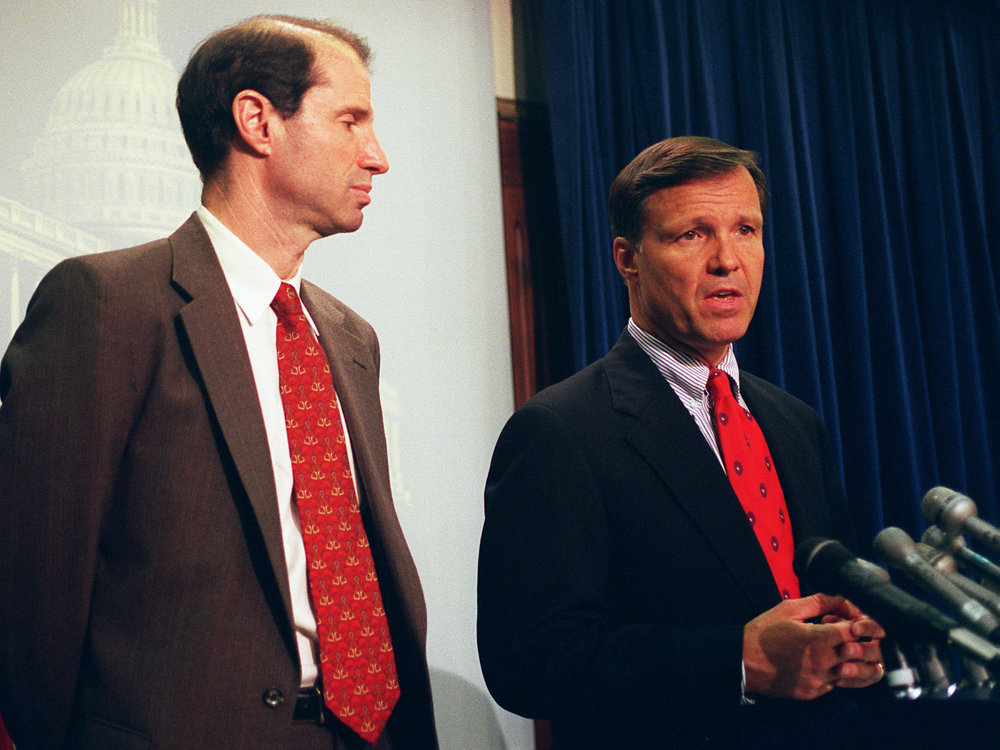
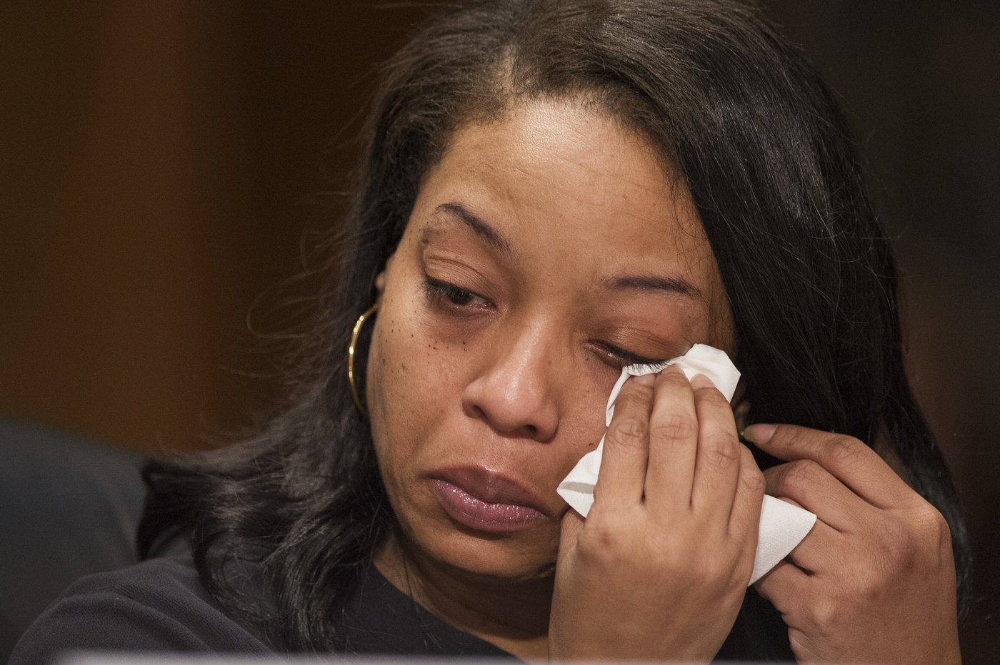
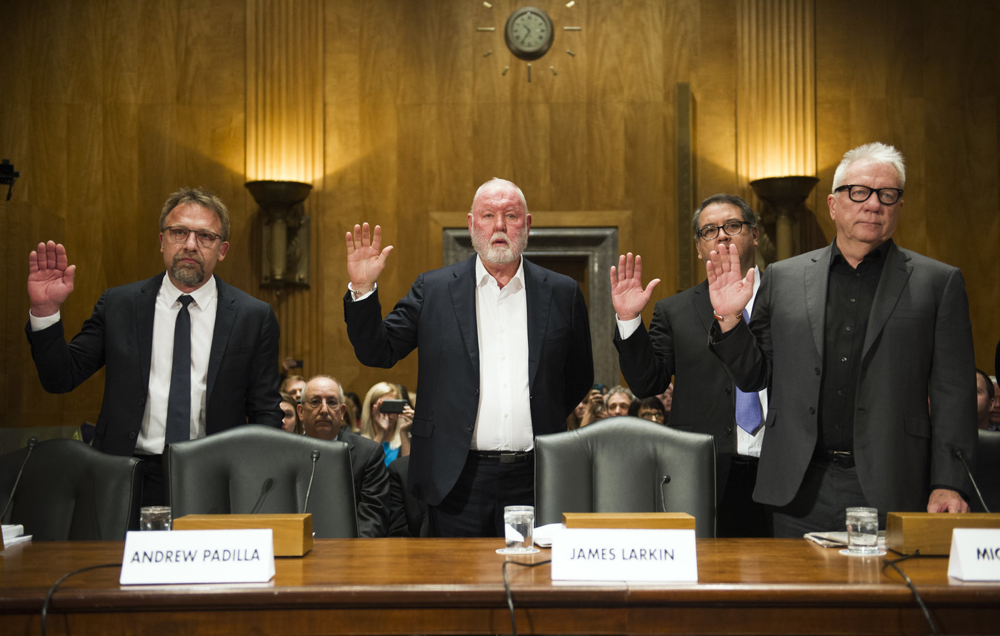
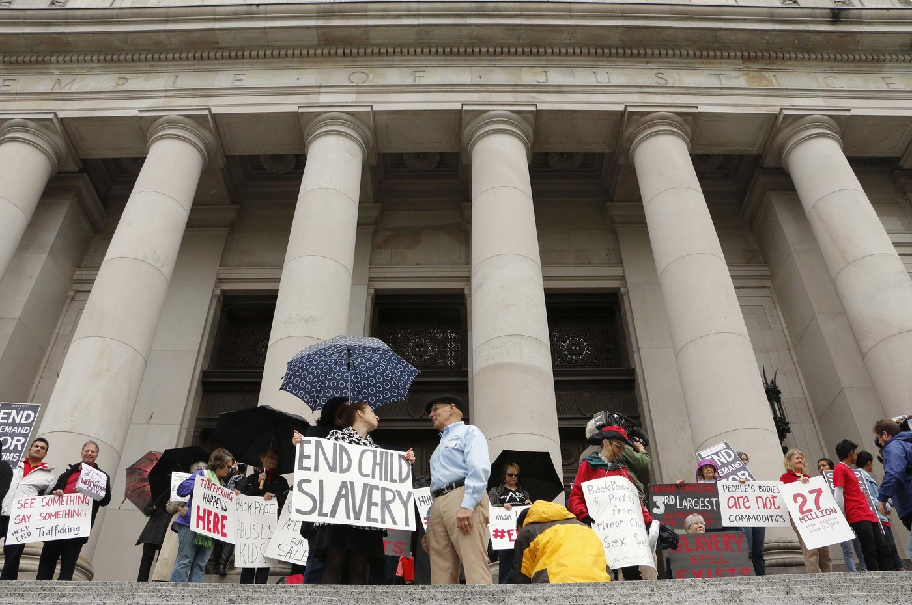

Section 230: A Key Legal Shield For Facebook, Google Is About To Change

# Section 230: A Key Legal Shield For Facebook, Google Is About To Change

7:02

A 1996 law sits at the heart of a major question about the modern Internet: How much responsibility should fall to online platforms for how their users act and get treated? ** Oivind Hovland/Getty Images/Ikon Images **  ****hide caption****

 ****toggle caption****
Oivind Hovland/Getty Images/Ikon Images

**Updated at 5:17 p.m. ET**

It's 1995, and Chris Cox is on a plane reading a newspaper. One article about a recent court decision catches his eye. This moment, in a way, ends up changing his life — and, to this day, it continues to change ours.

The case that caught the congressman's attention involved some posts on a bulletin board — the early-Internet precursor to today's social media. The ruling led to a new law, co-authored by Cox and often called simply "Section 230."

This 1996 statute became known as "[a core pillar of Internet freedom](https://www.theverge.com/2017/8/1/16072680/cda-230-stop-enabling-sex-traffickers-act-liability-shield-senate-backpage)" and "[the law that gave us modern Internet](https://www.theatlantic.com/business/archive/2013/09/the-law-that-gave-us-the-modern-internet-and-the-campaign-to-kill-it/279588/)" — a critical component of free speech online. But the journey of Section 230 runs through some of the darkest corners of the Web. Most egregiously, the law has been used to defend Backpage.com, a website featuring ads for sex with children forced into prostitution.

Today, this law still sits at the heart of a major question about the modern Internet: *How much responsibility do online platforms have for how their users behave or get treated? *

In the first major change to Section 230 in years, Congress voted this week to make Internet companies take a little more responsibility than they have for content on their sites.

**Library or newspaper?**

The court decision that started it all had to do with some online posts about a company called Stratton Oakmont. On one finance-themed bulletin board, someone had accused the investment firm of fraud.

Years later, Stratton Oakmont's crimes would be turned into a Hollywood film, *The Wolf of Wall Street. *But in 1994, the firm called the accusations libel and wanted to sue. But because it was the Internet, the posts were anonymous. So instead, the firm sued Prodigy, the online service that hosted the bulletin board.

Prodigy argued it couldn't be responsible for a user's post — like a library, it could not liable for what's inside its books. Or, in now-familiar terms: It's a platform, not a publisher.

#### Politics

## Congress Passes Legislation To Curb Online Sex Trafficking Of Children

4:12

- [**Download**](https://ondemand.npr.org/anon.npr-mp3/npr/atc/2018/03/20180321_atc_congress_passes_legislation_to_curb_online_sex_trafficking_of_children.mp3?orgId=1&topicId=1014&d=252&p=2&story=595791401&siteplayer=true&dl=1)

- **Embed**    **  `**<**iframe src="https://www.npr.org/player/embed/595791401/595791415" width="100%" height="290" frameborder="0" scrolling="no" title="NPR embedded audio player">`  **

The court disagreed, but for an unexpected reason: Prodigy moderated posts, cleaning up foul language. And because of that, the court treated Prodigy like a newspaper liable for its articles.

As Cox read about this ruling, he thought this was "exactly the wrong result": How was this amazing new thing — the Internet — going to blossom, if companies got punished for *trying *to keep things clean? "This struck me as a way to make the Internet a cesspool," he says.

At this moment, Cox was flying from his home in California to return to Congress. Back at work, Cox, a Republican, teamed up with his friend, Oregon Democrat Ron Wyden, to rectify the court precedent.

Together, they produced Section 230 — perhaps the only 20-year-old statute to be claimed by Internet companies and advocates as technologically prescient.

Sen. Ron Wyden, D-Ore., (left) and Rep. Christopher Cox, R-Calif., speak about the Communications Decency Act in 1997. They were behind Section 230, which says that with some exceptions, online platforms can't be sued for something posted by a user. ** Douglas Graham/Congressional Quarterly/Getty Images **  ****hide caption****

 ****toggle caption****
Douglas Graham/Congressional Quarterly/Getty Images

**"The original purpose"**

Section 230 lives inside the Communications Decency Act of 1996, and it gives websites broad legal immunity: With [some exceptions](https://www.law.cornell.edu/uscode/text/47/230), online platforms can't be sued for something posted by a user — and that remains true even if they act a little like publishers, by moderating posts or setting specific standards.

"Section 230 is as important as the First Amendment to protecting free speech online, certainly here in the U.S.," says Emma Llanso, a free expression advocate at the Center for Democracy and Technology.

No provider or user of an interactive computer service shall be treated as the publisher or speaker of any information provided by another information content provider.

47 U.S. Code § 230

The argument goes that without Section 230, we would never have platforms like YouTube, Facebook, Twitter, Yelp or Reddit — sites that allow ordinary people to post opinions or write reviews.

It's "the one line of federal code that has created more economic value in this country than any other," says Michael Beckerman, who runs the Internet Association, which represents many of Silicon Valley's largest companies.

But Section 230 is also tied to some of the worst stuff on the Internet, protecting sites when they host revenge porn, extremely gruesome videos or violent death threats. The broad leeway given to Internet companies represents "power without responsibility," Georgetown University law professor Rebecca Tushnet wrote in an [oft-cited paper](https://scholarship.law.georgetown.edu/cgi/viewcontent.cgi?referer=https://www.google.com/&httpsredir=1&article=1078&context=fwps_papers).

Cox says, "The original purpose of this law was to help clean up the Internet, not to facilitate people doing bad things on the Internet."

**"A Teflon shield"**

The original purpose hasn't always prevailed in court. And one specific example has prompted Congress to vote to amend Section 230 — the first cutback to websites' protections in years.

It's the case of Backpage.com, a site ostensibly for classifieds, but one well known for its adult-services ads. Among them — if you know what to look for — are sex ads featuring children forced into prostitution.

"All of those terms were indicative of an underage child — Lolita, fresh, new to town," says Mary Mazzio, a filmmaker whose documentary [I Am Jane Doe](https://www.youtube.com/watch?v=Bq-PdMr7pTY) tells the story of several young girls sold for sex on Backpage.

Over the years, victims and their families brought case after case against Backpage — and lost. The website kept convincing judges across the country that Section 230 shielded it from liability for the posts of its users. Major digital-rights groups, including the Center for Democracy and Technology, argued that holding Backpage liable could have chilling effects for social media and other websites.

This bewildered Mazzio: "How is it possibly legal that a website that makes millions and millions of dollars has no accountability for this crime?" she says. "Section 230 has turned into a Teflon shield, not to protect free speech but to protect business revenue."

The Supreme Court [last year declined](https://www.reuters.com/article/us-usa-court-backpage/u-s-supreme-court-will-not-examine-tech-industry-legal-shield-idUSKBN14T1OR) to hear victims' appeal in the case of Backpage and Section 230.

Kubiiki P. wipes tears as she testifies at a 2017 Senate hearing about her young daughter being sold for sex on Backpage.com. The site, ostensibly for classifieds, is well-known for its adult-services ads. ** Cliff Owen/AP **  ****hide caption****

 ****toggle caption****
Cliff Owen/AP

**"The judge-made law"**

Eventually, [mounting evidence](https://www.congress.gov/114/crpt/srpt214/CRPT-114srpt214.pdf)showed that Backpage was [actively involved](https://www.washingtonpost.com/local/public-safety/backpage-has-always-claimed-it-doesnt-control-sex-related-ads-new-documents-show-otherwise/2017/07/10/b3158ef6-553c-11e7-b38e-35fd8e0c288f_story.html?utm_term=.4bc40802346a) in the sex ads. That means the site isa publisher liable for its content. Backpage and its founders are now facing a federal grand jury in Arizona.

To Sen. Ron Wyden, co-author of the law, the Department of Justice missed the mark for not going after Backpage earlier, since Section 230 does not preclude federal criminal investigations.

Beyond Backpage, similar concerns continue to play out with sites that solicit revenge porn, publicly acknowledge potential risks to users or ignore harassment complaints.

"I'm afraid ... the judge-made law has drifted away from the original purpose of the statute," says Cox, who is now president of Morgan Lewis Consulting. He says he was shocked to learn how many Section 230 rulings have cited other rulings instead of the actual statute, stretching the law.

Cox argues that websites that are "involved in soliciting" unlawful materials or "connected to unlawful activity" should not be immune under Section 230. Congress should revisit the law, he says, and "make the statute longer and make it crystal clear."

Backpage.com executives — CEO Carl Ferrer (from left), former owner James Larkin, Chief Operating Officer Andrew Padilla, former owner Michael Lacey — are sworn in to testify before a Senate Homeland Security and Governmental Affairs subcommittee on investigations in January 2017. ** Cliff Owen/AP **  ****hide caption****

 ****toggle caption****
Cliff Owen/AP

**Responsibility**

Cox draws this distinction of websites like Backpage — *involved *or *connected *with their content — and sites that are "pure intermediaries." He wouldn't say whether that term applied to Facebook or Google.

Interestingly, the Internet giants themselves — as well as Wyden — talk about the law as being rooted in responsibility.

"The real key to Section 230," Wyden says, "was making sure that companies in return for that protection — that they wouldn't be sued indiscriminately — were being responsible in terms of policing their platforms."

Beckerman of the Internet Association describes Section 230 as "not a blanket amnesty" but a call for responsible policing of platforms. The Internet companies say that on sex trafficking, they actively help investigate cases — and that generally, without Section 230, websites would resort to more censorship or decide to know as little as possible about what happens on their platforms.

But Danielle Citron, a University of Maryland law professor who authored the book *Hate Crimes in Cyberspace*, argues that responsibility is exactly what is missing from the law.

"Yes, let's think about the consequences for speech," she says, pointing to the flip side of the freewheeling Internet. "There are countless individuals who are chased offline as a result of cyber mobs and harassment."

People rally in 2014 at the Washington state Supreme Court, which heard a case filed by three victims of sex trafficking against Backpage.com, saying the website helped promote the exploitation of children. ** Rachel La Corte/AP **  ****hide caption****

 ****toggle caption****
Rachel La Corte/AP

**A rift among companies**

Politically, the story of Section 230 has recently taken a surprising turn.

The Backpage saga has galvanized lawmakers to act on bills amending Section 230 with the goal of stemming online sex trafficking. The legislation allows more state and civil lawsuits against websites related to online sex trafficking, for "knowingly assisting, supporting or facilitating" crimes.

The Senate passed the bill Wednesday, sending it to President Trump for his signature. The White House has supported the legislation.

And for the first time, after years of staunch defiance, the Internet Association came out in support of legislation to change Section 230, shocking smaller Internet companies and digital-rights groups by breaking ranks.

The industry giants are narrowly threading the needle. After the bill passed the House, the Internet Association said the industry not only is "committed to ending trafficking online" but also "will defend against attempts to weaken these crucial protections" of Section 230.

"We all share the same goal," the association's Beckerman told NPR, "and that's to ensure that victims are able to have justice they need, but also enable our companies to stop this practice."

#### Politics

## House Passes Bill To Crack Down On Online Sex Trafficking

2:46

- [**Download**](https://ondemand.npr.org/anon.npr-mp3/npr/atc/2018/02/20180227_atc_house_to_vote_on_online_sex_trafficking_bill.mp3?orgId=1&topicId=1014&d=166&p=2&story=589279439&siteplayer=true&dl=1)

- **Embed**    **  `**<**iframe src="https://www.npr.org/player/embed/589279439/589279440" width="100%" height="290" frameborder="0" scrolling="no" title="NPR embedded audio player">`  **

Engine, a group advocating on behalf of smaller Internet companies, argues that Silicon Valley behemoths like Google, Facebook and Twitter can handle more lawsuits and the legal uncertainty that would smother a startup.

**Not the last challenge**

Wyden points out that these are the very same platforms facing massive scrutiny for being manipulated by Russian operatives during the 2016 election, making it a politically touchy moment for the companies to fight over sex-trafficking legislation.

"The big companies have a lot of egg on their face over the election, and nobody wants to be seen as being soft on sex trafficking," he says.

Wyden and Cox have opposed the legislation to amend Section 230, along with groups including Engine and the Center for Democracy and Technology. Opponents of the bill say it could lead to crimes moving deeper into the dark web and to websites resorting to more censorship or ignorance of what happens on their platforms to avoid liability.

Sen. Rob Portman, R-Ohio, author of the Senate bill, says the tech community "overreacted" to amending Section 230 "to the point that they weren't willing to look at the obvious problem, which is that it's been abused to sell people online."

Wyden says all this should be a wake-up call for Silicon Valley:

"If the technology companies do not wake up to their responsibilities — and use the power 230 gives them — to better protect the public against sex trafficking and countries that try to hack our political system, you bet that companies can expect (this legislation) will not be the last challenge for them."

*NPR researcher Will Chase and Business Desk intern Ian Wren contributed to this report. *