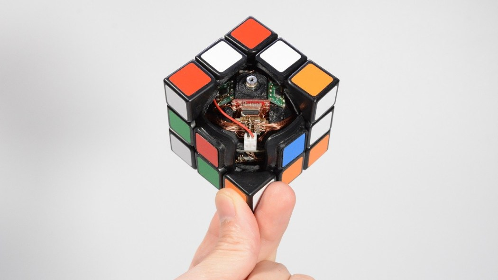
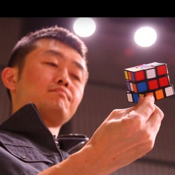

Self-solving Rubik's Cube

Exhibit

#   Self-solving Rubik's Cube

- [a4](https://www.facebook.com/sharer/sharer.php?u=https://makerfaire.com/maker/entry/69659/&t=Self-solving%20Rubik&%23039;s%20Cube)
- [h0](https://makerfaire.com/maker/entry/69659/#)
- [y0](http://reddit.com/submit?url=https://makerfaire.com/maker/entry/69659/&title=Self-solving%20Rubik&%23039;s%20Cube)
- [d0](https://makerfaire.com/maker/entry/69659/#)
- [k0](https://www.linkedin.com/shareArticle?mini=true&ro=true&trk=EasySocialShareButtons&title=Self-solving%20Rubik&%23039;s%20Cube&url=https://makerfaire.com/maker/entry/69659/)
- [A1](https://makerfaire.com/maker/entry/69659/#)
- [#](https://makerfaire.com/maker/entry/69659/#)

 

It is very difficult to solve the Rubik's cube.
But you are all right now.
You just scramble the Rubik's cube and put it on the table.
Then it solves itself while rolling!

 [Project Website](https://media.dmm-make.com/item/4462/)

**Categories:**  [Robotics](https://makerfaire.com/bay-area-2019/meet-the-makers/?category=Robotics), [3D Printing](https://makerfaire.com/bay-area-2019/meet-the-makers/?category=3D%20Printing), [Electronics](https://makerfaire.com/bay-area-2019/meet-the-makers/?category=Electronics), [Engineering](https://makerfaire.com/bay-area-2019/meet-the-makers/?category=Engineering), [Fun & Games](https://makerfaire.com/bay-area-2019/meet-the-makers/?category=Fun%20%26%20Games)

### Maker Faire Bay Area 2019

##### Friday, Saturday and Sunday: May 17-19

LOCATION: Zone 2 - Expo: Robots

 Hands-on Activity

## Maker

###   Takashi  Kaburagi

 

I am Japanese maker. I want to make something that surprises people all over the world! Recently I made a farting baseball. Watch the YouTube Human Controller channel. I always in DMM.make AKIBA in Tokyo, Japan.