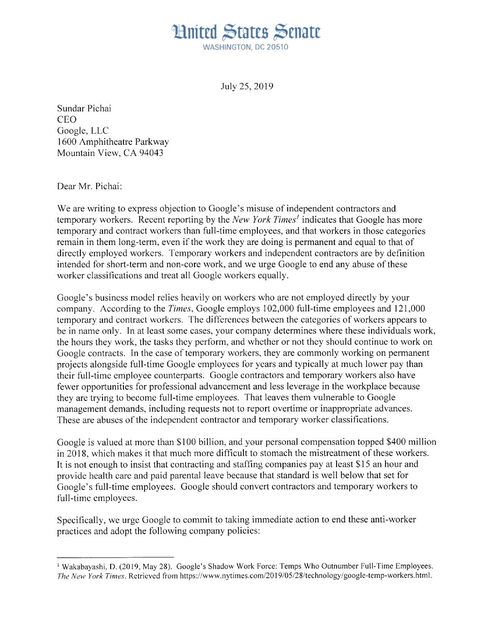

Senators Urge Google to Give Temporary Workers Full-Time Status

Advertisement

# Senators Urge Google to Give Temporary Workers Full-Time StatusSenators Urge Google to Give Temporary Workers Full-Time Status

Image

As of March, Google had more temporary workers than full-time employees. The senators demanded Sundar Pichai, the chief executive, end the company’s “two-tier employment structure.”CreditCreditTing Shen for The New York Times

By [Daisuke Wakabayashi](https://www.nytimes.com/by/daisuke-wakabayashi)

- Aug. 5, 2019

-

    - 
    - 
    - [](https://www.nytimes.com/2019/08/05/technology/senate-google-temp-workers.htmlmailto:?subject=NYTimes.com%3A%20Senators%20Urge%20Google%20to%20Give%20Temporary%20Workers%20Full-Time%20Status&body=From%20The%20New%20York%20Times%3A%0A%0ASenators%20Urge%20Google%20to%20Give%20Temporary%20Workers%20Full-Time%20Status%0A%0ATemps%20and%20contractors%20outnumber%20permanent%20employees%20at%20the%20company%2C%20allowing%20it%20to%20maintain%20labor%20flexibility%20and%20save%20money.%0A%0Ahttps%3A%2F%2Fwww.nytimes.com%2F2019%2F08%2F05%2Ftechnology%2Fsenate-google-temp-workers.html)

    -
    -

A group of Democratic senators has [demanded in a letter](https://int.nyt.com/data/documenthelper/1547-senate-democrats-letter-google-temporary-workers/1ad40d0ad9ac2286b911/optimized/full.pdf#page=1) sent to Google’s chief executive, Sundar Pichai, that the internet giant convert its more than 120,000 temporary and contract workers to full-time employees.

The letter, written by Senator Sherrod Brown of Ohio, also urged Google to stop its “anti-worker practices” and treat everyone at the company equally.

“Making these changes to your company’s employment practices will ensure equal treatment of all Google workers and put an end to the two-tier employment structure you have perpetuated,” Mr. Brown wrote. Among the 10 senators who signed were three running for president: Kamala Harris, Bernie Sanders and Elizabeth Warren.

As of March, Google had more temporary workers than full-time employees — 121,000 temps and contractors and 102,000 full-timers, according to company data viewed by The New York Times.

Advertisement

The senators’ letter, which was sent last month, cites a May [article by The Times](https://www.nytimes.com/2019/05/28/technology/google-temp-workers.html?module=inline) that explained how Google had created a shadow work force of temps, contractors and other contingent workers brought in through staffing companies.

The senators pushed for a number of changes to how the company treats temps and contractors, including moving them to full-time status after six months as well as equalizing their wages and benefits with permanent staff.

While many of the temps and contractors sit in the same offices as Google employees and often do similar work, they usually make less money, have significantly worse benefit plans and do not enjoy the same rights.

## Senate Democrats’ Letter to Google About Use of Temporary Workers and Contractors

The letter, written by Sherrod Brown of Ohio and signed by nine other senators, demanded that Google convert its more than 120,000 temporary and contract workers to full-time employees.

 

3 pages, 0.54 MB

Most of Google’s contingent workers are technically employees of staffing agencies, although the company acts like the employer in most cases — deciding when they work and what they do and assessing the quality of their work, according to current and former temps and contractors.

Advertisement

They have said they joined Google hoping to land a full-time job. When they encountered sexual harassment or pressure to perform unpaid overtime from Google employees, they were reluctant to speak up for fear that they would be labeled troublemakers and not receive full-time jobs.

Eileen Naughton, Google’s vice president of people operations, said in a letter replying to the senators that the company strongly disagreed “with any suggestion that Google misuses independent contractors or temporary workers.” She said the company’s practices “accord with the highest industry standards.”

Ms. Naughton said Google worked with staffing companies that had a particular expertise and could offer a “career path to employees.” She added that using contingent workers was a common practice in almost every industry in the United States and the government.

She did not directly address any of the senators’ policy demands. Mr. Pichai did not respond to the letter.

Image

Senator Sherrod Brown of Ohio wrote in the letter that Google’s wealth made it “that much more difficult to stomach the mistreatment of these workers.”CreditSarah Silbiger/The New York Times

Though Silicon Valley companies are among the richest in the world, they have embraced employing temps. And while the pay for engineers and executives in Silicon Valley [continues to rise](https://www.nytimes.com/2018/04/19/technology/artificial-intelligence-salaries-openai.html?module=inline), a growing faction of workers at many of those companies are not sharing in the success.

Temps and contractors account for 40 percent to 50 percent of workers at most technology firms, according to estimates by OnContracting, a site that helps people find tech contracting positions.

Advertisement

By keeping a large portion of their work forces contingent, companies like Google save money and maintain flexibility to decrease their head counts should business conditions change.

Younger tech companies like Uber and Lyft have built giant businesses that depend largely on the work of independent contractors, not employees.

Some Democrats are seizing on the issue as another sign of inequality in the country. That has put Google in their cross hairs.

Pete Buttigieg, the Democratic mayor of South Bend, Ind., who is also running for president, highlighted the widespread use of contingent labor at Google when laying out [his economic plan](https://peteforamerica.com/empowering-workers/) to give more power to workers.

Mr. Brown has also been a vocal critic of the growing use of so-called “alternative work arrangements” by companies. In his letter to Google’s chief executive, Mr. Brown said the company was using temporary and contract workers for more than short-term and nonessential work.

“We urge Google to end any abuses of these worker classifications and treat all Google workers equally,” he wrote. He noted that the more than $800 billion in market value of Google’s parent company, Alphabet, and Mr. Pichai’s hundreds of millions of dollars in stock compensation made it “that much more difficult to stomach the mistreatment of these workers.”

When Google’s parent company reported quarterly earnings last month, Ruth Porat, the company’s chief financial officer, said “some” customer support workers from staffing companies were being brought “in-house.” A Google spokeswoman declined to clarify what constituted “some.”

Advertisement

In addition to the other demands, Mr. Brown encouraged the company to eliminate noncompetition clauses and prohibit mandatory nondisclosure agreements about the terms and conditions of employment, including in contracts between temps and their staffing agencies.

He also said Google should accept liability for workplace violations that occurred with temps or contractors — instead of passing responsibility onto staffing agencies.

“Adopting these policies will extend the economic security of Google employment to all individuals who contribute to the company’s success,” Mr. Brown said.

The other senators who signed the letter were Richard Blumenthal of Connecticut, Benjamin L. Cardin of Maryland, Richard J. Durbin of Illinois, Edward J. Markey of Massachusetts, Patty Murray of Washington and Brian Schatz of Hawaii.

**Correction:** *Aug. 5, 2019*

Because of an editing error, an earlier version of this article misstated Google’s market value. It is more than $800 billion, not more than $800 million.

*Follow Daisuke Wakabayashi on Twitter: [@daiwaka](https://twitter.com/daiwaka).*

A version of this article appears in print on Aug. 6, 2019, Section B, Page 3 of the New York edition with the headline: Senators Press Google on Use of Contractors. [Order Reprints](http://www.nytreprints.com/) | [Today’s Paper](http://www.nytimes.com/pages/todayspaper/index.html) | [Subscribe](https://www.nytimes.com/subscriptions/Multiproduct/lp8HYKU.html?campaignId=48JQY)

- 
- 
- [](https://www.nytimes.com/2019/08/05/technology/senate-google-temp-workers.htmlmailto:?subject=NYTimes.com%3A%20Senators%20Urge%20Google%20to%20Give%20Temporary%20Workers%20Full-Time%20Status&body=From%20The%20New%20York%20Times%3A%0A%0ASenators%20Urge%20Google%20to%20Give%20Temporary%20Workers%20Full-Time%20Status%0A%0ATemps%20and%20contractors%20outnumber%20permanent%20employees%20at%20the%20company%2C%20allowing%20it%20to%20maintain%20labor%20flexibility%20and%20save%20money.%0A%0Ahttps%3A%2F%2Fwww.nytimes.com%2F2019%2F08%2F05%2Ftechnology%2Fsenate-google-temp-workers.html)

-

### Related Coverage

[   ## Google’s Shadow Work Force: Temps Who Outnumber Full-Time Employees  May 28, 2019     Image](https://www.nytimes.com/2019/05/28/technology/google-temp-workers.html?action=click&module=RelatedCoverage&pgtype=Article&region=Footer)[  OpinionThe Editorial Board  ## Google Should Google the Definition of ‘Employee’  May 29, 2019     Image](https://www.nytimes.com/2019/05/29/opinion/google-contract-labor.html?action=click&module=RelatedCoverage&pgtype=Article&region=Footer)[   ## Uber Drivers Are Contractors, Not Employees, Labor Board Says  May 14, 2019     Image](https://www.nytimes.com/2019/05/14/business/economy/nlrb-uber-drivers-contractors.html?action=click&module=RelatedCoverage&pgtype=Article&region=Footer)

Advertisement